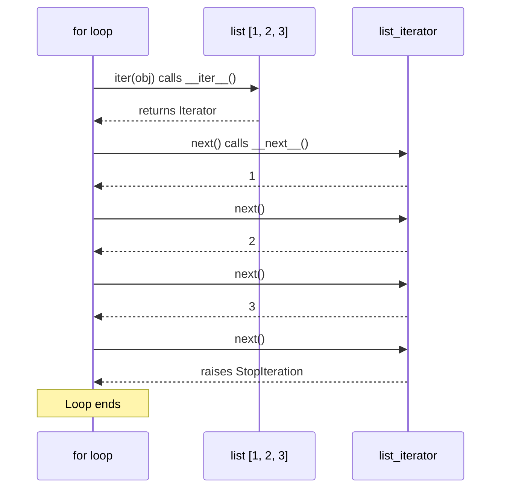
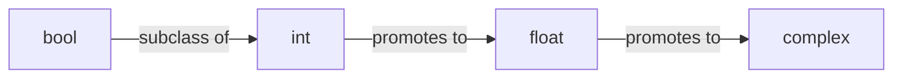

# Python Basics Review

> Python's fundamentals are deceptively deep -- mastering indentation semantics, dynamic typing, string internals, truthiness rules, and iterator-driven loops gives you the mental model that makes every advanced topic click.

## Table of Contents
- [Core Concepts](#core-concepts)
- [Code Examples](#code-examples)
- [Common Pitfalls](#common-pitfalls)
- [Key Takeaways](#key-takeaways)
- [Exercises](#exercises)

## Core Concepts

### Basic Syntax

#### What

Python uses indentation (whitespace) to define code blocks instead of braces `{}` or keywords like `end`. Every statement that introduces a block -- `if`, `for`, `def`, `class`, `with`, `try` -- ends with a colon `:`, and the indented lines below it form the block body. Comments start with `#`, and `print()` is the primary output function.

This is not a stylistic choice. Indentation is part of Python's grammar. The parser reads indentation levels to determine which statements belong to which block. Mixing tabs and spaces, or inconsistent indentation, produces `IndentationError` or `TabError` at parse time -- before any code runs.

#### How

```python
# A colon introduces a block; indentation defines its extent
def greet(name: str) -> str:
    # This is inside the function block (4-space indent, PEP 8 standard)
    if not name:
        return "Hello, stranger!"
    return f"Hello, {name}!"

# Back at module level -- the function block ended when indentation returned
print(greet("Alice"))   # Hello, Alice!
print(greet(""))        # Hello, stranger!
```

Python's `print()` function accepts `*args` with configurable `sep` and `end` parameters. By default, it separates arguments with a space and ends with a newline.

```python
# print() is more flexible than most people realize
print("x", "y", "z", sep="-")      # x-y-z
print("loading", end="... ")        # loading... (no newline)
print("done")                       # done

# Multiline blocks -- every line at the same indent is part of the same block
for i in range(3):
    squared = i ** 2
    print(f"{i}^2 = {squared}")
    # Both lines above are in the for-loop body
```

Under the hood, CPython compiles your source into bytecode before execution. The parser (as of Python 3.9+, a PEG parser) tokenizes indentation into `INDENT` and `DEDENT` tokens -- they function exactly like `{` and `}` in C-family languages. This is why the interpreter catches indentation errors at compile time, not runtime.

#### Why It Matters

Indentation-as-syntax eliminates an entire class of bugs where code *looks* like it belongs to a block but doesn't (the "goto fail" bug in C is the classic example). It also forces readable code structure -- you cannot write deeply nested, hard-to-follow logic without it becoming visually obvious. The 4-space convention from PEP 8 is universally adopted; deviating from it creates friction with every tool in the Python ecosystem (linters, formatters, IDEs).

---

### Variables and Data Types

#### What

Python variables are names bound to objects. There is no variable declaration -- assignment creates the binding. Python is dynamically typed (the type lives on the *object*, not the *variable*) and strongly typed (operations between incompatible types raise `TypeError` rather than silently coercing).

The core scalar types are:

| Type    | Example           | Notes                                        |
|---------|-------------------|----------------------------------------------|
| `int`   | `42`, `-7`, `0xff`| Arbitrary precision -- no overflow            |
| `float` | `3.14`, `1e-5`   | IEEE 754 double (64-bit)                     |
| `str`   | `"hello"`        | Immutable Unicode sequence                    |
| `bool`  | `True`, `False`  | Subclass of `int` (`True == 1`, `False == 0`)|
| `None`  | `None`           | Singleton null object                         |

#### How

```python
# Assignment creates a name binding -- no declaration needed
count = 42          # int
ratio = 3.14        # float
name = "Alice"      # str
active = True       # bool
result = None       # NoneType

# Python is dynamically typed: the same name can rebind to any type
x = 10
x = "ten"  # perfectly legal -- x now points to a str object

# But Python is strongly typed: no implicit coercion between incompatible types
# "age: " + 25  # TypeError: can only concatenate str to str
age_str = "age: " + str(25)  # explicit conversion required

# type() and isinstance() for inspection
print(type(count))                  # <class 'int'>
print(isinstance(active, int))     # True -- bool IS an int subclass
print(isinstance(active, bool))    # True
```

Under the hood, every Python value is a `PyObject` on the heap. Variables are entries in a namespace dictionary (for module-level) or in a fixed-size array (for function locals, determined at compile time). Assignment doesn't copy data -- it makes the name point to the existing object. This is why Python has no "value types" in the C/Java sense.

```python
# Names are references, not containers
a = [1, 2, 3]
b = a           # b points to the SAME list object
b.append(4)
print(a)        # [1, 2, 3, 4] -- a sees the change because it's the same object

# id() shows the object's memory address
print(id(a) == id(b))  # True -- same object
```

Python also interns small integers (typically -5 to 256) and some short strings. This means `is` (identity comparison) may return `True` for small integers but `False` for large ones. Always use `==` for value comparison and reserve `is` for `None` checks.

```python
# Integer interning -- implementation detail, never rely on this
a = 256
b = 256
print(a is b)   # True (interned)

a = 257
b = 257
print(a is b)   # May be False (not guaranteed to be interned)

# ALWAYS use == for value comparison
print(a == b)   # True (correct way to compare values)

# Use 'is' only for None/sentinel checks
value = None
if value is None:   # correct idiom
    print("no value")
```

#### Why It Matters

Understanding that variables are name bindings (not boxes that hold values) is the single most important mental model in Python. It explains why mutable default arguments are dangerous, why list assignment creates aliases, and why `is` vs `==` matters. Every "weird" Python behavior traces back to this object model. The arbitrary-precision `int` means you never worry about integer overflow -- a feature firmware engineers used to C's fixed-width types will appreciate. The fact that `bool` subclasses `int` means you can use booleans in arithmetic (`sum(flags)` counts `True` values), which is a deliberate design choice.

---

### Working with Strings

#### What

Strings in Python are immutable sequences of Unicode code points. Once created, a string's contents cannot change -- every string operation returns a *new* string object. Python 3 made Unicode the default; there is no separate "byte string" and "character string" confusion as in Python 2.

The three main tools for working with strings are: f-strings for formatting, slicing for extraction, and methods like `split()`, `join()`, and `strip()` for transformation.

#### How

**F-strings** (formatted string literals, Python 3.6+) embed expressions directly inside string literals. They are faster than `str.format()` and `%` formatting because the compiler generates optimized bytecode.

```python
name = "Alice"
score = 95.678

# Basic interpolation
greeting = f"Hello, {name}!"

# Expressions inside braces -- any valid Python expression works
result = f"Score: {score:.1f}/100 ({'pass' if score >= 60 else 'fail'})"
print(result)  # Score: 95.7/100 (pass)

# Format specifiers after the colon
pi = 3.14159265
print(f"{pi:.2f}")          # 3.14 (2 decimal places)
print(f"{1000000:,}")       # 1,000,000 (thousands separator)
print(f"{'left':<15}|")     # left           | (left-aligned, padded to 15)
print(f"{'right':>15}|")    #          right| (right-aligned)
print(f"{'center':^15}|")   #     center    | (centered)

# Multiline f-strings
report = (
    f"Student: {name}\n"
    f"Score:   {score:.1f}\n"
    f"Grade:   {'A' if score >= 90 else 'B'}"
)

# Debugging shortcut (Python 3.8+): = after expression shows both name and value
x = 42
print(f"{x = }")            # x = 42
print(f"{x * 2 = }")        # x * 2 = 84
```

**Slicing** uses the `[start:stop:step]` syntax. Indices are zero-based, `stop` is exclusive, and negative indices count from the end.

```python
text = "Hello, World!"

# Basic slicing: [start:stop] -- stop is exclusive
print(text[0:5])     # Hello
print(text[7:])      # World!
print(text[:5])      # Hello
print(text[-6:])     # World!

# Step parameter: [start:stop:step]
print(text[::2])     # Hlo ol!  (every 2nd character)
print(text[::-1])    # !dlroW ,olleH  (reversed)

# Slicing never raises IndexError -- it silently truncates
print(text[0:1000])  # Hello, World! (no error)
print(text[999:])    # "" (empty string, no error)
```

**Common string methods** -- these all return new strings (strings are immutable).

```python
raw = "  Hello, World!  "

# Stripping whitespace
print(raw.strip())       # "Hello, World!"
print(raw.lstrip())      # "Hello, World!  "
print(raw.rstrip())      # "  Hello, World!"

# Splitting and joining
csv_line = "alice,bob,charlie"
names = csv_line.split(",")          # ['alice', 'bob', 'charlie']
rejoined = " | ".join(names)         # 'alice | bob | charlie'

# split() with no args splits on any whitespace and strips leading/trailing
messy = "  hello   world  \n"
print(messy.split())                 # ['hello', 'world']

# Case methods
print("hello".upper())               # HELLO
print("Hello".lower())               # hello
print("hello world".title())         # Hello World
print("hello world".capitalize())    # Hello world

# Searching
text = "the quick brown fox"
print(text.find("quick"))            # 4 (index of first match)
print(text.find("slow"))             # -1 (not found)
print("quick" in text)               # True (membership test -- preferred)

# Replacing
print(text.replace("quick", "slow")) # the slow brown fox

# Checking content
print("42".isdigit())                # True
print("hello".isalpha())             # True
print("hello123".isalnum())          # True

# startswith / endswith accept tuples for multiple options
filename = "report.csv"
print(filename.endswith((".csv", ".tsv")))  # True
```

Under the hood, CPython stores strings as compact arrays of code points. Depending on the maximum code point in the string, it uses 1 byte (Latin-1), 2 bytes (UCS-2), or 4 bytes (UCS-4) per character. This is an optimization that keeps ASCII strings memory-efficient while still supporting the full Unicode range. String interning (reusing the same object for identical strings) happens automatically for identifier-like strings and can be forced with `sys.intern()`.

#### Why It Matters

Strings are immutable, so every concatenation in a loop creates a new object and copies all the data. Building a string by repeated `+=` is O(n^2). The correct approach is to collect parts in a list and `join()` at the end. Understanding this is the difference between code that handles 100 items and code that handles 1,000,000 items. F-strings are not just syntactic sugar -- they generate faster bytecode than `.format()` because the compiler knows the structure at compile time. The `f"{var = }"` debug syntax alone will save you dozens of `print(f"var={var}")` keystrokes.

---

### Conditionals

#### What

Python's conditional execution uses `if`, `elif`, and `else`. There is no `switch` statement in the traditional sense -- Python 3.10 introduced `match`/`case` for structural pattern matching, which is far more powerful. Python has well-defined truthiness rules that determine which values are considered `True` or `False` in a boolean context.

#### How

```python
# Basic if/elif/else
temperature = 22

if temperature > 30:
    status = "hot"
elif temperature > 20:
    status = "comfortable"
elif temperature > 10:
    status = "cool"
else:
    status = "cold"

print(status)  # comfortable
```

**Truthiness** is Python's system for treating non-boolean values as booleans. The rules are simple and consistent:

| Falsy values                    | Truthy values           |
|---------------------------------|-------------------------|
| `False`                         | `True`                  |
| `None`                          | Any non-zero number     |
| `0`, `0.0`, `0j`               | Any non-empty container |
| `""` (empty string)             | Any non-empty string    |
| `[]`, `()`, `{}`, `set()`       | Any object (by default) |
| Objects with `__bool__()` returning `False` | Everything else |

The rule: **zeros and empties are falsy, everything else is truthy**.

```python
# Truthiness in practice -- idiomatic Python
items = [1, 2, 3]

# GOOD -- use truthiness directly
if items:
    print("has items")

# BAD -- explicit length check is redundant
if len(items) > 0:
    print("has items")

# None checks use 'is', not truthiness
value: str | None = get_value()
if value is not None:  # explicit None check
    process(value)

# Truthiness for default values
name = user_input or "Anonymous"  # if user_input is falsy, use default
```

**Ternary expressions** (conditional expressions) put a simple if/else on one line.

```python
# Ternary expression: value_if_true if condition else value_if_false
age = 20
status = "adult" if age >= 18 else "minor"

# Works in f-strings
print(f"You are {'eligible' if age >= 18 else 'not eligible'}")

# Works in function arguments
print(max(a, b) if use_max else min(a, b))

# DON'T nest ternaries -- they become unreadable
# result = "a" if x > 0 else "b" if x == 0 else "c"  # hard to parse
# Use if/elif/else instead for multiple conditions
```

**Chained comparisons** are a Python-specific feature that reads like mathematical notation.

```python
# Python supports chained comparisons
x = 5
if 0 < x < 10:       # equivalent to: 0 < x and x < 10
    print("single digit positive")

# Works with any comparison operators
if 1 <= value <= 100:
    print("in range")

# Each expression is evaluated at most once
if a < b < c:        # b is only evaluated once, unlike a < b and b < c
    pass
```

**Match/case** (Python 3.10+) -- structural pattern matching, far more than a switch statement.

```python
def handle_command(command: str) -> str:
    match command.split():
        case ["quit"]:
            return "Goodbye!"
        case ["hello", name]:
            return f"Hello, {name}!"
        case ["add", *numbers] if all(n.isdigit() for n in numbers):
            total = sum(int(n) for n in numbers)
            return f"Sum: {total}"
        case _:
            return f"Unknown command: {command}"

print(handle_command("hello Alice"))    # Hello, Alice!
print(handle_command("add 1 2 3"))      # Sum: 6
print(handle_command("quit"))           # Goodbye!
```

#### Why It Matters

Truthiness is Python's way of reducing boilerplate. Instead of checking `if len(my_list) > 0`, you write `if my_list`. This is not just a style preference -- it is the expected idiom. Python linters (like ruff) will flag explicit length checks as violations. Understanding truthiness also explains the `or` pattern for defaults (`name = input or "default"`) and why empty containers in conditions behave as you'd expect.

The `match`/`case` statement is Python's answer to complex dispatching. Unlike C's `switch`, it can destructure data, bind variables, and apply guards -- making it ideal for parsing commands, handling API responses, and processing structured data.

---

### Loops

#### What

Python has two loop constructs: `for` (iterate over a sequence) and `while` (repeat while a condition is true). Both support `break`, `continue`, and the rarely-used but occasionally invaluable `else` clause. Python's `for` loop works with the *iterator protocol*, not integer indices -- this is fundamentally different from C-style for loops.

#### How

**For loops** iterate over any iterable object (lists, strings, ranges, files, generators -- anything that implements `__iter__`).

```python
# Iterating over a list
languages = ["Python", "Rust", "Go"]
for lang in languages:
    print(lang)

# range() generates a sequence of integers
for i in range(5):          # 0, 1, 2, 3, 4
    print(i)

for i in range(2, 10, 3):  # 2, 5, 8 (start, stop, step)
    print(i)

# enumerate() gives you index AND value -- never use range(len(...))
for index, lang in enumerate(languages):
    print(f"{index}: {lang}")

# enumerate() with custom start
for num, lang in enumerate(languages, start=1):
    print(f"{num}. {lang}")

# Iterating over dictionary items
config = {"host": "localhost", "port": 8080, "debug": True}
for key, value in config.items():
    print(f"{key} = {value}")

# zip() iterates over multiple sequences in parallel
names = ["Alice", "Bob", "Charlie"]
scores = [95, 87, 92]
for name, score in zip(names, scores, strict=True):  # strict=True (3.10+) raises if lengths differ
    print(f"{name}: {score}")
```

Here is how the iterator protocol works under the hood:



When you write `for x in obj`, Python calls `iter(obj)` to get an iterator, then repeatedly calls `next()` on that iterator until `StopIteration` is raised. This is why you can iterate over anything -- files yield lines, generators yield computed values, `range()` yields integers without creating a list.

**While loops** repeat as long as a condition is truthy.

```python
# Basic while loop
count = 0
while count < 5:
    print(count)
    count += 1

# While with walrus operator (Python 3.8+) -- cleaner input loops
while (line := input("Enter command (quit to exit): ")) != "quit":
    print(f"Processing: {line}")

# While True + break -- common pattern for input validation
while True:
    user_input = input("Enter a positive number: ")
    if user_input.isdigit() and int(user_input) > 0:
        number = int(user_input)
        break
    print("Invalid input, try again.")
```

**Break and continue** control flow within loops.

```python
# break exits the innermost loop immediately
for num in range(100):
    if num > 5:
        break
    print(num)  # prints 0 through 5

# continue skips to the next iteration
for num in range(10):
    if num % 2 == 0:
        continue  # skip even numbers
    print(num)  # prints 1, 3, 5, 7, 9
```

**The `else` clause on loops** -- executes when the loop completes *without* hitting `break`. This is one of Python's most misunderstood features.

```python
# else clause runs if the loop did NOT break
def find_prime_factor(n: int) -> int | None:
    """Find the smallest prime factor of n, or None if n is prime."""
    for candidate in range(2, int(n ** 0.5) + 1):
        if n % candidate == 0:
            return candidate  # found a factor, return it
    else:
        # Loop completed without finding a factor -- n is prime
        return None

# A more practical example: searching with a fallback
def find_user(users: list[dict[str, str]], target_email: str) -> dict[str, str] | None:
    for user in users:
        if user["email"] == target_email:
            print(f"Found: {user['name']}")
            break
    else:
        # No break occurred -- user was not found
        print(f"No user with email {target_email}")
        return None
    return user
```

Think of `for/else` as "for ... if not broken." The `else` block is a "no break" handler. It is rarely used, but when it fits, it eliminates flag variables and simplifies search-and-fallback patterns.

#### Why It Matters

Python's `for` loop is fundamentally different from C's `for (int i = 0; i < n; i++)`. It does not use indices -- it uses the iterator protocol. This is why `for` works with files, generators, database cursors, and any custom object that implements `__iter__`. If you find yourself writing `for i in range(len(my_list))`, you are almost certainly doing it wrong -- use `enumerate()`, `zip()`, or iterate directly.

The `else` clause on loops is a Python-only feature that eliminates "found" flag variables. Instead of setting `found = False` before a loop and checking it after, you use the `else` clause. It reads awkwardly at first (many feel `nobreak` would be a better keyword), but once you understand it, it simplifies specific patterns cleanly.

---

### Type Casting

#### What

Type casting (type conversion) transforms a value from one type to another. Python distinguishes between *explicit* conversion (you call a function like `int()`, `str()`, `float()`) and *implicit* conversion (Python promotes types automatically in certain arithmetic contexts). Python is conservative about implicit conversion -- it will widen `int` to `float` in arithmetic, but it will not silently convert `str` to `int`.

#### How

**Explicit conversion** -- you call the target type as a function.

```python
# str -> int
age = int("25")             # 25
hex_val = int("ff", 16)    # 255 (base-16 parsing)
bin_val = int("1010", 2)   # 10 (base-2 parsing)

# str -> float
price = float("19.99")     # 19.99
scientific = float("1e-3") # 0.001

# int/float -> str
count_str = str(42)         # "42"
pi_str = str(3.14)          # "3.14"

# float -> int (truncates toward zero, does NOT round)
print(int(3.7))             # 3 (truncated, not rounded)
print(int(-3.7))            # -3 (truncated toward zero)
print(round(3.7))           # 4 (if you want rounding)

# Numeric -> bool
print(bool(0))              # False
print(bool(42))             # True
print(bool(0.0))            # False
print(bool(-1))             # True (any nonzero is True)

# str -> bool (careful: any non-empty string is True!)
print(bool(""))             # False
print(bool("False"))        # True! "False" is a non-empty string
print(bool("0"))            # True! "0" is a non-empty string
```

**Implicit conversion** (type coercion) -- Python only does this for numeric types in arithmetic.

```python
# int + float -> float (int is promoted to float)
result = 3 + 4.5
print(result)               # 7.5
print(type(result))         # <class 'float'>

# int + bool -> int (bool is subclass of int)
total = 10 + True
print(total)                # 11
print(type(total))          # <class 'int'>

# bool arithmetic is actually useful
flags = [True, False, True, True, False]
print(sum(flags))           # 3 (counts True values)

# NO implicit str conversion -- Python raises TypeError
# result = "count: " + 5   # TypeError
result = "count: " + str(5) # must be explicit
```

The numeric tower in Python follows a clear promotion hierarchy:



When you mix types in arithmetic, the narrower type is promoted to the wider type. `bool` is the narrowest (it is literally a subclass of `int`), and `complex` is the widest. This promotion is always lossless in terms of the value (though float precision limits apply).

**Conversion edge cases and validation.**

```python
# int() raises ValueError for invalid input
try:
    value = int("hello")
except ValueError as e:
    print(f"Cannot convert: {e}")  # Cannot convert: invalid literal for int()...

# Safe conversion pattern
def safe_int(text: str, default: int = 0) -> int:
    """Convert string to int, returning default if conversion fails."""
    try:
        return int(text)
    except (ValueError, TypeError):
        return default

print(safe_int("42"))       # 42
print(safe_int("abc"))      # 0
print(safe_int("abc", -1))  # -1

# ord() and chr() convert between characters and Unicode code points
print(ord("A"))             # 65
print(chr(65))              # A
print(ord("*"))             # 42865 (Unicode code point)
```

#### Why It Matters

The most important thing about type casting is knowing what Python will *not* do implicitly. Coming from JavaScript (where `"5" + 3` gives `"53"` and `"5" - 3` gives `2`), Python's strictness is a feature. It forces explicit conversions, which means fewer silent bugs. The `bool("False") == True` gotcha catches everyone exactly once -- it is a direct consequence of the truthiness rule (any non-empty string is truthy). Understanding `int()` truncation vs `round()` rounding prevents subtle off-by-one errors in calculations. The safe conversion pattern using `try/except` is a fundamental Python idiom (EAFP -- Easier to Ask Forgiveness than Permission) that you will use constantly.

---

## Code Examples

### Example 1: Configuration Parser

A realistic example combining strings, type casting, conditionals, and loops to parse a configuration file format.

```python
from pathlib import Path


def parse_config(config_text: str) -> dict[str, str | int | float | bool]:
    """Parse a simple key=value configuration format.

    Supports comments (#), blank lines, and automatic type detection
    for int, float, and bool values.
    """
    config: dict[str, str | int | float | bool] = {}

    for line_num, raw_line in enumerate(config_text.splitlines(), start=1):
        # Strip whitespace and skip empty lines / comments
        line = raw_line.strip()
        if not line or line.startswith("#"):
            continue

        # Split on first '=' only (values might contain '=')
        if "=" not in line:
            print(f"Warning: skipping malformed line {line_num}: {line!r}")
            continue

        key, _, value = line.partition("=")
        key = key.strip()
        value = value.strip()

        # Auto-detect types using cascading conversions
        config[key] = _auto_cast(value)

    return config


def _auto_cast(value: str) -> str | int | float | bool:
    """Attempt to cast a string value to its most specific type."""
    # Check for boolean values (case-insensitive)
    match value.lower():
        case "true":
            return True
        case "false":
            return False

    # Try int first (more specific than float)
    try:
        return int(value)
    except ValueError:
        pass

    # Try float
    try:
        return float(value)
    except ValueError:
        pass

    # Fall back to string (strip optional quotes)
    if len(value) >= 2 and value[0] == value[-1] and value[0] in ('"', "'"):
        return value[1:-1]
    return value


# Usage
sample_config = """
# Database settings
host = localhost
port = 5432
max_connections = 100

# Feature flags
debug = true
cache_ttl = 3.5
app_name = "My Application"
"""

config = parse_config(sample_config)
for key, value in config.items():
    print(f"{key:20s} = {value!r:>25s}  ({type(value).__name__})")

# Output:
# host                 =              'localhost'  (str)
# port                 =                     5432  (int)
# max_connections      =                      100  (int)
# debug                =                     True  (bool)
# cache_ttl            =                      3.5  (float)
# app_name             =        'My Application'  (str)
```

### Example 2: Text Statistics Analyzer

Demonstrates string methods, loops, conditionals, and f-string formatting in a practical utility.

```python
def analyze_text(text: str) -> dict[str, int | float | str]:
    """Compute detailed statistics about a text string."""
    words = text.split()
    sentences = [s.strip() for s in text.replace("!", ".").replace("?", ".").split(".") if s.strip()]

    # Character frequency using a dict and loop
    char_freq: dict[str, int] = {}
    for char in text.lower():
        if char.isalpha():
            char_freq[char] = char_freq.get(char, 0) + 1

    # Find the most common character
    most_common = ""
    if char_freq:
        most_common = max(char_freq, key=lambda c: char_freq[c])

    # Word length distribution
    word_lengths = [len(w.strip(".,!?;:")) for w in words]
    avg_word_length = sum(word_lengths) / len(word_lengths) if word_lengths else 0.0

    return {
        "characters": len(text),
        "words": len(words),
        "sentences": len(sentences),
        "avg_word_length": round(avg_word_length, 1),
        "most_common_char": most_common,
        "unique_words": len(set(w.lower().strip(".,!?;:") for w in words)),
    }


# Usage
sample = (
    "Python is a powerful programming language. "
    "It emphasizes readability and simplicity. "
    "Python supports multiple programming paradigms!"
)

stats = analyze_text(sample)
print("Text Analysis Report")
print("=" * 40)
for label, value in stats.items():
    # Convert underscore-separated keys to title case labels
    display_label = label.replace("_", " ").title()
    print(f"  {display_label:<25s}: {value}")
```

### Example 3: Interactive Number Guessing Game

Combines while loops, conditionals, type casting with validation, and the walrus operator.

```python
import random


def play_guessing_game(low: int = 1, high: int = 100, max_guesses: int = 7) -> bool:
    """Number guessing game demonstrating loops, conditionals, and input handling."""
    secret = random.randint(low, high)
    print(f"I'm thinking of a number between {low} and {high}.")
    print(f"You have {max_guesses} guesses.\n")

    for attempt in range(1, max_guesses + 1):
        remaining = max_guesses - attempt

        # Input validation loop with walrus operator
        while True:
            raw = input(f"Guess #{attempt}: ")
            if raw.strip().isdigit() and low <= (guess := int(raw.strip())) <= high:
                break
            print(f"  Please enter a number between {low} and {high}.")

        # Evaluate the guess
        if guess == secret:
            print(f"  Correct! You got it in {attempt} guess{'es' if attempt > 1 else ''}!")
            return True
        elif guess < secret:
            hint = "higher"
        else:
            hint = "lower"

        # Provide contextual feedback
        diff = abs(guess - secret)
        warmth = "Burning hot" if diff <= 3 else "Warm" if diff <= 10 else "Cold"
        print(f"  Go {hint}. ({warmth}) — {remaining} guess{'es' if remaining != 1 else ''} left.")

    print(f"\n  Out of guesses! The number was {secret}.")
    return False
```

### Example 4: Data Formatter with Type-Aware Alignment

Shows f-string formatting power, type checking, and match/case.

```python
def format_table(
    headers: list[str],
    rows: list[list[str | int | float | bool | None]],
    *,
    min_width: int = 10,
) -> str:
    """Format data as an aligned text table with type-aware formatting.

    Numbers are right-aligned, strings left-aligned, booleans centered.
    """
    # Determine column widths
    col_widths = [max(len(h), min_width) for h in headers]
    for row in rows:
        for i, cell in enumerate(row):
            cell_str = _format_cell(cell)
            col_widths[i] = max(col_widths[i], len(cell_str))

    # Build the header
    header_line = " | ".join(
        f"{h:^{col_widths[i]}}" for i, h in enumerate(headers)
    )
    separator = "-+-".join("-" * w for w in col_widths)

    # Build rows with type-aware alignment
    formatted_rows: list[str] = []
    for row in rows:
        cells: list[str] = []
        for i, cell in enumerate(row):
            cell_str = _format_cell(cell)
            width = col_widths[i]

            # Align based on type
            match cell:
                case int() | float():
                    aligned = f"{cell_str:>{width}}"  # right-align numbers
                case bool():
                    aligned = f"{cell_str:^{width}}"  # center booleans
                case None:
                    aligned = f"{'—':^{width}}"       # center null marker
                case _:
                    aligned = f"{cell_str:<{width}}"  # left-align strings

            cells.append(aligned)
        formatted_rows.append(" | ".join(cells))

    return "\n".join([header_line, separator, *formatted_rows])


def _format_cell(value: str | int | float | bool | None) -> str:
    """Convert a cell value to its display string."""
    match value:
        case None:
            return "—"
        case bool():
            return "Yes" if value else "No"  # must check bool before int (bool is subclass)
        case float():
            return f"{value:,.2f}"
        case _:
            return str(value)


# Usage
headers = ["Name", "Age", "Score", "Active", "Notes"]
data = [
    ["Alice", 30, 95.5, True, "Team lead"],
    ["Bob", 25, 87.333, False, None],
    ["Charlie", 35, 100.0, True, "New hire"],
]

print(format_table(headers, data))
# Output:
#     Name   |    Age     |   Score    |  Active   |   Notes
# -----------+-----------+-----------+-----------+-----------
# Alice      |         30 |     95.50 |    Yes    | Team lead
# Bob        |         25 |     87.33 |    No     |     —
# Charlie    |         35 |    100.00 |    Yes    | New hire
```

---

## Common Pitfalls

### Pitfall 1: Mutable Default Arguments

Mutable default arguments are shared across all calls to the function. The default value is created once at function definition time, not at each call.

```python
# BAD — mutable default argument is shared between calls
def add_item(item: str, items: list[str] = []) -> list[str]:
    items.append(item)
    return items

result1 = add_item("a")  # ['a']
result2 = add_item("b")  # ['a', 'b'] -- surprise! Previous call's data leaked

# GOOD — use None as sentinel and create a new list each call
def add_item(item: str, items: list[str] | None = None) -> list[str]:
    if items is None:
        items = []
    items.append(item)
    return items

result1 = add_item("a")  # ['a']
result2 = add_item("b")  # ['b'] -- independent as expected
```

This happens because default argument values are evaluated once when the `def` statement executes (at module load time), not each time the function is called. The default list object lives on the function object (`add_item.__defaults__`) and is reused across calls. The `None` sentinel pattern avoids this by creating a new list inside the function body each time.

### Pitfall 2: String Concatenation in Loops

Building strings by repeated `+=` creates a new string object on every iteration, copying all previous content. This is O(n^2) in the total length.

```python
# BAD — O(n²) string concatenation in a loop
def build_csv_bad(rows: list[list[str]]) -> str:
    result = ""
    for row in rows:
        result += ",".join(row) + "\n"  # copies entire string each time
    return result

# GOOD — collect parts in a list, join once at the end
def build_csv_good(rows: list[list[str]]) -> str:
    lines = [",".join(row) for row in rows]
    return "\n".join(lines) + "\n"
```

With 10,000 rows, the bad version is roughly 100x slower because each `+=` allocates a new string and copies all previous content. `str.join()` allocates exactly once because it knows the total length upfront.

### Pitfall 3: Using `is` Instead of `==` for Value Comparison

The `is` operator checks *identity* (same object in memory), not *equality* (same value). Due to integer interning, `is` may work for small numbers but fail for larger ones.

```python
# BAD — using 'is' for value comparison
a = 1000
b = 1000
if a is b:  # may be False! depends on CPython interning
    print("equal")

# GOOD — use == for value comparison
if a == b:  # always correct for value comparison
    print("equal")

# The ONLY correct use of 'is': checking for None and sentinel objects
_MISSING = object()  # sentinel

def get_value(key: str, default: object = _MISSING) -> str:
    if default is _MISSING:  # identity check is correct here
        raise KeyError(key)
    return default
```

### Pitfall 4: Confusing `bool("False")` with `False`

Any non-empty string is truthy, including the string `"False"`. This catches everyone who parses boolean configuration values.

```python
# BAD — treating string "false" as a boolean directly
config_value = "false"  # from a config file or environment variable
if config_value:  # True! non-empty string is truthy
    enable_debug()  # BUG: debug mode is always on

# GOOD — explicitly compare against known string values
config_value = "false"
debug_enabled = config_value.lower() in ("true", "1", "yes")
if debug_enabled:
    enable_debug()

# GOOD — even better, centralize the parsing
def parse_bool(value: str) -> bool:
    """Parse a string into a boolean value."""
    match value.strip().lower():
        case "true" | "1" | "yes" | "on":
            return True
        case "false" | "0" | "no" | "off":
            return False
        case _:
            raise ValueError(f"Cannot parse {value!r} as boolean")
```

### Pitfall 5: Modifying a List While Iterating Over It

Changing a list's size during iteration causes skipped elements or `IndexError`. The iterator's internal index advances regardless of insertions or deletions.

```python
# BAD — removing items while iterating causes skipped elements
numbers = [1, 2, 3, 4, 5, 6]
for num in numbers:
    if num % 2 == 0:
        numbers.remove(num)  # modifies the list during iteration
print(numbers)  # [1, 3, 5, 6] -- 6 was skipped!

# GOOD — build a new list with a comprehension
numbers = [1, 2, 3, 4, 5, 6]
odds = [num for num in numbers if num % 2 != 0]
print(odds)  # [1, 3, 5]

# GOOD — if you must modify in place, iterate over a copy
numbers = [1, 2, 3, 4, 5, 6]
for num in numbers[:]:  # [:] creates a shallow copy
    if num % 2 == 0:
        numbers.remove(num)
print(numbers)  # [1, 3, 5]
```

The underlying issue is that the `for` loop's iterator tracks position by index. When you remove element at index 1, element at index 2 shifts to index 1, but the iterator advances to index 2 -- skipping what was originally at index 2. The list comprehension approach is preferred because it is both correct and more readable.

---

## Key Takeaways

- **Variables are name bindings, not containers.** Assignment makes a name point to an object; it never copies data. This explains aliasing, mutable defaults, and why `is` differs from `==`.

- **Truthiness follows one rule: zeros and empties are falsy, everything else is truthy.** Use this to write idiomatic conditionals (`if items:` not `if len(items) > 0:`), but always use `is None` for explicit None checks.

- **Python's `for` loop uses the iterator protocol, not indices.** It calls `iter()` to get an iterator and `next()` to advance. This is why `for` works with any iterable, and why `enumerate()` and `zip()` are the right tools instead of `range(len(...))`.

- **Strings are immutable -- every operation creates a new object.** Use `str.join()` for building strings from parts, f-strings for formatting, and slicing for extraction. Never use `+=` in a loop.

- **Python is strongly typed with minimal implicit conversion.** Only numeric types auto-promote (`int` to `float`). Everything else requires explicit casting. This strictness prevents silent bugs that plague weakly-typed languages.

---

## Exercises

### Exercise 1: Truthiness Explorer

Write a function `classify_truthiness(values: list[object]) -> dict[str, list[object]]` that takes a list of arbitrary values and returns a dictionary with two keys: `"truthy"` and `"falsy"`, each containing the values that fall into that category. Test it with: `[0, 1, "", "hello", None, [], [0], {}, {0: 0}, True, False, 0.0, 0.1]`.

### Exercise 2: Caesar Cipher

Write two functions: `encrypt(text: str, shift: int) -> str` and `decrypt(text: str, shift: int) -> str` that implement a Caesar cipher. Only shift alphabetic characters (preserve case, spaces, and punctuation). Use `ord()` and `chr()` for the conversion. The decrypt function should reuse encrypt with a negated shift.

### Exercise 3: Word Frequency Counter

Write a function `word_frequency(text: str, top_n: int = 5) -> list[tuple[str, int]]` that returns the `top_n` most frequent words in the text as `(word, count)` tuples, sorted by count descending. Normalize words to lowercase and strip punctuation. Use only concepts covered in this lesson (no `collections.Counter`).

### Exercise 4: Type-Safe Config Validator

Write a function `validate_config(config: dict[str, str], schema: dict[str, type]) -> dict[str, str | int | float | bool]` that takes a config dictionary (all string values) and a schema dictionary (mapping keys to expected types like `int`, `float`, `bool`, `str`). It should cast each value to the expected type, raise `ValueError` with a descriptive message if a required key is missing or a value cannot be cast, and handle the `bool("false")` trap correctly.

### Exercise 5: Loop Else Detective

Without running the code, predict the output of each snippet, then verify by running it. Explain *why* the `else` clause does or does not execute in each case.

```python
# Snippet A
for i in range(5):
    if i == 3:
        break
else:
    print("Loop A completed")

# Snippet B
for i in range(5):
    if i == 10:
        break
else:
    print("Loop B completed")

# Snippet C
for i in []:
    break
else:
    print("Loop C completed")
```

---
up:: [Schedule](../../Schedule.md)
#type/learning #source/self-study #status/seed
