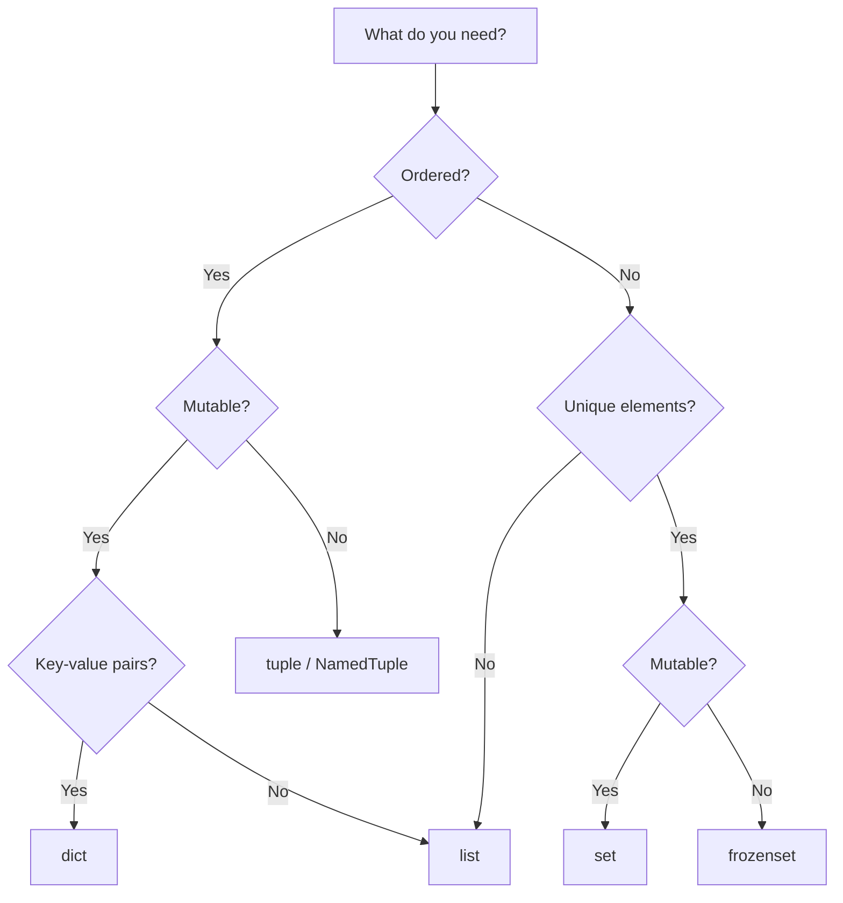

# Data Structures: Lists, Tuples, Sets, Dictionaries

> Python's four built-in collection types are highly optimized C implementations — choosing the right one for your use case is one of the highest-leverage decisions you make as a Python developer.

## Table of Contents
- [Core Concepts](#core-concepts)
  - [Lists](#lists)
  - [Tuples](#tuples)
  - [Sets](#sets)
  - [Dictionaries](#dictionaries)
  - [Choosing the Right Data Structure](#choosing-the-right-data-structure)
- [Code Examples](#code-examples)
- [Common Pitfalls](#common-pitfalls)
- [Key Takeaways](#key-takeaways)
- [Exercises](#exercises)

## Core Concepts

### Lists

#### What

A list is Python's workhorse sequence type — a mutable, ordered collection that can hold items of any type. Under the hood, CPython implements lists as **dynamic arrays**: a contiguous block of memory holding pointers to Python objects. This is the same strategy as C++'s `std::vector` or Java's `ArrayList`.

The dynamic array grows by over-allocating — when you `append` past the current capacity, CPython allocates roughly 12.5% extra space. This amortizes the cost of repeated appends to O(1) on average, even though individual resizes are O(n).

#### How

Lists support indexing, slicing, and a rich set of mutating methods:

```python
# Creation
numbers: list[int] = [1, 2, 3, 4, 5]
mixed: list[str | int] = ["hello", 42]
empty: list[str] = []

# Indexing — O(1) because it's a contiguous array
first = numbers[0]       # 1
last = numbers[-1]       # 5

# Slicing — creates a new list (shallow copy), O(k) where k = slice length
middle = numbers[1:4]    # [2, 3, 4]
reversed_copy = numbers[::-1]  # [5, 4, 3, 2, 1]

# Mutating methods
numbers.append(6)        # Add to end — amortized O(1)
numbers.extend([7, 8])   # Add multiple items — O(k)
numbers.insert(0, 0)     # Insert at index — O(n), shifts all elements
removed = numbers.pop()  # Remove from end — O(1)
numbers.pop(0)           # Remove from front — O(n), shifts all elements
numbers.remove(3)        # Remove first occurrence of value — O(n)
```

The key performance characteristics come from the array implementation. Appending is fast because it just writes to the next slot (or resizes occasionally). Inserting at the front is slow because every element must shift right. If you need fast prepend/append on both ends, use `collections.deque` instead.

#### Why It Matters

Lists are the default choice when you need an ordered, changeable collection. Their O(1) random access by index and amortized O(1) append make them ideal for building up sequences incrementally. However, `in` membership testing is O(n) — if you're checking membership frequently, a set is the right tool.

The fact that lists hold pointers (not values directly) means they can be heterogeneous, but it also means they consume more memory than, say, a NumPy array or an `array.array` for numeric data. Each element is a full Python object on the heap with its own reference count.

### Tuples

#### What

A tuple is an immutable sequence. Once created, you cannot add, remove, or change its elements. CPython stores tuples as a fixed-size array of pointers — no over-allocation needed since the size never changes.

Tuples serve two distinct roles in Python. First, they act as **immutable lists** — when you want a sequence that should not be modified after creation. Second, and more importantly, they act as **lightweight records** — fixed structures where position carries meaning (e.g., `(x, y)` coordinates, `(name, age)` pairs).

#### How

```python
# Creation
point: tuple[float, float] = (3.14, 2.72)
singleton: tuple[int] = (42,)      # Trailing comma required for single-element tuple
empty: tuple[()] = ()

# Packing / unpacking — the core tuple idiom
coordinates = 10, 20, 30           # Packing (parens are optional)
x, y, z = coordinates              # Unpacking
first, *rest = [1, 2, 3, 4, 5]    # Extended unpacking: first=1, rest=[2, 3, 4, 5]

# Swapping variables — tuple packing/unpacking under the hood
a, b = 1, 2
a, b = b, a  # No temp variable needed

# Tuples as dict keys (because they're hashable when all elements are hashable)
grid: dict[tuple[int, int], str] = {
    (0, 0): "origin",
    (1, 0): "right",
}
```

**Named tuples** bridge the gap between tuples and classes. They give each position a name, making code self-documenting without the overhead of a full class:

```python
from typing import NamedTuple

class Point(NamedTuple):
    """A 2D point with named fields."""
    x: float
    y: float

    @property
    def magnitude(self) -> float:
        return (self.x ** 2 + self.y ** 2) ** 0.5

p = Point(3.0, 4.0)
print(p.x)           # 3.0 — access by name
print(p[0])          # 3.0 — still works by index
print(p.magnitude)   # 5.0 — supports properties and methods
x, y = p             # Unpacking still works
```

The `typing.NamedTuple` class-based syntax (shown above) is preferred over the older `collections.namedtuple()` factory because it supports type hints, default values, methods, and docstrings natively.

#### Why It Matters

Immutability gives tuples three practical advantages. First, they are **hashable** (when their contents are hashable), so they can be dict keys or set members — lists cannot. Second, they communicate **intent**: when a function returns a tuple, it signals "this structure is fixed." Third, CPython can optimize tuples more aggressively — small tuples (up to length 20) are cached and reused, reducing memory allocations.

Named tuples are the sweet spot when you need a simple data record without the boilerplate of a full class. For more complex cases (mutable fields, validation, default factories), reach for `dataclasses` or Pydantic instead.

### Sets

#### What

A set is an unordered collection of unique, hashable elements. CPython implements sets as **hash tables** (similar to dicts, but storing only keys with no associated values). This gives O(1) average-case lookup, insertion, and deletion — the same performance characteristics as a dictionary.

Because sets are unordered, they do not support indexing (`my_set[0]` raises `TypeError`). The elements must be hashable: strings, numbers, tuples of hashable elements, and frozensets are fine; lists, dicts, and other sets are not.

#### How

```python
# Creation
unique_ids: set[int] = {1, 2, 3, 4, 5}
from_iterable = set([1, 2, 2, 3, 3, 3])  # {1, 2, 3} — duplicates removed
empty_set: set[str] = set()               # NOT {} — that creates an empty dict

# Membership testing — O(1) average, the primary reason to use sets
if 3 in unique_ids:
    print("found")

# Mutating
unique_ids.add(6)           # Add one element
unique_ids.discard(99)      # Remove if present — no error if missing
unique_ids.remove(1)        # Remove — raises KeyError if missing
popped = unique_ids.pop()   # Remove and return arbitrary element

# Set operations — the real power of sets
a = {1, 2, 3, 4}
b = {3, 4, 5, 6}

a | b    # Union:        {1, 2, 3, 4, 5, 6}
a & b    # Intersection: {3, 4}
a - b    # Difference:   {1, 2}
a ^ b    # Symmetric difference: {1, 2, 5, 6}

# Method equivalents (accept any iterable, not just sets)
a.union([5, 6])
a.intersection(range(3, 7))
a.difference(b)
a.symmetric_difference(b)

# Subset / superset checks
{1, 2} <= {1, 2, 3}   # True — subset
{1, 2, 3} >= {1, 2}   # True — superset
{1, 2} < {1, 2, 3}    # True — proper subset
```

**Frozensets** are the immutable counterpart — they can be used as dict keys or elements of other sets:

```python
fs: frozenset[int] = frozenset([1, 2, 3])
# fs.add(4)  # AttributeError — frozensets are immutable
nested_sets: set[frozenset[int]] = {frozenset([1, 2]), frozenset([3, 4])}
```

#### Why It Matters

The single most important use of sets is **membership testing**. Checking `x in my_list` scans every element (O(n)); checking `x in my_set` hashes and probes (O(1) average). Converting a list to a set before repeated lookups is one of the easiest performance wins in Python.

Set operations are also a clean, readable way to express relationships between collections. Finding common elements, removing duplicates, computing differences — all of these become one-liners with sets. If you find yourself writing nested loops to compare two lists, there's almost certainly a set operation that does it better.

### Dictionaries

#### What

A dictionary is a mutable mapping of unique keys to values. It is arguably the most important data structure in Python — not just because you use it directly, but because CPython uses dicts internally everywhere: module namespaces, class attributes, instance `__dict__`, keyword arguments, and the global scope are all dictionaries.

CPython's dict implementation is a **compact hash table** (redesigned in Python 3.6, guaranteed insertion-ordered since 3.7). The implementation uses two arrays: a sparse hash table of indices, and a dense array of `(hash, key, value)` entries. This design saves roughly 20-25% memory compared to the pre-3.6 implementation and preserves insertion order as a side effect of the dense array layout.

#### How

```python
# Creation
user: dict[str, str | int] = {"name": "Alice", "age": 30, "role": "engineer"}
from_pairs = dict([("a", 1), ("b", 2)])
from_kwargs = dict(x=10, y=20)
from_comprehension = {k: v for k, v in zip("abc", range(3))}

# Access
name = user["name"]              # "Alice" — raises KeyError if missing
age = user.get("age")            # 30
salary = user.get("salary", 0)   # 0 — default if missing, no exception

# setdefault — get existing value OR insert default and return it
# Incredibly useful for building up collections
groups: dict[str, list[str]] = {}
groups.setdefault("backend", []).append("Alice")
groups.setdefault("backend", []).append("Bob")
# groups == {"backend": ["Alice", "Bob"]}

# Mutation
user["email"] = "alice@example.com"   # Insert or overwrite
del user["role"]                       # Delete — raises KeyError if missing
removed_age = user.pop("age")          # Remove and return — 30
missing = user.pop("phone", None)      # Remove with default — None

# Merging (Python 3.9+)
defaults = {"theme": "dark", "lang": "en"}
overrides = {"lang": "zh", "font_size": 14}
merged = defaults | overrides   # {"theme": "dark", "lang": "zh", "font_size": 14}
defaults |= overrides           # In-place merge
```

**Dictionary views** are live, dynamic windows into a dict's keys, values, or items. They reflect changes to the underlying dict without creating copies:

```python
config: dict[str, int] = {"timeout": 30, "retries": 3, "port": 8080}

keys = config.keys()       # dict_keys(['timeout', 'retries', 'port'])
values = config.values()   # dict_values([30, 3, 8080])
items = config.items()     # dict_items([('timeout', 30), ('retries', 3), ('port', 8080)])

# Views are live — they update when the dict changes
config["debug"] = 1
print(len(keys))  # 4 — the view sees the new key

# Key views support set operations
other_config: dict[str, int] = {"timeout": 60, "verbose": 1}
common_keys = config.keys() & other_config.keys()  # {'timeout'}
all_keys = config.keys() | other_config.keys()      # All unique keys
```

Views are memory-efficient because they don't copy data. The `keys()` and `items()` views also support set operations (intersection, union, difference), which is useful for comparing or merging configuration dictionaries.

#### Why It Matters

Dictionaries give O(1) average-case access by key, making them the go-to structure for lookups, caches, configuration, and any kind of key-value mapping. Because Python uses dicts so heavily internally, the CPython team has invested enormous effort into making them fast and memory-efficient.

Understanding how dicts work under the hood helps you avoid performance traps. Keys must be hashable (their `__hash__` must not change over their lifetime), and two objects that compare equal must have the same hash. Violating this contract causes subtle, hard-to-debug data loss where keys silently overwrite each other or become unreachable.

Since Python 3.7, dicts maintain insertion order. This means `collections.OrderedDict` is rarely needed anymore — use a plain `dict` unless you need `OrderedDict`-specific features like `move_to_end()` or equality that considers order.

### Choosing the Right Data Structure

The choice between list, tuple, set, and dict depends on what questions you need to ask of your data:



| Operation | list | tuple | set | dict |
|-----------|------|-------|-----|------|
| Indexing by position | O(1) | O(1) | N/A | N/A |
| Lookup by key/value | O(n) | O(n) | O(1) | O(1) |
| Append | O(1)* | N/A | O(1)* | O(1)* |
| Insert at front | O(n) | N/A | N/A | N/A |
| Delete by value | O(n) | N/A | O(1)* | O(1)* |
| Memory per element | Low | Lowest | Medium | Highest |

*Amortized average case. Hash table operations can degrade to O(n) worst case with pathological hash collisions, but CPython uses perturbation-based probing that makes this extremely unlikely in practice.

**Rules of thumb:**
- Need to iterate in order, append, and index? Use a **list**.
- Need a fixed record or a hashable sequence? Use a **tuple** or **NamedTuple**.
- Need fast membership testing or deduplication? Use a **set**.
- Need fast key-based lookup? Use a **dict**.
- Need both order and fast lookup? Use a **dict** (it does both since 3.7).

## Code Examples

### Example 1: Grouping Data with `setdefault` and `defaultdict`

A common real-world task: group a flat list of records by some key.

```python
from collections import defaultdict

# Raw data: list of (department, employee) pairs
employees: list[tuple[str, str]] = [
    ("engineering", "Alice"),
    ("marketing", "Bob"),
    ("engineering", "Charlie"),
    ("marketing", "Diana"),
    ("engineering", "Eve"),
    ("sales", "Frank"),
]

# Approach 1: dict.setdefault — explicit, no imports needed
by_dept_v1: dict[str, list[str]] = {}
for dept, name in employees:
    by_dept_v1.setdefault(dept, []).append(name)

# Approach 2: defaultdict — cleaner for repeated use
by_dept_v2: defaultdict[str, list[str]] = defaultdict(list)
for dept, name in employees:
    by_dept_v2[dept].append(name)

# Approach 3: Comprehension (when source is already grouped or you can sort first)
from itertools import groupby
from operator import itemgetter

sorted_emps = sorted(employees, key=itemgetter(0))
by_dept_v3: dict[str, list[str]] = {
    dept: [name for _, name in group]
    for dept, group in groupby(sorted_emps, key=itemgetter(0))
}

# All three produce the same result:
# {"engineering": ["Alice", "Charlie", "Eve"],
#  "marketing": ["Bob", "Diana"],
#  "sales": ["Frank"]}
```

### Example 2: Set Operations for Data Analysis

Finding relationships between datasets is where sets shine:

```python
def analyze_user_engagement(
    registered: set[str],
    active_last_month: set[str],
    active_this_month: set[str],
    paid: set[str],
) -> dict[str, set[str]]:
    """Segment users based on activity and payment status."""
    return {
        "churned": active_last_month - active_this_month,
        "new_active": active_this_month - active_last_month,
        "consistently_active": active_last_month & active_this_month,
        "inactive_registered": registered - active_this_month - active_last_month,
        "free_active": active_this_month - paid,
        "paying_inactive": paid - active_this_month,
    }


# Usage
registered = {"alice", "bob", "charlie", "diana", "eve", "frank"}
last_month = {"alice", "bob", "charlie", "diana"}
this_month = {"alice", "charlie", "eve", "frank"}
paid = {"alice", "bob", "diana"}

segments = analyze_user_engagement(registered, last_month, this_month, paid)
print(segments["churned"])            # {'bob', 'diana'}
print(segments["new_active"])         # {'eve', 'frank'}
print(segments["paying_inactive"])    # {'bob', 'diana'}
```

### Example 3: Named Tuples for Structured Data

Named tuples provide lightweight, immutable data records with clear field names:

```python
from typing import NamedTuple
from datetime import datetime


class LogEntry(NamedTuple):
    """Represents a single log line from a web server."""
    timestamp: datetime
    method: str
    path: str
    status_code: int
    response_ms: float

    @property
    def is_error(self) -> bool:
        return self.status_code >= 400

    @property
    def is_slow(self) -> bool:
        return self.response_ms > 1000.0


def parse_log_entries(raw_lines: list[str]) -> list[LogEntry]:
    """Parse raw log lines into structured LogEntry records."""
    entries: list[LogEntry] = []
    for line in raw_lines:
        parts = line.split("|")
        entry = LogEntry(
            timestamp=datetime.fromisoformat(parts[0].strip()),
            method=parts[1].strip(),
            path=parts[2].strip(),
            status_code=int(parts[3].strip()),
            response_ms=float(parts[4].strip()),
        )
        entries.append(entry)
    return entries


def summarize_errors(entries: list[LogEntry]) -> dict[int, int]:
    """Count occurrences of each error status code."""
    error_counts: dict[int, int] = {}
    for entry in entries:
        if entry.is_error:
            error_counts[entry.status_code] = error_counts.get(entry.status_code, 0) + 1
    return dict(sorted(error_counts.items()))


# Usage
raw_logs = [
    "2026-02-28T10:00:00|GET|/api/users|200|45.2",
    "2026-02-28T10:00:01|POST|/api/login|401|12.8",
    "2026-02-28T10:00:02|GET|/api/data|500|2050.0",
    "2026-02-28T10:00:03|GET|/api/users|200|38.1",
    "2026-02-28T10:00:04|GET|/api/missing|404|5.3",
]

entries = parse_log_entries(raw_logs)
slow_requests = [e for e in entries if e.is_slow]
print(f"Slow requests: {len(slow_requests)}")      # 1
print(f"Error counts: {summarize_errors(entries)}")  # {401: 1, 404: 1, 500: 1}

# Named tuples support unpacking
for ts, method, path, status, ms in entries[:2]:
    print(f"{method} {path} -> {status} ({ms:.0f}ms)")
```

### Example 4: Dictionary Merge and Config Resolution

A realistic pattern: layering configuration from multiple sources with priority:

```python
from typing import Any


def resolve_config(
    defaults: dict[str, Any],
    config_file: dict[str, Any],
    env_vars: dict[str, Any],
    cli_args: dict[str, Any],
) -> dict[str, Any]:
    """Merge configuration sources with increasing priority.

    Priority order (lowest to highest):
    defaults < config_file < env_vars < cli_args
    """
    # Python 3.9+ merge operator — later dicts overwrite earlier ones
    return defaults | config_file | env_vars | cli_args


def find_config_diff(
    current: dict[str, Any],
    proposed: dict[str, Any],
) -> dict[str, dict[str, Any]]:
    """Compare two configs and report what changed."""
    all_keys = current.keys() | proposed.keys()  # Set union on dict_keys view
    added = proposed.keys() - current.keys()
    removed = current.keys() - proposed.keys()
    common = current.keys() & proposed.keys()

    diff: dict[str, dict[str, Any]] = {}

    for key in added:
        diff[key] = {"change": "added", "new": proposed[key]}
    for key in removed:
        diff[key] = {"change": "removed", "old": current[key]}
    for key in common:
        if current[key] != proposed[key]:
            diff[key] = {"change": "modified", "old": current[key], "new": proposed[key]}

    return diff


# Usage
defaults = {"host": "localhost", "port": 8080, "debug": False, "workers": 4}
from_file = {"port": 9090, "log_level": "INFO"}
from_env = {"debug": True}
from_cli = {"workers": 8}

final = resolve_config(defaults, from_file, from_env, from_cli)
# {"host": "localhost", "port": 9090, "debug": True, "workers": 8, "log_level": "INFO"}

diff = find_config_diff(defaults, final)
print(diff)
# {"port": {"change": "modified", "old": 8080, "new": 9090},
#  "debug": {"change": "modified", "old": False, "new": True},
#  "workers": {"change": "modified", "old": 4, "new": 8},
#  "log_level": {"change": "added", "new": "INFO"}}
```

### Example 5: Building an Inverted Index

A practical data structures exercise combining dicts, sets, and list processing:

```python
from collections import defaultdict


def build_inverted_index(documents: dict[str, str]) -> dict[str, set[str]]:
    """Build an inverted index mapping each word to the set of documents containing it.

    This is the core data structure behind full-text search engines.
    """
    index: defaultdict[str, set[str]] = defaultdict(set)

    for doc_id, content in documents.items():
        # Normalize: lowercase, split on whitespace, strip punctuation
        words = {
            word.strip(".,!?;:'\"()[]{}").lower()
            for word in content.split()
            if word.strip(".,!?;:'\"()[]{}") # Skip empty strings after stripping
        }
        for word in words:
            index[word].add(doc_id)

    return dict(index)


def search(index: dict[str, set[str]], query: str) -> set[str]:
    """Find documents containing ALL query terms (AND search)."""
    terms = query.lower().split()
    if not terms:
        return set()

    # Start with docs matching the first term, intersect with the rest
    result = index.get(terms[0], set()).copy()
    for term in terms[1:]:
        result &= index.get(term, set())

    return result


# Usage
docs = {
    "doc1": "Python is a great programming language",
    "doc2": "Java is also a programming language",
    "doc3": "Python has great data structures",
    "doc4": "Data structures are fundamental to programming",
}

idx = build_inverted_index(docs)
print(search(idx, "python"))                 # {'doc1', 'doc3'}
print(search(idx, "programming language"))   # {'doc1', 'doc2'}
print(search(idx, "python great"))           # {'doc1', 'doc3'}
print(search(idx, "data structures"))        # {'doc3', 'doc4'}
```

## Common Pitfalls

### Pitfall 1: Using a List for Membership Testing

```python
# BAD — O(n) membership test on every iteration
allowed_users: list[str] = ["alice", "bob", "charlie", "diana"]

def is_allowed(username: str) -> bool:
    return username in allowed_users  # Scans entire list each time

# With 10,000 users and 100,000 checks, this is 10^9 comparisons
```

```python
# GOOD — O(1) membership test with a set
allowed_users: set[str] = {"alice", "bob", "charlie", "diana"}

def is_allowed(username: str) -> bool:
    return username in allowed_users  # Hash lookup, constant time
```

When you have a collection that will be searched repeatedly and order does not matter, always use a set. The conversion itself is O(n), but it pays for itself after just one or two lookups on large collections.

### Pitfall 2: Modifying a List While Iterating Over It

```python
# BAD — skips elements because indices shift during deletion
numbers = [1, 2, 3, 4, 5, 6, 7, 8]
for n in numbers:
    if n % 2 == 0:
        numbers.remove(n)
# Result: [1, 3, 5, 7]?  No! Result: [1, 3, 5, 7] — seems correct here
# but with [1, 2, 2, 3]: removes first 2, skips second 2 → [1, 2, 3]
```

```python
# GOOD — build a new list with a comprehension
numbers = [1, 2, 3, 4, 5, 6, 7, 8]
odds = [n for n in numbers if n % 2 != 0]
# Result: [1, 3, 5, 7] — always correct
```

Mutating a collection while iterating is a classic bug in every language. In Python, the idiomatic solution is a list comprehension — it creates a new list, leaving the original untouched. If you truly need in-place modification, iterate over a copy: `for n in numbers[:]:`.

### Pitfall 3: Using `{}` to Create an Empty Set

```python
# BAD — this creates an empty dict, not an empty set
empty = {}
print(type(empty))  # <class 'dict'>
empty.add("item")   # AttributeError: 'dict' object has no attribute 'add'
```

```python
# GOOD — use set() for an empty set
empty: set[str] = set()
empty.add("item")   # Works correctly
print(empty)         # {'item'}
```

This is a historical quirk: `{}` was dict syntax before sets existed in Python. Set literals like `{1, 2, 3}` work fine for non-empty sets, but the empty case is ambiguous and defaults to dict. Just use `set()`.

### Pitfall 4: Using Mutable Default Arguments with Data Structures

```python
# BAD — the default list is shared across all calls
def add_item(item: str, items: list[str] = []) -> list[str]:
    items.append(item)
    return items

result1 = add_item("a")    # ["a"]
result2 = add_item("b")    # ["a", "b"] — leaked from previous call!
print(result1 is result2)  # True — same object!
```

```python
# GOOD — use None as sentinel and create a new list inside the function
def add_item(item: str, items: list[str] | None = None) -> list[str]:
    if items is None:
        items = []
    items.append(item)
    return items

result1 = add_item("a")    # ["a"]
result2 = add_item("b")    # ["b"] — independent list
print(result1 is result2)  # False — different objects
```

Python evaluates default arguments once at function definition time, not at each call. This means a mutable default like `[]` or `{}` is a single shared object. The `None` sentinel pattern is the universal fix and is considered idiomatic Python.

### Pitfall 5: Forgetting That Dictionary `.keys()` Returns a View, Not a List

```python
# BAD — modifying dict size during iteration raises RuntimeError
config = {"a": 1, "b": 2, "c": 3}
for key in config:
    if config[key] < 3:
        del config[key]
# RuntimeError: dictionary changed size during iteration
```

```python
# GOOD — iterate over a snapshot (list of keys)
config = {"a": 1, "b": 2, "c": 3}
for key in list(config):  # list() creates a snapshot
    if config[key] < 3:
        del config[key]
# config == {"c": 3}

# BETTER — use a dict comprehension to build a new dict
config = {"a": 1, "b": 2, "c": 3}
config = {k: v for k, v in config.items() if v >= 3}
# config == {"c": 3}
```

Since dict views are live references to the underlying hash table, adding or removing keys during iteration corrupts the iteration state. Always materialize to a list first, or build a new dict with a comprehension.

## Key Takeaways

- **Lists are dynamic arrays** — O(1) append and index access, O(n) insert/delete at arbitrary positions, O(n) membership testing. Use them when you need ordered, mutable sequences.
- **Tuples are immutable sequences** — use them for fixed records (especially named tuples for clarity), as dict keys, and to signal that data should not change. CPython caches small tuples for performance.
- **Sets are hash tables storing unique elements** — O(1) membership testing is their killer feature. Set operations (union, intersection, difference) replace verbose loops with clean, readable one-liners.
- **Dicts are hash tables mapping keys to values** — the most important data structure in Python, used internally for namespaces, attributes, and keyword arguments. Insertion-ordered since Python 3.7. Use `setdefault()` or `defaultdict` for grouping patterns.
- **Choose by access pattern**: list for ordered iteration, set for membership testing, dict for key-based lookup. The right choice often turns O(n) algorithms into O(1).

## Exercises

1. **Frequency Counter**: Write a function `def count_words(text: str) -> dict[str, int]` that counts the frequency of each word in a text string (case-insensitive, ignoring punctuation). Return the dict sorted by frequency in descending order. Use only built-in data structures (no `Counter`).

2. **Set Operations Challenge**: Given two lists of student IDs representing two different courses, write functions to find: (a) students enrolled in both courses, (b) students enrolled in exactly one course, (c) students in the first course but not the second. Use set operations, not loops.

3. **Matrix as Dict**: Implement a sparse matrix using a dict with `(row, col)` tuple keys. Write a function `def sparse_multiply(matrix: dict[tuple[int, int], float], vector: list[float]) -> list[float]` that multiplies the sparse matrix by a dense vector. Only iterate over non-zero elements.

4. **Named Tuple Refactor**: You have this function that returns `tuple[str, int, float]` for `(name, age, gpa)`. Refactor it to use a `NamedTuple` called `Student`. Add a property `honors` that returns `True` if GPA >= 3.5. Demonstrate that the named tuple still supports unpacking and indexing.

5. **Deduplication with Order**: Write a function `def deduplicate(items: list[str]) -> list[str]` that removes duplicates from a list while preserving the original order of first appearances. Do this in O(n) time using appropriate data structures. Do not use `dict.fromkeys()` — implement the logic yourself with a set.

---
up:: [Schedule](../../Schedule.md)
#type/learning #source/self-study #status/seed
