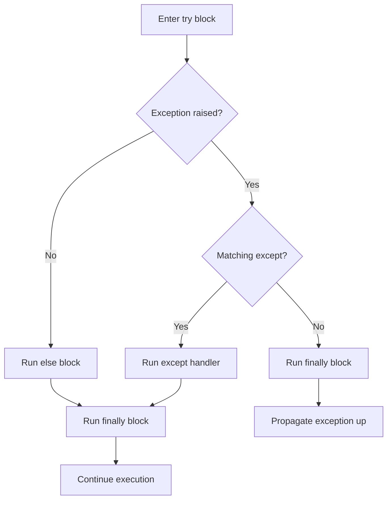
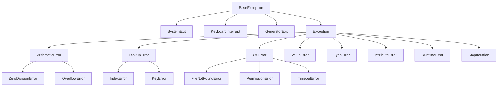

# Exceptions

> Exceptions are Python's primary mechanism for signaling and handling errors — but more than that, they are a core control flow tool, and the "easier to ask forgiveness than permission" (EAFP) idiom makes them central to idiomatic Python.

## Table of Contents
- [Core Concepts](#core-concepts)
  - [The Exception Model](#the-exception-model)
  - [try / except / else / finally](#try--except--else--finally)
  - [Raising Exceptions](#raising-exceptions)
  - [Custom Exception Classes](#custom-exception-classes)
  - [EAFP vs LBYL](#eafp-vs-lbyl)
  - [Exception Chaining](#exception-chaining)
  - [The Exception Hierarchy](#the-exception-hierarchy)
- [Code Examples](#code-examples)
- [Common Pitfalls](#common-pitfalls)
- [Key Takeaways](#key-takeaways)
- [Exercises](#exercises)

## Core Concepts

### The Exception Model

#### What

An exception is an object that represents an error or unexpected condition. When something goes wrong, Python **raises** (throws) an exception — an instance of a class that inherits from `BaseException`. If no code catches it, the exception propagates up the call stack, printing a traceback and terminating the program.

Python's exception model is fundamentally different from error-code returns (C style) or result types (Rust style). In Python, the happy path runs at full speed with zero overhead. The cost is paid only when an exception is actually raised — CPython uses a zero-cost exception model (since Python 3.11) where `try` blocks have virtually no performance impact if no exception occurs.

#### How

The basic flow is straightforward: code runs inside a `try` block, and if an exception is raised, Python searches for a matching `except` handler. If found, the handler runs. If not, the exception propagates to the caller.

```python
try:
    result = int("not_a_number")
except ValueError as e:
    print(f"Conversion failed: {e}")
```

Under the hood, CPython pushes an exception handler frame onto an internal stack when entering a `try` block. When an exception is raised, the interpreter unwinds the call stack looking for a handler that matches the exception type (via `isinstance` check). This is why catching a base class also catches all its subclasses.

#### Why It Matters

Exceptions separate the error-handling logic from the normal control flow, making both easier to read. Without exceptions, every function call would need an `if error` check, cluttering the happy path (this is the "staircase of doom" problem in languages without exceptions). Python's exception model lets you write the happy path cleanly and handle errors in a dedicated block.

The zero-cost model in Python 3.11+ means there is no reason to avoid `try`/`except` for performance. The old advice of "exceptions are slow" was already misleading — now it is completely obsolete.

### try / except / else / finally

#### What

The full exception handling syntax has four clauses, each with a distinct purpose:

- **`try`**: The code that might raise an exception.
- **`except`**: What to do when a specific exception occurs.
- **`else`**: What to do when the `try` block succeeds without any exception. This runs only if no exception was raised.
- **`finally`**: Cleanup code that runs no matter what — whether the `try` succeeded, an exception was caught, or an exception is propagating uncaught.

#### How

```python
import json
from pathlib import Path


def load_config(path: Path) -> dict[str, str]:
    """Load a JSON config file with proper exception handling."""
    try:
        content = path.read_text(encoding="utf-8")
        config = json.loads(content)
    except FileNotFoundError:
        print(f"Config file not found: {path}")
        return {}
    except json.JSONDecodeError as e:
        print(f"Invalid JSON in {path}: {e}")
        return {}
    except PermissionError:
        print(f"Permission denied reading {path}")
        return {}
    else:
        # Only runs if try block succeeded — no exception at all
        print(f"Successfully loaded config from {path}")
        return config
    finally:
        # Always runs — use for cleanup, not for return values
        print(f"Finished processing {path}")
```

The execution order matters:



You can also catch multiple exception types in a single handler:

```python
try:
    value = some_operation()
except (ValueError, TypeError, KeyError) as e:
    print(f"Expected error: {e}")
```

Since Python 3.11, you can use **exception groups** to handle multiple simultaneous exceptions (useful for concurrent code):

```python
try:
    raise ExceptionGroup("multiple errors", [
        ValueError("bad value"),
        TypeError("wrong type"),
    ])
except* ValueError as eg:
    print(f"Value errors: {eg.exceptions}")
except* TypeError as eg:
    print(f"Type errors: {eg.exceptions}")
```

#### Why It Matters

The `else` clause is underused but important. It narrows the scope of the `try` block to just the code that might raise the exception you're catching. Without `else`, you might accidentally catch exceptions from unrelated code that happens to be inside the `try` block. The rule is: keep your `try` block as small as possible, and put post-success logic in `else`.

The `finally` clause guarantees cleanup regardless of what happens. This is essential for releasing resources (file handles, network connections, locks) when you cannot use a context manager. However, in most cases, a `with` statement is a cleaner way to ensure cleanup.

### Raising Exceptions

#### What

You raise exceptions explicitly using the `raise` statement. This is how you signal that something has gone wrong in your own code — bad arguments, violated invariants, impossible states, or business logic violations.

#### How

```python
def calculate_average(numbers: list[float]) -> float:
    """Calculate the arithmetic mean of a list of numbers."""
    if not numbers:
        raise ValueError("Cannot calculate average of an empty list")
    return sum(numbers) / len(numbers)


def get_user_by_id(user_id: int) -> dict[str, str]:
    """Look up a user by their ID."""
    if user_id < 0:
        raise ValueError(f"User ID must be non-negative, got {user_id}")
    # ... database lookup ...
    user = None  # Simulating not found
    if user is None:
        raise LookupError(f"No user found with ID {user_id}")
    return user
```

You can also re-raise the current exception using bare `raise`:

```python
import logging

logger = logging.getLogger(__name__)

def process_data(data: bytes) -> dict[str, str]:
    """Process raw data, logging any errors before re-raising."""
    try:
        return json.loads(data)
    except json.JSONDecodeError:
        logger.error("Failed to parse data: %s", data[:100])
        raise  # Re-raises the original exception with its full traceback
```

Bare `raise` preserves the original traceback, which is critical for debugging. It is the correct way to "handle and propagate" — log the error, do partial cleanup, then let the exception continue up the stack.

#### Why It Matters

Raising exceptions early, with clear messages, is one of the most effective debugging strategies. The sooner you detect and signal a problem, the closer the error message is to the actual cause. A `ValueError` raised at the function boundary with a descriptive message is infinitely more useful than a cryptic `IndexError` three function calls later.

Always include relevant context in the exception message: what value was received, what was expected, and where the violation occurred. This saves hours of debugging.

### Custom Exception Classes

#### What

Custom exceptions are user-defined exception classes that inherit from `Exception` (or a more specific built-in exception). They let you create a domain-specific error vocabulary for your application, making error handling more precise and your API more expressive.

#### How

The simplest custom exception is just a class with a meaningful name:

```python
class InsufficientFundsError(Exception):
    """Raised when a withdrawal exceeds the available balance."""
    pass
```

For richer error information, add attributes:

```python
class ValidationError(Exception):
    """Raised when input validation fails."""

    def __init__(self, field: str, value: str, reason: str) -> None:
        self.field = field
        self.value = value
        self.reason = reason
        super().__init__(f"Validation failed for '{field}': {reason} (got '{value}')")


class APIError(Exception):
    """Base exception for all API-related errors."""

    def __init__(self, message: str, status_code: int, detail: str = "") -> None:
        self.status_code = status_code
        self.detail = detail
        super().__init__(message)


class NotFoundError(APIError):
    """Resource not found."""

    def __init__(self, resource: str, identifier: str) -> None:
        super().__init__(
            message=f"{resource} not found: {identifier}",
            status_code=404,
            detail=f"The requested {resource.lower()} with identifier '{identifier}' does not exist.",
        )


class RateLimitError(APIError):
    """Too many requests."""

    def __init__(self, retry_after: int) -> None:
        self.retry_after = retry_after
        super().__init__(
            message=f"Rate limited. Retry after {retry_after} seconds.",
            status_code=429,
        )
```

A well-designed exception hierarchy lets callers choose their granularity:

```python
try:
    response = api_client.get_user(user_id=42)
except NotFoundError:
    # Handle specifically: redirect to signup page
    ...
except RateLimitError as e:
    # Handle specifically: wait and retry
    time.sleep(e.retry_after)
except APIError:
    # Catch-all for any API error
    ...
```

#### Why It Matters

Custom exceptions serve as a contract between your code and its callers. When you define `InsufficientFundsError`, you are documenting that this is a known, expected failure mode — not a bug. Callers can catch it specifically and handle it gracefully, rather than guessing which built-in exception might mean "not enough money."

The hierarchy pattern (a base exception like `APIError` with specific subclasses) is particularly powerful. Library and framework authors use this pattern extensively — FastAPI, SQLAlchemy, and requests all define exception hierarchies. It lets callers be as specific or general as they want.

Always call `super().__init__()` with a human-readable message. This ensures that `str(exception)` and traceback output remain useful even if the caller does not access the custom attributes.

### EAFP vs LBYL

#### What

These are two competing philosophies for dealing with operations that might fail:

- **LBYL (Look Before You Leap)**: Check preconditions before performing an operation. "Is the key in the dict? If yes, access it."
- **EAFP (Easier to Ask Forgiveness than Permission)**: Just do it, and handle the exception if it fails. "Access the key. If it raises KeyError, handle it."

EAFP is the Pythonic idiom. Python's exception system is designed to make this style natural and efficient.

#### How

```python
import os
from pathlib import Path

# ── File access ──

# LBYL — race condition: file could be deleted between check and read
def read_config_lbyl(path: Path) -> str:
    if path.exists() and path.is_file() and os.access(path, os.R_OK):
        return path.read_text()
    return ""

# EAFP — no race condition, handles all failure modes at once
def read_config_eafp(path: Path) -> str:
    try:
        return path.read_text()
    except (FileNotFoundError, PermissionError):
        return ""


# ── Dictionary access ──

data: dict[str, dict[str, str]] = {
    "user": {"name": "Alice", "email": "alice@example.com"}
}

# LBYL — verbose, checks twice
if "user" in data and "email" in data["user"]:
    email = data["user"]["email"]
else:
    email = "unknown"

# EAFP — concise, one try
try:
    email = data["user"]["email"]
except KeyError:
    email = "unknown"


# ── Type conversion ──

user_input = "42abc"

# LBYL — fragile, what if it's "42.0" or " 42 "?
if user_input.isdigit():
    number = int(user_input)
else:
    number = 0

# EAFP — handles all edge cases
try:
    number = int(user_input)
except ValueError:
    number = 0
```

#### Why It Matters

EAFP is preferred in Python for three reasons. First, it avoids **race conditions** — in the LBYL file example, the file could be deleted between the `exists()` check and the `read_text()` call. EAFP handles this atomically. Second, it is **faster in the common case** — when the operation usually succeeds, EAFP pays zero cost (no precondition checks), while LBYL always pays the checking cost. Third, it is **more complete** — EAFP catches all failure modes at once, while LBYL requires you to anticipate every possible problem.

That said, LBYL is sometimes clearer. For simple boolean checks that do not involve I/O or concurrency (`if x is not None`, `if items`), LBYL reads more naturally. Use EAFP when the operation might fail for multiple reasons, involves external resources, or has race conditions.

### Exception Chaining

#### What

Exception chaining links a new exception to the one that caused it, preserving the full causal history. Python supports two forms: **implicit chaining** (automatic, when an exception is raised inside an `except` block) and **explicit chaining** (using `raise ... from ...`).

#### How

```python
class ConfigError(Exception):
    """Application configuration error."""
    pass


def load_port_from_config(config_text: str) -> int:
    """Parse a port number from config text."""
    try:
        return int(config_text.strip())
    except ValueError as e:
        # Explicit chaining: "raise X from Y"
        # The traceback will show both exceptions with "The above exception
        # was the direct cause of the following exception:"
        raise ConfigError(
            f"Invalid port value in config: '{config_text.strip()}'"
        ) from e


# Suppressing the chain when the original exception is noise
def safe_parse_int(text: str) -> int | None:
    """Parse an integer, returning None on failure."""
    try:
        return int(text)
    except ValueError:
        # "raise from None" suppresses the chained context
        # Use sparingly — usually the chain is helpful for debugging
        return None
```

The traceback for explicit chaining looks like this:

```
ValueError: invalid literal for int() with base 10: 'abc'

The above exception was the direct cause of the following exception:

Traceback (most recent call last):
  ...
ConfigError: Invalid port value in config: 'abc'
```

#### Why It Matters

Exception chaining preserves debugging context. Without it, you lose the original traceback when you catch and re-raise as a different type. The `from` clause makes the causal relationship explicit: "this ConfigError happened *because of* that ValueError."

Always use `raise NewException(...) from original_exception` when translating exceptions at API boundaries. This is the standard pattern in libraries: catch low-level exceptions (socket errors, parse errors) and raise high-level domain exceptions, while preserving the chain for developers who need to debug.

### The Exception Hierarchy

#### What

All exceptions in Python form a class hierarchy rooted at `BaseException`. Understanding this hierarchy is essential for writing correct `except` clauses, because `except SomeType` catches that type and all its subclasses.

#### How



Key rules:

- **Never catch `BaseException`** unless you are writing a top-level error reporter. It would swallow `KeyboardInterrupt` (Ctrl+C) and `SystemExit` (clean shutdown), making your program unkillable.
- **Never use bare `except:`** — it is equivalent to `except BaseException:` and has the same problem.
- **Catch the most specific exception possible** — `except KeyError` is better than `except LookupError` which is better than `except Exception`.
- **Custom exceptions should inherit from `Exception`**, not `BaseException`.

#### Why It Matters

The hierarchy design means that catching `OSError` also catches `FileNotFoundError`, `PermissionError`, and `TimeoutError`. This is intentional — it lets you write handlers at whatever level of specificity you need. A retry loop might catch `OSError` broadly, while a file-handling function catches `FileNotFoundError` specifically.

Understanding the hierarchy also prevents a common mistake: catching `Exception` too broadly and silently swallowing errors that should propagate. If you catch `Exception`, you catch `ValueError`, `TypeError`, `RuntimeError`, and hundreds of other exceptions that might indicate real bugs in your code.

## Code Examples

### Example 1: Robust Data Parsing with Layered Exception Handling

```python
import json
from dataclasses import dataclass
from pathlib import Path


@dataclass
class ServerConfig:
    """Validated server configuration."""
    host: str
    port: int
    debug: bool
    workers: int


class ConfigError(Exception):
    """Base exception for configuration errors."""
    pass


class ConfigFileError(ConfigError):
    """Error reading the configuration file."""
    pass


class ConfigValidationError(ConfigError):
    """Error validating configuration values."""

    def __init__(self, field: str, value: str, reason: str) -> None:
        self.field = field
        self.value = value
        self.reason = reason
        super().__init__(f"Invalid value for '{field}': {reason} (got '{value}')")


def load_server_config(path: Path) -> ServerConfig:
    """Load and validate server configuration from a JSON file.

    Demonstrates layered exception handling:
    - Low-level I/O exceptions → ConfigFileError
    - Parse exceptions → ConfigFileError
    - Validation exceptions → ConfigValidationError
    """
    # Layer 1: Read the file
    try:
        raw_text = path.read_text(encoding="utf-8")
    except FileNotFoundError as e:
        raise ConfigFileError(f"Config file not found: {path}") from e
    except PermissionError as e:
        raise ConfigFileError(f"Cannot read config file: {path}") from e

    # Layer 2: Parse JSON
    try:
        data = json.loads(raw_text)
    except json.JSONDecodeError as e:
        raise ConfigFileError(f"Invalid JSON in {path}: {e.msg}") from e

    # Layer 3: Validate and construct
    if not isinstance(data, dict):
        raise ConfigValidationError("root", str(type(data)), "Expected a JSON object")

    try:
        host = str(data["host"])
    except KeyError:
        raise ConfigValidationError("host", "missing", "Field is required")

    try:
        port = int(data["port"])
    except (KeyError, ValueError, TypeError) as e:
        raise ConfigValidationError(
            "port", str(data.get("port", "missing")), "Must be an integer"
        ) from e

    if not (1 <= port <= 65535):
        raise ConfigValidationError("port", str(port), "Must be between 1 and 65535")

    debug = bool(data.get("debug", False))
    workers = int(data.get("workers", 4))

    if workers < 1:
        raise ConfigValidationError("workers", str(workers), "Must be at least 1")

    return ServerConfig(host=host, port=port, debug=debug, workers=workers)


# Usage — caller chooses how specific to be
def main() -> None:
    config_path = Path("server.json")
    try:
        config = load_server_config(config_path)
    except ConfigFileError as e:
        print(f"Cannot load config: {e}")
        print("Using default configuration.")
        config = ServerConfig(host="localhost", port=8080, debug=False, workers=4)
    except ConfigValidationError as e:
        print(f"Bad config value: {e}")
        print(f"  Field: {e.field}, Value: {e.value}, Reason: {e.reason}")
        raise SystemExit(1)

    print(f"Starting server on {config.host}:{config.port}")
```

### Example 2: Retry Logic with Exception Handling

```python
import time
import random
import logging
from collections.abc import Callable
from typing import TypeVar

logger = logging.getLogger(__name__)
T = TypeVar("T")


class MaxRetriesExceeded(Exception):
    """All retry attempts have been exhausted."""

    def __init__(self, attempts: int, last_exception: Exception) -> None:
        self.attempts = attempts
        self.last_exception = last_exception
        super().__init__(
            f"Failed after {attempts} attempts. Last error: {last_exception}"
        )


def retry(
    func: Callable[[], T],
    *,
    max_attempts: int = 3,
    delay_seconds: float = 1.0,
    backoff_factor: float = 2.0,
    retryable_exceptions: tuple[type[Exception], ...] = (Exception,),
) -> T:
    """Execute a function with exponential backoff retry logic.

    Only retries on exceptions listed in retryable_exceptions.
    Non-retryable exceptions propagate immediately.
    """
    last_exception: Exception | None = None
    delay = delay_seconds

    for attempt in range(1, max_attempts + 1):
        try:
            return func()
        except retryable_exceptions as e:
            last_exception = e
            if attempt == max_attempts:
                break
            # Add jitter to prevent thundering herd
            jittered_delay = delay * (0.5 + random.random())
            logger.warning(
                "Attempt %d/%d failed: %s. Retrying in %.1fs...",
                attempt, max_attempts, e, jittered_delay,
            )
            time.sleep(jittered_delay)
            delay *= backoff_factor

    assert last_exception is not None  # Guaranteed by loop logic
    raise MaxRetriesExceeded(max_attempts, last_exception) from last_exception


# Usage
class TemporaryNetworkError(Exception):
    pass

def flaky_api_call() -> dict[str, str]:
    """Simulates an unreliable network call."""
    if random.random() < 0.7:
        raise TemporaryNetworkError("Connection timed out")
    return {"status": "ok", "data": "payload"}


try:
    result = retry(
        flaky_api_call,
        max_attempts=5,
        delay_seconds=0.5,
        retryable_exceptions=(TemporaryNetworkError,),
    )
    print(f"Success: {result}")
except MaxRetriesExceeded as e:
    print(f"Gave up: {e}")
    print(f"Last error was: {e.last_exception}")
```

### Example 3: Context Manager with Exception-Safe Cleanup

```python
from pathlib import Path
from contextlib import contextmanager
from collections.abc import Generator
import tempfile
import shutil


@contextmanager
def atomic_write(target: Path) -> Generator[Path, None, None]:
    """Write to a temporary file, then atomically rename to the target.

    If any exception occurs during writing, the temp file is cleaned up
    and the original target file is left untouched. This prevents
    half-written files from corrupting your data.
    """
    # Create temp file in the same directory (required for atomic rename)
    tmp_path = target.with_suffix(target.suffix + ".tmp")
    try:
        yield tmp_path
        # Only reached if the with-block completed without exception
        tmp_path.replace(target)  # Atomic on POSIX systems
    except BaseException:
        # Clean up temp file on any failure
        tmp_path.unlink(missing_ok=True)
        raise  # Re-raise the original exception


@contextmanager
def temp_directory() -> Generator[Path, None, None]:
    """Create a temporary directory that is cleaned up even on exception."""
    tmp_dir = Path(tempfile.mkdtemp())
    try:
        yield tmp_dir
    finally:
        # finally ensures cleanup even if exception propagates
        shutil.rmtree(tmp_dir, ignore_errors=True)


# Usage
def save_report(data: dict[str, list[float]], output: Path) -> None:
    """Save a report, ensuring the file is never half-written."""
    import json

    with atomic_write(output) as tmp:
        # If this fails at any point, the original file is untouched
        content = json.dumps(data, indent=2)
        tmp.write_text(content, encoding="utf-8")

    print(f"Report saved to {output}")
```

### Example 4: EAFP Pattern for Nested Data Access

```python
from typing import Any


def deep_get(data: dict[str, Any], *keys: str, default: Any = None) -> Any:
    """Safely traverse nested dicts using EAFP.

    Instead of checking each level with LBYL:
        if "a" in data and "b" in data["a"] and "c" in data["a"]["b"]: ...

    Just try the access and catch the exception:
    """
    current = data
    try:
        for key in keys:
            current = current[key]
        return current
    except (KeyError, TypeError, IndexError):
        return default


# Usage with realistic nested API response
api_response: dict[str, Any] = {
    "data": {
        "user": {
            "profile": {
                "name": "Alice Chen",
                "settings": {
                    "theme": "dark",
                    "notifications": {"email": True, "push": False},
                },
            },
            "posts": [
                {"id": 1, "title": "First Post"},
                {"id": 2, "title": "Second Post"},
            ],
        }
    }
}

# Clean, readable nested access
name = deep_get(api_response, "data", "user", "profile", "name")
theme = deep_get(api_response, "data", "user", "profile", "settings", "theme")
phone = deep_get(api_response, "data", "user", "profile", "phone", default="N/A")
email_notif = deep_get(
    api_response, "data", "user", "profile", "settings", "notifications", "email"
)

print(f"Name: {name}")           # Alice Chen
print(f"Theme: {theme}")         # dark
print(f"Phone: {phone}")         # N/A
print(f"Email notif: {email_notif}")  # True
```

### Example 5: Exception Hierarchy for a Domain Library

```python
"""
Exception hierarchy for a hypothetical payment processing library.

Demonstrates the pattern used by production libraries:
- Base exception catches everything from this library
- Specific subclasses for each failure mode
- Rich error attributes for programmatic handling
"""


class PaymentError(Exception):
    """Base exception for all payment-related errors."""

    def __init__(self, message: str, transaction_id: str | None = None) -> None:
        self.transaction_id = transaction_id
        super().__init__(message)


class PaymentValidationError(PaymentError):
    """Input validation failed before attempting payment."""

    def __init__(self, field: str, reason: str) -> None:
        self.field = field
        self.reason = reason
        super().__init__(f"Validation error on '{field}': {reason}")


class PaymentDeclinedError(PaymentError):
    """Payment was declined by the processor."""

    def __init__(
        self,
        reason: str,
        decline_code: str,
        transaction_id: str,
    ) -> None:
        self.decline_code = decline_code
        super().__init__(
            f"Payment declined: {reason} (code: {decline_code})",
            transaction_id=transaction_id,
        )


class PaymentNetworkError(PaymentError):
    """Network error communicating with payment processor."""

    def __init__(self, message: str, is_retryable: bool = True) -> None:
        self.is_retryable = is_retryable
        super().__init__(message)


class PaymentTimeoutError(PaymentNetworkError):
    """Payment request timed out — state is unknown."""

    def __init__(self, timeout_seconds: float, transaction_id: str) -> None:
        self.timeout_seconds = timeout_seconds
        super().__init__(
            f"Payment timed out after {timeout_seconds}s. "
            f"Transaction {transaction_id} may or may not have succeeded.",
            is_retryable=False,  # Timeout means state is uncertain
        )
        self.transaction_id = transaction_id


def process_payment(
    amount: float,
    currency: str,
    card_token: str,
) -> str:
    """Process a payment. Returns transaction ID on success."""
    # Validation
    if amount <= 0:
        raise PaymentValidationError("amount", "Must be positive")
    if currency not in ("USD", "EUR", "GBP", "TWD"):
        raise PaymentValidationError("currency", f"Unsupported currency: {currency}")
    if not card_token:
        raise PaymentValidationError("card_token", "Cannot be empty")

    # Simulate processing...
    transaction_id = "txn_abc123"
    return transaction_id


# Caller with granular handling
def handle_checkout(amount: float, currency: str, card_token: str) -> str:
    """Handle a checkout with appropriate error recovery."""
    try:
        txn_id = process_payment(amount, currency, card_token)
    except PaymentValidationError as e:
        # User error — show them what to fix
        return f"Please fix: {e.field} — {e.reason}"
    except PaymentDeclinedError as e:
        # Card declined — suggest alternatives
        return f"Payment declined ({e.decline_code}). Try a different card."
    except PaymentTimeoutError as e:
        # Dangerous state — payment might have gone through
        # Log and alert, do NOT retry
        return f"Payment status unknown for {e.transaction_id}. Contact support."
    except PaymentNetworkError as e:
        if e.is_retryable:
            return "Temporary issue. Please try again."
        return "Payment service unavailable. Please try later."
    except PaymentError:
        # Catch-all for any other payment error
        return "An unexpected payment error occurred."
    else:
        return f"Payment successful! Transaction: {txn_id}"
```

## Common Pitfalls

### Pitfall 1: Catching Too Broadly

```python
# BAD — catches everything, including bugs you want to know about
def get_user_email(users: dict[str, dict[str, str]], user_id: str) -> str:
    try:
        return users[user_id]["email"]
    except Exception:
        return "unknown"

# This silently hides:
# - TypeError if users is None
# - KeyError if "email" key is missing (might indicate a schema change)
# - Any other bug in the code
```

```python
# GOOD — catch only the specific exceptions you expect
def get_user_email(users: dict[str, dict[str, str]], user_id: str) -> str:
    try:
        return users[user_id]["email"]
    except KeyError:
        return "unknown"
```

Catching `Exception` (or worse, bare `except:`) is the most common exception-handling mistake. It turns bugs into silent data corruption. Catch the narrowest exception type that covers the failure mode you're handling.

### Pitfall 2: Using Exceptions for Normal Control Flow (Unnecessarily)

```python
# BAD — using exception to check dict membership when .get() exists
def lookup_setting(settings: dict[str, str], key: str) -> str:
    try:
        return settings[key]
    except KeyError:
        return "default"
```

```python
# GOOD — use .get() for simple default values
def lookup_setting(settings: dict[str, str], key: str) -> str:
    return settings.get(key, "default")
```

EAFP does not mean "always use try/except." When a simple, non-exception alternative exists (like `dict.get()`, `getattr()` with a default, or `list.pop()` with a default), prefer it. Reserve `try`/`except` for cases where the failure might come from multiple sources or involves I/O.

### Pitfall 3: Losing the Original Traceback

```python
# BAD — raises a new exception, losing the original traceback
def parse_config(text: str) -> dict[str, str]:
    try:
        return json.loads(text)
    except json.JSONDecodeError as e:
        raise ValueError(f"Bad config: {e}")
        # The traceback starts HERE — the original JSONDecodeError
        # context (which line of JSON failed, what character) is gone
```

```python
# GOOD — chain the exception to preserve the full traceback
def parse_config(text: str) -> dict[str, str]:
    try:
        return json.loads(text)
    except json.JSONDecodeError as e:
        raise ValueError(f"Bad config: {e}") from e
        # Both tracebacks are shown: the original JSONDecodeError
        # AND the new ValueError, linked with "The above exception
        # was the direct cause of the following exception:"
```

Always use `raise ... from original` when translating exceptions. The `from` clause costs nothing and preserves the debugging information that will save you (or your users) hours.

### Pitfall 4: Using `finally` to Return Values

```python
# BAD — finally's return silently swallows the exception
def divide(a: float, b: float) -> float:
    try:
        return a / b
    except ZeroDivisionError:
        print("Division by zero!")
        raise
    finally:
        return 0.0  # This ALWAYS executes, overriding everything above
        # The exception is silently swallowed!

print(divide(1, 0))  # Prints "Division by zero!" then returns 0.0 — no exception!
```

```python
# GOOD — use finally only for cleanup, never for return values
def divide(a: float, b: float) -> float:
    try:
        result = a / b
    except ZeroDivisionError:
        print("Division by zero!")
        return 0.0  # Explicit return in except block
    else:
        return result
    finally:
        # Cleanup only — logging, releasing resources, etc.
        print("Division operation completed")
```

A `return` in a `finally` block overrides any return value from `try` or `except`, and silently suppresses any active exception. This is almost never what you want. Use `finally` exclusively for cleanup actions like closing connections or releasing locks.

### Pitfall 5: Not Using `else` to Narrow the `try` Scope

```python
# BAD — too much code inside try block
def process_file(path: Path) -> list[dict[str, str]]:
    try:
        text = path.read_text()
        data = json.loads(text)
        # This transform could raise KeyError or TypeError — bugs in our logic
        # that would be incorrectly caught as "file/parse errors"
        result = [
            {"name": item["name"].upper(), "value": str(item["value"])}
            for item in data
        ]
        return result
    except (FileNotFoundError, json.JSONDecodeError) as e:
        print(f"Error: {e}")
        return []
    # If data has unexpected structure, the KeyError from the list
    # comprehension would be caught too if we weren't careful.
    # (In this case it wouldn't because we only catch FileNotFoundError
    # and JSONDecodeError, but if we'd used a broader except...)
```

```python
# GOOD — minimal try block, processing in else
def process_file(path: Path) -> list[dict[str, str]]:
    try:
        text = path.read_text()
        data = json.loads(text)
    except FileNotFoundError:
        print(f"File not found: {path}")
        return []
    except json.JSONDecodeError as e:
        print(f"Invalid JSON in {path}: {e}")
        return []
    else:
        # Only runs if try succeeded — exceptions here propagate normally
        # A KeyError here would NOT be caught by the above handlers,
        # which is exactly what we want (it would be a bug in our logic)
        return [
            {"name": item["name"].upper(), "value": str(item["value"])}
            for item in data
        ]
```

The `else` clause ensures that only the risky operations (file I/O and JSON parsing) are inside the `try` block. Any exception from the data transformation in `else` propagates normally, revealing bugs instead of hiding them.

## Key Takeaways

- **Use EAFP as your default style** — try the operation and handle failure, rather than checking preconditions. It is faster in the common case, avoids race conditions, and handles all failure modes at once. But prefer simple alternatives (`.get()`, `getattr()` defaults) when they exist.
- **Catch the narrowest exception type possible** — `except KeyError` is better than `except Exception`. Broad catches hide bugs. If you must catch broadly, log the exception and re-raise.
- **Always chain exceptions with `from`** — when translating low-level exceptions into domain exceptions, use `raise DomainError(...) from original`. This preserves the full debugging context at zero cost.
- **Design exception hierarchies for your libraries** — a base exception plus specific subclasses lets callers choose their error-handling granularity. Include rich attributes (error codes, field names, retry hints) for programmatic handling.
- **Keep `try` blocks minimal and use `else`** — put only the risky operation inside `try`. Post-success logic belongs in `else`, cleanup belongs in `finally`. Never put a `return` statement in `finally`.

## Exercises

1. **Safe Division Calculator**: Write a function `def safe_calc(expression: str) -> float | str` that takes a string like `"10 / 3"` or `"5 + 0"`, parses the two numbers and operator, performs the calculation, and returns the result. Handle `ValueError` (bad number format), `ZeroDivisionError`, and unsupported operators. Return a descriptive error string on failure. Use the EAFP approach.

2. **Custom Exception Hierarchy**: Design an exception hierarchy for a file-processing library. Create a base `FileProcessingError`, and subclasses for `FileFormatError` (wrong file format), `FileSizeError` (file too large), and `FileCorruptedError` (file exists but cannot be parsed). Each subclass should carry relevant attributes (filename, expected format, actual format, max size, actual size, etc.). Write a `process_file` function that raises these exceptions under different conditions.

3. **Retry Decorator**: Write a decorator `@retry(max_attempts=3, retryable=(ConnectionError, TimeoutError))` that retries the decorated function up to `max_attempts` times, but only for the specified exception types. If all attempts fail, raise the last exception. If a non-retryable exception occurs, let it propagate immediately. Include exponential backoff.

4. **Exception Context Investigation**: Write a function that demonstrates all three forms of exception chaining: (a) implicit chaining (exception raised inside an `except` block), (b) explicit chaining with `raise ... from ...`, and (c) suppressed chaining with `raise ... from None`. For each, print the traceback using `traceback.format_exception()` and explain what `__cause__` and `__context__` attributes contain.

5. **Validate and Transform**: Write a function `def validate_records(records: list[dict[str, str]]) -> list[dict[str, str | int]]` that takes a list of dicts (e.g., `[{"name": "Alice", "age": "30"}, {"name": "", "age": "abc"}]`) and validates each record: name must be non-empty, age must be a valid positive integer. Collect all validation errors (don't stop at the first one) and raise a single `ValidationError` that contains a list of all problems found, including which record index and field caused each error.

---
up:: [Schedule](../../Schedule.md)
#type/learning #source/self-study #status/seed
