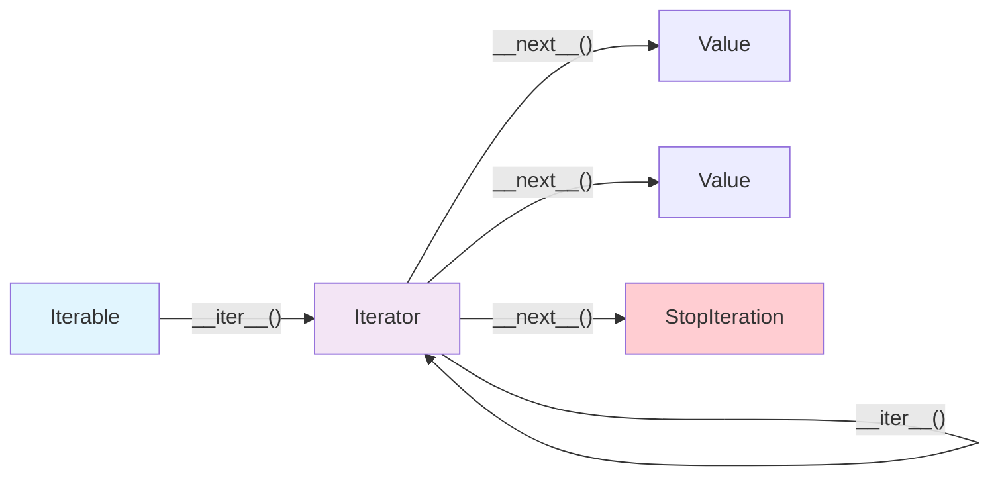
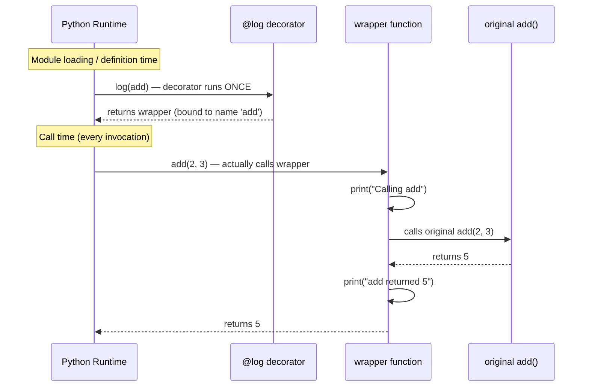
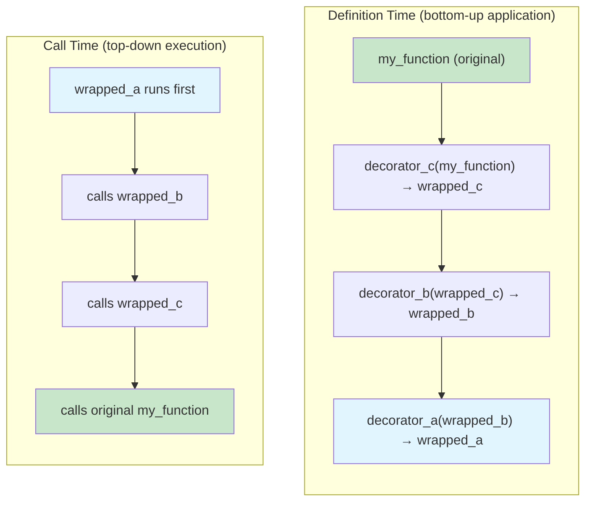

# Iterators and Decorators

> Iterators define how Python loops work at the lowest level, and decorators let you modify function behavior without touching function code — together they represent two of Python's most powerful abstraction mechanisms.

## Table of Contents
- [Core Concepts](#core-concepts)
- [Code Examples](#code-examples)
- [Common Pitfalls](#common-pitfalls)
- [Key Takeaways](#key-takeaways)
- [Exercises](#exercises)

## Core Concepts

### The Iterator Protocol

#### What

The iterator protocol is a contract between two dunder methods: `__iter__` and `__next__`. Any object that implements these two methods is an iterator. Every `for` loop, list comprehension, tuple unpacking, and `*` unpacking in Python works by calling these methods under the hood. There is nothing special about `for` — it is syntactic sugar on top of the iterator protocol.

#### How

Here is exactly what Python does when you write `for x in something`:

```python
# This loop:
for x in something:
    print(x)

# Is equivalent to this:
_iter = iter(something)       # Calls something.__iter__()
while True:
    try:
        x = next(_iter)       # Calls _iter.__next__()
    except StopIteration:
        break
    print(x)
```

Two concepts are often conflated but are distinct:

- **Iterable**: An object with an `__iter__` method that returns an iterator. Lists, tuples, dicts, strings, sets, files — all iterables. Calling `iter()` on them produces an iterator.
- **Iterator**: An object with both `__iter__` (returns itself) and `__next__` (returns the next value or raises `StopIteration`). An iterator is always iterable, but not every iterable is an iterator.

A list is an **iterable** — you can loop over it multiple times because each `iter()` call creates a fresh iterator. A file object is an **iterator** — once you read through it, it is exhausted.

#### Why It Matters

The iterator protocol is the unifying abstraction behind all iteration in Python. Comprehensions, `for` loops, `zip()`, `map()`, `*` unpacking, `any()`, `all()` — they all call `__iter__` and `__next__`. Understanding this means you can create your own objects that work seamlessly with every iteration tool in the language. It also explains why some things can only be iterated once (iterators) while others can be iterated many times (iterables that create new iterators).

### `StopIteration` and Iterator Exhaustion

#### What

`StopIteration` is the exception that signals the end of iteration. When `__next__` has no more values to yield, it raises `StopIteration`, and the `for` loop catches it silently. Once raised, the iterator is considered exhausted — calling `__next__` again should keep raising `StopIteration`.

#### How

```python
numbers = [10, 20, 30]
it = iter(numbers)

print(next(it))  # 10
print(next(it))  # 20
print(next(it))  # 30
print(next(it))  # Raises StopIteration

# next() with a default value avoids the exception
it2 = iter(numbers)
next(it2)  # 10
next(it2)  # 20
next(it2)  # 30
print(next(it2, "done"))  # "done" — no exception raised
```

`StopIteration` is a subclass of `Exception`, not `BaseException`. This is important because bare `except Exception` will catch it — which can silently swallow the end of iteration and cause infinite loops.

#### Why It Matters

The `StopIteration` mechanism is elegant but has a subtle trap: if `StopIteration` leaks out of a generator (due to a bug in code called by the generator), Python 3.7+ converts it to a `RuntimeError` (PEP 479). This prevents a category of silent bugs where a generator accidentally stops early. Understanding this exception is essential for writing correct custom iterators.

### Building Custom Iterators

#### What

A custom iterator is a class that implements `__iter__` and `__next__`. You build custom iterators when you need stateful iteration that is too complex for a generator — for example, iterating over a tree structure, implementing pagination, or creating an infinite sequence with specific logic.

#### How

```python
class Countdown:
    """Iterator that counts down from a starting number to 1."""

    def __init__(self, start: int) -> None:
        self._current = start

    def __iter__(self) -> "Countdown":
        # An iterator returns itself from __iter__
        return self

    def __next__(self) -> int:
        if self._current <= 0:
            raise StopIteration
        value = self._current
        self._current -= 1
        return value


# Works with for loops, unpacking, and all iteration tools
for n in Countdown(5):
    print(n)  # 5, 4, 3, 2, 1

# Works with list(), sum(), any(), etc.
print(list(Countdown(3)))  # [3, 2, 1]
print(sum(Countdown(10)))  # 55
```

For iterables that should support multiple independent iterations, separate the iterable from the iterator:

```python
class Range:
    """Iterable that creates fresh iterators each time."""

    def __init__(self, stop: int) -> None:
        self._stop = stop

    def __iter__(self) -> "RangeIterator":
        # Return a NEW iterator each time — supports multiple loops
        return RangeIterator(self._stop)


class RangeIterator:
    """Iterator for Range."""

    def __init__(self, stop: int) -> None:
        self._stop = stop
        self._current = 0

    def __iter__(self) -> "RangeIterator":
        return self

    def __next__(self) -> int:
        if self._current >= self._stop:
            raise StopIteration
        value = self._current
        self._current += 1
        return value


r = Range(3)
print(list(r))  # [0, 1, 2]
print(list(r))  # [0, 1, 2] — works again! Fresh iterator each time.
```

#### Why It Matters

The separation between iterable and iterator is a fundamental design pattern. Python's built-in types follow it: a `list` is an iterable that produces `list_iterator` objects. Each `for` loop gets its own iterator, so nested loops over the same list work correctly. When you build custom data structures, following this pattern ensures they integrate naturally with all of Python's iteration machinery.

### Iterable vs Iterator: The Relationship

#### What

The distinction is simple but critical. An **iterable** has `__iter__` that returns an iterator. An **iterator** has both `__iter__` (returning itself) and `__next__`. Think of an iterable as a book (you can start reading from page 1 any number of times) and an iterator as a bookmark (it tracks where you are and moves forward only).

#### How



You can test the distinction at runtime:

```python
from collections.abc import Iterable, Iterator

my_list = [1, 2, 3]
my_iter = iter(my_list)

isinstance(my_list, Iterable)   # True
isinstance(my_list, Iterator)   # False — list is iterable, not an iterator

isinstance(my_iter, Iterable)   # True — every iterator is iterable
isinstance(my_iter, Iterator)   # True
```

#### Why It Matters

Confusing iterables with iterators leads to bugs. If you pass an iterator to two functions that both try to loop over it, the second one gets nothing — the iterator was exhausted by the first. If you pass an iterable, each function gets its own fresh iterator. Knowing which you have determines whether your data can be consumed once or many times.

### What Decorators Are

#### What

A decorator is a function that takes a function as input and returns a new function (or the same function, modified) as output. The `@decorator` syntax is syntactic sugar — `@log` above `def f()` is identical to writing `f = log(f)` after the function definition.

#### How

```python
def log(func):
    def wrapper(*args, **kwargs):
        print(f"Calling {func.__name__}")
        result = func(*args, **kwargs)
        print(f"{func.__name__} returned {result}")
        return result
    return wrapper

# Using @ syntax
@log
def add(a: int, b: int) -> int:
    return a + b

# The above is exactly equivalent to:
# def add(a: int, b: int) -> int:
#     return a + b
# add = log(add)  # Rebind 'add' to the wrapper
```

After decoration, the name `add` points to the `wrapper` function, not the original `add`. When you call `add(2, 3)`, you are actually calling `wrapper(2, 3)`, which calls the original `add` inside.

#### Why It Matters

Decorators are everywhere in Python. `@property`, `@staticmethod`, `@classmethod` are built into the language. `@app.route` in Flask/FastAPI, `@pytest.fixture` in testing, `@functools.cache` for memoization, `@dataclass` for data classes — all decorators. Understanding how they work means you can read any Python framework's source code and build your own abstractions.

### How Decorators Work Under the Hood

#### What

A decorator is not special syntax — it is a **function call at definition time**. When Python encounters `@decorator` above a `def`, it executes the decorator function immediately after the function body is compiled. The decorator receives the function object and its return value replaces the original name binding.

#### How

The execution flow of decoration:

```python
@log
def add(a: int, b: int) -> int:
    return a + b
```

Step by step:
1. Python compiles the function body of `add` into bytecode.
2. Python creates a function object and temporarily binds it to `add`.
3. Python calls `log(add)` — the decorator runs **now**, at definition time.
4. The return value of `log(add)` (which is `wrapper`) replaces the name `add`.
5. From this point forward, `add` refers to `wrapper`.

This means decorator code runs **once** at import/definition time, not every time the decorated function is called. The wrapper function runs at each call.



#### Why It Matters

Understanding the timing (definition-time vs call-time) clarifies why decorators can modify function behavior without performance overhead on the decoration itself — the wrapping happens once. It also explains why you can use decorators to register functions (like Flask's `@app.route`) — the registration code runs at import time, building a routing table before any request arrives.

### Preserving Metadata with `functools.wraps`

#### What

When a decorator replaces a function with a wrapper, the wrapper has its own `__name__`, `__doc__`, `__module__`, and `__annotations__`. Without intervention, the original function's metadata is lost. `functools.wraps` is a decorator (yes, a decorator for writing decorators) that copies the original function's metadata onto the wrapper.

#### How

```python
import functools


def log(func):
    @functools.wraps(func)  # Copy metadata from func to wrapper
    def wrapper(*args, **kwargs):
        print(f"Calling {func.__name__}")
        result = func(*args, **kwargs)
        print(f"{func.__name__} returned {result}")
        return result
    return wrapper


@log
def add(a: int, b: int) -> int:
    """Add two integers."""
    return a + b


# Without @functools.wraps:
# add.__name__  => "wrapper"
# add.__doc__   => None

# With @functools.wraps:
print(add.__name__)  # "add"
print(add.__doc__)   # "Add two integers."
```

`functools.wraps` also sets `__wrapped__`, which points to the original function. This means you can always access the undecorated version: `add.__wrapped__(2, 3)` calls the original `add` directly, bypassing the wrapper.

#### Why It Matters

Without `functools.wraps`, debugging becomes painful — stack traces show "wrapper" instead of the actual function name, `help()` shows the wrong docstring, and introspection tools break. Every production decorator should use `functools.wraps`. It is so universal that omitting it is considered a bug.

### Stacking Decorators

#### What

Multiple decorators can be applied to a single function. They are applied **bottom-up** (closest to the function first) but execute **top-down** at call time because each decorator wraps the previous result.

#### How

```python
@decorator_a
@decorator_b
@decorator_c
def my_function():
    ...

# Equivalent to:
# my_function = decorator_a(decorator_b(decorator_c(my_function)))
```

The execution order:



Think of it like wrapping a gift: the innermost wrapper (closest to the function) goes on first, and the outermost wrapper is what you see. When you unwrap (call the function), you go through the outer layer first.

#### Why It Matters

Stacking is common in real frameworks. A FastAPI endpoint might have `@app.get("/users")`, `@require_auth`, and `@cache(ttl=60)` stacked together. Understanding the order matters — if `@require_auth` is above `@cache`, the auth check happens before the cache lookup, which is correct. Reverse them and unauthenticated users get cached responses.

### Decorators with Arguments

#### What

Sometimes decorators need configuration — `@cache(maxsize=128)`, `@retry(max_attempts=3)`, `@app.route("/users")`. These are not simple decorators — they are **decorator factories**: functions that accept arguments and return the actual decorator.

#### How

A decorator with arguments requires one extra level of nesting:

```python
import functools
from collections.abc import Callable
from typing import TypeVar

T = TypeVar("T")


def repeat(times: int) -> Callable:
    """Decorator factory: call the decorated function 'times' times."""
    def decorator(func: Callable[..., T]) -> Callable[..., T]:
        @functools.wraps(func)
        def wrapper(*args: object, **kwargs: object) -> T:
            result = None
            for _ in range(times):
                result = func(*args, **kwargs)
            return result  # type: ignore[return-value]
        return wrapper
    return decorator


@repeat(times=3)
def say_hello(name: str) -> str:
    print(f"Hello, {name}!")
    return f"greeted {name}"

say_hello("Alice")
# Hello, Alice!
# Hello, Alice!
# Hello, Alice!
```

The key insight: `@repeat(times=3)` first calls `repeat(times=3)`, which returns the `decorator` function. Then Python applies that decorator to `say_hello` — it is equivalent to `say_hello = repeat(times=3)(say_hello)`.

The three levels are:
1. **Factory** (`repeat`): receives the configuration arguments, returns a decorator.
2. **Decorator** (`decorator`): receives the function, returns a wrapper.
3. **Wrapper** (`wrapper`): runs at every call, forwards to the original function.

#### Why It Matters

Decorator factories are the pattern behind most framework decorators. `@app.route("/users")` is `app.route("/users")` returning a decorator. `@functools.lru_cache(maxsize=256)` is the same pattern. Knowing this three-level structure lets you read and write any decorator, no matter how complex.

### Class-Based Decorators

#### What

Any callable can be a decorator — not just functions. A class with a `__call__` method works as a decorator. Class-based decorators are useful when you need to maintain state across calls (e.g., counting calls, caching results) because the instance holds the state naturally.

#### How

```python
import functools
from collections.abc import Callable
from typing import TypeVar

T = TypeVar("T")


class CountCalls:
    """Decorator that counts how many times a function has been called."""

    def __init__(self, func: Callable[..., T]) -> None:
        functools.update_wrapper(self, func)
        self._func = func
        self.call_count = 0

    def __call__(self, *args: object, **kwargs: object) -> T:
        self.call_count += 1
        print(f"{self._func.__name__} has been called {self.call_count} time(s)")
        return self._func(*args, **kwargs)  # type: ignore[return-value]


@CountCalls
def process_data(data: list[int]) -> int:
    return sum(data)


process_data([1, 2, 3])  # "process_data has been called 1 time(s)" → 6
process_data([4, 5, 6])  # "process_data has been called 2 time(s)" → 15
print(process_data.call_count)  # 2 — state accessible on the decorated function
```

Note: `functools.update_wrapper` is the function form of `@functools.wraps`. It copies metadata from the original function onto the class instance. This is necessary because the instance replaces the function in the namespace.

#### Why It Matters

Class-based decorators are less common than function-based ones, but they shine when the decorator needs persistent state. The `call_count` attribute above lives on the instance and is directly accessible — no need for `nonlocal` or closure tricks. The built-in `@staticmethod` and `@classmethod` are actually class-based decorators (implemented in C).

### Common Decorator Patterns in the Standard Library

#### What

Python ships several decorators that you should know and use. They demonstrate the power of the pattern and save you from reinventing the wheel.

#### How

**`functools.cache`** — unlimited memoization (Python 3.9+):

```python
import functools

@functools.cache
def fibonacci(n: int) -> int:
    if n < 2:
        return n
    return fibonacci(n - 1) + fibonacci(n - 2)

fibonacci(100)  # Instant — without cache this would take centuries
```

**`functools.lru_cache`** — bounded memoization with LRU eviction:

```python
@functools.lru_cache(maxsize=128)
def expensive_lookup(key: str) -> dict:
    # Simulate expensive operation
    ...
```

**`property`** — turn method access into attribute access:

```python
class Circle:
    def __init__(self, radius: float) -> None:
        self._radius = radius

    @property
    def area(self) -> float:
        return 3.14159 * self._radius ** 2

c = Circle(5)
c.area  # 78.53975 — looks like an attribute, computed on access
```

#### Why It Matters

These decorators are battle-tested, optimized (often implemented in C), and universally understood. `@functools.cache` can turn a recursive Fibonacci from O(2^n) to O(n) with a single line. `@property` lets you evolve a class API from a simple attribute to a computed property without changing any calling code. Always reach for standard library decorators before writing your own.

## Code Examples

### Example 1: Custom Range Iterator with Step Support

```python
from collections.abc import Iterator


class StepRange:
    """Iterable that supports float steps, unlike built-in range().

    Creates a fresh iterator each time __iter__ is called,
    so it can be used in multiple loops.
    """

    def __init__(self, start: float, stop: float, step: float = 1.0) -> None:
        if step == 0:
            raise ValueError("step must not be zero")
        self._start = start
        self._stop = stop
        self._step = step

    def __iter__(self) -> "_StepRangeIterator":
        return _StepRangeIterator(self._start, self._stop, self._step)

    def __repr__(self) -> str:
        return f"StepRange({self._start}, {self._stop}, {self._step})"


class _StepRangeIterator(Iterator[float]):
    """Iterator for StepRange. Tracks current position."""

    def __init__(self, start: float, stop: float, step: float) -> None:
        self._current = start
        self._stop = stop
        self._step = step

    def __next__(self) -> float:
        if (self._step > 0 and self._current >= self._stop) or \
           (self._step < 0 and self._current <= self._stop):
            raise StopIteration

        value = self._current
        self._current += self._step
        # Round to avoid floating point drift
        self._current = round(self._current, 10)
        return value


# Usage — works with all Python iteration tools
float_range = StepRange(0.0, 1.0, 0.2)

print(list(float_range))            # [0.0, 0.2, 0.4, 0.6, 0.8]
print(list(float_range))            # [0.0, 0.2, 0.4, 0.6, 0.8] — reusable!
print(sum(float_range))             # 2.0
print(0.5 in float_range)           # False (0.5 is not a step boundary)

# Works in nested loops because each iter() creates a new iterator
for x in StepRange(0, 3, 1):
    for y in StepRange(0, 3, 1):
        print(f"({x}, {y})", end=" ")
```

### Example 2: Paginated API Iterator

```python
from collections.abc import Iterator
from dataclasses import dataclass


@dataclass
class Page:
    """Simulated API response page."""
    items: list[dict[str, str]]
    next_cursor: str | None


def _fetch_page(cursor: str | None) -> Page:
    """Simulate an API call that returns paginated results."""
    # In reality, this would be an HTTP request
    pages = {
        None: Page(
            items=[{"id": "1", "name": "Alice"}, {"id": "2", "name": "Bob"}],
            next_cursor="page2",
        ),
        "page2": Page(
            items=[{"id": "3", "name": "Charlie"}, {"id": "4", "name": "Diana"}],
            next_cursor="page3",
        ),
        "page3": Page(
            items=[{"id": "5", "name": "Eve"}],
            next_cursor=None,  # Last page
        ),
    }
    return pages[cursor]


class PaginatedResults(Iterator[dict[str, str]]):
    """Iterator that transparently handles API pagination.

    The caller iterates over individual items; the iterator
    fetches new pages automatically when the current page
    is exhausted.
    """

    def __init__(self) -> None:
        self._cursor: str | None = None
        self._items: list[dict[str, str]] = []
        self._index = 0
        self._exhausted = False
        self._fetch_next_page()

    def _fetch_next_page(self) -> None:
        """Fetch the next page from the API."""
        page = _fetch_page(self._cursor)
        self._items = page.items
        self._index = 0
        self._cursor = page.next_cursor
        if page.next_cursor is None:
            self._is_last_page = True
        else:
            self._is_last_page = False

    def __next__(self) -> dict[str, str]:
        # Current page has more items
        if self._index < len(self._items):
            item = self._items[self._index]
            self._index += 1
            return item

        # Current page exhausted — try next page
        if self._is_last_page:
            raise StopIteration

        self._fetch_next_page()
        return self.__next__()  # Recurse to get first item of new page


# Usage — iterate over all pages transparently
for user in PaginatedResults():
    print(f"User: {user['name']} (ID: {user['id']})")
# User: Alice (ID: 1)
# User: Bob (ID: 2)
# User: Charlie (ID: 3)
# User: Diana (ID: 4)
# User: Eve (ID: 5)

# Works with list() to collect all results
all_users = list(PaginatedResults())
print(f"Total users: {len(all_users)}")  # Total users: 5
```

### Example 3: Timing Decorator with `functools.wraps`

```python
import functools
import time
from collections.abc import Callable
from typing import ParamSpec, TypeVar

P = ParamSpec("P")
T = TypeVar("T")


def timer(func: Callable[P, T]) -> Callable[P, T]:
    """Decorator that prints the execution time of the decorated function.

    Uses ParamSpec (PEP 612) to preserve the exact type signature
    of the decorated function — the return type of timer(f) matches f.
    """

    @functools.wraps(func)
    def wrapper(*args: P.args, **kwargs: P.kwargs) -> T:
        start = time.perf_counter()
        result = func(*args, **kwargs)
        elapsed = time.perf_counter() - start
        print(f"{func.__name__} took {elapsed:.4f}s")
        return result

    return wrapper


@timer
def slow_sum(n: int) -> int:
    """Sum numbers from 0 to n using a loop (intentionally slow)."""
    total = 0
    for i in range(n):
        total += i
    return total


result = slow_sum(10_000_000)
# slow_sum took 0.4321s
print(result)  # 49999995000000

# Metadata is preserved
print(slow_sum.__name__)  # "slow_sum"
print(slow_sum.__doc__)   # "Sum numbers from 0 to n using a loop..."
```

### Example 4: Retry Decorator with Arguments

```python
import functools
import time
from collections.abc import Callable
from typing import ParamSpec, TypeVar

P = ParamSpec("P")
T = TypeVar("T")


def retry(
    max_attempts: int = 3,
    delay: float = 1.0,
    exceptions: tuple[type[Exception], ...] = (Exception,),
) -> Callable[[Callable[P, T]], Callable[P, T]]:
    """Decorator factory: retry a function on specified exceptions.

    Three-level structure:
    1. retry() — factory, receives config, returns decorator
    2. decorator — receives function, returns wrapper
    3. wrapper — runs at each call, implements retry logic
    """

    def decorator(func: Callable[P, T]) -> Callable[P, T]:
        @functools.wraps(func)
        def wrapper(*args: P.args, **kwargs: P.kwargs) -> T:
            last_exc: Exception | None = None

            for attempt in range(1, max_attempts + 1):
                try:
                    return func(*args, **kwargs)
                except exceptions as exc:
                    last_exc = exc
                    if attempt < max_attempts:
                        print(
                            f"{func.__name__}: attempt {attempt}/{max_attempts} "
                            f"failed ({exc}), retrying in {delay}s..."
                        )
                        time.sleep(delay)

            raise RuntimeError(
                f"{func.__name__}: all {max_attempts} attempts failed"
            ) from last_exc

        return wrapper

    return decorator


@retry(max_attempts=5, delay=0.5, exceptions=(ConnectionError, TimeoutError))
def fetch_data(url: str) -> str:
    """Fetch data from a URL, with automatic retries on network errors."""
    import random

    if random.random() < 0.7:
        raise ConnectionError(f"Connection refused: {url}")
    return f"Response from {url}"


# Each call automatically retries up to 5 times
try:
    data = fetch_data("https://api.example.com/data")
    print(data)
except RuntimeError as exc:
    print(f"Gave up: {exc}")
```

### Example 5: Access Control Decorator (Real-World Pattern)

```python
import functools
from collections.abc import Callable
from dataclasses import dataclass
from typing import ParamSpec, TypeVar

P = ParamSpec("P")
T = TypeVar("T")


@dataclass
class User:
    name: str
    role: str


def require_role(role: str) -> Callable[[Callable[P, T]], Callable[P, T]]:
    """Decorator factory that restricts access to users with a specific role.

    This pattern is used in web frameworks (Flask, FastAPI, Django)
    to protect endpoints. The decorator inspects the first argument
    (assumed to be a User) and checks its role.
    """

    def decorator(func: Callable[P, T]) -> Callable[P, T]:
        @functools.wraps(func)
        def wrapper(*args: P.args, **kwargs: P.kwargs) -> T:
            # Extract user from first positional arg or 'user' keyword arg
            user: User | None = None
            if args:
                first_arg = args[0]
                if isinstance(first_arg, User):
                    user = first_arg
            if user is None:
                user = kwargs.get("user")  # type: ignore[assignment]

            if user is None:
                raise TypeError(f"{func.__name__} requires a User argument")
            if user.role != role:
                raise PermissionError(
                    f"{func.__name__} requires role '{role}', "
                    f"but {user.name} has role '{user.role}'"
                )

            return func(*args, **kwargs)

        return wrapper

    return decorator


@require_role("admin")
def delete_database(user: User, db_name: str) -> str:
    """Delete a database. Requires admin role."""
    return f"Database '{db_name}' deleted by {user.name}"


@require_role("admin")
@timer  # Stacked: timer runs inside require_role
def rebuild_index(user: User) -> str:
    """Rebuild search index. Requires admin role."""
    time.sleep(0.1)  # Simulate work
    return "Index rebuilt"


admin = User("Alice", "admin")
viewer = User("Bob", "viewer")

print(delete_database(admin, "test_db"))  # "Database 'test_db' deleted by Alice"

try:
    delete_database(viewer, "production")
except PermissionError as exc:
    print(exc)
    # delete_database requires role 'admin', but Bob has role 'viewer'
```

### Example 6: Stacking Decorators — Execution Order Demonstration

```python
import functools
from collections.abc import Callable
from typing import ParamSpec, TypeVar

P = ParamSpec("P")
T = TypeVar("T")


def decorator_a(func: Callable[P, T]) -> Callable[P, T]:
    @functools.wraps(func)
    def wrapper(*args: P.args, **kwargs: P.kwargs) -> T:
        print("  → A: before")
        result = func(*args, **kwargs)
        print("  ← A: after")
        return result
    return wrapper


def decorator_b(func: Callable[P, T]) -> Callable[P, T]:
    @functools.wraps(func)
    def wrapper(*args: P.args, **kwargs: P.kwargs) -> T:
        print("  → B: before")
        result = func(*args, **kwargs)
        print("  ← B: after")
        return result
    return wrapper


def decorator_c(func: Callable[P, T]) -> Callable[P, T]:
    @functools.wraps(func)
    def wrapper(*args: P.args, **kwargs: P.kwargs) -> T:
        print("  → C: before")
        result = func(*args, **kwargs)
        print("  ← C: after")
        return result
    return wrapper


@decorator_a  # Applied third (outermost wrapper)
@decorator_b  # Applied second
@decorator_c  # Applied first (innermost wrapper)
def greet(name: str) -> str:
    print(f"  * greet({name}) executing")
    return f"Hello, {name}!"


print("Calling greet('World'):")
result = greet("World")
print(f"Result: {result}")

# Output:
# Calling greet('World'):
#   → A: before       ← outermost runs first
#   → B: before
#   → C: before       ← innermost runs last (closest to function)
#   * greet(World) executing
#   ← C: after        ← innermost returns first
#   ← B: after
#   ← A: after        ← outermost returns last
# Result: Hello, World!
```

## Common Pitfalls

### Pitfall 1: Forgetting `functools.wraps`

Without `functools.wraps`, the decorated function loses its identity. This breaks debugging, `help()`, and any code that inspects `__name__` or `__doc__`.

```python
import functools

# BAD — wrapper replaces the function's identity
def log_bad(func):
    def wrapper(*args, **kwargs):
        print(f"Calling {func.__name__}")
        return func(*args, **kwargs)
    return wrapper

@log_bad
def add(a: int, b: int) -> int:
    """Add two numbers."""
    return a + b

print(add.__name__)  # "wrapper" — wrong!
print(add.__doc__)   # None — docstring lost!

# GOOD — functools.wraps preserves metadata
def log_good(func):
    @functools.wraps(func)
    def wrapper(*args, **kwargs):
        print(f"Calling {func.__name__}")
        return func(*args, **kwargs)
    return wrapper

@log_good
def add(a: int, b: int) -> int:
    """Add two numbers."""
    return a + b

print(add.__name__)  # "add" — correct
print(add.__doc__)   # "Add two numbers." — preserved
```

### Pitfall 2: Consuming an Iterator Twice

Iterators are single-use. After exhaustion, they return nothing. If you need to iterate multiple times, convert to a list or use an iterable that creates fresh iterators.

```python
# BAD — iterator exhausted after first use
numbers = map(lambda x: x ** 2, range(5))

total = sum(numbers)         # 30 — works
average = sum(numbers) / 5   # ZeroDivisionError! sum(numbers) is 0 — exhausted

# GOOD — materialize to a list if you need multiple passes
numbers = list(map(lambda x: x ** 2, range(5)))

total = sum(numbers)         # 30
average = sum(numbers) / 5   # 6.0

# GOOD — or use a comprehension (produces a list by default)
numbers = [x ** 2 for x in range(5)]
```

### Pitfall 3: Decorator with Arguments Missing the Extra Layer

A parameterized decorator needs three levels of nesting. Forgetting the factory level causes a confusing `TypeError`.

```python
import functools

# BAD — missing the factory level
def repeat_bad(func, times=3):  # This doesn't work as @repeat_bad(times=5)
    @functools.wraps(func)
    def wrapper(*args, **kwargs):
        for _ in range(times):
            func(*args, **kwargs)
    return wrapper

# @repeat_bad(times=5)  # TypeError: repeat_bad() missing required argument 'func'

# GOOD — proper three-level structure
def repeat_good(times: int = 3):
    """Factory: returns a decorator configured with 'times'."""
    def decorator(func):
        @functools.wraps(func)
        def wrapper(*args, **kwargs):
            result = None
            for _ in range(times):
                result = func(*args, **kwargs)
            return result
        return wrapper
    return decorator

@repeat_good(times=5)  # Works! repeat_good(times=5) returns the decorator
def say_hi() -> None:
    print("Hi!")
```

### Pitfall 4: Mutating Iterator State During Iteration

Modifying the underlying collection while iterating over it leads to undefined behavior or `RuntimeError`.

```python
# BAD — modifying a dict while iterating raises RuntimeError
config = {"a": 1, "b": 2, "c": 3}
for key in config:
    if config[key] < 2:
        del config[key]  # RuntimeError: dictionary changed size during iteration

# GOOD — iterate over a copy of the keys
config = {"a": 1, "b": 2, "c": 3}
for key in list(config):  # list() creates a snapshot of the keys
    if config[key] < 2:
        del config[key]

# GOOD — or build a new dict with comprehension (preferred)
config = {"a": 1, "b": 2, "c": 3}
config = {k: v for k, v in config.items() if v >= 2}
```

### Pitfall 5: Decorating Methods Without Handling `self`

When decorating class methods, the wrapper receives `self` as the first positional argument. If the decorator does not forward `*args` and `**kwargs`, it silently drops `self` and the method breaks.

```python
import functools

# BAD — wrapper with fixed parameters loses self
def validate_positive_bad(func):
    @functools.wraps(func)
    def wrapper(value):  # Missing self!
        if value <= 0:
            raise ValueError("Must be positive")
        return func(value)  # self is not forwarded
    return wrapper

class Account:
    @validate_positive_bad
    def deposit(self, amount: float) -> None:  # self becomes 'value'!
        self.balance += amount
        # TypeError or wrong behavior — self is misinterpreted

# GOOD — always use *args, **kwargs in decorator wrappers
def validate_positive_good(func):
    @functools.wraps(func)
    def wrapper(*args, **kwargs):
        # Works with functions, methods, classmethods — anything
        # For methods, args[0] is self, args[1] is the value
        return func(*args, **kwargs)
    return wrapper
```

The rule is simple: **always use `*args, **kwargs`** in decorator wrappers unless you have a very specific reason not to. This makes the decorator work with any function signature, including methods.

## Key Takeaways

- **The iterator protocol is two methods**: `__iter__` returns an iterator, `__next__` returns the next value or raises `StopIteration`. Every `for` loop, comprehension, and unpacking calls these methods. Understanding the protocol means you can make any object iterable.
- **Iterables create iterators; iterators are single-use**: A list is an iterable (loop over it many times). A `map()` result is an iterator (consumed once). Know which you have to avoid silent data loss.
- **Decorators are function transformations**: `@decorator` above `def f` is just `f = decorator(f)`. The decorator runs once at definition time; the wrapper runs at every call. Always use `functools.wraps` to preserve the original function's metadata.
- **Stacked decorators apply bottom-up, execute top-down**: The decorator closest to the function wraps it first (innermost), but the outermost wrapper executes first at call time. Order matters for correctness.
- **Decorator factories add one nesting level**: `@retry(max_attempts=3)` calls `retry(max_attempts=3)` first (returns a decorator), then applies that decorator to the function. Three levels: factory, decorator, wrapper.

## Exercises

1. **Custom iterator**: Write a class `FibonacciIterator` that implements the iterator protocol and yields Fibonacci numbers up to a given maximum value. It should work with `for`, `list()`, and `sum()`. Then write a separate `Fibonacci` iterable class that creates fresh `FibonacciIterator` instances so it can be iterated multiple times.

2. **Decorator basics**: Write a `@debug` decorator that prints the function name, arguments, and return value for every call. Use `functools.wraps` to preserve metadata. Test it on a function with `*args` and `**kwargs` to verify it handles arbitrary signatures.

3. **Decorator with arguments**: Write a `@rate_limit(max_calls, period)` decorator factory that raises a `RuntimeError` if the decorated function is called more than `max_calls` times within `period` seconds. Use `time.monotonic()` for timing. Test it by calling the function in a tight loop.

4. **Stacking order**: Given these three decorators — `@uppercase` (converts string return to uppercase), `@exclaim` (appends "!" to string return), `@repeat(n)` (repeats string return n times separated by spaces) — what is the output of `greet("hello")` with them stacked as `@uppercase @exclaim @repeat(2)`? Work it out by hand, then write the decorators and verify.

5. **Iterator protocol exploration**: Without running the code, predict the output of:
   ```python
   data = [1, 2, 3]
   it = iter(data)
   print(next(it))
   print(list(it))
   print(list(it))
   ```
   Explain why the second `list(it)` produces a different result than the first. Then modify the code to make both `list()` calls return the same result.

---
up:: [Schedule](../../Schedule.md)
#type/learning #source/self-study #status/seed
