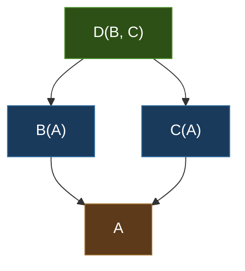

# Object-Oriented Programming

> Python's OOP model is built on the principle that everything is an object, conventions trump enforcement, and flexibility should never be sacrificed for ceremony.

## Table of Contents
- [Core Concepts](#core-concepts)
- [Code Examples](#code-examples)
- [Common Pitfalls](#common-pitfalls)
- [Key Takeaways](#key-takeaways)
- [Exercises](#exercises)

## Core Concepts

### Classes

#### What

A class is a blueprint for creating objects. In Python, a class defines a namespace that bundles data (attributes) and behavior (methods) together. Unlike languages such as Java or C++, Python classes are themselves objects — they are instances of `type`, and you can create, modify, and pass them around at runtime just like any other value.

Every class you write implicitly inherits from `object`, the root of Python's type hierarchy. When you write `class Dog:`, Python is actually doing `class Dog(object):` behind the scenes. This gives every object access to default implementations of `__repr__`, `__eq__`, `__hash__`, and other dunder methods.

#### How

The `class` keyword creates a new class. The `__init__` method is the initializer (not a constructor — `__new__` is the actual constructor). Inside `__init__`, you bind attributes to `self`, which is the instance being initialized.

```python
class Dog:
    # Class attribute — shared by ALL instances, stored on the class object itself
    species: str = "Canis familiaris"

    def __init__(self, name: str, age: int) -> None:
        # Instance attributes — unique to each instance, stored on the instance's __dict__
        self.name = name
        self.age = age
```

There is a critical distinction between **class attributes** and **instance attributes**. Class attributes live on the class object's `__dict__` and are shared across all instances. Instance attributes live on each instance's `__dict__`. When you access `dog.species`, Python first checks `dog.__dict__`, then `Dog.__dict__`, then walks up the MRO. This is called the **attribute lookup chain**, and understanding it is essential to understanding Python's OOP.

```python
fido = Dog("Fido", 3)
rex = Dog("Rex", 5)

# Both share the class attribute
assert fido.species is rex.species  # True — same object in memory

# Instance attributes are independent
fido.name = "Fido Jr."
assert rex.name == "Rex"  # unaffected
```

When you assign to an instance attribute that shadows a class attribute, you create a new entry in the instance's `__dict__` — the class attribute itself remains unchanged. This is a common source of confusion, especially with mutable class attributes (covered in Common Pitfalls).

#### Why It Matters

Python's class model is more dynamic than what you will find in statically-typed languages. You can add, modify, or delete attributes on instances and even on classes at runtime. This is not a bug — it is a design choice that enables metaclasses, monkey patching, and the incredible flexibility of Python's ecosystem. The tradeoff is that you need to understand the attribute lookup chain to avoid subtle bugs.

The fact that classes are objects means you can store them in variables, pass them as function arguments, and create them dynamically. This is the foundation of patterns like factory functions, plugin systems, and ORMs (where a class might represent a database table).

### Methods

#### What

Methods are functions defined inside a class body. Python has three kinds of methods, each serving a distinct purpose: **instance methods**, **class methods**, and **static methods**. The difference comes down to what gets passed as the first argument — and that determines what the method has access to.

#### How

**Instance methods** receive the instance as `self`. They can access and modify instance state, call other instance methods, and access the class via `self.__class__` or `type(self)`.

```python
class BankAccount:
    def __init__(self, owner: str, balance: float = 0.0) -> None:
        self.owner = owner
        self.balance = balance

    # Instance method — operates on the specific instance
    def deposit(self, amount: float) -> None:
        if amount <= 0:
            raise ValueError("Deposit amount must be positive")
        self.balance += amount
```

**Class methods** receive the class as `cls` via the `@classmethod` decorator. They cannot access instance state, but they can access and modify class state. Their primary use case is **alternative constructors** — factory methods that create instances in different ways.

```python
class BankAccount:
    _interest_rate: float = 0.02  # Class-level configuration

    def __init__(self, owner: str, balance: float = 0.0) -> None:
        self.owner = owner
        self.balance = balance

    @classmethod
    def from_csv(cls, csv_line: str) -> "BankAccount":
        """Alternative constructor: create account from CSV data."""
        owner, balance = csv_line.split(",")
        return cls(owner=owner.strip(), balance=float(balance.strip()))

    @classmethod
    def set_interest_rate(cls, rate: float) -> None:
        """Modify class-level state."""
        cls._interest_rate = rate
```

The reason `cls` is used instead of hardcoding the class name is **polymorphism**. If `SavingsAccount` inherits from `BankAccount`, calling `SavingsAccount.from_csv(line)` will correctly create a `SavingsAccount`, not a `BankAccount` — because `cls` will be `SavingsAccount`.

**Static methods** receive neither `self` nor `cls`. They are plain functions that happen to live inside a class's namespace. Use the `@staticmethod` decorator.

```python
class BankAccount:
    @staticmethod
    def validate_amount(amount: float) -> bool:
        """Pure utility — no access to instance or class state."""
        return isinstance(amount, (int, float)) and amount > 0
```

#### Why It Matters

The three method types exist to communicate **intent** and **scope of access**. An instance method says "I need a specific instance." A class method says "I need the class, not an instance." A static method says "I need neither — I am just a namespaced utility." Choosing the wrong type does not cause a syntax error, but it signals the wrong intent to anyone reading your code.

Class methods as alternative constructors are a Python idiom you will see everywhere: `datetime.fromtimestamp()`, `dict.fromkeys()`, `int.from_bytes()`. They solve a real problem — Python does not support constructor overloading like C++ or Java. Instead of multiple `__init__` signatures, you write multiple `@classmethod` factories, each with a descriptive name.

### Inheritance

#### What

Inheritance lets a class (the **child** or **subclass**) reuse and extend the behavior of another class (the **parent** or **superclass**). Python supports both **single inheritance** (one parent) and **multiple inheritance** (many parents). This is fundamentally different from Java (single inheritance + interfaces) or Go (composition only, no inheritance).

#### How

Single inheritance is straightforward — the child class lists the parent in parentheses:

```python
from dataclasses import dataclass


@dataclass
class Animal:
    name: str
    sound: str = "..."

    def speak(self) -> str:
        return f"{self.name} says {self.sound}"


@dataclass
class Dog(Animal):
    sound: str = "Woof"  # Override default
    tricks: list[str] = None  # Extend with new attribute

    def __post_init__(self) -> None:
        if self.tricks is None:
            self.tricks = []

    def learn_trick(self, trick: str) -> None:
        self.tricks.append(trick)
```

The `super()` function is how you call methods on parent classes. In single inheritance it simply calls the parent's method. In multiple inheritance, it follows the **Method Resolution Order (MRO)**.

```python
class Animal:
    def __init__(self, name: str) -> None:
        self.name = name

class Pet:
    def __init__(self, owner: str) -> None:
        self.owner = owner

class Dog(Animal, Pet):
    def __init__(self, name: str, owner: str, breed: str) -> None:
        # In multiple inheritance, super() follows the MRO
        # This is why cooperative multiple inheritance requires **kwargs patterns
        super().__init__(name)  # Calls Animal.__init__ (next in MRO)
        Pet.__init__(self, owner)  # Explicit call — breaks cooperative pattern but works
        self.breed = breed
```

**Method Resolution Order (MRO)** determines the order in which Python searches for methods in a class hierarchy. Python uses the **C3 linearization** algorithm, which guarantees two things: (1) children come before parents, and (2) the order of parents in the class definition is preserved. You can inspect the MRO via `ClassName.__mro__` or `ClassName.mro()`.

Consider the classic **diamond inheritance** problem:

```python
class A:
    def method(self) -> str:
        return "A"

class B(A):
    def method(self) -> str:
        return "B"

class C(A):
    def method(self) -> str:
        return "C"

class D(B, C):
    pass


# MRO: D -> B -> C -> A -> object
print(D.__mro__)
# (<class 'D'>, <class 'B'>, <class 'C'>, <class 'A'>, <class 'object'>)

d = D()
print(d.method())  # "B" — B comes before C in D's parent list, so B wins
```

Here is the MRO resolution for the diamond pattern, visualized:



**C3 linearization resolves this as: D -> B -> C -> A -> object**

The algorithm works by merging the linearizations of all parents while preserving two constraints: the local precedence order (B before C, because `class D(B, C)`) and the monotonicity constraint (if B comes before C in any linearization, it must come before C in all). If these constraints cannot be satisfied simultaneously, Python raises a `TypeError` at class definition time — it refuses to create an inconsistent hierarchy.

**Cooperative multiple inheritance** is the idiomatic way to handle multiple inheritance in Python. Every class in the hierarchy calls `super().__init__(**kwargs)` and only extracts the keyword arguments it needs, forwarding the rest:

```python
class Animal:
    def __init__(self, name: str, **kwargs: object) -> None:
        super().__init__(**kwargs)  # Forward remaining kwargs up the MRO
        self.name = name

class Pet:
    def __init__(self, owner: str, **kwargs: object) -> None:
        super().__init__(**kwargs)  # Forward remaining kwargs up the MRO
        self.owner = owner

class Dog(Animal, Pet):
    def __init__(self, breed: str, **kwargs: object) -> None:
        super().__init__(**kwargs)  # Follows MRO: Animal.__init__ -> Pet.__init__
        self.breed = breed


# Each class extracts what it needs from kwargs
rex = Dog(name="Rex", owner="Alice", breed="Labrador")
print(rex.name, rex.owner, rex.breed)  # Rex Alice Labrador
```

#### Why It Matters

Multiple inheritance is powerful but dangerous. Most Python code uses single inheritance or mixins (small, focused classes that add a single capability). The cooperative `super()` + `**kwargs` pattern is the only correct way to make multiple inheritance work reliably — if any class in the chain breaks the pattern, the whole thing falls apart.

The MRO matters practically, not just theoretically. When you use Django's class-based views, or combine multiple mixins, the MRO determines which method "wins." If you do not understand the MRO, you cannot predict the behavior of your own class hierarchies. Always inspect `__mro__` when debugging inheritance issues.

In modern Python, **composition is generally preferred over inheritance**. Instead of `class Dog(Animal, Pet, Serializable)`, consider giving `Dog` an `animal` attribute, a `pet` attribute, and a `serialize()` method that delegates to a strategy object. Inheritance creates tight coupling — composition keeps things flexible.

### Encapsulation

#### What

Encapsulation is the practice of hiding internal implementation details and exposing a clean public interface. Python's approach to encapsulation is radically different from Java or C++: **there are no access modifiers** (`public`, `private`, `protected`). Instead, Python relies on **naming conventions** — a social contract between developers, not compiler enforcement.

This philosophy is captured by the phrase: "We are all consenting adults here." Python trusts developers to respect the conventions and does not put up barriers to accessing internals. The underscore prefix is a signal, not a lock.

#### How

Python uses three levels of access convention:

**Public** (no prefix): Part of the public API. Safe for external use.

```python
class User:
    def __init__(self, name: str) -> None:
        self.name = name  # Public — anyone can read and write
```

**Protected** (`_single_underscore`): Internal implementation detail. "You can use this, but it might change without notice." This is the most common convention for non-public attributes. It is respected by IDE autocompletion (most IDEs hide `_` members from suggestions) and by `from module import *` (which skips `_` names).

```python
class User:
    def __init__(self, name: str) -> None:
        self._name = name  # Protected by convention — "don't touch unless you know what you're doing"
```

**Name-mangled** (`__double_underscore`): Python rewrites `__attr` to `_ClassName__attr` at compile time. This is called **name mangling**. It exists specifically to prevent **accidental name collisions** in inheritance hierarchies — not to enforce privacy.

```python
class Base:
    def __init__(self) -> None:
        self.__secret = 42  # Becomes self._Base__secret

class Child(Base):
    def __init__(self) -> None:
        super().__init__()
        self.__secret = 99  # Becomes self._Child__secret — no collision!


c = Child()
print(c._Base__secret)   # 42 — Base's attribute is still there
print(c._Child__secret)  # 99 — Child's attribute is separate
```

Name mangling is not security. Anyone who knows the naming scheme can access `_ClassName__attr` directly. It solves a specific technical problem (subclass attribute collisions), not a privacy problem.

**The `@property` decorator** lets you replace direct attribute access with getter/setter methods without changing the calling code. This is Python's answer to the Java `getX()`/`setX()` pattern — but much cleaner.

```python
class Temperature:
    def __init__(self, celsius: float) -> None:
        self._celsius = celsius  # Store internally

    @property
    def celsius(self) -> float:
        """Read access — called when you do temp.celsius"""
        return self._celsius

    @celsius.setter
    def celsius(self, value: float) -> None:
        """Write access — called when you do temp.celsius = 30"""
        if value < -273.15:
            raise ValueError("Temperature below absolute zero is not possible")
        self._celsius = value

    @property
    def fahrenheit(self) -> float:
        """Computed property — derived from internal state"""
        return self._celsius * 9 / 5 + 32

    @fahrenheit.setter
    def fahrenheit(self, value: float) -> None:
        self.celsius = (value - 32) * 5 / 9  # Delegates to celsius setter for validation
```

Usage is identical to direct attribute access:

```python
temp = Temperature(100)
print(temp.celsius)     # 100 — calls the getter
print(temp.fahrenheit)  # 212.0 — computed property
temp.celsius = -300     # ValueError — setter enforces validation
```

**The Descriptor Protocol Behind `@property`**

Under the hood, `@property` is implemented using Python's **descriptor protocol**. A descriptor is any object that defines `__get__`, `__set__`, or `__delete__`. When Python encounters attribute access on an instance, it checks if the attribute on the class is a descriptor and, if so, calls the appropriate descriptor method instead of doing a normal attribute lookup.

```python
# What @property actually creates (simplified):
class PropertyDescriptor:
    """This is roughly what the built-in property() does under the hood."""

    def __init__(self, fget=None, fset=None, fdel=None):
        self.fget = fget
        self.fset = fset
        self.fdel = fdel

    def __get__(self, obj, objtype=None):
        if obj is None:
            return self  # Accessed on the class, not an instance
        if self.fget is None:
            raise AttributeError("unreadable attribute")
        return self.fget(obj)

    def __set__(self, obj, value):
        if self.fset is None:
            raise AttributeError("can't set attribute")
        self.fset(obj, value)

    def __delete__(self, obj):
        if self.fdel is None:
            raise AttributeError("can't delete attribute")
        self.fdel(obj)
```

The descriptor protocol is one of Python's most powerful mechanisms. It powers `@property`, `@classmethod`, `@staticmethod`, `__slots__`, and even regular method binding (when you call `obj.method()`, Python's descriptor protocol is what binds `obj` as the first argument). Understanding descriptors gives you deep insight into how Python's object model works.

The attribute lookup order, accounting for descriptors, is:

1. **Data descriptors** on the class (descriptors that define `__set__` or `__delete__`) — these take priority over instance `__dict__`
2. **Instance `__dict__`** — the instance's own attributes
3. **Non-data descriptors** on the class (descriptors that only define `__get__`) and other class attributes
4. `__getattr__` (if defined) — fallback for missing attributes

This is why `@property` (a data descriptor) can intercept attribute assignment — it has higher priority than the instance's `__dict__`.

#### Why It Matters

Python's convention-based encapsulation is a deliberate design choice, not a limitation. It makes debugging and testing dramatically easier — you can always reach into an object's internals when you need to, whether that is for testing private logic, debugging in production, or monkey-patching a library.

The `@property` decorator embodies a core Python design principle: **start with simple attribute access, add behavior later if needed**. In Java, you write getters and setters from day one "just in case." In Python, you start with a plain attribute and only introduce `@property` when you actually need validation, computation, or lazy loading. The calling code never changes — this is backward-compatible API evolution.

Understanding the descriptor protocol is what separates intermediate Python developers from advanced ones. It is the mechanism behind most of Python's "magic" and is essential if you ever need to write custom descriptors, metaclasses, or understand how frameworks like Django ORM or SQLAlchemy work.

### Duck Typing vs Nominal Typing

#### What

Python is a **duck-typed** language: "If it walks like a duck and quacks like a duck, then it is a duck." This means Python cares about **what an object can do** (its methods and attributes), not **what it is** (its class hierarchy). You do not need to inherit from an interface or base class to be compatible with a function — you just need to have the right methods.

#### How

In a nominally-typed language like Java, you would define an interface and require objects to explicitly implement it:

```python
# The "Java way" — nominal typing (Python supports this but doesn't require it)
from abc import ABC, abstractmethod


class Drawable(ABC):
    @abstractmethod
    def draw(self) -> str: ...


class Circle(Drawable):
    def draw(self) -> str:
        return "Drawing a circle"

# Must inherit from Drawable to be accepted
```

In idiomatic Python, you rely on duck typing instead:

```python
# The Pythonic way — duck typing
class Circle:
    def draw(self) -> str:
        return "Drawing a circle"

class Square:
    def draw(self) -> str:
        return "Drawing a square"

class Text:
    def draw(self) -> str:
        return "Drawing text"


def render_all(drawables: list) -> None:
    """Works with ANY object that has a draw() method — no base class required."""
    for item in drawables:
        print(item.draw())


# No common base class, no interface — just objects with a draw() method
render_all([Circle(), Square(), Text()])
```

For **static type checking** (mypy), you can use `Protocol` from the `typing` module to define structural types — the static-typing equivalent of duck typing:

```python
from typing import Protocol


class Drawable(Protocol):
    def draw(self) -> str: ...


def render_all(drawables: list[Drawable]) -> None:
    for item in drawables:
        print(item.draw())

# Circle, Square, Text are all Drawable WITHOUT inheriting from it
# mypy checks structurally — does the class have a draw() -> str method?
```

#### Why It Matters

Duck typing is not just a convenience — it fundamentally shapes how you design Python code. You write functions that accept "anything with method X" rather than "instances of class Y." This makes your code more flexible, more testable (pass in a mock with the right methods), and more composable (mix and match objects from different libraries).

The `Protocol` class bridges the gap between duck typing and static analysis. It gives mypy the information it needs to check types without forcing runtime inheritance. This is the modern best practice: duck typing at runtime, structural typing for static analysis.

### Dataclasses: The Modern Alternative to Manual `__init__`

#### What

The `dataclasses` module (Python 3.7+) generates boilerplate code (`__init__`, `__repr__`, `__eq__`, and more) from class attribute annotations. It is the standard way to create classes that primarily hold data — replacing the tedious pattern of manually writing `__init__` methods that just assign arguments to `self`.

#### How

```python
from dataclasses import dataclass, field


@dataclass
class User:
    name: str
    email: str
    age: int
    tags: list[str] = field(default_factory=list)  # Mutable defaults need field()
    active: bool = True

    @property
    def display_name(self) -> str:
        return f"{self.name} <{self.email}>"
```

This single decorator generates:

- `__init__(self, name, email, age, tags=<list factory>, active=True)`
- `__repr__(self)` returning `User(name='...', email='...', ...)`
- `__eq__(self, other)` comparing all fields

You can customize behavior with parameters:

```python
@dataclass(frozen=True)  # Immutable — instances cannot be modified after creation
class Point:
    x: float
    y: float

@dataclass(slots=True)  # Python 3.10+ — uses __slots__ for memory efficiency
class Sensor:
    id: int
    value: float
    timestamp: float

@dataclass(order=True)  # Generates __lt__, __le__, __gt__, __ge__
class Priority:
    level: int
    label: str = field(compare=False)  # Excluded from ordering comparisons
```

#### Why It Matters

Dataclasses eliminate an entire category of bugs (typos in `__init__`, forgetting to update `__repr__` after adding a field, incorrect `__eq__` implementations) by generating correct code automatically. They are also self-documenting — the class body reads like a schema.

For **runtime validation** (API input, configuration files, external data), use Pydantic's `BaseModel` instead. Dataclasses trust the caller to provide correct types; Pydantic validates and coerces at runtime. The two serve different purposes: dataclasses for internal data structures, Pydantic for boundary validation.

## Code Examples

### Example 1: Real-World Class Hierarchy with Dataclasses

This example shows a production-style approach: dataclasses for data, composition for behavior, and `@property` for computed attributes.

```python
from dataclasses import dataclass, field
from datetime import datetime, timedelta
from enum import Enum, auto


class Priority(Enum):
    LOW = auto()
    MEDIUM = auto()
    HIGH = auto()
    CRITICAL = auto()


@dataclass
class Task:
    """A single actionable task with metadata and computed properties."""

    title: str
    assignee: str
    priority: Priority = Priority.MEDIUM
    created_at: datetime = field(default_factory=datetime.now)
    completed_at: datetime | None = None
    tags: list[str] = field(default_factory=list)

    @property
    def is_completed(self) -> bool:
        return self.completed_at is not None

    @property
    def age(self) -> timedelta:
        """Time since the task was created."""
        return datetime.now() - self.created_at

    def complete(self) -> None:
        """Mark the task as completed. Idempotent — safe to call multiple times."""
        if not self.is_completed:
            self.completed_at = datetime.now()

    def __str__(self) -> str:
        status = "DONE" if self.is_completed else "TODO"
        return f"[{status}] {self.title} ({self.priority.name}) -> {self.assignee}"


@dataclass
class Sprint:
    """A collection of tasks with a deadline. Demonstrates composition over inheritance."""

    name: str
    deadline: datetime
    tasks: list[Task] = field(default_factory=list)

    def add_task(self, task: Task) -> None:
        self.tasks.append(task)

    @property
    def completion_rate(self) -> float:
        """Percentage of tasks completed (0.0 to 1.0)."""
        if not self.tasks:
            return 0.0
        completed = sum(1 for t in self.tasks if t.is_completed)
        return completed / len(self.tasks)

    @property
    def overdue(self) -> bool:
        return datetime.now() > self.deadline and self.completion_rate < 1.0

    def tasks_by_priority(self) -> dict[Priority, list[Task]]:
        """Group tasks by priority. Returns a dict with Priority keys."""
        result: dict[Priority, list[Task]] = {}
        for task in self.tasks:
            result.setdefault(task.priority, []).append(task)
        return result


# Usage
sprint = Sprint(
    name="Sprint 12",
    deadline=datetime(2026, 3, 15),
)

task1 = Task("Fix login bug", "Alice", Priority.CRITICAL, tags=["auth", "bug"])
task2 = Task("Add dark mode", "Bob", Priority.LOW, tags=["ui"])
task3 = Task("Write API docs", "Alice", Priority.MEDIUM, tags=["docs"])

sprint.add_task(task1)
sprint.add_task(task2)
sprint.add_task(task3)

task1.complete()

print(f"Sprint: {sprint.name}")
print(f"Completion: {sprint.completion_rate:.0%}")
print(f"Overdue: {sprint.overdue}")
for task in sprint.tasks:
    print(f"  {task}")
```

### Example 2: Class Methods as Alternative Constructors

This pattern appears throughout the Python standard library and in popular frameworks.

```python
from __future__ import annotations

import json
from dataclasses import dataclass, field
from pathlib import Path


@dataclass
class Config:
    """Application configuration with multiple construction paths."""

    host: str = "localhost"
    port: int = 8080
    debug: bool = False
    allowed_origins: list[str] = field(default_factory=lambda: ["*"])

    @classmethod
    def from_json_file(cls, path: Path) -> Config:
        """Load configuration from a JSON file."""
        data = json.loads(path.read_text())
        return cls(**data)

    @classmethod
    def from_dict(cls, data: dict[str, object]) -> Config:
        """Create config from a dictionary, ignoring unknown keys."""
        valid_fields = {f.name for f in cls.__dataclass_fields__.values()}
        filtered = {k: v for k, v in data.items() if k in valid_fields}
        return cls(**filtered)

    @classmethod
    def production(cls) -> Config:
        """Pre-configured for production deployment."""
        return cls(
            host="0.0.0.0",
            port=443,
            debug=False,
            allowed_origins=["https://example.com"],
        )

    @classmethod
    def development(cls) -> Config:
        """Pre-configured for local development."""
        return cls(debug=True)


# Multiple ways to create the same type of object
config_dev = Config.development()
config_prod = Config.production()
config_custom = Config.from_dict({"host": "10.0.0.1", "port": 9090, "extra_key": "ignored"})

print(config_dev)   # Config(host='localhost', port=8080, debug=True, allowed_origins=['*'])
print(config_prod)  # Config(host='0.0.0.0', port=443, debug=False, allowed_origins=['https://example.com'])
```

### Example 3: Cooperative Multiple Inheritance with Mixins

Mixins are small, focused classes that add a single capability. This is the primary legitimate use case for multiple inheritance in Python.

```python
from __future__ import annotations

import json
from dataclasses import dataclass, asdict
from datetime import datetime


class JsonSerializableMixin:
    """Mixin that adds JSON serialization to any dataclass."""

    def to_json(self, indent: int = 2) -> str:
        # asdict() works on any dataclass instance
        data = asdict(self)  # type: ignore[arg-type]
        return json.dumps(data, indent=indent, default=str)

    @classmethod
    def from_json(cls, json_str: str) -> "JsonSerializableMixin":
        data = json.loads(json_str)
        return cls(**data)  # type: ignore[call-arg]


class TimestampMixin:
    """Mixin that adds created/updated timestamps."""

    created_at: datetime
    updated_at: datetime

    def __init_subclass__(cls, **kwargs: object) -> None:
        super().__init_subclass__(**kwargs)
        original_init = cls.__init__

        def new_init(self: object, *args: object, **kw: object) -> None:
            original_init(self, *args, **kw)
            now = datetime.now()
            if not hasattr(self, "created_at"):
                object.__setattr__(self, "created_at", now)
            object.__setattr__(self, "updated_at", now)

        cls.__init__ = new_init  # type: ignore[method-assign]


class AuditMixin:
    """Mixin that tracks who created and last modified an object."""

    _change_log: list[str]

    def log_change(self, user: str, action: str) -> None:
        if not hasattr(self, "_change_log"):
            self._change_log = []
        entry = f"[{datetime.now().isoformat()}] {user}: {action}"
        self._change_log.append(entry)

    def get_change_log(self) -> list[str]:
        return getattr(self, "_change_log", [])


@dataclass
class Product(JsonSerializableMixin, AuditMixin):
    """A product that can be serialized to JSON and audited."""

    name: str
    price: float
    sku: str


# Usage
product = Product(name="Widget", price=29.99, sku="WDG-001")
product.log_change("alice", "Created product")
product.log_change("bob", "Updated price from 24.99")

print(product.to_json())
print(product.get_change_log())

# MRO shows the method resolution order
print(Product.__mro__)
# (Product, JsonSerializableMixin, AuditMixin, object)
```

### Example 4: Custom Descriptor — Validated Attributes

This example shows how to write a reusable descriptor that validates attribute values. This is the same mechanism behind `@property`, but generalized.

```python
from typing import Any


class Validated:
    """A descriptor that validates values on assignment.

    This is the mechanism behind @property, but reusable across multiple classes
    and attributes. Define once, apply to any number of fields.
    """

    def __init__(self, min_value: float | None = None, max_value: float | None = None) -> None:
        self.min_value = min_value
        self.max_value = max_value

    def __set_name__(self, owner: type, name: str) -> None:
        """Called automatically when the descriptor is assigned to a class attribute.
        Stores the attribute name so we know which key to use in __dict__.
        """
        self.public_name = name
        self.private_name = f"_{name}"

    def __get__(self, obj: Any, objtype: type | None = None) -> Any:
        if obj is None:
            return self  # Accessed on the class itself
        return getattr(obj, self.private_name, None)

    def __set__(self, obj: Any, value: float) -> None:
        if self.min_value is not None and value < self.min_value:
            raise ValueError(
                f"{self.public_name} must be >= {self.min_value}, got {value}"
            )
        if self.max_value is not None and value > self.max_value:
            raise ValueError(
                f"{self.public_name} must be <= {self.max_value}, got {value}"
            )
        setattr(obj, self.private_name, value)


class Sensor:
    """A sensor with validated numeric attributes.

    temperature and humidity use the Validated descriptor — any assignment
    goes through __set__, which enforces the constraints automatically.
    """

    temperature = Validated(min_value=-40.0, max_value=125.0)
    humidity = Validated(min_value=0.0, max_value=100.0)

    def __init__(self, name: str, temperature: float, humidity: float) -> None:
        self.name = name
        # These assignments trigger Validated.__set__
        self.temperature = temperature
        self.humidity = humidity

    def __repr__(self) -> str:
        return (
            f"Sensor(name={self.name!r}, "
            f"temperature={self.temperature}, "
            f"humidity={self.humidity})"
        )


# Usage
sensor = Sensor("outdoor", temperature=23.5, humidity=65.0)
print(sensor)  # Sensor(name='outdoor', temperature=23.5, humidity=65.0)

sensor.temperature = 100.0  # OK
# sensor.temperature = 200.0  # ValueError: temperature must be <= 125.0, got 200.0
# sensor.humidity = -5.0      # ValueError: humidity must be >= 0.0, got -5.0
```

### Example 5: Inheritance with `super()` and the Template Method Pattern

The template method pattern defines the skeleton of an algorithm in a base class, letting subclasses override specific steps. This is one of the most practical uses of inheritance.

```python
from abc import ABC, abstractmethod
from dataclasses import dataclass, field
from typing import Any


@dataclass
class Report:
    """The output of a report generation pipeline."""
    title: str
    sections: list[str] = field(default_factory=list)
    footer: str = ""

    def render(self) -> str:
        parts = [f"=== {self.title} ===", ""]
        parts.extend(self.sections)
        if self.footer:
            parts.extend(["", f"--- {self.footer} ---"])
        return "\n".join(parts)


class ReportGenerator(ABC):
    """Base class defining the report generation template.

    The generate() method is the template — it calls abstract methods
    that subclasses must implement. This ensures a consistent structure
    while allowing customization of each step.
    """

    def generate(self, data: dict[str, Any]) -> Report:
        """Template method — defines the algorithm skeleton."""
        title = self.build_title(data)
        sections = self.build_sections(data)
        footer = self.build_footer(data)
        report = Report(title=title, sections=sections, footer=footer)
        self.post_process(report)  # Hook for optional customization
        return report

    @abstractmethod
    def build_title(self, data: dict[str, Any]) -> str: ...

    @abstractmethod
    def build_sections(self, data: dict[str, Any]) -> list[str]: ...

    def build_footer(self, data: dict[str, Any]) -> str:
        """Default footer — subclasses can override if needed."""
        return "Generated automatically"

    def post_process(self, report: Report) -> None:
        """Hook method — does nothing by default. Override to add processing."""
        pass


class SalesReportGenerator(ReportGenerator):
    """Concrete implementation for sales reports."""

    def build_title(self, data: dict[str, Any]) -> str:
        return f"Sales Report — {data.get('period', 'Unknown Period')}"

    def build_sections(self, data: dict[str, Any]) -> list[str]:
        sections: list[str] = []
        if "revenue" in data:
            sections.append(f"Total Revenue: ${data['revenue']:,.2f}")
        if "units_sold" in data:
            sections.append(f"Units Sold: {data['units_sold']:,}")
        if "top_products" in data:
            sections.append("Top Products:")
            for product in data["top_products"]:
                sections.append(f"  - {product}")
        return sections

    def post_process(self, report: Report) -> None:
        """Add a summary line at the end of sections."""
        report.sections.append("")
        report.sections.append(f"Total sections: {len(report.sections)}")


# Usage
generator = SalesReportGenerator()
report = generator.generate({
    "period": "Q1 2026",
    "revenue": 1_500_000.00,
    "units_sold": 42_000,
    "top_products": ["Widget Pro", "Gadget X", "Thingamajig"],
})
print(report.render())
```

## Common Pitfalls

### Pitfall 1: Mutable Default Class Attributes Are Shared Across Instances

This is one of the most common OOP bugs in Python. When you use a mutable object (list, dict, set) as a class attribute, all instances share the **same** object.

```python
# BAD — mutable class attribute shared by all instances
class Student:
    grades: list[int] = []  # This ONE list is shared by every Student

    def __init__(self, name: str) -> None:
        self.name = name

    def add_grade(self, grade: int) -> None:
        self.grades.append(grade)


alice = Student("Alice")
bob = Student("Bob")
alice.add_grade(95)
print(bob.grades)  # [95] — Bob has Alice's grade! They share the same list.
```

```python
# GOOD — initialize mutable attributes in __init__ so each instance gets its own copy
class Student:
    def __init__(self, name: str) -> None:
        self.name = name
        self.grades: list[int] = []  # Each instance gets a fresh list

    def add_grade(self, grade: int) -> None:
        self.grades.append(grade)


alice = Student("Alice")
bob = Student("Bob")
alice.add_grade(95)
print(bob.grades)  # [] — correctly independent

# Or even better — use a dataclass with field(default_factory=list):
from dataclasses import dataclass, field

@dataclass
class Student:
    name: str
    grades: list[int] = field(default_factory=list)
```

The root cause is that class attributes are stored on the class object, not on instances. When `alice.grades.append(95)` runs, Python finds `grades` on `Student.__dict__` (since it is not on `alice.__dict__`), and mutates it in place. Both instances see the same mutated list.

### Pitfall 2: Forgetting `super().__init__()` in Subclasses

When you override `__init__` in a subclass but forget to call `super().__init__()`, the parent's initialization code never runs. This leads to missing attributes and `AttributeError` at runtime.

```python
# BAD — parent __init__ is never called
class Animal:
    def __init__(self, name: str) -> None:
        self.name = name
        self.health = 100

class Dog(Animal):
    def __init__(self, name: str, breed: str) -> None:
        # Forgot super().__init__(name)!
        self.breed = breed

rex = Dog("Rex", "Labrador")
print(rex.breed)   # "Labrador"
print(rex.name)    # AttributeError: 'Dog' object has no attribute 'name'
print(rex.health)  # AttributeError: 'Dog' object has no attribute 'health'
```

```python
# GOOD — always call super().__init__() when overriding
class Animal:
    def __init__(self, name: str) -> None:
        self.name = name
        self.health = 100

class Dog(Animal):
    def __init__(self, name: str, breed: str) -> None:
        super().__init__(name)  # Initialize parent state first
        self.breed = breed

rex = Dog("Rex", "Labrador")
print(rex.name)    # "Rex"
print(rex.health)  # 100
print(rex.breed)   # "Labrador"
```

### Pitfall 3: Using `__double_underscore` for "Privacy" Instead of `_single_underscore`

Name mangling (`__attr`) is frequently misused by developers coming from Java or C++. They think it makes attributes private. It does not — it only prevents accidental collisions in subclass hierarchies.

```python
# BAD — using name mangling for "privacy" when you just want convention-private
class UserService:
    def __init__(self) -> None:
        self.__db_connection = self._connect()  # Mangled to _UserService__db_connection
        self.__cache = {}                       # Mangled to _UserService__cache

    def _connect(self):
        return "db_conn"

# Testing becomes painful:
service = UserService()
# service.__db_connection  # AttributeError!
# service._UserService__db_connection  # Works but ugly — you forced the caller to know the class name
```

```python
# GOOD — use single underscore for convention-private attributes
class UserService:
    def __init__(self) -> None:
        self._db_connection = self._connect()  # Convention: internal, don't rely on it
        self._cache: dict[str, object] = {}    # Clear, accessible for testing

    def _connect(self) -> str:
        return "db_conn"

# Testing is straightforward:
service = UserService()
assert service._db_connection == "db_conn"  # Easy to test internal state
```

Reserve `__double_underscore` for the rare case where you are writing a framework or library and need to prevent attribute name collisions with subclasses you do not control. For everything else, `_single_underscore` is the correct choice.

### Pitfall 4: Overusing Inheritance When Composition Would Be Simpler

Deep inheritance hierarchies create tight coupling and make code harder to understand, test, and modify. This is especially common when developers try to model real-world "is-a" relationships too literally.

```python
# BAD — deep inheritance hierarchy creates tight coupling
class Vehicle:
    def __init__(self, make: str) -> None:
        self.make = make

class MotorVehicle(Vehicle):
    def __init__(self, make: str, engine_size: float) -> None:
        super().__init__(make)
        self.engine_size = engine_size

class Car(MotorVehicle):
    def __init__(self, make: str, engine_size: float, doors: int) -> None:
        super().__init__(make, engine_size)
        self.doors = doors

class ElectricCar(Car):
    def __init__(self, make: str, doors: int, battery_kwh: float) -> None:
        super().__init__(make, engine_size=0.0, doors=doors)  # Awkward — electric cars don't have engines
        self.battery_kwh = battery_kwh

# ElectricCar has an engine_size attribute set to 0.0 — makes no sense
```

```python
# GOOD — composition: assemble behavior from independent components
from dataclasses import dataclass


@dataclass
class Engine:
    type: str  # "gasoline", "electric", "hybrid"
    power_kw: float

@dataclass
class Battery:
    capacity_kwh: float
    chemistry: str = "lithium-ion"

@dataclass
class Car:
    make: str
    doors: int
    engine: Engine
    battery: Battery | None = None  # Only electric/hybrid cars have batteries


# Clean, flexible, no awkward inheritance workarounds
tesla = Car(
    make="Tesla",
    doors=4,
    engine=Engine(type="electric", power_kw=250),
    battery=Battery(capacity_kwh=75),
)

civic = Car(
    make="Honda",
    doors=4,
    engine=Engine(type="gasoline", power_kw=130),
)
```

Composition gives you more flexibility. You can combine engines, batteries, and car bodies in any configuration without being constrained by a rigid class hierarchy. Each component can be tested independently.

### Pitfall 5: Using `@property` for Expensive Operations Without Signaling the Cost

Properties look like simple attribute access, so callers assume they are cheap (O(1)). If a property does significant computation, makes network calls, or triggers database queries, it violates caller expectations.

```python
# BAD — expensive operation hidden behind @property
class UserProfile:
    def __init__(self, user_id: int) -> None:
        self.user_id = user_id

    @property
    def followers(self) -> list[str]:
        """Looks like a simple attribute, but makes a database query every time."""
        return self._query_database(f"SELECT * FROM followers WHERE user_id={self.user_id}")

    def _query_database(self, query: str) -> list[str]:
        # Simulating expensive DB call
        import time
        time.sleep(0.5)
        return ["alice", "bob"]


profile = UserProfile(42)
# A developer writes this thinking it's cheap — it's actually making two DB queries:
print(f"{len(profile.followers)} followers: {', '.join(profile.followers)}")
```

```python
# GOOD — make the cost explicit with a method name
class UserProfile:
    def __init__(self, user_id: int) -> None:
        self.user_id = user_id
        self._followers_cache: list[str] | None = None

    def get_followers(self) -> list[str]:
        """Method name signals this might be expensive."""
        if self._followers_cache is None:
            self._followers_cache = self._query_database(
                f"SELECT * FROM followers WHERE user_id={self.user_id}"
            )
        return self._followers_cache

    def _query_database(self, query: str) -> list[str]:
        import time
        time.sleep(0.5)
        return ["alice", "bob"]


profile = UserProfile(42)
# The method name makes the cost visible — and caching prevents redundant queries
followers = profile.get_followers()
print(f"{len(followers)} followers: {', '.join(followers)}")
```

The rule of thumb: use `@property` for cheap operations (simple validation, computed values from existing attributes, type conversion). Use explicit methods (`get_X()`, `fetch_X()`, `compute_X()`) for anything that might be slow, has side effects, or could fail.

## Key Takeaways

- **Everything in Python is an object** — classes are instances of `type`, functions are objects with `__call__`, and the attribute lookup chain (instance `__dict__` -> class `__dict__` -> MRO) governs all attribute access.
- **Prefer composition over inheritance.** Use dataclasses for data, mixins for cross-cutting concerns, and composition for assembling behavior. Reserve inheritance for genuine "is-a" relationships with a shallow hierarchy.
- **Naming conventions are the API contract.** Use `_single_underscore` for internal attributes, avoid `__double_underscore` unless you specifically need to prevent subclass name collisions. Python trusts you — and your team — to respect the convention.
- **Start with plain attributes, add `@property` later.** The descriptor protocol lets you transparently add validation, computation, or lazy loading without changing the public API. This is Python's answer to the getter/setter ceremony of other languages.
- **Understand the MRO.** When you use `super()`, it follows the C3 linearization — not a simple parent chain. Inspect `__mro__` when debugging, and use cooperative `**kwargs` patterns for multiple inheritance.

## Exercises

1. **Dataclass Hierarchy**: Design a `Shape` hierarchy using dataclasses. Create a base `Shape` class with an abstract `area()` method and a `name` property. Implement `Circle`, `Rectangle`, and `Triangle` subclasses. Add a `ShapeCollection` class that holds a list of shapes and provides methods for `total_area()`, `largest()`, and `filter_by_type()`. Use `@property` for the `area` computation. Demonstrate duck typing by writing a function that accepts any object with an `area()` method.

2. **Custom Descriptor**: Write a `TypeChecked` descriptor that enforces type checking on attribute assignment. It should accept a type (or tuple of types) at construction time and raise `TypeError` on invalid assignments. Use it to build a `Config` class where `host` must be `str`, `port` must be `int`, and `debug` must be `bool`. Show what happens when someone tries to assign the wrong type.

3. **MRO Prediction**: Given the following class hierarchy, predict the MRO without running the code. Then verify by checking `__mro__`. Explain why the order is what it is using the C3 linearization rules.
   ```python
   class A: pass
   class B(A): pass
   class C(A): pass
   class D(B, C): pass
   class E(C, B): pass
   # What is D.__mro__?
   # What is E.__mro__?
   # Can you create class F(D, E)? Why or why not?
   ```

4. **Cooperative Multiple Inheritance**: Build a logging system using cooperative multiple inheritance. Create a `Handler` base class and three mixins: `TimestampMixin` (adds timestamp to messages), `LevelFilterMixin` (filters messages below a certain level), and `JsonFormatterMixin` (formats output as JSON). Each mixin should use `super()` and `**kwargs` for cooperative initialization. Show that a `JsonTimestampHandler(TimestampMixin, JsonFormatterMixin, Handler)` correctly chains all behaviors.

5. **Property vs Attribute Migration**: You have an existing class where `email` is a plain attribute. Users of your class access it directly as `user.email = "..."`. Now you need to add validation (must contain `@`, must be lowercase). Refactor the class to use `@property` with a setter that enforces these rules, without changing how callers use the class. Write tests that show the old calling code still works and the validation catches bad input.

---
up:: [Schedule](../../Schedule.md)
#type/learning #source/self-study #status/seed
