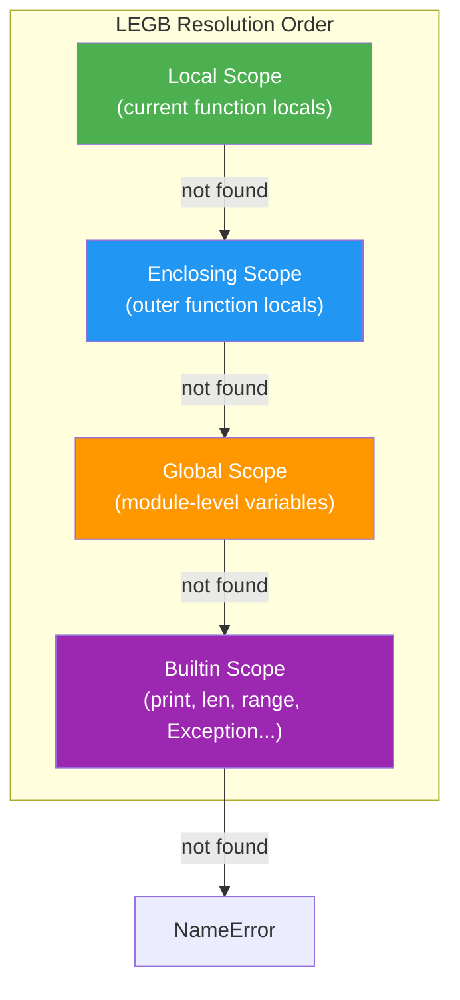

# Modules and Variable Scope

> Modules are Python's primary mechanism for organizing code into reusable units, and the LEGB scope rule governs how Python resolves every variable name you reference at runtime.

## Table of Contents
- [Core Concepts](#core-concepts)
- [Code Examples](#code-examples)
- [Common Pitfalls](#common-pitfalls)
- [Key Takeaways](#key-takeaways)
- [Exercises](#exercises)

## Core Concepts

### Builtin Modules

#### What

Python ships with a "batteries included" standard library — over 200 modules covering everything from file I/O to cryptography. These are pre-installed and available without `pip install`. The most frequently used ones in professional Python code are `os`, `sys`, `json`, `datetime`, `pathlib`, and `collections`.

#### How

You import them with `import` or `from ... import`. When Python encounters an `import` statement, it follows a well-defined search order: first it checks `sys.modules` (a cache of already-imported modules), then it searches `sys.path` (a list of directories). Once found, the module is executed top-to-bottom, its namespace is created, and it gets cached in `sys.modules`. Subsequent imports of the same module skip execution entirely and return the cached reference.

```python
import sys

# sys.modules is a dict mapping module names to module objects
print(type(sys.modules))        # <class 'dict'>
print("json" in sys.modules)    # False — not imported yet

import json
print("json" in sys.modules)    # True — now cached
```

#### Why It Matters

Understanding the import cache (`sys.modules`) explains why module-level code only runs once, why circular imports sometimes work (and sometimes don't), and why reloading modules during development requires `importlib.reload()`. This isn't academic — it directly affects how you structure initialization code, database connections, and global configuration.

---

### `pathlib` — Modern File System Paths

#### What

`pathlib.Path` is the modern replacement for `os.path`. It represents filesystem paths as objects rather than strings, giving you method chaining, operator overloading, and a cleaner API. Since Python 3.4, `pathlib` is the recommended way to handle paths.

#### How

`Path` objects use `/` as an operator to join path segments. Methods like `.exists()`, `.read_text()`, `.write_text()`, `.iterdir()`, `.glob()`, and `.resolve()` replace scattered `os` and `os.path` function calls. Paths are also aware of the current OS — they produce `PosixPath` on Unix/macOS and `WindowsPath` on Windows.

```python
from pathlib import Path

# Build paths with the / operator — no string concatenation
project_root = Path("/home/user/project")
config_file = project_root / "config" / "settings.json"

# Common operations
print(config_file.suffix)      # .json
print(config_file.stem)        # settings
print(config_file.parent)      # /home/user/project/config
print(config_file.exists())    # True or False

# Read/write without open()
content = config_file.read_text(encoding="utf-8")
config_file.write_text('{"debug": true}', encoding="utf-8")

# Glob for pattern matching
for py_file in project_root.rglob("*.py"):
    print(py_file)
```

#### Why It Matters

String-based paths are error-prone: developers forget to use `os.sep`, manually concatenate with `+`, or mix up `os.path.join` argument order. `Path` objects eliminate these bugs. They also make code cross-platform by default. Every modern Python style guide recommends `pathlib` over `os.path`, and tools like `ruff` can auto-flag `os.path` usage.

---

### `os` and `sys` — System Interaction

#### What

`os` provides operating system interfaces: environment variables, process management, and (legacy) file operations. `sys` provides access to Python interpreter internals: command-line arguments, the import system, stdin/stdout/stderr, and recursion limits.

#### How

In modern Python, `os` is mainly used for environment variables and process-level operations. Most file operations have moved to `pathlib`. `sys` is used for CLI argument access (though `argparse` is better for real CLIs), interpreter configuration, and import system introspection.

```python
import os
import sys

# os: Environment variables
db_url = os.environ.get("DATABASE_URL", "sqlite:///default.db")
os.environ["APP_MODE"] = "production"

# os: Current working directory (prefer pathlib for path manipulation)
cwd = os.getcwd()

# sys: Command-line arguments
script_name = sys.argv[0]    # The script itself
args = sys.argv[1:]          # Everything after

# sys: Python version and platform
print(sys.version)           # 3.12.0 (main, Oct 2 2023, ...)
print(sys.platform)          # 'darwin', 'linux', 'win32'

# sys: Import system introspection
print(sys.path)              # List of directories Python searches for modules
print(sys.modules.keys())    # All currently imported modules
```

#### Why It Matters

`os.environ` is the standard way to inject configuration (database URLs, API keys, feature flags) into applications — the Twelve-Factor App methodology mandates it. `sys.path` manipulation (while generally discouraged) is sometimes necessary in monorepos or plugin systems. Understanding `sys.modules` is essential for debugging import issues and circular dependencies.

---

### `json` — Data Serialization

#### What

The `json` module serializes Python objects to JSON strings and deserializes JSON strings back to Python objects. JSON is the lingua franca of web APIs, configuration files, and inter-service communication.

#### How

Four core functions: `json.dumps()` (object to string), `json.loads()` (string to object), `json.dump()` (object to file), `json.load()` (file to object). The `s`-suffix versions work with strings; the non-`s` versions work with file objects.

```python
import json
from pathlib import Path

# Python dict → JSON string
data = {"name": "Alice", "scores": [95, 87, 92], "active": True}
json_str = json.dumps(data, indent=2, ensure_ascii=False)

# JSON string → Python dict
parsed = json.loads(json_str)
print(parsed["name"])  # Alice

# Write to file
config_path = Path("config.json")
with config_path.open("w", encoding="utf-8") as f:
    json.dump(data, f, indent=2, ensure_ascii=False)

# Read from file
with config_path.open("r", encoding="utf-8") as f:
    loaded = json.load(f)
```

The type mapping is straightforward: Python `dict` becomes JSON object, `list` becomes JSON array, `str` becomes JSON string, `int`/`float` become JSON number, `True`/`False` become `true`/`false`, `None` becomes `null`. Anything outside this set (like `datetime`, `set`, `Path`) requires a custom encoder.

#### Why It Matters

JSON serialization errors are among the most common runtime bugs in Python web applications. Knowing the exact type mapping prevents surprises (e.g., tuple becomes array, and you lose the immutability distinction). The `ensure_ascii=False` flag is critical for internationalized applications — without it, non-ASCII characters get escaped to `\uXXXX` sequences.

---

### `datetime` — Date and Time Handling

#### What

The `datetime` module provides classes for manipulating dates and times: `datetime.datetime`, `datetime.date`, `datetime.time`, `datetime.timedelta`, and `datetime.timezone`. Dates and times are notoriously tricky — this module handles the core cases, though timezone-heavy work often uses `zoneinfo` (stdlib since 3.9).

#### How

```python
from datetime import datetime, date, timedelta, timezone
from zoneinfo import ZoneInfo

# Current time
now = datetime.now()                          # Naive — no timezone info
now_utc = datetime.now(tz=timezone.utc)       # Aware — has timezone

# Parsing strings
ts = datetime.fromisoformat("2026-02-28T14:30:00+08:00")

# Formatting strings
formatted = now.strftime("%Y-%m-%d %H:%M:%S")  # "2026-02-28 14:30:00"

# Arithmetic with timedelta
tomorrow = date.today() + timedelta(days=1)
one_week_ago = datetime.now(tz=timezone.utc) - timedelta(weeks=1)

# Timezone conversion
taipei_tz = ZoneInfo("Asia/Taipei")
local_time = now_utc.astimezone(taipei_tz)
```

#### Why It Matters

The naive-vs-aware datetime distinction is the single biggest source of datetime bugs. A naive datetime has no timezone — it could be UTC, local time, or anything. An aware datetime knows its timezone and can be converted accurately. Rule of thumb: always use aware datetimes in application code. Store UTC, convert to local only for display.

---

### `collections` — Specialized Containers

#### What

`collections` provides high-performance container datatypes that extend the built-in `dict`, `list`, `tuple`, and `set`. The most useful are `defaultdict`, `Counter`, `deque`, `namedtuple`, and `OrderedDict` (though regular `dict` preserves insertion order since Python 3.7).

#### How

```python
from collections import defaultdict, Counter, deque, namedtuple

# defaultdict — auto-creates missing keys with a factory function
word_groups: defaultdict[str, list[str]] = defaultdict(list)
for word in ["apple", "banana", "avocado", "blueberry"]:
    word_groups[word[0]].append(word)
# {'a': ['apple', 'avocado'], 'b': ['banana', 'blueberry']}

# Counter — count hashable objects
text = "abracadabra"
letter_counts = Counter(text)
print(letter_counts.most_common(3))  # [('a', 5), ('b', 2), ('r', 2)]

# deque — double-ended queue with O(1) append/pop on both ends
recent_events: deque[str] = deque(maxlen=5)
for event in ["a", "b", "c", "d", "e", "f"]:
    recent_events.append(event)
print(list(recent_events))  # ['b', 'c', 'd', 'e', 'f'] — oldest dropped

# namedtuple — lightweight immutable data class
Point = namedtuple("Point", ["x", "y"])
origin = Point(0, 0)
print(origin.x, origin.y)  # 0 0
```

#### Why It Matters

`defaultdict` eliminates the "check if key exists, if not create it" boilerplate that clutters real code. `Counter` replaces manual counting loops that are both slower and harder to read. `deque` is the correct data structure for queues and sliding windows — using `list.pop(0)` is O(n) while `deque.popleft()` is O(1). Knowing these containers makes your code faster and more expressive simultaneously.

---

### Custom Modules and Packages

#### What

A module is any `.py` file. A package is a directory containing an `__init__.py` file (which can be empty) and other modules. Packages let you organize large codebases into hierarchical namespaces. Since Python 3.3, "namespace packages" (directories without `__init__.py`) also exist, but regular packages with `__init__.py` are the standard for application code.

#### How

Consider this project structure:

```
my_project/
├── main.py
├── config.py
└── utils/
    ├── __init__.py
    ├── formatting.py
    └── validation.py
```

**Absolute imports** reference the full path from the project root:

```python
# In main.py
from utils.formatting import format_currency
from utils.validation import validate_email
import config
```

**Relative imports** use dots to reference modules relative to the current package:

```python
# In utils/formatting.py
from .validation import validate_email    # Same package
from ..config import Settings             # Parent package
```

The `__init__.py` file controls what gets exported when someone imports the package. It runs when the package is first imported:

```python
# utils/__init__.py
from .formatting import format_currency
from .validation import validate_email

# Now users can do: from utils import format_currency
# Instead of: from utils.formatting import format_currency
```

#### Why It Matters

Package structure is the architecture of a Python project. A well-organized package makes code discoverable, testable, and maintainable. Relative imports (`from .sibling import func`) create packages that can be moved or renamed without updating every import. The `__init__.py` file acts as the package's public API surface — only expose what users need.

---

### The Import System Under the Hood

#### What

Python's import system is more sophisticated than most developers realize. When you write `import foo`, Python executes a multi-step process involving finders, loaders, and caching — all configurable and extensible.

#### How

The import sequence works like this:

1. **Check `sys.modules`** — if the module was already imported, return the cached version immediately. This is why module-level code runs only once.
2. **Search `sys.path`** — Python iterates through `sys.path` (a list of directories) looking for the module. `sys.path` typically includes: the script's directory, `PYTHONPATH` environment variable entries, and the standard library directory.
3. **Find the module** — Python uses "finders" registered in `sys.meta_path`. The default finders handle built-in modules, frozen modules, and path-based imports.
4. **Load the module** — the finder returns a "loader" that reads and executes the module code. The module's namespace becomes a `module` object.
5. **Cache in `sys.modules`** — the module object is stored so future imports skip steps 2-4.

```python
import sys
import importlib

# See the search path
for path in sys.path:
    print(path)

# Force-reload a module (bypasses cache)
import my_module
importlib.reload(my_module)  # Re-executes module code

# See all currently loaded modules
print(len(sys.modules))  # Typically 50+ even in a fresh interpreter
```

#### Why It Matters

Understanding the import cache explains several Python behaviors that confuse developers: why module-level side effects (like print statements) only run once, why circular imports sometimes produce `ImportError` and sometimes produce partially-initialized modules, and why changes to `.py` files during development don't take effect until you restart the interpreter (or use `importlib.reload()`).

---

### The `if __name__ == "__main__"` Guard

#### What

Every Python module has a `__name__` attribute. When a module is run directly (`python my_script.py`), its `__name__` is set to `"__main__"`. When it's imported by another module, `__name__` is set to the module's qualified name (e.g., `"utils.formatting"`).

#### How

```python
# utils/formatting.py

def format_currency(amount: float, symbol: str = "$") -> str:
    return f"{symbol}{amount:,.2f}"

if __name__ == "__main__":
    # This block only runs when the file is executed directly
    # Not when imported as a module
    print(format_currency(1234567.89))  # $1,234,567.89
```

The guard lets a file serve dual purpose: as an importable module and as a standalone script. Without it, any top-level code (test prints, demo scripts) would execute on import — polluting the importing module's behavior.

#### Why It Matters

This pattern is so fundamental that `ruff` warns about scripts lacking it. It enables writing self-testing modules during development while keeping them clean for production imports. It's also the entry point convention for Python packages run with `python -m package_name`.

---

### Variable Scope — The LEGB Rule

#### What

When Python encounters a variable name, it needs to figure out which object that name refers to. The LEGB rule defines the lookup order: **L**ocal, **E**nclosing, **G**lobal, **B**uilt-in. Python searches these four scopes in order and uses the first match it finds.

#### How



Each scope explained:

**Local (L)** — Variables assigned inside the current function. This includes parameters. Created when the function is called, destroyed when it returns.

**Enclosing (E)** — Variables in the local scope of any enclosing function. This only applies to nested functions (closures). Python searches from the innermost enclosing function outward.

**Global (G)** — Variables assigned at the module level (top-level of the `.py` file). They persist for the module's lifetime.

**Built-in (B)** — Names pre-defined by Python: `print`, `len`, `range`, `int`, `str`, `True`, `False`, `None`, etc. These live in the `builtins` module.

```python
# Global scope
x = "global"

def outer() -> None:
    # Enclosing scope (relative to inner())
    x = "enclosing"

    def inner() -> None:
        # Local scope
        x = "local"
        print(x)  # "local" — found in L

    inner()
    print(x)      # "enclosing" — found in L (outer's local)

outer()
print(x)          # "global" — found in G
```

#### Why It Matters

LEGB determines every name resolution in Python. When a developer writes `x = 10` inside a function, Python creates a *new local variable* — it does not modify a global `x`. This is the root cause of the `UnboundLocalError` that confuses many developers. Understanding LEGB turns "weird Python behavior" into predictable, logical outcomes.

---

### The `global` and `nonlocal` Keywords

#### What

By default, assigning to a variable inside a function creates a local variable, even if a variable with the same name exists in an outer scope. The `global` keyword tells Python to use the module-level (global) variable instead. The `nonlocal` keyword tells Python to use the variable from the nearest enclosing function scope.

#### How

```python
counter = 0

def increment() -> None:
    global counter          # Without this, 'counter = counter + 1' raises UnboundLocalError
    counter = counter + 1

increment()
increment()
print(counter)  # 2


def make_counter(start: int = 0):
    count = start

    def increment(step: int = 1) -> int:
        nonlocal count      # Without this, 'count += step' creates a new local
        count += step
        return count

    return increment

counter = make_counter(10)
print(counter())    # 11
print(counter())    # 12
print(counter(5))   # 17
```

The distinction: `global` always refers to the module-level scope, no matter how deeply nested. `nonlocal` refers to the nearest enclosing function scope — it cannot reach module-level.

```python
x = "module level"

def outer() -> None:
    x = "outer"

    def middle() -> None:
        x = "middle"

        def inner() -> None:
            nonlocal x      # Binds to middle's x
            x = "modified by inner"

        inner()
        print(x)    # "modified by inner"

    middle()
    print(x)        # "outer" — middle's x was modified, not outer's

outer()
print(x)            # "module level" — untouched
```

#### Why It Matters

`global` is widely considered a code smell — it creates hidden dependencies between functions and module state, making code harder to test and reason about. The alternative is almost always passing values as function arguments and returning results. `nonlocal` is more acceptable because it's contained within a closure, but even then, using a class or a mutable container is often clearer. Both keywords exist because Python's scope rules demand them, but professional code uses them sparingly.

---

### How Python Determines Scope at Compile Time

#### What

A critical and often misunderstood detail: Python determines which scope a variable belongs to **at compile time** (when the function is defined), not at runtime (when the code executes). If a variable is assigned anywhere in a function body, Python treats it as local for the *entire* function — even lines before the assignment.

#### How

```python
x = 10

def broken() -> None:
    print(x)        # UnboundLocalError: cannot access local variable 'x'
    x = 20          # This assignment makes 'x' local for the ENTIRE function

broken()
```

Python's compiler scans the entire function body before execution. It sees `x = 20`, marks `x` as local, and then when `print(x)` runs on the first line, `x` hasn't been assigned yet in the local scope — hence `UnboundLocalError`.

This is not a bug. It's a deliberate design choice that prevents a function's behavior from changing based on whether a global variable happens to exist. If Python used runtime resolution, adding a global variable in an unrelated part of the code could silently change what `x` means inside your function.

#### Why It Matters

This compile-time scoping rule is the source of the infamous `UnboundLocalError`. Once you understand that assignment anywhere in a function marks the variable as local everywhere in that function, the error becomes predictable. The fix is either using `global`/`nonlocal` (if you truly need to modify an outer variable) or choosing a different variable name.

---

### Closures

#### What

A closure is a function that remembers the variables from its enclosing scope, even after the enclosing function has returned. The inner function "closes over" the enclosing variables, keeping them alive.

#### How

```python
def make_multiplier(factor: int):
    # 'factor' is in the enclosing scope of 'multiply'

    def multiply(x: int) -> int:
        return x * factor   # Accesses 'factor' via the closure

    return multiply         # Returns the inner function

double = make_multiplier(2)
triple = make_multiplier(3)

print(double(5))   # 10
print(triple(5))   # 15

# The closure keeps 'factor' alive — inspect it
print(double.__closure__)           # (<cell object at 0x...>,)
print(double.__closure__[0].cell_contents)  # 2
```

Closures are implemented using "cell objects." When Python detects that an inner function references a variable from an enclosing scope, it wraps that variable in a cell. Both the enclosing function and the inner function reference the same cell, so modifications via `nonlocal` are visible to both.

#### Why It Matters

Closures are the mechanism behind decorators, callback registrations, and factory functions. They're also how `functools.partial` works conceptually. Understanding closures makes decorators go from "magic syntax" to "obvious function wrapping." They're also the key to understanding why late binding in loops creates bugs (covered in Common Pitfalls).

---

### Scope in Comprehensions and Generator Expressions

#### What

List comprehensions, dict comprehensions, set comprehensions, and generator expressions each create their own scope in Python 3. The iteration variable does not leak into the enclosing scope. This was a deliberate fix from Python 2, where `[x for x in range(10)]` would leave `x = 9` in the enclosing scope.

#### How

```python
x = "original"
squares = [x for x in range(5)]    # x here is local to the comprehension
print(x)                           # "original" — not affected

# However, comprehensions CAN read from enclosing scopes
multiplier = 3
results = [i * multiplier for i in range(5)]   # multiplier is read via LEGB
print(results)                                  # [0, 3, 6, 9, 12]
```

Note: the walrus operator (`:=`) inside a comprehension *does* leak into the enclosing scope — this is intentional and is the primary use case for `:=` in comprehensions.

```python
# Walrus operator leaks out of comprehension scope — by design
filtered = [y for x in range(10) if (y := x * 2) > 10]
print(y)  # 18 — the last value assigned by :=
```

#### Why It Matters

This scoping behavior means you can safely reuse variable names like `i`, `x`, or `item` in comprehensions without worrying about clobbering outer variables. It's one of the many Python 3 improvements over Python 2 that makes the language more predictable.

## Code Examples

### Example 1: Building a Configuration Loader with `pathlib` and `json`

```python
"""
A production-style configuration loader that reads JSON config files,
supports defaults, and handles missing files gracefully.
"""
from pathlib import Path
import json
from typing import Any


def load_config(
    config_path: Path,
    defaults: dict[str, Any] | None = None,
) -> dict[str, Any]:
    """Load JSON configuration, merging with defaults.

    The defaults dict is used as the base — config file values
    override defaults. This lets you define sensible defaults
    in code while allowing file-based overrides.
    """
    merged: dict[str, Any] = dict(defaults) if defaults else {}

    if not config_path.exists():
        print(f"Config file not found: {config_path}, using defaults")
        return merged

    raw_text = config_path.read_text(encoding="utf-8")
    file_config: dict[str, Any] = json.loads(raw_text)

    # File values override defaults
    merged.update(file_config)
    return merged


# Usage
DEFAULT_CONFIG: dict[str, Any] = {
    "debug": False,
    "log_level": "INFO",
    "max_retries": 3,
    "database_url": "sqlite:///local.db",
}

config = load_config(
    config_path=Path("config.json"),
    defaults=DEFAULT_CONFIG,
)
print(json.dumps(config, indent=2))
```

### Example 2: Log File Analyzer with `collections` and `datetime`

```python
"""
Parse structured log lines and produce summary statistics
using Counter, defaultdict, and datetime parsing.
"""
from collections import Counter, defaultdict
from datetime import datetime

# Simulated log lines (in real code, read from a file)
LOG_LINES: list[str] = [
    "2026-02-28 10:15:03 ERROR auth_service: Login failed for user=alice",
    "2026-02-28 10:15:05 INFO  auth_service: Login succeeded for user=bob",
    "2026-02-28 10:16:10 ERROR payment_service: Timeout connecting to gateway",
    "2026-02-28 10:16:12 WARN  auth_service: Rate limit approaching for user=alice",
    "2026-02-28 10:17:00 ERROR auth_service: Login failed for user=alice",
    "2026-02-28 10:18:30 INFO  payment_service: Payment processed for order=12345",
    "2026-02-28 10:19:00 ERROR payment_service: Timeout connecting to gateway",
]


def parse_log_line(line: str) -> dict[str, str]:
    """Extract timestamp, level, service, and message from a log line."""
    parts = line.split(maxsplit=3)
    date_str, time_str, level, rest = parts
    # rest looks like "service_name: message"
    service, _, message = rest.partition(": ")
    return {
        "timestamp": f"{date_str} {time_str}",
        "level": level.strip(),
        "service": service.strip(),
        "message": message.strip(),
    }


def analyze_logs(lines: list[str]) -> None:
    """Produce summary statistics from log lines."""
    level_counts: Counter[str] = Counter()
    errors_by_service: defaultdict[str, list[str]] = defaultdict(list)

    for line in lines:
        parsed = parse_log_line(line)
        level_counts[parsed["level"]] += 1

        if parsed["level"] == "ERROR":
            errors_by_service[parsed["service"]].append(parsed["message"])

    print("=== Log Level Distribution ===")
    for level, count in level_counts.most_common():
        print(f"  {level}: {count}")

    print("\n=== Errors by Service ===")
    for service, messages in sorted(errors_by_service.items()):
        print(f"  {service} ({len(messages)} errors):")
        for msg in messages:
            print(f"    - {msg}")


analyze_logs(LOG_LINES)
```

### Example 3: Well-Structured Package with Clean Imports

```python
"""
Demonstrates a professional package structure.

Project layout:

    analytics/
    ├── __init__.py
    ├── models.py
    ├── processing.py
    └── reporting/
        ├── __init__.py
        ├── formatters.py
        └── exporters.py
"""

# === analytics/models.py ===
from dataclasses import dataclass
from datetime import datetime


@dataclass(frozen=True)
class Event:
    """An immutable analytics event."""
    user_id: str
    event_type: str
    timestamp: datetime
    payload: dict[str, str]


# === analytics/processing.py ===
from collections import Counter
from .models import Event  # Relative import — same package


def count_events_by_type(events: list[Event]) -> Counter[str]:
    """Count occurrences of each event type."""
    return Counter(e.event_type for e in events)


def filter_events_by_user(events: list[Event], user_id: str) -> list[Event]:
    """Return only events belonging to a specific user."""
    return [e for e in events if e.user_id == user_id]


# === analytics/reporting/formatters.py ===
from ..models import Event  # Relative import — go up one package level


def format_event_summary(event: Event) -> str:
    """Format an event as a human-readable one-liner."""
    ts = event.timestamp.strftime("%Y-%m-%d %H:%M")
    return f"[{ts}] {event.user_id}: {event.event_type}"


# === analytics/reporting/exporters.py ===
import json
from pathlib import Path
from ..models import Event  # Two dots: up to analytics/, then into models


def export_events_to_json(events: list[Event], output_path: Path) -> None:
    """Export events to a JSON file."""
    serializable = [
        {
            "user_id": e.user_id,
            "event_type": e.event_type,
            "timestamp": e.timestamp.isoformat(),
            "payload": e.payload,
        }
        for e in events
    ]
    output_path.write_text(
        json.dumps(serializable, indent=2, ensure_ascii=False),
        encoding="utf-8",
    )


# === analytics/__init__.py ===
# Controls the public API of the package
from .models import Event
from .processing import count_events_by_type, filter_events_by_user

# Users can now write:
#   from analytics import Event, count_events_by_type
# Instead of:
#   from analytics.models import Event
#   from analytics.processing import count_events_by_type

__all__ = ["Event", "count_events_by_type", "filter_events_by_user"]
```

### Example 4: LEGB Rule in Action — Closure-Based Rate Limiter

```python
"""
A practical closure that uses enclosing scope to maintain state
without classes or global variables.
"""
from collections import deque
from datetime import datetime, timedelta, timezone


def make_rate_limiter(
    max_calls: int,
    window: timedelta,
):
    """Create a rate limiter using closures.

    Returns a function that returns True if the call is allowed,
    False if rate limit exceeded. Uses enclosing scope (nonlocal
    isn't needed because we mutate the deque, not reassign it).
    """
    # These variables live in the enclosing scope of 'check'
    call_timestamps: deque[datetime] = deque()

    def check() -> bool:
        now = datetime.now(tz=timezone.utc)
        cutoff = now - window

        # Remove expired timestamps — deque is O(1) for popleft
        while call_timestamps and call_timestamps[0] < cutoff:
            call_timestamps.popleft()

        if len(call_timestamps) >= max_calls:
            return False

        call_timestamps.append(now)
        return True

    return check


# Allow 3 calls per 10-second window
is_allowed = make_rate_limiter(max_calls=3, window=timedelta(seconds=10))

for i in range(5):
    result = is_allowed()
    print(f"Call {i + 1}: {'allowed' if result else 'RATE LIMITED'}")
# Call 1: allowed
# Call 2: allowed
# Call 3: allowed
# Call 4: RATE LIMITED
# Call 5: RATE LIMITED
```

### Example 5: File Discovery with `pathlib` and Module Introspection

```python
"""
A module discovery utility that finds Python modules in a directory
and reports their contents — combining pathlib with importlib.
"""
from pathlib import Path
import ast
from dataclasses import dataclass, field


@dataclass
class ModuleInfo:
    """Metadata extracted from a Python module file."""
    path: Path
    name: str
    functions: list[str] = field(default_factory=list)
    classes: list[str] = field(default_factory=list)
    imports: list[str] = field(default_factory=list)


def analyze_module(module_path: Path) -> ModuleInfo:
    """Parse a Python file's AST to extract functions, classes, and imports."""
    source = module_path.read_text(encoding="utf-8")
    tree = ast.parse(source)

    info = ModuleInfo(
        path=module_path,
        name=module_path.stem,
    )

    for node in ast.iter_child_nodes(tree):
        match node:
            case ast.FunctionDef(name=name) | ast.AsyncFunctionDef(name=name):
                info.functions.append(name)
            case ast.ClassDef(name=name):
                info.classes.append(name)
            case ast.Import(names=aliases):
                for alias in aliases:
                    info.imports.append(alias.name)
            case ast.ImportFrom(module=module) if module:
                info.imports.append(module)

    return info


def discover_modules(root: Path) -> list[ModuleInfo]:
    """Find and analyze all Python modules under a directory."""
    modules: list[ModuleInfo] = []

    for py_file in sorted(root.rglob("*.py")):
        # Skip __pycache__, hidden dirs, and __init__.py
        if "__pycache__" in py_file.parts:
            continue
        if any(part.startswith(".") for part in py_file.parts):
            continue

        modules.append(analyze_module(py_file))

    return modules


def print_module_report(modules: list[ModuleInfo]) -> None:
    """Print a formatted report of discovered modules."""
    for mod in modules:
        print(f"\n{'=' * 50}")
        print(f"Module: {mod.name}")
        print(f"Path:   {mod.path}")
        if mod.classes:
            print(f"Classes:   {', '.join(mod.classes)}")
        if mod.functions:
            print(f"Functions: {', '.join(mod.functions)}")
        if mod.imports:
            print(f"Imports:   {', '.join(mod.imports)}")


if __name__ == "__main__":
    project_root = Path(".")
    modules = discover_modules(project_root)
    print(f"Found {len(modules)} Python modules")
    print_module_report(modules)
```

## Common Pitfalls

### Pitfall 1: The `UnboundLocalError` Trap

Assignment anywhere in a function makes the variable local for the *entire* function body — including lines before the assignment.

```python
# BAD — UnboundLocalError because assignment makes 'count' local everywhere
count = 0

def increment() -> None:
    count += 1       # Python sees assignment → marks 'count' as local
                     # But 'count' hasn't been assigned locally yet → UnboundLocalError

increment()

# GOOD — explicitly declare intent with 'global' (or better: avoid global state)
count = 0

def increment() -> None:
    global count
    count += 1

# BEST — avoid mutable global state entirely
def increment(count: int) -> int:
    return count + 1

count = 0
count = increment(count)
```

### Pitfall 2: Late Binding in Closures (The Loop Variable Trap)

Closures capture *references* to variables, not their values. When you create closures in a loop, they all share the same loop variable — and they see its final value.

```python
# BAD — all functions return 4 (the last value of i)
functions: list = []
for i in range(5):
    functions.append(lambda: i)

print([f() for f in functions])  # [4, 4, 4, 4, 4] — not [0, 1, 2, 3, 4]!

# GOOD — capture the current value with a default argument
functions: list = []
for i in range(5):
    functions.append(lambda i=i: i)   # Default arg captures current value

print([f() for f in functions])  # [0, 1, 2, 3, 4]

# ALSO GOOD — use functools.partial for clarity
from functools import partial

def identity(x: int) -> int:
    return x

functions = [partial(identity, i) for i in range(5)]
print([f() for f in functions])  # [0, 1, 2, 3, 4]
```

### Pitfall 3: Shadowing Built-in Names

Python lets you use any name as a variable — including names that shadow built-in functions. This silently breaks the built-in for the rest of the scope.

```python
# BAD — 'list' now refers to the list object, not the built-in type
list = [1, 2, 3]
# Later in the same scope...
other = list("hello")  # TypeError: 'list' object is not callable

# BAD — 'id' is a common offender
id = 42
print(id("hello"))     # TypeError: 'int' object is not callable

# GOOD — use descriptive names that don't collide with builtins
items = [1, 2, 3]
user_id = 42
input_values = [10, 20, 30]   # Don't shadow 'input' either
```

Common built-in names that developers accidentally shadow: `list`, `dict`, `set`, `id`, `type`, `input`, `filter`, `map`, `range`, `sum`, `max`, `min`, `open`, `format`, `hash`.

### Pitfall 4: Mutating Module-Level State Through Imports

When two modules import the same module, they share the same module object. Mutating module-level variables in one place affects all importers — which is either a feature (singleton pattern) or a bug (unintended coupling).

```python
# BAD — shared mutable state via module globals
# config.py
settings = {"debug": False, "log_level": "INFO"}

# module_a.py
from config import settings
settings["debug"] = True     # Mutates the SHARED dict object

# module_b.py
from config import settings
print(settings["debug"])     # True — module_a's change is visible!

# GOOD — use immutable configuration or explicit copy
# config.py
from dataclasses import dataclass

@dataclass(frozen=True)
class Settings:
    debug: bool = False
    log_level: str = "INFO"

DEFAULT_SETTINGS = Settings()

# module_a.py
from config import DEFAULT_SETTINGS
# Cannot mutate — frozen dataclass raises FrozenInstanceError
# Create a new instance if you need different values:
from dataclasses import replace
local_settings = replace(DEFAULT_SETTINGS, debug=True)
```

### Pitfall 5: Circular Imports

Two modules importing each other can cause `ImportError` or partially initialized modules, depending on timing.

```python
# BAD — circular import that fails at runtime
# models.py
from services import process_user   # services.py imports models.py → circular!

class User:
    def process(self) -> None:
        process_user(self)

# services.py
from models import User             # models.py imports services.py → circular!

def process_user(user: User) -> None:
    print(f"Processing {user}")

# GOOD — break the cycle with import inside the function (lazy import)
# models.py
class User:
    def process(self) -> None:
        from services import process_user   # Import at use-time, not load-time
        process_user(self)

# BETTER — restructure to eliminate the dependency cycle
# Move the shared interface to a third module, or use dependency injection
```

## Key Takeaways

- **Module imports are cached**: `sys.modules` stores every imported module. Module-level code runs once. Understanding this cache explains most import-related surprises.
- **LEGB is compile-time**: Python decides which scope a variable belongs to when the function is defined, not when the code runs. An assignment anywhere in a function makes that name local everywhere in that function.
- **`global` is a code smell**: It creates hidden coupling between functions and module state. Prefer passing arguments and returning values. Use `nonlocal` only in closures where state encapsulation is the goal.
- **`pathlib.Path` replaces `os.path`**: Object-oriented paths with operator overloading are cleaner, safer, and cross-platform by default. There is no good reason to use `os.path` in new code.
- **`collections` types solve common patterns**: `defaultdict` eliminates key-existence checks, `Counter` replaces manual counting, `deque` gives O(1) append/pop on both ends. Reaching for these before writing manual loops makes code faster and more readable.

## Exercises

### Exercise 1: Module Discovery Tool

Write a function `find_all_imports(directory: Path) -> dict[str, int]` that scans all `.py` files in a directory tree and returns a dictionary mapping each imported module name to the number of files that import it. Use `pathlib` for file discovery and simple string parsing (look for lines starting with `import` or `from`). Sort the output by count, descending.

### Exercise 2: Scope Detective

Without running the code, predict the output of each `print()` call. Then verify by running it. Explain each result using the LEGB rule.

```python
x = "global"

def f() -> None:
    print(f"1: {x}")

def g() -> None:
    x = "local-g"
    print(f"2: {x}")

def h() -> None:
    x = "local-h"
    def inner() -> None:
        print(f"3: {x}")
    inner()

def k() -> None:
    x = "local-k"
    def inner() -> None:
        nonlocal x
        x = "modified"
    inner()
    print(f"4: {x}")

f()
g()
h()
k()
print(f"5: {x}")
```

### Exercise 3: Closure-Based Accumulator

Write a function `make_accumulator(initial: float = 0.0)` that returns a function. Each call to the returned function should accept a number, add it to a running total, and return the new total. The running total must persist between calls using a closure (no classes, no global variables).

```python
acc = make_accumulator(100.0)
print(acc(10))    # 110.0
print(acc(20))    # 130.0
print(acc(-5))    # 125.0
```

### Exercise 4: Configuration Merger

Write a function `deep_merge(base: dict, override: dict) -> dict` that recursively merges two nested dictionaries. Values from `override` replace values from `base`, but nested dicts should be merged recursively rather than replaced wholesale. Use this to build a configuration system that loads a default config and overrides it with environment-specific settings from JSON files.

### Exercise 5: Package Structure Design

You're building a CLI tool called `logwatch` that monitors log files. Design the package structure (directory tree with file names) and write the `__init__.py` files that expose a clean public API. The tool has three subsystems: parsing (reads log formats), filtering (filters by level, time range, regex), and output (formats results as table, JSON, or CSV). Write the `__init__.py` for each sub-package and the top-level package.

---
up:: [Schedule](../../Schedule.md)
#type/learning #source/self-study #status/seed
