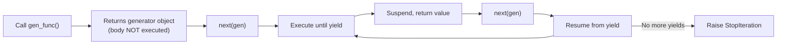
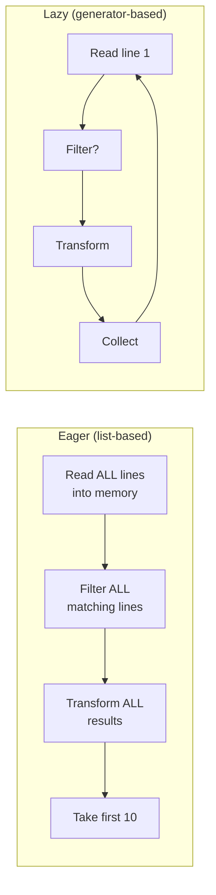

# Comprehensions and Generators

> Comprehensions are Python's concise syntax for transforming and filtering data into collections, while generators produce values lazily one at a time — enabling memory-efficient processing of datasets that would not fit in RAM.

## Table of Contents
- [Core Concepts](#core-concepts)
- [Code Examples](#code-examples)
- [Common Pitfalls](#common-pitfalls)
- [Key Takeaways](#key-takeaways)
- [Exercises](#exercises)

## Core Concepts

### List Comprehensions

#### What

A list comprehension is a concise expression that creates a new list by transforming and/or filtering elements from an iterable. It replaces the common pattern of initializing an empty list, looping, and appending. The syntax is `[expression for item in iterable if condition]`.

#### How

The general form has three parts: the output expression, the iteration clause, and an optional filter:

```python
# Basic form: [expression for variable in iterable]
squares: list[int] = [x ** 2 for x in range(10)]
# [0, 1, 4, 9, 16, 25, 36, 49, 64, 81]

# With filter: [expression for variable in iterable if condition]
even_squares: list[int] = [x ** 2 for x in range(10) if x % 2 == 0]
# [0, 4, 16, 36, 64]

# With transformation
names: list[str] = ["  alice  ", "BOB", "  Charlie"]
cleaned: list[str] = [name.strip().lower() for name in names]
# ["alice", "bob", "charlie"]

# With walrus operator for compute-once-and-filter
import math
valid_roots: list[float] = [
    root
    for x in range(-5, 20)
    if (root := math.sqrt(x)) == int(root)  # Only perfect squares
    if x >= 0  # Multiple if-clauses are ANDed
]
```

A comprehension is evaluated left to right: the `for` clause runs first, then each `if` clause filters, then the output expression produces the value. Multiple `if` clauses are logically ANDed together. The entire comprehension has its own scope in Python 3 — the iteration variable does not leak into the surrounding scope.

#### Why It Matters

List comprehensions are not just syntactic sugar — they are faster than the equivalent `for`+`append` loop because the Python bytecode compiler optimizes them into a tighter internal loop. The `LIST_APPEND` bytecode operation avoids the overhead of looking up the `append` method on every iteration. More importantly, comprehensions communicate intent — when a reader sees `[expr for ...]`, they immediately know "this is building a list by transforming elements," without needing to trace through multiple lines of loop logic.

### Dict and Set Comprehensions

#### What

Dict comprehensions create dictionaries using `{key: value for item in iterable}`, and set comprehensions create sets using `{value for item in iterable}`. They follow the same structure as list comprehensions but produce different collection types.

#### How

```python
# Dict comprehension: {key_expr: value_expr for item in iterable}
word_lengths: dict[str, int] = {word: len(word) for word in ["hello", "world", "python"]}
# {"hello": 5, "world": 5, "python": 6}

# Inverting a dictionary
original: dict[str, int] = {"a": 1, "b": 2, "c": 3}
inverted: dict[int, str] = {v: k for k, v in original.items()}
# {1: "a", 2: "b", 3: "c"}

# Dict comprehension with filter
config: dict[str, str] = {
    "DEBUG": "true",
    "DATABASE_URL": "postgres://...",
    "SECRET_KEY": "abc123",
    "LOG_LEVEL": "info",
}
debug_settings: dict[str, str] = {
    k: v for k, v in config.items()
    if k.startswith("DEBUG") or k.startswith("LOG")
}
# {"DEBUG": "true", "LOG_LEVEL": "info"}

# Set comprehension: {expr for item in iterable}
unique_lengths: set[int] = {len(word) for word in ["cat", "dog", "elephant", "ant"]}
# {3, 8}

# Deduplication with transformation
emails: list[str] = ["Alice@Example.COM", "alice@example.com", "BOB@test.org"]
unique_emails: set[str] = {email.lower() for email in emails}
# {"alice@example.com", "bob@test.org"}
```

Dict comprehensions are especially useful for restructuring data — flipping keys and values, grouping, or reindexing. When duplicate keys exist, the last value wins (just like in a regular dict literal).

#### Why It Matters

Dict comprehensions replace the verbose pattern of creating an empty dict and assigning keys in a loop. They are the idiomatic way to build dictionaries from iterables in Python. Set comprehensions are less common but invaluable for deduplication with transformation — normalizing email addresses, extracting unique attributes from objects, or computing the distinct values in a column.

### Nested Comprehensions

#### What

Comprehensions can contain multiple `for` clauses, which create nested iteration. The clauses are evaluated left to right, equivalent to nested `for` loops written in the same order. You can also nest comprehensions inside each other to create lists of lists, dicts of dicts, etc.

#### How

```python
# Multiple for-clauses: equivalent to nested loops
# Left to right = outer to inner
pairs: list[tuple[int, int]] = [
    (x, y)
    for x in range(3)
    for y in range(3)
    if x != y
]
# [(0, 1), (0, 2), (1, 0), (1, 2), (2, 0), (2, 1)]

# Equivalent nested loops:
# for x in range(3):
#     for y in range(3):
#         if x != y:
#             result.append((x, y))

# Flattening a list of lists
matrix: list[list[int]] = [[1, 2, 3], [4, 5, 6], [7, 8, 9]]
flat: list[int] = [elem for row in matrix for elem in row]
# [1, 2, 3, 4, 5, 6, 7, 8, 9]

# Nested comprehension (comprehension inside comprehension)
# Creates a new structure — a transposed matrix
transposed: list[list[int]] = [
    [row[i] for row in matrix]
    for i in range(len(matrix[0]))
]
# [[1, 4, 7], [2, 5, 8], [3, 6, 9]]

# Real-world: extract all tags from nested blog posts
posts: list[dict[str, list[str]]] = [
    {"title": "Post 1", "tags": ["python", "tutorial"]},
    {"title": "Post 2", "tags": ["python", "advanced", "generators"]},
    {"title": "Post 3", "tags": ["tutorial", "beginner"]},
]
all_tags: set[str] = {tag for post in posts for tag in post["tags"]}
# {"python", "tutorial", "advanced", "generators", "beginner"}
```

The readability rule of thumb: if a comprehension has more than two `for` clauses or the logic is complex, switch to explicit loops. Comprehensions are meant to be read at a glance. If you need to study it to understand it, it is too complex.

#### Why It Matters

Nested comprehensions are the Pythonic replacement for nested loops when building collections. Flattening nested structures is an extremely common operation — extracting items from lists of lists, collecting values from nested dicts, or processing matrix data. The key insight is reading order: the `for` clauses appear in the same order as they would in a nested loop. Once you internalize this, nested comprehensions become natural.

### Generator Expressions

#### What

A generator expression looks like a list comprehension but uses parentheses instead of brackets: `(expr for item in iterable)`. Instead of building the entire list in memory, it produces values one at a time as they are requested. It returns a generator object that implements the iterator protocol.

#### How

```python
# List comprehension: builds the entire list in memory
squares_list: list[int] = [x ** 2 for x in range(1_000_000)]
# Allocates memory for 1,000,000 integers at once

# Generator expression: produces values lazily, one at a time
squares_gen = (x ** 2 for x in range(1_000_000))
# Allocates memory for ONE integer at a time

# Generator expressions work anywhere an iterable is expected
total: int = sum(x ** 2 for x in range(1_000_000))  # Parentheses from sum() suffice

# They can be chained with other lazy operations
from itertools import islice

first_ten = list(islice(
    (x ** 2 for x in range(1_000_000_000)),  # Would be 8+ GB as a list
    10,
))
# [0, 1, 4, 9, 16, 25, 36, 49, 64, 81]
```

A generator expression is a one-shot iterable — once consumed, it is exhausted and cannot be restarted. If you need to iterate multiple times, either use a list comprehension or convert with `list()` (which defeats the memory benefit) or use a generator function that can be called again.

```python
gen = (x for x in range(5))
print(list(gen))  # [0, 1, 2, 3, 4]
print(list(gen))  # [] — exhausted, produces nothing
```

#### Why It Matters

Generator expressions solve the fundamental tension between declarative code and memory efficiency. List comprehensions are readable but materialized — they build the entire result in memory. For operations like `sum()`, `max()`, `min()`, `any()`, `all()`, or feeding into another loop, you never need the entire list at once. A generator expression gives you the same declarative syntax with O(1) memory usage. The rule is simple: if you need the list itself, use `[...]`. If you only need to iterate through it once, use `(...)`.

### Generator Functions with `yield`

#### What

A generator function is any function containing a `yield` expression. When called, it does not execute the function body — instead, it returns a generator object. Each call to `next()` on that generator executes the function body until the next `yield`, suspends execution (preserving all local state), and returns the yielded value.

#### How

```python
from collections.abc import Generator


def countdown(n: int) -> Generator[int, None, None]:
    """Yield integers from n down to 1."""
    print(f"Starting countdown from {n}")
    while n > 0:
        print(f"  About to yield {n}")
        yield n  # Suspend here, resume on next()
        print(f"  Resumed after yielding {n}")
        n -= 1
    print("Countdown complete!")


# Calling the function does NOT execute the body
gen = countdown(3)
print(type(gen))  # <class 'generator'>

# Each next() call runs until the next yield
print(next(gen))
# Starting countdown from 3
#   About to yield 3
# 3

print(next(gen))
#   Resumed after yielding 3
#   About to yield 2
# 2

print(next(gen))
#   Resumed after yielding 2
#   About to yield 1
# 1

# One more next() — function body completes and raises StopIteration
# next(gen)  # StopIteration with "Countdown complete!" printed
```

The execution model is critically important to understand:



The generator's local variables, instruction pointer, and entire call stack frame are preserved between `yield` calls. This is cooperative multitasking — the generator voluntarily suspends execution and the caller decides when to resume it.

The type hint `Generator[YieldType, SendType, ReturnType]` from `collections.abc` describes the three channels of communication: what the generator yields, what can be sent into it via `.send()`, and what it returns when it completes. For simple generators, `SendType` and `ReturnType` are both `None`.

#### Why It Matters

Generator functions are Python's most powerful abstraction for lazy computation. They decouple the production of values from their consumption. A generator that reads lines from a 100 GB file, a generator that produces the Fibonacci sequence infinitely, and a generator that yields database rows one by one all look the same to the consumer — just a `for` loop. This separation of concerns is the foundation of Python's data processing pipelines and is what makes `asyncio` possible (coroutines are generators under the hood).

### Lazy Evaluation and Memory Efficiency

#### What

Lazy evaluation means values are computed only when they are actually needed, not when they are defined. Generators implement lazy evaluation — they compute and yield one value at a time, keeping only the current value in memory. This contrasts with eager evaluation (list comprehensions, `list()`, `readlines()`), which computes and stores all values immediately.

#### How

The memory difference is dramatic for large datasets:

```python
import sys

# Eager: list comprehension — all values in memory at once
eager = [x ** 2 for x in range(1_000_000)]
print(sys.getsizeof(eager))  # ~8,448,728 bytes (8 MB)

# Lazy: generator expression — constant memory regardless of size
lazy = (x ** 2 for x in range(1_000_000))
print(sys.getsizeof(lazy))   # ~200 bytes (always the same)

# Even with 1 billion elements, the generator is still ~200 bytes
huge_lazy = (x ** 2 for x in range(1_000_000_000))
print(sys.getsizeof(huge_lazy))  # ~200 bytes
```

Lazy evaluation enables pipeline-style processing where each stage handles one element at a time:



In the eager pipeline, every intermediate step materializes the full dataset. If the file has 10 million lines but you only need 10 results, the eager pipeline still processes and stores all 10 million at each stage. The lazy pipeline processes one line at a time and stops as soon as it has the 10 results it needs.

```python
from pathlib import Path
from collections.abc import Generator


def read_lines(path: Path) -> Generator[str, None, None]:
    """Yield lines from a file lazily."""
    with open(path, "r", encoding="utf-8") as f:
        for line in f:
            yield line.rstrip("\n")


def filter_errors(lines: Generator[str, None, None]) -> Generator[str, None, None]:
    """Yield only lines containing ERROR."""
    for line in lines:
        if "ERROR" in line:
            yield line


def extract_message(lines: Generator[str, None, None]) -> Generator[str, None, None]:
    """Yield the message portion of each log line."""
    for line in lines:
        # Assume format: "TIMESTAMP LEVEL MESSAGE"
        parts = line.split(maxsplit=2)
        if len(parts) >= 3:
            yield parts[2]


# Pipeline: lazy from start to finish
# Memory usage is constant regardless of file size
path = Path("server.log")
pipeline = extract_message(filter_errors(read_lines(path)))

from itertools import islice
first_10_errors = list(islice(pipeline, 10))
# Reads only as many lines as needed to find 10 errors
```

#### Why It Matters

Lazy evaluation is what makes it possible to process datasets larger than available RAM. A generator pipeline that reads a 50 GB log file, filters it, transforms it, and writes the output uses only a few kilobytes of memory at any given time. This is not a theoretical benefit — it is the difference between a script that runs and one that gets OOM-killed. Every data-processing script should default to lazy evaluation and only materialize into lists when the collected result is actually needed.

### `yield from` — Delegating to Sub-Generators

#### What

`yield from` delegates iteration to another iterable or generator. Instead of manually looping over a sub-generator and re-yielding each value, `yield from` handles it in a single expression. It also transparently propagates `.send()`, `.throw()`, and `.close()` calls to the sub-generator.

#### How

```python
from collections.abc import Generator


def flatten(nested: list[list[int]]) -> Generator[int, None, None]:
    """Flatten a list of lists using yield from."""
    for sublist in nested:
        yield from sublist  # Equivalent to: for item in sublist: yield item


data = [[1, 2, 3], [4, 5], [6, 7, 8, 9]]
print(list(flatten(data)))  # [1, 2, 3, 4, 5, 6, 7, 8, 9]


# More powerful: composing generators
def read_multiple_files(paths: list[str]) -> Generator[str, None, None]:
    """Yield all lines from multiple files as a single stream."""
    for path in paths:
        yield from read_lines(Path(path))


# yield from works with any iterable, not just generators
def chain(*iterables: list[int]) -> Generator[int, None, None]:
    """Yield all items from each iterable in sequence."""
    for it in iterables:
        yield from it


print(list(chain([1, 2], [3, 4], [5])))  # [1, 2, 3, 4, 5]
```

Without `yield from`, you would write `for item in sublist: yield item`, which is verbose and does not properly propagate `.send()` and `.throw()`. The difference matters when building complex generator pipelines or coroutine systems.

#### Why It Matters

`yield from` is essential for composing generators. Without it, every level of delegation requires a manual loop, and you lose the ability to send values into or throw exceptions at sub-generators. It transforms generators from simple iterators into composable pipeline stages. It is also the mechanism that underpins `async/await` — in CPython, `await` is essentially `yield from` on coroutine objects. Understanding `yield from` now makes the concurrency topics in Week 9 much more intuitive.

### `itertools` — The Generator Toolbox

#### What

The `itertools` module provides a collection of fast, memory-efficient building blocks for creating and combining iterators. All `itertools` functions return lazy iterators — they produce values on demand without materializing intermediate results. They are implemented in C for maximum performance.

#### How

```python
import itertools
from collections.abc import Iterable


# chain — concatenate multiple iterables lazily
combined = itertools.chain([1, 2], [3, 4], [5])
print(list(combined))  # [1, 2, 3, 4, 5]

# chain.from_iterable — flatten one level of nesting
nested = [[1, 2], [3, 4], [5, 6]]
flat = itertools.chain.from_iterable(nested)
print(list(flat))  # [1, 2, 3, 4, 5, 6]

# islice — lazy slicing (no negative indices)
first_five = itertools.islice(range(1_000_000), 5)
print(list(first_five))  # [0, 1, 2, 3, 4]

# takewhile / dropwhile — take/skip while predicate is true
data = [1, 3, 5, 7, 2, 4, 6]
early = list(itertools.takewhile(lambda x: x < 6, data))
# [1, 3, 5] — stops at 7 because 7 >= 6

# groupby — group consecutive elements by a key
# IMPORTANT: data must be sorted by key first!
from operator import itemgetter

records = [
    {"dept": "eng", "name": "Alice"},
    {"dept": "eng", "name": "Bob"},
    {"dept": "sales", "name": "Charlie"},
    {"dept": "sales", "name": "Diana"},
]
for dept, members in itertools.groupby(records, key=itemgetter("dept")):
    print(f"{dept}: {[m['name'] for m in members]}")
# eng: ['Alice', 'Bob']
# sales: ['Charlie', 'Diana']

# product — cartesian product (replaces nested loops)
for size, color in itertools.product(["S", "M", "L"], ["red", "blue"]):
    print(f"{size}-{color}")
# S-red, S-blue, M-red, M-blue, L-red, L-blue

# batched (Python 3.12+) — split iterable into fixed-size chunks
for batch in itertools.batched(range(10), 3):
    print(batch)
# (0, 1, 2), (3, 4, 5), (6, 7, 8), (9,)
```

#### Why It Matters

`itertools` is the standard library's toolkit for lazy data processing. Instead of writing manual loops with accumulation logic, you compose `itertools` functions into pipelines. They are implemented in C, making them faster than equivalent Python code. `groupby`, `chain`, `islice`, and `batched` appear constantly in real-world data processing. Knowing `itertools` is the difference between writing ten lines of loop logic and writing one expressive, performant line.

### Functional vs OOP Paradigms in Python

#### What

Python is a multi-paradigm language — it supports procedural, object-oriented, and functional programming styles. Functional programming emphasizes pure functions (no side effects), immutable data, and function composition. OOP emphasizes objects that encapsulate state and behavior. Python leans toward OOP but borrows heavily from functional programming.

#### How

The same problem solved in functional vs OOP style:

```python
# --- Functional approach ---
from functools import reduce
from collections.abc import Callable


def process_orders_functional(
    orders: list[dict[str, float]],
    discount: float = 0.1,
) -> float:
    """Calculate total revenue after discount using functional style."""
    return reduce(
        lambda acc, order: acc + order["amount"],
        filter(lambda o: o["status"] == "completed", orders),
        0.0,
    ) * (1 - discount)


# --- OOP approach ---
from dataclasses import dataclass


@dataclass
class Order:
    amount: float
    status: str


class OrderProcessor:
    def __init__(self, discount: float = 0.1) -> None:
        self.discount = discount
        self._orders: list[Order] = []

    def add_order(self, order: Order) -> None:
        self._orders.append(order)

    def total_revenue(self) -> float:
        completed = [o for o in self._orders if o.status == "completed"]
        subtotal = sum(o.amount for o in completed)
        return subtotal * (1 - self.discount)


# --- Pythonic approach: blend the best of both ---
def total_revenue(orders: list[Order], discount: float = 0.1) -> float:
    """Pythonic style: data classes for structure, functions for behavior."""
    return sum(
        o.amount for o in orders if o.status == "completed"
    ) * (1 - discount)
```

Python's functional tools and when to use them:

| Tool | Use When | Avoid When |
|------|----------|------------|
| Comprehensions | Transforming/filtering into a collection | Logic is complex or side-effecting |
| `map()` / `filter()` | Applying an existing named function | You would need a `lambda` — use a comprehension instead |
| `functools.reduce()` | Accumulating a single result from a sequence | The logic is clearer as a loop |
| `functools.partial()` | Fixing some arguments of a function | A simple lambda is clearer |
| Generator expressions | Lazy iteration for one-shot consumption | You need the result multiple times |
| Dataclasses | Structuring data with named fields | You need complex behavior (use a full class) |

#### Why It Matters

Python's philosophy is pragmatic, not dogmatic. Pure functional programming in Python is awkward — `reduce` with lambdas is less readable than a loop, and Python lacks tail-call optimization, making recursive solutions impractical for large inputs. Pure OOP with everything in classes is equally awkward — classes with no state that exist only to hold methods (the "Kingdom of Nouns" anti-pattern) are verbose and add no value over plain functions.

The Pythonic approach borrows the best from both: use classes and dataclasses for structuring data, use functions for behavior, use comprehensions and generators for data transformation, and use `itertools` for complex iteration. The guiding principle from the Zen of Python is "practicality beats purity." Choose the style that makes the code most readable for the problem at hand, not the style that adheres most strictly to a paradigm.

### When to Use Each Style

#### What

Choosing between functional and OOP approaches is a design decision based on the nature of the problem: whether the code is primarily about data transformation (functional) or about entities with identity and mutable state (OOP).

#### How

Use **functional style** (comprehensions, generators, pure functions) when:
- You are transforming data: filtering, mapping, reducing, reshaping
- The operations are stateless — output depends only on input
- You are building data processing pipelines
- You want easy testability (pure functions are trivial to test)

Use **OOP style** (classes with methods and state) when:
- You are modeling entities with identity (a `User`, a `DatabaseConnection`)
- You need to encapsulate mutable state with controlled access
- You are building APIs that other code interacts with over time
- The object has a lifecycle (create, configure, use, teardown)

Use **dataclasses + functions** (the Pythonic blend) when:
- You need structured data but behavior is simple
- Functions operate on the data but do not need to live inside the class
- You want the clarity of named fields without the ceremony of full OOP

```python
# Data transformation → functional style
def top_earners(
    employees: list[dict[str, float]],
    threshold: float,
) -> list[str]:
    """Pure function: easy to test, no side effects."""
    return [
        emp["name"]
        for emp in employees
        if emp["salary"] > threshold
    ]

# Entity with lifecycle → OOP style
class ConnectionPool:
    """Manages a pool of database connections with state."""

    def __init__(self, max_size: int) -> None:
        self._max_size = max_size
        self._connections: list[Connection] = []
        self._available: list[Connection] = []

    def acquire(self) -> Connection: ...
    def release(self, conn: Connection) -> None: ...
    def close_all(self) -> None: ...

# Structured data → dataclass + functions
@dataclass(frozen=True)
class Point:
    x: float
    y: float

def distance(a: Point, b: Point) -> float:
    return ((a.x - b.x) ** 2 + (a.y - b.y) ** 2) ** 0.5
```

#### Why It Matters

The worst Python code comes from dogmatic adherence to a single paradigm. Java developers writing Python tend to put everything in classes. Haskell enthusiasts tend to avoid classes entirely. Both miss Python's sweet spot. Functions are the default unit of abstraction in Python — if your code does not need state, it does not need a class. But when you do need state, classes are the right tool. Recognizing which paradigm fits which situation is a hallmark of an experienced Python developer.

## Code Examples

### Example 1: Data Pipeline with Generators

```python
"""Process a large CSV of server metrics using a lazy generator pipeline."""

from pathlib import Path
from collections.abc import Generator
from dataclasses import dataclass
import itertools


@dataclass(frozen=True)
class Metric:
    """A single server metric measurement."""
    timestamp: str
    server: str
    cpu: float
    memory: float


def read_metrics(path: Path) -> Generator[Metric, None, None]:
    """Lazily read metrics from a CSV file, skipping the header."""
    with open(path, "r", encoding="utf-8") as f:
        next(f)  # Skip header line
        for line in f:
            ts, server, cpu, mem = line.strip().split(",")
            yield Metric(
                timestamp=ts,
                server=server,
                cpu=float(cpu),
                memory=float(mem),
            )


def high_cpu(
    metrics: Generator[Metric, None, None],
    threshold: float = 80.0,
) -> Generator[Metric, None, None]:
    """Filter to only metrics where CPU exceeds the threshold."""
    for m in metrics:
        if m.cpu > threshold:
            yield m


def format_alert(
    metrics: Generator[Metric, None, None],
) -> Generator[str, None, None]:
    """Format each metric as an alert string."""
    for m in metrics:
        yield f"[ALERT] {m.timestamp} | {m.server} | CPU: {m.cpu:.1f}%"


# Compose the pipeline — nothing executes until we consume it
def alert_pipeline(path: Path, threshold: float = 80.0) -> Generator[str, None, None]:
    """Full pipeline: read → filter → format. Lazy from start to finish."""
    return format_alert(high_cpu(read_metrics(path), threshold))


# Usage: process a potentially huge file with constant memory
if __name__ == "__main__":
    alerts = alert_pipeline(Path("metrics.csv"), threshold=90.0)

    # Only process the first 100 alerts
    for alert in itertools.islice(alerts, 100):
        print(alert)
```

### Example 2: Comprehension-Based Data Transformation

```python
"""Real-world data reshaping using comprehensions."""

from collections import defaultdict


def analyze_sales(
    transactions: list[dict[str, str | float]],
) -> dict[str, dict[str, float]]:
    """Transform flat transaction records into a nested summary.

    Input: [{"product": "A", "region": "US", "amount": 100.0}, ...]
    Output: {"US": {"total": 500.0, "avg": 100.0, "count": 5}, ...}
    """
    # Step 1: Group transactions by region using a dict comprehension
    # and defaultdict for accumulation
    by_region: dict[str, list[float]] = defaultdict(list)
    for tx in transactions:
        region = str(tx["region"])
        amount = float(tx["amount"])
        by_region[region].append(amount)

    # Step 2: Compute summary statistics using a dict comprehension
    return {
        region: {
            "total": sum(amounts),
            "avg": sum(amounts) / len(amounts),
            "count": float(len(amounts)),
            "max": max(amounts),
            "min": min(amounts),
        }
        for region, amounts in sorted(by_region.items())
    }


def pivot_table(
    records: list[dict[str, str | float]],
    row_key: str,
    col_key: str,
    value_key: str,
) -> dict[str, dict[str, float]]:
    """Create a pivot table from flat records using nested comprehensions.

    Analogous to a spreadsheet pivot table.
    """
    # Get unique row and column values
    rows: list[str] = sorted({str(r[row_key]) for r in records})
    cols: list[str] = sorted({str(r[col_key]) for r in records})

    # Build lookup: (row, col) -> sum of values
    lookup: dict[tuple[str, str], float] = defaultdict(float)
    for r in records:
        key = (str(r[row_key]), str(r[col_key]))
        lookup[key] += float(r[value_key])

    # Construct the pivot table using nested dict comprehension
    return {
        row: {col: lookup.get((row, col), 0.0) for col in cols}
        for row in rows
    }


# Usage
transactions = [
    {"product": "Widget", "region": "US", "amount": 150.0},
    {"product": "Gadget", "region": "US", "amount": 200.0},
    {"product": "Widget", "region": "EU", "amount": 120.0},
    {"product": "Gadget", "region": "EU", "amount": 180.0},
    {"product": "Widget", "region": "US", "amount": 160.0},
]

summary = analyze_sales(transactions)
pivot = pivot_table(transactions, row_key="region", col_key="product", value_key="amount")

# pivot = {
#     "EU": {"Gadget": 180.0, "Widget": 120.0},
#     "US": {"Gadget": 200.0, "Widget": 310.0},
# }
```

### Example 3: Infinite Generator and Pipeline Composition

```python
"""Demonstrate infinite generators and pipeline composition."""

from collections.abc import Generator
import itertools


def fibonacci() -> Generator[int, None, None]:
    """Infinite generator producing the Fibonacci sequence."""
    a, b = 0, 1
    while True:
        yield a
        a, b = b, a + b


def primes() -> Generator[int, None, None]:
    """Infinite generator producing prime numbers using a sieve approach."""
    yield 2
    composites: dict[int, list[int]] = {}
    candidate = 3

    while True:
        if candidate not in composites:
            # candidate is prime
            yield candidate
            # Mark candidate^2 as composite (smaller multiples already handled)
            composites[candidate * candidate] = [candidate]
        else:
            # candidate is composite — advance its factors
            for factor in composites[candidate]:
                composites.setdefault(candidate + factor, []).append(factor)
            del composites[candidate]  # No longer needed
        candidate += 2  # Skip even numbers


def take(n: int, iterable):
    """Take first n items from any iterable (wrapper around islice)."""
    return list(itertools.islice(iterable, n))


# Fibonacci numbers that are also prime
def prime_fibs() -> Generator[int, None, None]:
    """Yield Fibonacci numbers that are prime."""
    prime_set: set[int] = set()
    prime_gen = primes()
    max_prime_checked = 0

    for fib in fibonacci():
        if fib < 2:
            continue
        # Expand our prime set to cover this Fibonacci number
        while max_prime_checked < fib:
            p = next(prime_gen)
            prime_set.add(p)
            max_prime_checked = p
        if fib in prime_set:
            yield fib


# Usage
print(f"First 20 Fibonacci: {take(20, fibonacci())}")
print(f"First 20 primes: {take(20, primes())}")
print(f"First 10 prime Fibonacci: {take(10, prime_fibs())}")
# [2, 3, 5, 13, 89, 233, 1597, 28657, 514229, 433494437]
```

### Example 4: Generator-Based Batched Processing

```python
"""Process records in batches using generators — essential for database and API operations."""

from collections.abc import Generator, Iterable
from dataclasses import dataclass
import itertools


@dataclass(frozen=True)
class User:
    id: int
    name: str
    email: str


def batched_iter(
    iterable: Iterable[User],
    batch_size: int,
) -> Generator[list[User], None, None]:
    """Yield successive batches from an iterable.

    Uses itertools.batched in Python 3.12+, but here is the manual
    implementation for understanding how it works.
    """
    iterator = iter(iterable)
    while True:
        batch = list(itertools.islice(iterator, batch_size))
        if not batch:
            return
        yield batch


def read_users_from_csv(path: str) -> Generator[User, None, None]:
    """Lazily read users from a CSV file."""
    from pathlib import Path

    with open(Path(path), "r", encoding="utf-8") as f:
        next(f)  # Skip header
        for line in f:
            id_str, name, email = line.strip().split(",")
            yield User(id=int(id_str), name=name, email=email)


def bulk_insert(users: list[User]) -> None:
    """Simulate a bulk database insert."""
    print(f"  Inserting batch of {len(users)} users: {[u.name for u in users]}")


def process_users(csv_path: str, batch_size: int = 100) -> int:
    """Read users lazily and insert in batches.

    Memory usage: O(batch_size), not O(total_users).
    """
    total = 0
    user_stream = read_users_from_csv(csv_path)

    for batch in batched_iter(user_stream, batch_size):
        bulk_insert(batch)
        total += len(batch)

    print(f"Total users processed: {total}")
    return total


# Python 3.12+ version using itertools.batched directly
def process_users_modern(csv_path: str, batch_size: int = 100) -> int:
    """Same as above but using itertools.batched (Python 3.12+)."""
    total = 0
    user_stream = read_users_from_csv(csv_path)

    for batch in itertools.batched(user_stream, batch_size):
        users = list(batch)  # batched yields tuples
        bulk_insert(users)
        total += len(users)

    return total
```

### Example 5: Comprehensions for Configuration and Validation

```python
"""Use comprehensions for real-world config parsing and data validation."""

from pathlib import Path
from dataclasses import dataclass


def parse_env_file(path: Path) -> dict[str, str]:
    """Parse a .env file into a dictionary using comprehensions.

    Skips blank lines and comments. Handles values with = signs.
    """
    with open(path, "r", encoding="utf-8") as f:
        return {
            key.strip(): value.strip().strip("\"'")
            for line in f
            if (stripped := line.strip()) and not stripped.startswith("#")
            for key, _, value in [stripped.partition("=")]
            if key  # Skip lines without =
        }


@dataclass
class ValidationError:
    field: str
    message: str


def validate_records(
    records: list[dict[str, str]],
    required_fields: set[str],
) -> dict[int, list[ValidationError]]:
    """Validate records and return errors indexed by row number.

    Uses comprehensions to build the error mapping concisely.
    """
    return {
        i: errors
        for i, record in enumerate(records)
        if (
            errors := [
                ValidationError(field=field, message=f"Missing required field: {field}")
                for field in required_fields
                if field not in record or not record[field].strip()
            ]
        )
    }


def transform_config(
    raw: dict[str, str],
    type_map: dict[str, type],
) -> dict[str, int | float | bool | str]:
    """Convert string config values to their proper types.

    Demonstrates comprehension with complex value expressions.
    """
    converters: dict[type, callable] = {
        int: int,
        float: float,
        bool: lambda v: v.lower() in ("true", "1", "yes"),
        str: str,
    }

    return {
        key: converters[type_map.get(key, str)](value)
        for key, value in raw.items()
    }


# Usage
raw_config = {"PORT": "8080", "DEBUG": "true", "WORKERS": "4", "HOST": "0.0.0.0"}
type_map = {"PORT": int, "DEBUG": bool, "WORKERS": int}
config = transform_config(raw_config, type_map)
# {"PORT": 8080, "DEBUG": True, "WORKERS": 4, "HOST": "0.0.0.0"}
```

## Common Pitfalls

### Pitfall 1: Using a List Comprehension When You Only Need to Iterate

Building a full list just to pass it to a function that consumes it once wastes memory for zero benefit. Functions like `sum()`, `max()`, `min()`, `any()`, `all()`, and `str.join()` all accept generators directly.

```python
# BAD — builds a 1,000,000-element list in memory, only to sum it and throw it away
total = sum([x ** 2 for x in range(1_000_000)])

# GOOD — generator expression uses constant memory
total = sum(x ** 2 for x in range(1_000_000))

# BAD — builds entire list just to check if any element matches
has_error = any([line.startswith("ERROR") for line in log_lines])

# GOOD — stops at the first True without processing remaining elements
has_error = any(line.startswith("ERROR") for line in log_lines)
```

The `any()` case is especially important: with a generator, `any()` short-circuits and stops consuming as soon as it finds a truthy value. With a list comprehension, it must evaluate every single element before `any()` even starts.

### Pitfall 2: Overly Complex Comprehensions

Comprehensions should be readable at a glance. If you need more than a few seconds to parse a comprehension, it is too complex and should be refactored into a loop or broken into smaller functions.

```python
# BAD — nested comprehension with multiple conditions is unreadable
result = {
    k: [x * 2 for x in v if x > 0 and x % 2 == 0]
    for k, v in data.items()
    if k.startswith("valid_") and len(v) > 3
    if any(x > 100 for x in v)
}

# GOOD — break into named functions that document intent
def is_relevant_group(key: str, values: list[int]) -> bool:
    return key.startswith("valid_") and len(values) > 3 and any(x > 100 for x in values)

def double_positive_evens(values: list[int]) -> list[int]:
    return [x * 2 for x in values if x > 0 and x % 2 == 0]

result = {
    k: double_positive_evens(v)
    for k, v in data.items()
    if is_relevant_group(k, v)
}
```

### Pitfall 3: Exhausting a Generator and Using It Again

Generators are single-use — once consumed, they are empty. This catches people who treat generators like lists and try to iterate them multiple times.

```python
# BAD — second loop gets nothing because the generator is exhausted
numbers = (x ** 2 for x in range(10))
total = sum(numbers)           # Consumes the generator
average = total / len(list(numbers))  # numbers is empty! list(numbers) == []

# GOOD — use a list if you need multiple passes
numbers = [x ** 2 for x in range(10)]
total = sum(numbers)
average = total / len(numbers)

# ALTERNATIVE — use a generator function (can be called again to create a fresh generator)
def squares(n: int):
    return (x ** 2 for x in range(n))

total = sum(squares(10))       # Fresh generator
count = sum(1 for _ in squares(10))  # Another fresh generator
```

### Pitfall 4: Modifying a Collection While Comprehending Over It

Comprehensions create new collections, but if the source expression has side effects that modify the original data, you get unpredictable results. This also applies to generators that modify shared state.

```python
# BAD — modifying the dict while iterating over it (RuntimeError in Python 3)
prices = {"apple": 1.0, "banana": 0.5, "cherry": 2.0}
# This raises RuntimeError: dictionary changed size during iteration
# expensive = {k: v for k, v in prices.items() if prices.pop(k)}

# GOOD — comprehensions naturally create a new collection without modifying the original
prices = {"apple": 1.0, "banana": 0.5, "cherry": 2.0}
expensive = {k: v for k, v in prices.items() if v > 0.75}
# prices is unchanged, expensive is a new dict

# BAD — generator with side effects that affect its own data source
items = [1, 2, 3, 4, 5]
def bad_filter():
    for item in items:
        if item % 2 == 0:
            items.remove(item)  # Mutating while iterating!
        yield item

# GOOD — pure function, no side effects
def good_filter(data: list[int]) -> Generator[int, None, None]:
    for item in data:
        if item % 2 != 0:
            yield item
```

### Pitfall 5: Using `map()`/`filter()` with Lambdas Instead of Comprehensions

Python inherited `map()` and `filter()` from functional programming, but in Python they are almost always less readable than the equivalent comprehension. The only exception is when you already have a named function to apply.

```python
# BAD — lambda makes map/filter harder to read than a comprehension
result = list(map(lambda x: x ** 2, filter(lambda x: x % 2 == 0, range(20))))

# GOOD — comprehension is immediately readable
result = [x ** 2 for x in range(20) if x % 2 == 0]

# EXCEPTION — map with a named function is fine and arguably cleaner
names = ["alice", "bob", "charlie"]

# Both are acceptable:
upper_names = list(map(str.upper, names))  # Fine — applying existing method
upper_names = [name.upper() for name in names]  # Also fine

# For complex transformations, comprehension wins on readability
data = [{"name": "Alice", "score": 85}, {"name": "Bob", "score": 92}]

# BAD — nested lambdas are painful
passed = list(filter(lambda d: d["score"] >= 90, data))
names = list(map(lambda d: d["name"], passed))

# GOOD — single comprehension, clear and direct
names = [d["name"] for d in data if d["score"] >= 90]
```

## Key Takeaways

- Use **list comprehensions** for building lists from iterables — they are faster, more readable, and more Pythonic than `for` + `append` loops. Use **generator expressions** when you only need to iterate once and want to save memory.
- **Generators** (both expressions and functions with `yield`) enable memory-efficient processing of arbitrarily large datasets. They produce values lazily, one at a time, keeping memory usage constant regardless of dataset size.
- **`yield from`** is essential for composing generators and delegating to sub-generators. It transparently handles the full generator protocol including `.send()` and `.throw()`.
- Python's strength is its **multi-paradigm** nature. Use functional style (comprehensions, generators, pure functions) for data transformation, OOP for entities with state and identity, and dataclasses for structured data. Do not force everything into one paradigm.
- **`itertools`** is the standard library for lazy iteration patterns. Learn `chain`, `islice`, `groupby`, `batched`, and `product` — they replace verbose loops with composable, C-speed building blocks.

## Exercises

1. **Nested Comprehension Challenge**: Given a list of sentences, write a single dict comprehension that produces a dictionary mapping each unique word (lowercased) to the number of sentences it appears in. For example, `["Hello world", "World of Python", "Hello Python"]` should produce `{"hello": 2, "world": 2, "of": 1, "python": 2}`.

2. **Generator Pipeline**: Write a generator pipeline that processes a text file containing one number per line. The pipeline should: (a) read lines lazily, (b) skip blank lines and comments (lines starting with `#`), (c) convert to float, (d) filter to only positive values, (e) yield running averages. Each stage should be a separate generator function. Demonstrate that the pipeline uses constant memory regardless of file size.

3. **Batched API Caller**: Write a generator function `batched_api_call(items: list[str], batch_size: int)` that yields results from a simulated API that accepts batches of items. The function should lazily batch the input, call the API for each batch, and `yield from` each batch's results. Track and print the number of API calls made.

4. **Functional vs OOP Comparison**: Implement a simple in-memory task manager in two styles: (a) a functional style using only functions, tuples/dataclasses, and comprehensions, and (b) an OOP style using a `TaskManager` class with methods. Both should support adding tasks, marking tasks complete, and filtering by status. Compare the readability, testability, and extensibility of each approach in comments.

5. **Custom `groupby` Generator**: Implement your own version of `itertools.groupby` as a generator function. It should accept an iterable and an optional key function, and yield `(key, group)` pairs where `group` is an iterator over consecutive elements with the same key. Test it on a list of dictionaries grouped by a shared field. Explain in comments why the input must be sorted by the key for `groupby` to work correctly.

---
up:: [Schedule](../../Schedule.md)
#type/learning #source/self-study #status/seed
