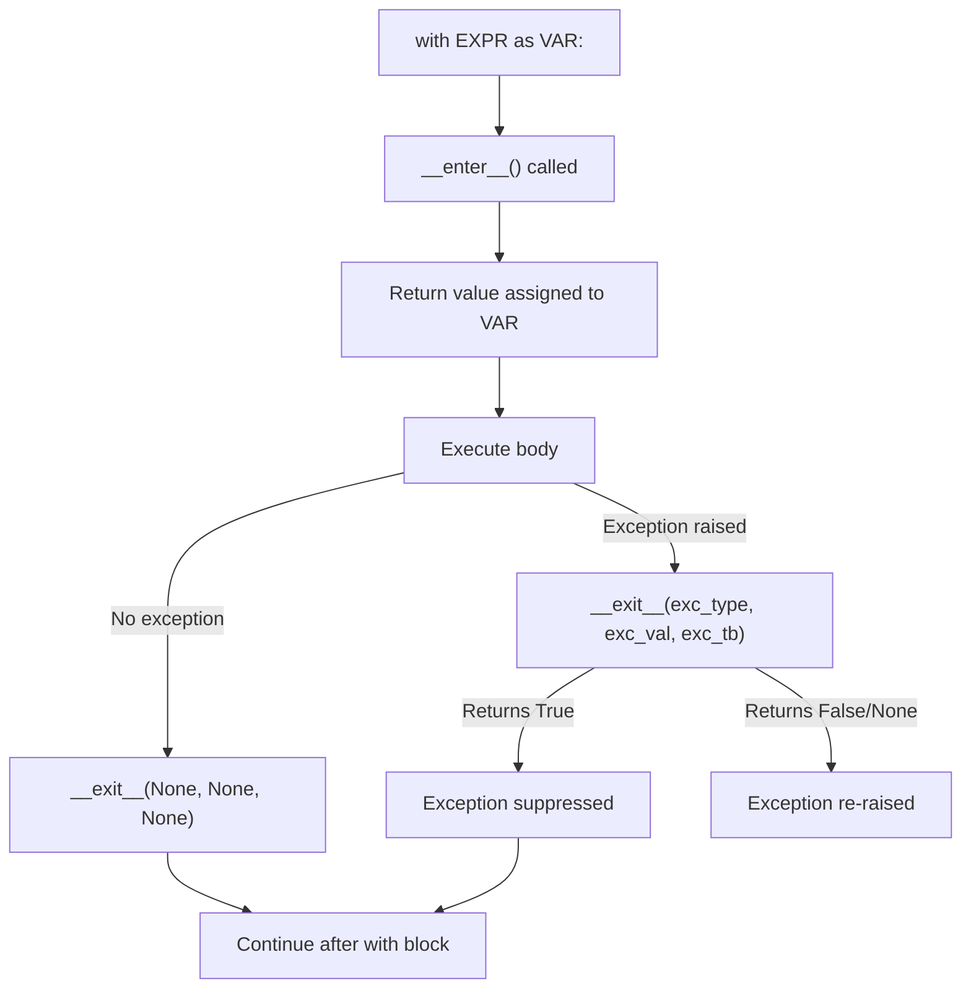

# File Handling and Context Managers

> File I/O is how programs interact with the outside world, and context managers are Python's guarantee that resources get cleaned up — they are the `with` statement's backbone and Python's equivalent of C++'s RAII pattern.

## Table of Contents
- [Core Concepts](#core-concepts)
- [Code Examples](#code-examples)
- [Common Pitfalls](#common-pitfalls)
- [Key Takeaways](#key-takeaways)
- [Exercises](#exercises)

## Core Concepts

### File Handling Fundamentals

#### What

File handling is the mechanism for reading data from and writing data to the filesystem. Python provides the built-in `open()` function that returns a file object, which supports the iterator protocol and acts as a context manager. Every file operation involves three steps: open the file, perform the operation, close the file.

#### How

The `open()` function takes a file path and a mode string. The mode determines whether you read (`"r"`), write (`"w"`), append (`"a"`), or use binary mode (`"b"`). You can combine modes — `"rb"` reads binary, `"w+"` writes and reads.

```python
# The basic signature
open(file, mode="r", buffering=-1, encoding=None, errors=None, newline=None, closefd=True, opener=None)
```

Here is the complete mode table:

| Mode | Description | Creates file? | Truncates? | Position |
|------|-------------|--------------|------------|----------|
| `"r"` | Read text | No (raises `FileNotFoundError`) | No | Start |
| `"w"` | Write text | Yes | Yes | Start |
| `"a"` | Append text | Yes | No | End |
| `"x"` | Exclusive create | Yes (raises `FileExistsError` if exists) | N/A | Start |
| `"r+"` | Read + write | No | No | Start |
| `"w+"` | Write + read | Yes | Yes | Start |
| `"a+"` | Append + read | Yes | No | End |
| `"rb"` | Read binary | No | No | Start |
| `"wb"` | Write binary | Yes | Yes | Start |

The `"x"` mode is often overlooked but extremely useful — it prevents accidentally overwriting existing files, acting as an atomic "create if not exists" operation.

#### Why It Matters

Every program that persists data, reads configuration, processes logs, or communicates with other systems needs file I/O. Understanding modes prevents data loss — using `"w"` on an existing file silently destroys its contents, while `"a"` preserves them. Understanding encoding prevents the most common class of text-processing bugs — mojibake, where text appears garbled because the wrong encoding was assumed.

### Encoding and Text vs Binary

#### What

Text mode (`"r"`, `"w"`) decodes bytes into `str` using an encoding. Binary mode (`"rb"`, `"wb"`) gives you raw `bytes`. The encoding parameter tells Python how to translate between bytes on disk and Unicode strings in memory.

#### How

Always specify encoding explicitly. Python's default encoding is platform-dependent — it is UTF-8 on macOS and Linux, but was historically the system locale encoding on Windows (though Python 3.15 will change this). Never rely on the default.

```python
# Always specify encoding for text files
with open("data.txt", "r", encoding="utf-8") as f:
    content = f.read()

# Binary mode for non-text files (images, protobuf, etc.)
with open("image.png", "rb") as f:
    raw_bytes = f.read()
```

The `errors` parameter controls what happens when decoding fails. The default `"strict"` raises `UnicodeDecodeError`. Alternatives include `"ignore"` (silently skip bad bytes), `"replace"` (insert `U+FFFD`), and `"backslashreplace"` (insert `\xNN` escape sequences). For debugging, `"backslashreplace"` is invaluable because it shows you exactly which bytes are problematic.

#### Why It Matters

Text encoding bugs are insidious — code works fine on your machine with your test data, then breaks in production with real-world input containing accented characters, CJK text, or emoji. Explicitly specifying `encoding="utf-8"` is the single most important defensive habit for text file handling. UTF-8 dominates the modern web (over 98% of web pages) and should be your default unless you have a specific reason to use something else.

### Reading Files: Methods and Patterns

#### What

File objects provide multiple reading strategies: `read()` loads the entire file into memory, `readline()` reads one line at a time, `readlines()` returns a list of all lines, and iterating the file object directly yields lines lazily.

#### How

```python
from pathlib import Path

path = Path("server.log")

# read() — entire file as one string (small files only)
content: str = path.read_text(encoding="utf-8")

# Iterating line-by-line — memory-efficient for large files
with open(path, "r", encoding="utf-8") as f:
    for line in f:  # f is an iterator — yields one line at a time
        process(line.rstrip("\n"))

# readlines() — all lines as a list (loads entire file into memory)
with open(path, "r", encoding="utf-8") as f:
    lines: list[str] = f.readlines()

# readline() — one line at a time with manual control
with open(path, "r", encoding="utf-8") as f:
    header = f.readline()  # Read just the first line
    rest = f.read()        # Read everything else
```

For large files, always iterate directly over the file object. This uses a fixed-size read buffer internally, so memory usage stays constant regardless of file size. The `read()` and `readlines()` methods load everything into memory, which can crash your process on multi-gigabyte files.

#### Why It Matters

The choice between these methods is a memory-versus-convenience tradeoff. For config files and small data, `read()` or `read_text()` is perfectly fine. For log files, CSVs, and anything that could grow unboundedly, line-by-line iteration is the only safe choice. This distinction matters in production — a script that works on your 10 MB test file and OOM-kills on a 10 GB production file is a real and common failure mode.

### Writing Files: Modes and Strategies

#### What

Writing to files uses the same `open()` function with write modes. The key distinction is between `"w"` (truncate and overwrite) and `"a"` (append to end). The `write()` method writes a string, while `writelines()` writes an iterable of strings (without adding newlines).

#### How

```python
from pathlib import Path

path = Path("output.txt")

# Write — creates or overwrites the file
path.write_text("Hello, world!\n", encoding="utf-8")

# Append — adds to the end of existing content
with open(path, "a", encoding="utf-8") as f:
    f.write("Appended line\n")

# Write multiple lines — writelines does NOT add newlines
lines = ["line 1\n", "line 2\n", "line 3\n"]
with open(path, "w", encoding="utf-8") as f:
    f.writelines(lines)

# Safe write pattern — write to temp file, then rename
import tempfile

def safe_write(path: Path, content: str) -> None:
    """Atomic write: either the full content is written or nothing changes."""
    tmp = path.with_suffix(".tmp")
    tmp.write_text(content, encoding="utf-8")
    tmp.rename(path)  # Atomic on POSIX if same filesystem
```

The `print()` function also accepts a `file` parameter, which is convenient for writing formatted output:

```python
with open("report.txt", "w", encoding="utf-8") as f:
    print("=== Report ===", file=f)
    print(f"Total: {total}", file=f)
    print(f"Average: {total / count:.2f}", file=f)
```

#### Why It Matters

The difference between `"w"` and `"a"` is the difference between "replace everything" and "add to what is there." Confusing them causes data loss. The safe write pattern (write to temp, then rename) is critical for any data that must not be corrupted — config files, databases, serialized state. A crash during a normal `write()` can leave a half-written file. A rename is atomic on most filesystems, so the file is either the old version or the new version, never a corrupted intermediate.

### pathlib.Path — Modern File Path Operations

#### What

`pathlib` provides an object-oriented interface for filesystem paths. `Path` objects represent file and directory paths and expose methods for reading, writing, querying, and manipulating the filesystem. It replaces the older `os.path` module and most of `os` for file operations.

#### How

```python
from pathlib import Path

# Creating paths
home = Path.home()                    # /Users/username
config = home / ".config" / "app"     # The / operator joins paths
data_file = Path("data") / "input.csv"

# Querying path components
p = Path("/Users/dev/project/src/main.py")
p.name          # "main.py"
p.stem          # "main"
p.suffix        # ".py"
p.parent        # Path("/Users/dev/project/src")
p.parents[1]    # Path("/Users/dev/project")
p.parts         # ("/", "Users", "dev", "project", "src", "main.py")

# Checking existence and type
p.exists()       # True/False
p.is_file()      # True if it's a regular file
p.is_dir()       # True if it's a directory
p.is_symlink()   # True if it's a symbolic link

# Filesystem operations
p.mkdir(parents=True, exist_ok=True)  # Like mkdir -p
p.rename(Path("new_name.py"))         # Move/rename
p.unlink()                            # Delete file
p.rmdir()                             # Delete empty directory

# Globbing
for py_file in Path("src").rglob("*.py"):   # Recursive glob
    print(py_file)

# Reading and writing (convenience methods)
content = p.read_text(encoding="utf-8")
p.write_text("new content", encoding="utf-8")
raw = p.read_bytes()
p.write_bytes(b"\x00\x01\x02")

# Resolving paths
p.resolve()            # Absolute path with symlinks resolved
p.relative_to(base)    # Relative path from base
```

`Path` objects are immutable — methods like `with_suffix()` and `with_name()` return new `Path` objects rather than modifying the original. The `/` operator is overloaded via `__truediv__` to join path components, making path construction read naturally.

#### Why It Matters

`pathlib` is the modern standard for a reason — it eliminates entire categories of bugs. String-based path manipulation with `os.path.join()` is error-prone (forgetting to join, using wrong separators, accidentally concatenating instead of joining). `Path` objects make correct path manipulation the default. They are also cross-platform — the same code works on Windows, macOS, and Linux without worrying about `\\` vs `/`. Every new Python project should use `pathlib` exclusively.

### The `with` Statement and Context Manager Protocol

#### What

A context manager is any object that defines `__enter__()` and `__exit__()` methods. The `with` statement guarantees that `__exit__()` is called when the block finishes, whether it completes normally or raises an exception. This is Python's resource management pattern — the equivalent of RAII in C++ or `try-finally` in Java.

#### How

The `with` statement follows this exact execution flow:



Under the hood, the `with` statement desugars to roughly this:

```python
# This:
with open("file.txt", "r", encoding="utf-8") as f:
    data = f.read()

# Is equivalent to this:
manager = open("file.txt", "r", encoding="utf-8")
f = manager.__enter__()
try:
    data = f.read()
except Exception:
    if not manager.__exit__(*sys.exc_info()):
        raise
else:
    manager.__exit__(None, None, None)
```

The `__exit__` method receives the exception type, value, and traceback if an exception occurred, or three `None` values if the block completed normally. If `__exit__` returns `True`, the exception is suppressed. This is used rarely — most context managers let exceptions propagate by returning `None` (which is falsy).

Python 3.1+ supports multiple context managers in a single `with` statement:

```python
# Multiple context managers — both guaranteed to be cleaned up
with open("input.txt", "r", encoding="utf-8") as src, \
     open("output.txt", "w", encoding="utf-8") as dst:
    dst.write(src.read())

# Python 3.10+ allows parenthesized form
with (
    open("input.txt", "r", encoding="utf-8") as src,
    open("output.txt", "w", encoding="utf-8") as dst,
):
    dst.write(src.read())
```

#### Why It Matters

Context managers solve the resource leak problem. Without them, every resource acquisition needs a matching `try-finally` block — which developers forget, especially when juggling multiple resources or when early returns are involved. The `with` statement makes correct resource management the path of least resistance. It is not limited to files — database connections, locks, network sockets, temporary directories, and even things like timing measurements all benefit from this pattern.

### Writing a Class-Based Context Manager

#### What

A class-based context manager is any class that implements the `__enter__` and `__exit__` dunder methods. This is the full-power approach — you get complete control over setup, teardown, and exception handling.

#### How

```python
import time
from typing import Self


class Timer:
    """Context manager that measures wall-clock time of a code block."""

    def __init__(self, label: str = "Block") -> None:
        self.label = label
        self.elapsed: float = 0.0
        self._start: float = 0.0

    def __enter__(self) -> Self:
        self._start = time.perf_counter()
        return self  # This becomes the 'as' variable

    def __exit__(
        self,
        exc_type: type[BaseException] | None,
        exc_val: BaseException | None,
        exc_tb: object | None,
    ) -> bool:
        self.elapsed = time.perf_counter() - self._start
        print(f"{self.label}: {self.elapsed:.4f}s")
        return False  # Do not suppress exceptions


# Usage
with Timer("Data processing") as t:
    data = [i ** 2 for i in range(1_000_000)]

print(f"Elapsed: {t.elapsed:.4f}s")  # Access after the block
```

The `__enter__` method can return any object — it does not have to return `self`. For file objects, `__enter__` returns the file object itself. For database transactions, it might return a cursor. For lock managers, it might return `None`.

The `__exit__` method's return value is a boolean. Return `True` to swallow the exception, `False` (or `None`) to let it propagate. Suppressing exceptions should be done sparingly and deliberately — silent failures cause debugging nightmares.

#### Why It Matters

Class-based context managers are the right choice when you need to store state across the `__enter__` / `__exit__` boundary, when you need to handle exceptions in `__exit__`, or when the context manager is complex enough to warrant a dedicated class. The `Timer` example above stores the elapsed time so it can be accessed after the block — something a function-based context manager can do less cleanly.

### `contextlib.contextmanager` — Generator-Based Context Managers

#### What

The `contextlib.contextmanager` decorator turns a generator function into a context manager. Instead of writing a class with `__enter__` and `__exit__`, you write a single function with a `yield` statement. Everything before `yield` is the setup (`__enter__`), and everything after `yield` is the teardown (`__exit__`).

#### How

```python
from contextlib import contextmanager
from collections.abc import Generator


@contextmanager
def managed_resource(name: str) -> Generator[str, None, None]:
    """Acquire a resource, yield it, then clean up."""
    print(f"Acquiring {name}")
    resource = name.upper()  # Simulated acquisition
    try:
        yield resource  # This value becomes the 'as' variable
    finally:
        print(f"Releasing {name}")


with managed_resource("database") as r:
    print(f"Using {r}")

# Output:
# Acquiring database
# Using DATABASE
# Releasing database
```

The `try/finally` around `yield` is critical. Without it, if the body of the `with` block raises an exception, the cleanup code after `yield` will never run — the generator will simply be garbage collected. The `try/finally` ensures cleanup happens regardless.

The generator must yield exactly once. Yielding zero times raises `RuntimeError`, and yielding more than once also raises `RuntimeError`. The `contextmanager` decorator enforces this.

#### Why It Matters

Generator-based context managers are dramatically less boilerplate than class-based ones. For the common case where you just need setup-then-teardown with no special exception handling, they reduce a 15-line class to a 5-line function. Use `@contextmanager` by default; reach for a class only when you need to store state on an instance or customize exception handling in `__exit__`.

### Real-World Context Manager Patterns

#### What

Context managers extend far beyond file handling. Any pattern that follows "acquire-use-release" or "setup-action-teardown" is a candidate. Here are the most common real-world applications.

#### How

**Temporary directory that cleans up after itself:**

```python
import tempfile
from pathlib import Path
from contextlib import contextmanager
from collections.abc import Generator


@contextmanager
def temp_workspace() -> Generator[Path, None, None]:
    """Create a temporary directory, yield its path, then delete everything."""
    with tempfile.TemporaryDirectory() as tmpdir:
        workspace = Path(tmpdir)
        yield workspace
    # TemporaryDirectory.__exit__ handles deletion


with temp_workspace() as ws:
    (ws / "data.txt").write_text("temporary data", encoding="utf-8")
    # Directory and all contents are deleted after this block
```

**Database transaction with automatic commit/rollback:**

```python
from contextlib import contextmanager
from collections.abc import Generator
import sqlite3


@contextmanager
def transaction(db_path: str) -> Generator[sqlite3.Cursor, None, None]:
    """Auto-commit on success, auto-rollback on failure."""
    conn = sqlite3.connect(db_path)
    cursor = conn.cursor()
    try:
        yield cursor
        conn.commit()
    except Exception:
        conn.rollback()
        raise
    finally:
        conn.close()


with transaction("app.db") as cur:
    cur.execute("INSERT INTO users (name) VALUES (?)", ("Alice",))
    cur.execute("INSERT INTO users (name) VALUES (?)", ("Bob",))
    # Both inserts commit together, or neither does
```

**Temporarily changing working directory:**

```python
import os
from pathlib import Path
from contextlib import contextmanager
from collections.abc import Generator


@contextmanager
def working_directory(path: Path) -> Generator[Path, None, None]:
    """Temporarily change working directory, then restore it."""
    original = Path.cwd()
    os.chdir(path)
    try:
        yield path
    finally:
        os.chdir(original)


with working_directory(Path("/tmp")):
    print(Path.cwd())  # /tmp
# Back to original directory here
```

**Redirecting stdout for testing or capturing:**

```python
import sys
from io import StringIO
from contextlib import contextmanager
from collections.abc import Generator


@contextmanager
def capture_stdout() -> Generator[StringIO, None, None]:
    """Capture everything printed to stdout."""
    buffer = StringIO()
    old_stdout = sys.stdout
    sys.stdout = buffer
    try:
        yield buffer
    finally:
        sys.stdout = old_stdout


with capture_stdout() as output:
    print("Hello, captured world!")

print(output.getvalue())  # "Hello, captured world!\n"
```

**Suppressing specific exceptions:**

```python
from contextlib import suppress

# Instead of try/except with pass
with suppress(FileNotFoundError):
    Path("nonexistent.txt").unlink()

# Equivalent to:
# try:
#     Path("nonexistent.txt").unlink()
# except FileNotFoundError:
#     pass
```

#### Why It Matters

Context managers are one of Python's most powerful abstraction tools. They encapsulate resource lifecycle management into a reusable, composable unit. Once you start thinking in terms of "what needs to be cleaned up?", you see context manager opportunities everywhere — temp files, locks, database connections, SSH tunnels, GPU memory, mocked environments. The patterns above cover the most common categories, but the concept is infinitely extensible.

### `contextlib` Module Utilities

#### What

The `contextlib` module provides several utility classes and functions beyond `@contextmanager` for working with context managers. The most important are `suppress`, `redirect_stdout`, `redirect_stderr`, `closing`, `ExitStack`, and `nullcontext`.

#### How

**`ExitStack` — dynamic context manager management:**

```python
from contextlib import ExitStack
from pathlib import Path


def process_files(paths: list[Path]) -> list[str]:
    """Open a dynamic number of files safely."""
    results: list[str] = []
    with ExitStack() as stack:
        files = [
            stack.enter_context(open(p, "r", encoding="utf-8"))
            for p in paths
        ]
        for f in files:
            results.append(f.read())
    # All files are closed here, even if an exception occurred
    return results
```

`ExitStack` is essential when the number of context managers is not known at write time — you cannot write a fixed `with` statement for a variable number of files. It maintains a LIFO stack of cleanup callbacks, and calls them all in reverse order when the block exits.

**`nullcontext` — a no-op context manager:**

```python
from contextlib import nullcontext

def process(data: str, output_path: Path | None = None) -> None:
    """Write to file if path given, otherwise to stdout."""
    cm = open(output_path, "w", encoding="utf-8") if output_path else nullcontext(sys.stdout)
    with cm as out:
        out.write(data)
```

`nullcontext` is useful when an API expects a context manager but you want to conditionally skip the resource management. It yields its argument (or `None`) and does nothing on exit.

**`closing` — add context manager protocol to objects that only have `close()`:**

```python
from contextlib import closing
from urllib.request import urlopen

with closing(urlopen("https://example.com")) as response:
    html = response.read()
# response.close() is called automatically
```

#### Why It Matters

These utilities fill gaps in real-world code. `ExitStack` solves the problem of dynamic resource management that plain `with` statements cannot handle. `nullcontext` prevents awkward conditional branching around `with` statements. `closing` adapts legacy APIs that do not implement the context manager protocol. Together, they make context managers applicable to virtually every cleanup scenario.

## Code Examples

### Example 1: Log File Processor with pathlib

```python
"""Process a log file, extract errors, and write a summary report."""

from pathlib import Path
from dataclasses import dataclass, field
from collections import Counter


@dataclass
class LogSummary:
    """Summary statistics from processing a log file."""
    total_lines: int = 0
    error_count: int = 0
    warning_count: int = 0
    error_types: Counter[str] = field(default_factory=Counter)


def parse_log_file(log_path: Path) -> LogSummary:
    """Parse a log file and return a summary of its contents.

    Expects log lines in the format: TIMESTAMP LEVEL MESSAGE
    e.g., '2026-02-28 10:15:30 ERROR ConnectionTimeout: ...'
    """
    summary = LogSummary()

    with open(log_path, "r", encoding="utf-8") as f:
        for line in f:  # Memory-efficient line-by-line processing
            summary.total_lines += 1
            parts = line.strip().split(maxsplit=3)

            if len(parts) < 3:
                continue

            level = parts[2]
            if level == "ERROR":
                summary.error_count += 1
                # Extract error type (e.g., "ConnectionTimeout")
                if len(parts) > 3:
                    error_type = parts[3].split(":")[0]
                    summary.error_types[error_type] += 1
            elif level == "WARNING":
                summary.warning_count += 1

    return summary


def write_report(summary: LogSummary, output_path: Path) -> None:
    """Write a human-readable summary report."""
    with open(output_path, "w", encoding="utf-8") as f:
        f.write("=== Log Analysis Report ===\n\n")
        f.write(f"Total lines processed: {summary.total_lines}\n")
        f.write(f"Errors: {summary.error_count}\n")
        f.write(f"Warnings: {summary.warning_count}\n\n")

        if summary.error_types:
            f.write("Error breakdown:\n")
            for error_type, count in summary.error_types.most_common():
                f.write(f"  {error_type}: {count}\n")


def process_all_logs(log_dir: Path, report_dir: Path) -> None:
    """Process all .log files in a directory and generate individual reports."""
    report_dir.mkdir(parents=True, exist_ok=True)

    for log_file in sorted(log_dir.rglob("*.log")):
        summary = parse_log_file(log_file)
        report_path = report_dir / f"{log_file.stem}_report.txt"
        write_report(summary, report_path)
        print(f"Processed {log_file.name}: {summary.error_count} errors")


# Usage
if __name__ == "__main__":
    process_all_logs(
        log_dir=Path("logs"),
        report_dir=Path("reports"),
    )
```

### Example 2: Atomic File Writer Context Manager

```python
"""A context manager that writes to a temp file and atomically replaces the target."""

from pathlib import Path
from contextlib import contextmanager
from collections.abc import Generator
from typing import IO
import tempfile
import os


@contextmanager
def atomic_write(
    target: Path,
    mode: str = "w",
    encoding: str = "utf-8",
) -> Generator[IO[str], None, None]:
    """Write to a temp file, then atomically rename to target.

    If the body raises an exception, the target file is untouched.
    This prevents corrupt/partial writes from ever being visible.
    """
    target = target.resolve()
    # Create temp file in the same directory (required for atomic rename)
    fd, tmp_path_str = tempfile.mkstemp(
        dir=target.parent,
        prefix=f".{target.name}.",
        suffix=".tmp",
    )
    tmp_path = Path(tmp_path_str)

    try:
        # Close the raw file descriptor; we'll reopen with proper encoding
        os.close(fd)
        with open(tmp_path, mode, encoding=encoding) as f:
            yield f
        # Only rename if the body succeeded (no exception)
        tmp_path.rename(target)
    except BaseException:
        # Clean up temp file on any error
        tmp_path.unlink(missing_ok=True)
        raise


# Usage: config file that must never be half-written
config = Path("app_config.json")
with atomic_write(config) as f:
    import json
    json.dump({"database": "prod", "debug": False}, f, indent=2)
# If json.dump raises, config is untouched
```

### Example 3: Multi-File CSV Merger with ExitStack

```python
"""Merge multiple CSV files into one, handling a dynamic number of inputs."""

import csv
from pathlib import Path
from contextlib import ExitStack


def merge_csvs(
    input_paths: list[Path],
    output_path: Path,
    *,
    has_header: bool = True,
) -> int:
    """Merge multiple CSV files into a single output file.

    Returns the total number of data rows written.
    All files must have the same column structure.
    """
    rows_written = 0

    with ExitStack() as stack:
        # Open all input files dynamically
        readers: list[csv.reader] = []
        for path in input_paths:
            f = stack.enter_context(open(path, "r", encoding="utf-8", newline=""))
            readers.append(csv.reader(f))

        out_file = stack.enter_context(
            open(output_path, "w", encoding="utf-8", newline="")
        )
        writer = csv.writer(out_file)

        header_written = False
        for reader in readers:
            for i, row in enumerate(reader):
                if has_header and i == 0:
                    if not header_written:
                        writer.writerow(row)
                        header_written = True
                    continue  # Skip headers from subsequent files
                writer.writerow(row)
                rows_written += 1

    return rows_written


# Usage
if __name__ == "__main__":
    csvs = list(Path("data").glob("sales_*.csv"))
    total = merge_csvs(csvs, Path("data/merged_sales.csv"))
    print(f"Merged {len(csvs)} files, {total} total rows")
```

### Example 4: Indented Logger Context Manager

```python
"""A nestable context manager for indented logging — demonstrates re-entrant design."""

from contextlib import contextmanager
from collections.abc import Generator
import sys
from typing import TextIO


class IndentedLogger:
    """Logger that supports nested indentation via context manager."""

    def __init__(self, output: TextIO = sys.stdout, indent_str: str = "  ") -> None:
        self._output = output
        self._indent_str = indent_str
        self._level = 0

    def log(self, message: str) -> None:
        """Print a message at the current indentation level."""
        prefix = self._indent_str * self._level
        self._output.write(f"{prefix}{message}\n")

    @contextmanager
    def section(self, title: str) -> Generator[None, None, None]:
        """Create an indented section with a title."""
        self.log(title)
        self._level += 1
        try:
            yield
        finally:
            self._level -= 1


# Usage
logger = IndentedLogger()
logger.log("Starting build process")

with logger.section("Compiling"):
    logger.log("main.c")
    logger.log("utils.c")
    with logger.section("Linking"):
        logger.log("libmath.so")
        logger.log("libnet.so")
    logger.log("build.o")

logger.log("Build complete")

# Output:
# Starting build process
# Compiling
#   main.c
#   utils.c
#   Linking
#     libmath.so
#     libnet.so
#   build.o
# Build complete
```

### Example 5: Timed Context Manager with Statistics

```python
"""A reusable timing context manager that collects statistics across multiple uses."""

import time
from dataclasses import dataclass, field
from contextlib import contextmanager
from collections.abc import Generator
import statistics


@dataclass
class TimingStats:
    """Collects timing measurements and computes statistics."""
    measurements: list[float] = field(default_factory=list)

    @property
    def count(self) -> int:
        return len(self.measurements)

    @property
    def total(self) -> float:
        return sum(self.measurements)

    @property
    def mean(self) -> float:
        return statistics.mean(self.measurements) if self.measurements else 0.0

    @property
    def median(self) -> float:
        return statistics.median(self.measurements) if self.measurements else 0.0

    @property
    def stdev(self) -> float:
        return statistics.stdev(self.measurements) if len(self.measurements) > 1 else 0.0

    def summary(self) -> str:
        if not self.measurements:
            return "No measurements"
        return (
            f"n={self.count}, total={self.total:.4f}s, "
            f"mean={self.mean:.4f}s, median={self.median:.4f}s, "
            f"stdev={self.stdev:.4f}s"
        )


@contextmanager
def timed(stats: TimingStats, label: str = "") -> Generator[None, None, None]:
    """Record the wall-clock time of a block into a TimingStats collector."""
    start = time.perf_counter()
    try:
        yield
    finally:
        elapsed = time.perf_counter() - start
        stats.measurements.append(elapsed)
        if label:
            print(f"[{label}] {elapsed:.4f}s")


# Usage
db_stats = TimingStats()

for i in range(5):
    with timed(db_stats, f"query-{i}"):
        time.sleep(0.01)  # Simulate work

print(f"Database timing: {db_stats.summary()}")
```

## Common Pitfalls

### Pitfall 1: Forgetting to Close Files

Without a `with` statement, files remain open until the garbage collector runs — which may be never in some Python implementations (CPython uses reference counting, but PyPy uses a tracing GC with unpredictable timing). Open file handles are a finite OS resource, and exhausting them crashes your entire process.

```python
# BAD — file may never be closed, especially in PyPy or on exception
f = open("data.txt", "r", encoding="utf-8")
data = f.read()
f.close()  # Never reached if f.read() raises

# GOOD — with statement guarantees close regardless of exceptions
with open("data.txt", "r", encoding="utf-8") as f:
    data = f.read()
```

### Pitfall 2: Using `"w"` Mode When You Meant to Append

The `"w"` mode truncates the file immediately upon opening — before you write anything. If your code crashes before the write, you have lost the original data and written nothing.

```python
# BAD — destroys existing log entries every time this function is called
def add_log_entry(path: Path, message: str) -> None:
    with open(path, "w", encoding="utf-8") as f:
        f.write(f"{message}\n")

# GOOD — append mode preserves existing content
def add_log_entry(path: Path, message: str) -> None:
    with open(path, "a", encoding="utf-8") as f:
        f.write(f"{message}\n")
```

### Pitfall 3: Not Specifying Encoding

Omitting the encoding parameter means Python uses `locale.getpreferredencoding()`, which varies by platform. Code that works on your macOS machine (UTF-8 by default) breaks on a Windows machine (which may default to cp1252) or inside a Docker container (which may have no locale set).

```python
# BAD — encoding depends on platform locale
with open("data.txt", "r") as f:
    content = f.read()  # May raise UnicodeDecodeError on different platform

# GOOD — always specify encoding explicitly
with open("data.txt", "r", encoding="utf-8") as f:
    content = f.read()
```

### Pitfall 4: Missing `try/finally` in `@contextmanager` Functions

If the body of a `with` block raises an exception, the generator-based context manager resumes at the `yield` point by re-raising the exception. Without `try/finally`, your cleanup code is skipped.

```python
from contextlib import contextmanager
from collections.abc import Generator

# BAD — cleanup code never runs if the body raises
@contextmanager
def connect(url: str) -> Generator[object, None, None]:
    conn = create_connection(url)
    yield conn
    conn.close()  # SKIPPED if body raises an exception!

# GOOD — try/finally ensures cleanup always runs
@contextmanager
def connect(url: str) -> Generator[object, None, None]:
    conn = create_connection(url)
    try:
        yield conn
    finally:
        conn.close()  # Always runs
```

### Pitfall 5: Reading Entire Large Files into Memory

`read()` and `readlines()` load the entire file into memory. For a 4 GB log file, that is 4 GB of RAM — plus overhead for the Python string objects, which can easily double the memory usage.

```python
# BAD — loads entire file into memory as a list of strings
with open("huge_access.log", "r", encoding="utf-8") as f:
    for line in f.readlines():  # 4GB file = 4GB+ in memory
        process(line)

# GOOD — iterate directly over the file object (lazy, constant memory)
with open("huge_access.log", "r", encoding="utf-8") as f:
    for line in f:  # Reads one buffered chunk at a time
        process(line)
```

## Key Takeaways

- Always use `with` statements for file I/O and any resource that needs cleanup. It is not optional — it is the only correct way to handle resources in Python.
- Always specify `encoding="utf-8"` when opening text files. Platform-dependent defaults cause cross-platform bugs that are difficult to diagnose.
- Use `pathlib.Path` for all path operations. String-based path manipulation with `os.path` is error-prone and less readable.
- Use `@contextmanager` for simple setup/teardown patterns; use class-based context managers when you need to store state or customize exception handling.
- Iterate over file objects directly for memory-efficient line-by-line processing. Reserve `read()` for small, bounded files.

## Exercises

1. **File Statistics Tool**: Write a function `file_stats(path: Path) -> dict[str, int]` that reads a text file and returns a dictionary with keys `"lines"`, `"words"`, `"chars"`, and `"blank_lines"`. Handle the case where the file does not exist by raising a custom `FileStatsError` exception with a helpful message.

2. **Directory Tree Printer**: Write a function `print_tree(root: Path, indent: int = 0) -> None` that recursively prints a directory's contents in a tree format (similar to the Unix `tree` command). Use `pathlib` for all path operations. Directories should be listed before files at each level, and the output should use indentation to show nesting depth.

3. **Context Manager: Temporary Environment Variables**: Write a context manager `temp_env(**kwargs: str)` using `@contextmanager` that temporarily sets environment variables for the duration of the `with` block, then restores the original values (or removes them if they did not exist before). It should handle exceptions correctly — the environment must always be restored.

4. **Safe Config Writer**: Write a class `SafeConfigWriter` that implements the context manager protocol (`__enter__` / `__exit__`). On enter, it loads a JSON config file into a dictionary and returns it. On exit (whether normal or exceptional), it writes the dictionary back to the file only if no exception occurred. If an exception occurred, the original file must remain unchanged. Use the atomic write pattern (write to temp file, then rename).

5. **Multi-Log Tailer**: Write a function `tail_logs(log_dir: Path, n: int = 10) -> dict[str, list[str]]` that uses `ExitStack` to open all `.log` files in a directory simultaneously, reads the last `n` lines from each file, and returns a dictionary mapping filename to its last `n` lines. Handle the case where a file has fewer than `n` lines.

---
up:: [Schedule](../../Schedule.md)
#type/learning #source/self-study #status/seed
