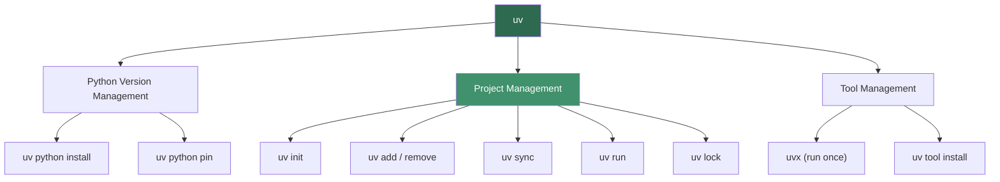
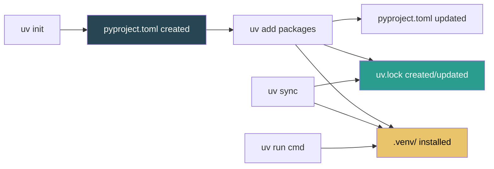
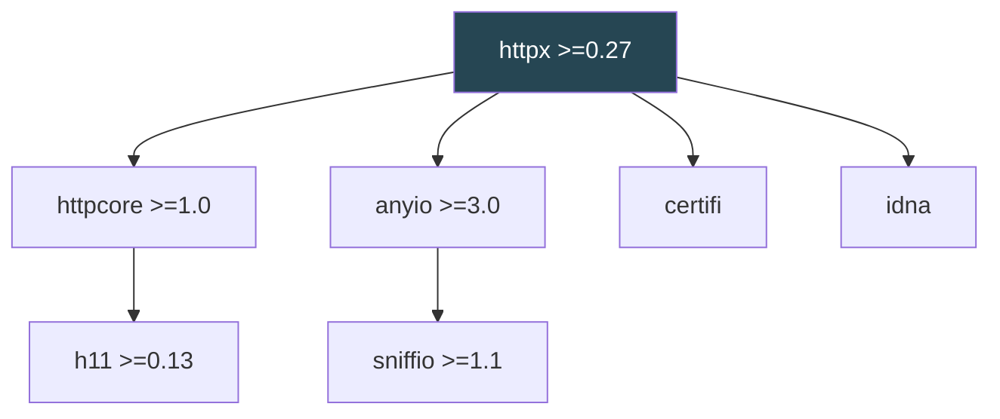

# Package Management: PyPI, uv, and pyproject.toml

> Modern Python package management revolves around three pillars: PyPI as the package registry, `uv` as the fast all-in-one tool for installing and managing packages, and `pyproject.toml` as the single configuration file that defines your project.

## Table of Contents
- [Core Concepts](#core-concepts)
- [Code Examples](#code-examples)
- [Common Pitfalls](#common-pitfalls)
- [Key Takeaways](#key-takeaways)
- [Exercises](#exercises)

## Core Concepts

### PyPI — The Python Package Index

#### What

PyPI (Python Package Index) is the official third-party package repository for Python. It hosts over 500,000 packages — everything from web frameworks (FastAPI, Django) to scientific computing libraries (NumPy, pandas) to tiny utilities. When you run `uv add requests` or `pip install requests`, the package is downloaded from PyPI.

Think of PyPI as the "app store" for Python libraries. Every open-source Python package that wants broad adoption publishes there. The website at pypi.org lets you browse packages, read their descriptions, and check metadata like version history, license, and download counts.

#### How

You rarely interact with PyPI directly. Your package manager (uv, pip) queries the PyPI API to resolve package names, find compatible versions, and download distribution files. But knowing how to evaluate packages on PyPI is a critical skill.

When evaluating a package on pypi.org, look for these signals:

- **Download counts**: A package with millions of monthly downloads is battle-tested. A package with 50 downloads is a gamble.
- **Maintenance activity**: Check the release history. If the last release was 3+ years ago and there are open security issues, walk away.
- **License**: MIT and Apache 2.0 are permissive and safe for most projects. GPL requires your code to also be open-source. No license means you technically cannot use it.
- **Dependencies**: A package that pulls in 40 transitive dependencies for a simple task is a liability. Fewer dependencies mean fewer things that can break.
- **Documentation**: Good packages have clear README files, API docs, and examples. If you cannot figure out how to use it from the docs, maintenance cost will be high.

PyPI serves two types of distribution formats: **sdist** (source distribution — a tarball of the source code that must be built on install) and **wheel** (pre-built binary distribution that installs instantly). Always prefer packages that publish wheels. If a package only has sdist, you may need a C compiler and system libraries to install it.

#### Why It Matters

PyPI is the reason Python's ecosystem is so productive. Instead of writing an HTTP client from scratch, you install `httpx`. Instead of building a CLI framework, you use `typer`. But this power comes with responsibility — every dependency you add is code you did not write and cannot fully control. Supply chain attacks (malicious packages with similar names to popular ones) are real. Evaluating packages carefully is not paranoia; it is engineering discipline.

### uv — The Modern Python Package Manager

#### What

`uv` is a Python package and project manager written in Rust by Astral (the same team behind the `ruff` linter). It is a single binary that replaces pip, venv, pip-tools, poetry, pyenv, and pipx — all in one tool, running 10-100x faster than the tools it replaces.

Before `uv`, the Python packaging landscape was fragmented. You needed `pyenv` to manage Python versions, `venv` or `virtualenv` to create environments, `pip` to install packages, `pip-tools` or `poetry` to manage lock files, and `pipx` to install CLI tools globally. `uv` unifies all of these into a single coherent workflow.

#### How

`uv` operates in two modes: as a **drop-in pip replacement** (for existing workflows) and as a **project manager** (for new projects). The project manager mode is the recommended approach.

##### Installing uv

```bash
# macOS / Linux
curl -LsSf https://astral.sh/uv/install.sh | sh

# Or via Homebrew
brew install uv

# Verify installation
uv --version
```

##### Managing Python Versions

```bash
# List available Python versions
uv python list

# Install a specific Python version
uv python install 3.12

# Install multiple versions
uv python install 3.11 3.12 3.13

# Pin a Python version for the current project
uv python pin 3.12
```

`uv` downloads and manages Python installations automatically. No more fighting with system Python or installing `pyenv`. When you create a project or run a script, `uv` will automatically download the required Python version if it is not already installed.

##### Creating and Managing Projects

```bash
# Create a new project (creates pyproject.toml, src/, etc.)
uv init my-project
cd my-project

# Add a dependency
uv add requests
uv add httpx

# Add a development dependency
uv add --dev pytest
uv add --dev mypy
uv add --dev ruff

# Remove a dependency
uv remove requests

# Sync environment (install all dependencies from lock file)
uv sync

# Run a command inside the project's virtual environment
uv run python main.py
uv run pytest
uv run mypy src/
```

When you run `uv add`, three things happen: (1) the package is added to `pyproject.toml`, (2) the lock file (`uv.lock`) is updated with the exact resolved versions, and (3) the package is installed into the project's virtual environment. This is atomic — if resolution fails, nothing changes.

##### The Lock File: uv.lock

The lock file records the exact version of every package (including transitive dependencies) that was resolved. This guarantees reproducible installs: every developer, CI server, and production deployment gets the identical set of packages.

```bash
# Update all packages to latest compatible versions
uv lock --upgrade

# Update a specific package
uv lock --upgrade-package requests

# Install exactly what the lock file specifies
uv sync --frozen
```

The `--frozen` flag tells `uv sync` to refuse to update the lock file — it installs exactly what is locked or fails. Use this in CI to catch situations where the lock file is out of date.

##### Virtual Environments

`uv` creates and manages virtual environments automatically. You almost never need to think about them.

```bash
# uv creates a .venv/ directory automatically when you run uv sync or uv run
# But you can create one explicitly if needed:
uv venv

# Create with a specific Python version
uv venv --python 3.12

# The environment lives in .venv/ by default
# uv run automatically activates it — no need to source activate
```

The key insight: with `uv run`, you never need to activate a virtual environment. `uv run python script.py` automatically finds and uses the project's `.venv`. This eliminates an entire class of "wrong Python" bugs.

##### Running Scripts and Tools

```bash
# Run a single-file script with inline dependencies
uv run script.py

# Run a CLI tool without installing it globally
uvx ruff check .
uvx black .

# Install a global CLI tool
uv tool install ruff
```

`uvx` (alias for `uv tool run`) is the replacement for `pipx`. It runs a CLI tool in an isolated environment without polluting your global Python installation.



#### Why It Matters

Speed matters more than you think. When `pip install` takes 30 seconds and `uv add` takes 0.5 seconds, you experiment more freely. You try more packages, iterate faster, and waste less time waiting. But the real value is simplicity: one tool, one workflow, one lock file. New team members run `uv sync` and have a working environment in seconds, not minutes of debugging pip version conflicts.

`uv` is also the first Python tool to handle cross-platform lock files correctly. The lock file captures resolution for all platforms, so the same `uv.lock` works on macOS, Linux, and Windows without re-resolving.

### pyproject.toml — The Single Source of Truth

#### What

`pyproject.toml` is the standardized configuration file for Python projects, defined by PEP 518 and PEP 621. It replaces the old `setup.py`, `setup.cfg`, `requirements.txt`, and `MANIFEST.in` with a single declarative file. Every modern Python tool (uv, ruff, mypy, pytest) reads its configuration from `pyproject.toml`.

Before `pyproject.toml`, a typical Python project had `setup.py` (imperative build config), `requirements.txt` (dependencies), `requirements-dev.txt` (dev dependencies), `setup.cfg` (declarative build config), `.flake8` (linter config), `mypy.ini` (type checker config), and `pytest.ini` (test config). That is seven files where one now suffices.

#### How

A `pyproject.toml` file has several standard sections. Here is the anatomy:

##### The [project] Section (PEP 621)

This is the core metadata section, standardized across all Python packaging tools.

```toml
[project]
name = "my-awesome-project"
version = "1.2.0"
description = "A short description of what this project does"
readme = "README.md"
license = { text = "MIT" }
requires-python = ">=3.12"
authors = [
    { name = "Your Name", email = "you@example.com" },
]

# Runtime dependencies — packages your code needs to run
dependencies = [
    "httpx>=0.27.0",
    "pydantic>=2.0,<3.0",
    "sqlalchemy>=2.0",
]
```

The `requires-python` field is critical. It tells installers which Python versions your project supports. `uv` uses this to resolve compatible package versions.

##### Dependency Version Specifiers

Python uses PEP 440 version specifiers. Understanding these prevents dependency hell:

```toml
dependencies = [
    # Exact version — almost never what you want (breaks compatibility)
    "requests==2.31.0",

    # Minimum version — allows any version >= 2.31.0
    "requests>=2.31.0",

    # Compatible release — allows 2.31.x but not 2.32.0
    # Equivalent to >=2.31.0, <2.32.0
    "requests~=2.31.0",

    # Upper bound — allows >=2.0 but <3.0
    "requests>=2.0,<3.0",

    # Exclusion — exclude a known buggy version
    "requests>=2.0,!=2.30.0",
]
```

The `~=` (compatible release) operator is the sweet spot for most dependencies. `~=2.31.0` means "2.31.0 or any bugfix release in the 2.31.x line, but not 2.32.0 which might break things." For libraries you depend on heavily, use `>=X.Y,<X+1.0` to allow minor version bumps but not major ones.

##### Optional Dependencies (Extras)

```toml
[project.optional-dependencies]
dev = [
    "pytest>=8.0",
    "mypy>=1.8",
    "ruff>=0.3",
]
postgres = [
    "psycopg2-binary>=2.9",
]
all = [
    "my-awesome-project[dev,postgres]",
]
```

Optional dependencies let users install only what they need. `uv add --dev pytest` puts pytest under the `dev` group. Users install extras with `uv sync --extra dev` or `uv sync --all-extras`.

##### The [build-system] Section

```toml
[build-system]
requires = ["hatchling"]
build-backend = "hatchling.api"
```

This tells tools how to build your package into a distributable format (wheel, sdist). `hatchling` is a common modern choice — fast, minimal configuration. Other options include `setuptools`, `flit-core`, and `maturin` (for Rust extensions). If you are writing an application (not a library), you may not need this section at all.

##### The [tool.*] Sections

Every Python tool can claim a namespace under `[tool]`. This is where tool-specific configuration lives:

```toml
# Ruff linter/formatter configuration
[tool.ruff]
line-length = 88
target-version = "py312"

[tool.ruff.lint]
select = ["E", "F", "W", "I", "N", "UP", "B", "A", "SIM"]

# Mypy type checker configuration
[tool.mypy]
python_version = "3.12"
strict = true
warn_return_any = true
warn_unused_configs = true

# Pytest configuration
[tool.pytest.ini_options]
testpaths = ["tests"]
addopts = "-v --tb=short"
```

The beauty of `[tool.*]` is that tools can coexist without stepping on each other. Ruff reads `[tool.ruff]`, mypy reads `[tool.mypy]`, and pytest reads `[tool.pytest.ini_options]`. One file, zero conflicts.

##### Entry Points and Scripts

```toml
[project.scripts]
# Creates a CLI command "my-cli" that runs my_project.cli:main
my-cli = "my_project.cli:main"

[project.gui-scripts]
my-gui = "my_project.gui:main"
```

When someone installs your package, `uv` creates executable commands in the virtual environment's `bin/` directory that map to the specified Python functions. This is how CLI tools like `ruff`, `mypy`, and `pytest` work.

##### A Complete pyproject.toml Example

```toml
[project]
name = "inventory-api"
version = "0.1.0"
description = "A REST API for inventory management"
readme = "README.md"
license = { text = "MIT" }
requires-python = ">=3.12"
authors = [
    { name = "Dev Team", email = "team@example.com" },
]
dependencies = [
    "fastapi>=0.110.0",
    "httpx>=0.27.0",
    "pydantic>=2.6",
    "sqlalchemy>=2.0",
    "uvicorn>=0.27.0",
]

[project.optional-dependencies]
dev = [
    "pytest>=8.0",
    "pytest-asyncio>=0.23",
    "mypy>=1.8",
    "ruff>=0.3",
    "pre-commit>=3.6",
]

[project.scripts]
serve = "inventory_api.main:start_server"

[build-system]
requires = ["hatchling"]
build-backend = "hatchling.api"

[tool.ruff]
line-length = 88
target-version = "py312"

[tool.ruff.lint]
select = ["E", "F", "W", "I", "N", "UP", "B", "A", "SIM", "RUF"]

[tool.mypy]
python_version = "3.12"
strict = true

[tool.pytest.ini_options]
testpaths = ["tests"]
addopts = "-v --tb=short"
asyncio_mode = "auto"
```

#### Why It Matters

`pyproject.toml` is the end of configuration sprawl. Instead of hunting across seven files to understand how a project is configured, you look at one. It is declarative (you say *what* you want, not *how* to build it), standardized (PEP 621 means every tool agrees on the format), and version-controllable (one file to review in PRs). When you join a new project, `pyproject.toml` is the first file you read — it tells you the Python version, dependencies, dev tools, and how everything is configured.

### The Modern Python Project Workflow

#### What

Combining PyPI, `uv`, and `pyproject.toml` gives you a complete project workflow — from creation to dependency management to running code.

#### How

Here is the end-to-end workflow for starting a new Python project:

```bash
# Step 1: Create the project
uv init my-service --python 3.12
cd my-service

# Step 2: Add runtime dependencies
uv add fastapi uvicorn pydantic sqlalchemy

# Step 3: Add development dependencies
uv add --dev pytest mypy ruff

# Step 4: Write your code in src/my_service/
# ... edit files ...

# Step 5: Run your code
uv run python -m my_service

# Step 6: Run dev tools
uv run pytest
uv run mypy src/
uv run ruff check src/

# Step 7: Commit pyproject.toml AND uv.lock to version control
git add pyproject.toml uv.lock
git commit -m "Initial project setup"
```



For an existing project (e.g., you just cloned a repo):

```bash
git clone https://github.com/team/my-service.git
cd my-service

# One command — installs exact locked dependencies
uv sync

# Start working
uv run pytest
```

That is it. No README instructions like "install pyenv, install Python 3.12, create a virtualenv, activate it, pip install -r requirements.txt, pip install -r requirements-dev.txt." Just `uv sync`.

#### Why It Matters

Developer onboarding time is a real metric. If it takes a new team member 2 hours to get a working environment, that is 2 hours of lost productivity multiplied by every new hire. With `uv`, it is under 30 seconds. Reproducibility is equally important — "works on my machine" is eliminated when everyone uses the same lock file. This workflow scales from solo side projects to large teams with CI/CD pipelines.

### Migrating From pip/venv to uv

#### What

If you have existing projects using `requirements.txt` or Poetry, migrating to `uv` is straightforward.

#### How

##### From requirements.txt

```bash
# Initialize a pyproject.toml if you don't have one
uv init --bare

# Import dependencies from requirements.txt
# (manually add them to pyproject.toml or use:)
uv add $(cat requirements.txt | grep -v '^#' | grep -v '^$' | tr '\n' ' ')

# Or if you have a requirements.txt with pinned versions:
uv pip install -r requirements.txt  # works as a pip drop-in
```

The cleaner approach is to start fresh: create `pyproject.toml`, add your dependencies with `uv add`, and delete `requirements.txt`. The lock file (`uv.lock`) replaces pinned requirements files.

##### From Poetry

```bash
# uv can read poetry's pyproject.toml format
# Remove poetry-specific sections and switch to PEP 621 format:
# [tool.poetry] → [project]
# [tool.poetry.dependencies] → [project.dependencies]

# Then:
uv sync
```

The main change is moving from Poetry's custom `[tool.poetry]` format to the standardized `[project]` format (PEP 621). The dependency specifier syntax is nearly identical.

#### Why It Matters

You do not need to migrate all at once. `uv pip` is a drop-in replacement for `pip` — you can start using `uv` for speed alone and migrate to full project management later. But the sooner you adopt `pyproject.toml` + `uv.lock`, the sooner you eliminate "dependency chaos" from your workflow.

### Understanding Dependency Resolution

#### What

Dependency resolution is the process of finding a set of package versions that satisfies all constraints — your direct dependencies, their transitive dependencies, and all version bounds. This is actually an NP-hard problem (it reduces to Boolean satisfiability), which is why fast resolvers like `uv`'s matter.

#### How

When you run `uv add httpx`, the resolver must:

1. Find all available versions of `httpx` on PyPI.
2. For each candidate version, read its dependencies (e.g., httpx 0.27 needs `httpcore>=1.0`, `anyio>=3.0`, `certifi`, etc.).
3. For each of those dependencies, recursively find compatible versions.
4. Find a combination where every version constraint is satisfied simultaneously.
5. If no combination works, report which constraints conflict.



The lock file records the exact resolution. Without it, `uv add httpx` might resolve to httpx 0.27.2 today and 0.28.0 tomorrow (if a new version is published), potentially breaking your code.

#### Why It Matters

Understanding resolution explains why dependency conflicts happen and how to fix them. When `uv` reports "no solution found," it is telling you that two packages require incompatible versions of a shared dependency. The fix is usually to relax a version constraint or find an alternative package. `uv` provides excellent error messages that show exactly which constraints conflict.

## Code Examples

### Example 1: Initializing a Project From Scratch

```bash
# Create a new project with uv
uv init weather-cli --python 3.12
cd weather-cli

# Project structure created by uv init:
# weather-cli/
# ├── pyproject.toml
# ├── README.md
# └── src/
#     └── weather_cli/
#         └── __init__.py

# Add dependencies
uv add httpx typer rich

# Add dev dependencies
uv add --dev pytest mypy ruff

# Verify what was installed
uv tree
```

### Example 2: A pyproject.toml for a CLI Application

```toml
[project]
name = "weather-cli"
version = "0.1.0"
description = "A CLI tool to check weather forecasts"
readme = "README.md"
license = { text = "MIT" }
requires-python = ">=3.12"
dependencies = [
    "httpx>=0.27.0",
    "typer>=0.9.0",
    "rich>=13.0",
]

[project.optional-dependencies]
dev = [
    "pytest>=8.0",
    "pytest-httpx>=0.30",
    "mypy>=1.8",
    "ruff>=0.3",
]

[project.scripts]
weather = "weather_cli.main:app"

[build-system]
requires = ["hatchling"]
build-backend = "hatchling.api"

[tool.ruff]
line-length = 88
target-version = "py312"

[tool.ruff.lint]
select = ["E", "F", "W", "I", "N", "UP", "B", "A", "SIM", "RUF"]

[tool.mypy]
python_version = "3.12"
strict = true
```

### Example 3: The Application Code

```python
"""weather_cli/main.py — A CLI weather tool demonstrating project structure."""
from __future__ import annotations

from typing import Annotated

import httpx
import typer
from rich.console import Console
from rich.table import Table

app = typer.Typer(help="Check weather forecasts from the command line.")
console = Console()


def fetch_weather(city: str, api_key: str) -> dict[str, object]:
    """Fetch weather data for a city from the weather API.

    Uses httpx for async-capable HTTP requests with automatic
    connection pooling and timeout handling.
    """
    url = "https://api.weatherapi.com/v1/current.json"
    params = {"key": api_key, "q": city}

    # httpx provides better defaults than requests:
    # - Timeouts are required (no hanging forever)
    # - HTTP/2 support
    # - Async and sync APIs
    with httpx.Client(timeout=10.0) as client:
        response = client.get(url, params=params)
        response.raise_for_status()
        return response.json()


def display_weather(data: dict[str, object]) -> None:
    """Render weather data as a rich table in the terminal."""
    location = data["location"]
    current = data["current"]

    table = Table(title=f"Weather for {location['name']}, {location['country']}")
    table.add_column("Metric", style="cyan")
    table.add_column("Value", style="green")

    table.add_row("Temperature", f"{current['temp_c']}°C / {current['temp_f']}°F")
    table.add_row("Condition", current["condition"]["text"])
    table.add_row("Humidity", f"{current['humidity']}%")
    table.add_row("Wind", f"{current['wind_kph']} km/h {current['wind_dir']}")

    console.print(table)


@app.command()
def check(
    city: Annotated[str, typer.Argument(help="City name to check weather for")],
    api_key: Annotated[
        str,
        typer.Option("--api-key", envvar="WEATHER_API_KEY", help="API key"),
    ],
) -> None:
    """Check the current weather for a city."""
    try:
        data = fetch_weather(city, api_key)
        display_weather(data)
    except httpx.HTTPStatusError as exc:
        console.print(f"[red]API error: {exc.response.status_code}[/red]")
        raise typer.Exit(code=1) from exc
    except httpx.ConnectError:
        console.print("[red]Could not connect to weather API.[/red]")
        raise typer.Exit(code=1)


if __name__ == "__main__":
    app()
```

### Example 4: Running and Managing the Project

```bash
# Run the CLI tool through uv
uv run weather check "Tokyo" --api-key "your-key-here"

# Run tests
uv run pytest

# Run type checker
uv run mypy src/

# Run linter
uv run ruff check src/

# Format code
uv run ruff format src/

# See the dependency tree
uv tree

# Update all dependencies to latest compatible versions
uv lock --upgrade

# Update only httpx
uv lock --upgrade-package httpx

# Sync the environment after pulling new changes
uv sync
```

### Example 5: Using uv for One-Off Scripts

```python
#!/usr/bin/env python3
"""quick_check.py — A standalone script with inline dependency metadata.

uv supports PEP 723 inline script metadata, so you can declare
dependencies directly in a script without a project.

Run with: uv run quick_check.py
"""
# /// script
# requires-python = ">=3.12"
# dependencies = [
#     "httpx>=0.27",
#     "rich>=13.0",
# ]
# ///

from __future__ import annotations

import httpx
from rich import print as rprint


def check_status(urls: list[str]) -> None:
    """Check HTTP status of multiple URLs."""
    with httpx.Client(timeout=5.0, follow_redirects=True) as client:
        for url in urls:
            try:
                response = client.get(url)
                status = response.status_code
                color = "green" if status < 400 else "red"
                rprint(f"[{color}]{status}[/{color}] {url}")
            except httpx.RequestError as exc:
                rprint(f"[red]ERR[/red] {url} — {exc}")


if __name__ == "__main__":
    sites = [
        "https://python.org",
        "https://pypi.org",
        "https://github.com",
        "https://httpbin.org/status/404",
    ]
    check_status(sites)
```

This is powerful: `uv run quick_check.py` reads the inline metadata, creates a temporary environment with `httpx` and `rich`, and runs the script — all in about a second. No project setup needed.

### Example 6: Evaluating Packages Programmatically

```python
"""evaluate_package.py — Check PyPI package metadata before adding a dependency.

Demonstrates querying the PyPI JSON API to evaluate a package's
health signals before committing to it as a dependency.

Run with: uv run evaluate_package.py
"""
# /// script
# requires-python = ">=3.12"
# dependencies = ["httpx>=0.27", "rich>=13.0"]
# ///

from __future__ import annotations

from datetime import datetime, timezone

import httpx
from rich.console import Console
from rich.table import Table

console = Console()


def evaluate_package(package_name: str) -> None:
    """Fetch and display key health metrics for a PyPI package."""
    url = f"https://pypi.org/pypi/{package_name}/json"

    with httpx.Client(timeout=10.0) as client:
        response = client.get(url)
        if response.status_code == 404:
            console.print(f"[red]Package '{package_name}' not found on PyPI.[/red]")
            return
        response.raise_for_status()

    data = response.json()
    info = data["info"]
    releases = data["releases"]

    # Find latest release date
    latest_version = info["version"]
    release_dates = sorted(releases.keys(), reverse=True)
    latest_upload = None
    for version in release_dates:
        files = releases[version]
        if files:
            latest_upload = files[0]["upload_time_iso_8601"]
            break

    # Calculate days since last release
    days_since_release = "Unknown"
    if latest_upload:
        upload_dt = datetime.fromisoformat(latest_upload.replace("Z", "+00:00"))
        delta = datetime.now(timezone.utc) - upload_dt
        days_since_release = f"{delta.days} days ago"

    # Count total versions
    total_versions = len([v for v in releases if releases[v]])

    table = Table(title=f"PyPI Package: {package_name}")
    table.add_column("Metric", style="cyan")
    table.add_column("Value", style="green")

    table.add_row("Latest Version", latest_version)
    table.add_row("Last Release", days_since_release)
    table.add_row("Total Releases", str(total_versions))
    table.add_row("License", info.get("license") or "Not specified")
    table.add_row("Python Requires", info.get("requires_python") or "Not specified")
    table.add_row("Home Page", info.get("home_page") or info.get("project_url") or "N/A")

    # Check for wheels
    latest_files = releases.get(latest_version, [])
    has_wheel = any(f["packagetype"] == "bdist_wheel" for f in latest_files)
    table.add_row("Has Wheel", "[green]Yes[/green]" if has_wheel else "[red]No[/red]")

    # Count dependencies
    requires_dist = info.get("requires_dist") or []
    # Filter out optional/extra dependencies
    required = [r for r in requires_dist if "extra ==" not in r]
    table.add_row("Direct Dependencies", str(len(required)))

    console.print(table)

    # Health warnings
    if latest_upload:
        upload_dt = datetime.fromisoformat(latest_upload.replace("Z", "+00:00"))
        delta = datetime.now(timezone.utc) - upload_dt
        if delta.days > 365:
            console.print(
                f"[yellow]⚠ Last release was over {delta.days // 365} year(s) ago. "
                "Check if the project is still maintained.[/yellow]"
            )
    if not has_wheel:
        console.print(
            "[yellow]⚠ No wheel available — installation requires building from source.[/yellow]"
        )
    if not info.get("license"):
        console.print("[yellow]⚠ No license specified — legal risk.[/yellow]")


if __name__ == "__main__":
    # Evaluate some popular packages
    for pkg in ["fastapi", "pydantic", "httpx", "requests"]:
        evaluate_package(pkg)
        console.print()
```

## Common Pitfalls

### Pitfall 1: Not Committing the Lock File

```bash
# BAD — .gitignore excludes the lock file
# .gitignore contains:
# uv.lock

# Different developers get different package versions.
# Works on your machine, breaks in CI.
```

The lock file is the single source of truth for reproducible installs. Without it, `uv sync` resolves dependencies from scratch every time, potentially picking up new (and incompatible) versions.

```bash
# GOOD — always commit the lock file
git add pyproject.toml uv.lock
git commit -m "Add httpx dependency"

# Now every developer and CI pipeline gets identical packages.
```

### Pitfall 2: Using pip install Inside a uv Project

```bash
# BAD — mixing pip and uv in the same project
uv init my-project
cd my-project
pip install requests  # ← installs into wrong environment or global Python

# The package won't be in pyproject.toml or uv.lock.
# Next time someone runs uv sync, requests is gone.
```

`pip install` does not know about uv's virtual environment or lock file. It may install into the system Python or a different environment entirely.

```bash
# GOOD — always use uv for dependency management
uv add requests          # adds to pyproject.toml + uv.lock + .venv
uv run python -c "import requests; print(requests.__version__)"
```

### Pitfall 3: Overly Strict Version Pinning in pyproject.toml

```toml
# BAD — pinning exact versions in pyproject.toml
[project]
dependencies = [
    "requests==2.31.0",
    "pydantic==2.6.1",
    "sqlalchemy==2.0.27",
]
# This prevents installing security patches and bugfixes.
# It also causes resolution conflicts when other packages
# need different versions of these dependencies.
```

Exact pins belong in the lock file, not in `pyproject.toml`. The project file should express *compatibility ranges*; the lock file captures the *exact resolution*.

```toml
# GOOD — use compatible release or range constraints
[project]
dependencies = [
    "requests>=2.31",
    "pydantic>=2.6,<3.0",
    "sqlalchemy>=2.0,<3.0",
]
# Allows bugfix updates while preventing breaking major version changes.
# The lock file (uv.lock) records the exact versions installed.
```

### Pitfall 4: Running Python Directly Instead of uv run

```bash
# BAD — running python directly
python main.py
# Which python? System python? Homebrew python? The venv python?
# If the venv isn't activated, you get import errors or wrong versions.
```

Calling `python` directly depends on your shell's PATH and whether a virtual environment is activated. This is fragile and the #1 cause of "it works on my machine" issues.

```bash
# GOOD — always use uv run
uv run python main.py
# uv run finds the project's .venv automatically — no activation needed.
# It also ensures the environment is synced before running.

# Even better — define a script entry point in pyproject.toml:
# [project.scripts]
# serve = "my_project.main:start"
uv run serve
```

### Pitfall 5: Forgetting requires-python

```toml
# BAD — no Python version constraint
[project]
name = "my-project"
version = "0.1.0"
dependencies = [
    "pydantic>=2.0",
]
# Someone with Python 3.8 tries to install it.
# They get cryptic syntax errors from f-string or match/case usage.
```

Without `requires-python`, your package claims to work on any Python version. Users on old versions get confusing errors instead of a clear "this package requires Python >= 3.12" message.

```toml
# GOOD — always specify requires-python
[project]
name = "my-project"
version = "0.1.0"
requires-python = ">=3.12"
dependencies = [
    "pydantic>=2.0",
]
# uv and pip will refuse to install on incompatible Python versions
# with a clear error message.
```

## Key Takeaways

- **PyPI is a shared resource, not an app store you blindly trust.** Evaluate packages by download count, maintenance activity, license, dependency count, and documentation quality before adding them to your project.
- **`uv` replaces the entire pip/venv/poetry/pyenv toolchain** with a single, fast binary. Use `uv add` for dependencies, `uv run` for execution, `uv sync` for reproducible environments. Stop activating virtualenvs.
- **`pyproject.toml` is the single source of truth** for your project. It declares metadata, dependencies, and tool configuration in one standardized, declarative file. Kill your `requirements.txt`, `setup.py`, and `.flake8` files.
- **Always commit `uv.lock` to version control.** The lock file guarantees every developer and CI pipeline gets identical packages. Without it, "works on my machine" is your future.
- **Use version ranges in `pyproject.toml`, exact pins in the lock file.** `>=2.0,<3.0` in your project file lets you receive bugfixes; `uv.lock` captures the exact resolved version for reproducibility.

## Exercises

### Exercise 1: Project Initialization

Create a new Python project using `uv init` called `link-checker`. Add `httpx`, `typer`, and `rich` as runtime dependencies, and `pytest`, `mypy`, and `ruff` as dev dependencies. Examine the generated `pyproject.toml` and `uv.lock`. Run `uv tree` and explain the dependency tree output — which transitive dependencies did `httpx` bring in?

### Exercise 2: Dependency Version Constraints

Given the following constraints, write the correct version specifiers for `pyproject.toml`:
1. `pydantic` version 2.x (any minor/patch, but not 3.0)
2. `sqlalchemy` at least 2.0.20, but only patch releases (no 2.1.0)
3. `requests` any version except 2.30.0 (which had a known bug)
4. `numpy` compatible with 1.26.x (allow patches, not minor bumps)

Then explain: what is the difference between `>=2.0,<3.0` and `~=2.0`? When would you use each?

### Exercise 3: Migration Scenario

You inherit a project with the following files: `requirements.txt`, `requirements-dev.txt`, `setup.py`, `setup.cfg`, `.flake8`, and `mypy.ini`. Describe the step-by-step process to migrate this project to use `uv` + `pyproject.toml`. Which files can be deleted after migration? What goes into which section of `pyproject.toml`?

### Exercise 4: Script With Inline Dependencies

Write a single-file Python script (using PEP 723 inline metadata) that:
1. Takes a GitHub username as a command-line argument
2. Fetches their public repositories using the GitHub API (`httpx`)
3. Displays the top 5 repositories by star count in a formatted table (`rich`)
4. The script should be runnable with just `uv run script.py <username>` — no project setup required

### Exercise 5: Package Evaluation

Pick three Python HTTP client libraries (e.g., `requests`, `httpx`, `aiohttp`, `urllib3`). For each one, check PyPI and evaluate: last release date, number of dependencies, wheel availability, Python version support, and license. Based on your evaluation, which would you choose for a new project and why? Write your reasoning as comments in a Python script that queries the PyPI JSON API.

---
up:: [Schedule](../../Schedule.md)
#type/learning #source/self-study #status/seed
