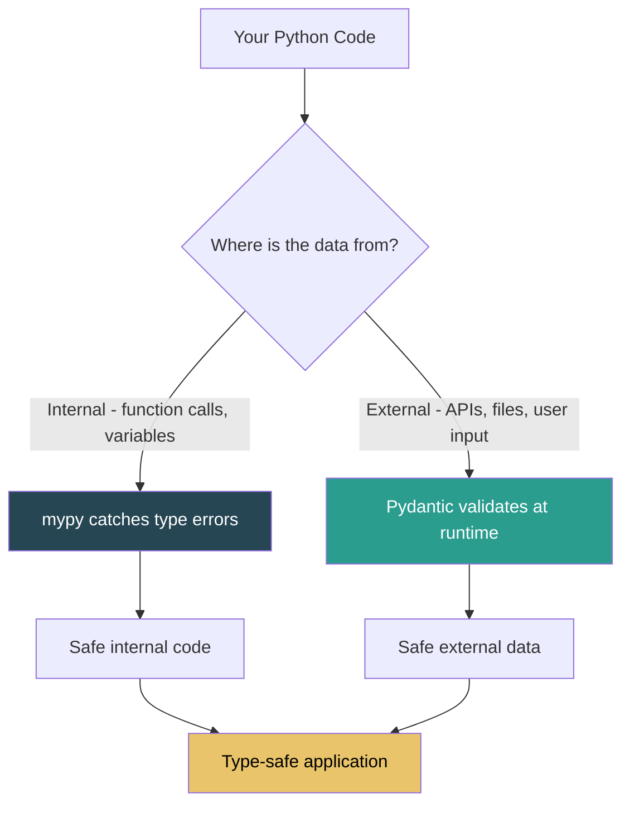

# Static Typing: typing Module, mypy, and Pydantic

> Python's type system gives you the best of both worlds: optional type hints that document intent and catch bugs before runtime (via mypy), plus runtime data validation for external input (via Pydantic) — together they transform Python from a "hope it works" language into one where entire categories of bugs are impossible.

## Table of Contents
- [Core Concepts](#core-concepts)
- [Code Examples](#code-examples)
- [Common Pitfalls](#common-pitfalls)
- [Key Takeaways](#key-takeaways)
- [Exercises](#exercises)

## Core Concepts

### The typing Module — Python's Type Hint System

#### What

The `typing` module provides the vocabulary for annotating Python code with type information. Type hints were introduced in PEP 484 (Python 3.5) and have evolved significantly through PEP 604 (union syntax `X | Y`), PEP 612 (ParamSpec), PEP 695 (type parameter syntax), and others. They are completely optional — the Python runtime ignores them by default. Their value comes from external tools (mypy, Pyright, IDEs) that analyze them statically.

Type hints are not like Java's type system. They do not enforce anything at runtime. They are a contract: "I intend for this parameter to be a `str`." A tool like mypy reads that contract and verifies that callers respect it. Think of type hints as machine-readable documentation that can be automatically verified.

#### How

##### Basic Type Annotations

```python
from __future__ import annotations


# Function parameters and return types
def greet(name: str, times: int = 1) -> str:
    return (f"Hello, {name}! " * times).strip()


# Variable annotations (rarely needed — inference handles most cases)
count: int = 0
name: str = "world"

# None return type — function has side effects only
def log_message(msg: str) -> None:
    print(f"[LOG] {msg}")
```

In Python 3.12+, you almost never need `from __future__ import annotations` for basic types. But it is still useful when you have forward references (a class referencing itself) or complex type expressions.

##### Built-in Generic Types (Python 3.9+)

Starting with Python 3.9, built-in types can be used directly as generics. No need to import `List`, `Dict`, `Set`, or `Tuple` from `typing`.

```python
from __future__ import annotations


# Python 3.9+ — use built-in types directly
def process_names(names: list[str]) -> dict[str, int]:
    return {name: len(name) for name in names}


def get_coordinates() -> tuple[float, float]:
    return (40.7128, -74.0060)


# Variable-length tuple
def get_scores() -> tuple[int, ...]:
    return (95, 87, 92, 88)


# Nested generics
def group_by_length(words: list[str]) -> dict[int, list[str]]:
    groups: dict[int, list[str]] = {}
    for word in words:
        groups.setdefault(len(word), []).append(word)
    return groups
```

##### Union Types and Optional (PEP 604)

```python
from __future__ import annotations


# Modern syntax (Python 3.10+, or any version with __future__ annotations)
def find_user(user_id: int) -> dict[str, str] | None:
    """Return user data or None if not found."""
    users = {1: {"name": "Alice"}, 2: {"name": "Bob"}}
    return users.get(user_id)


# Union of multiple types
def parse_input(value: str | int | float) -> float:
    return float(value)


# Avoid the old typing.Optional and typing.Union:
# Optional[str] is just Union[str, None] — use str | None instead
# Union[int, str] — use int | str instead
```

The `str | None` syntax (PEP 604) is preferred over `Optional[str]` because it is explicit about what is happening: the value is either a `str` or `None`. `Optional[str]` has a misleading name — it does not mean the parameter is optional (has a default), it means the value can be `None`.

##### collections.abc for Function Signatures

```python
from __future__ import annotations

from collections.abc import Sequence, Mapping, Iterable, Callable


# Use abstract types in function parameters — accept any compatible type
def calculate_mean(values: Sequence[float]) -> float:
    """Accept list, tuple, or any sequence — not just list."""
    return sum(values) / len(values)


def lookup(data: Mapping[str, int], key: str) -> int | None:
    """Accept dict, OrderedDict, or any mapping."""
    return data.get(key)


def process_items(items: Iterable[str]) -> list[str]:
    """Accept any iterable — list, generator, set, etc."""
    return [item.upper() for item in items]


def apply_transform(
    values: list[int],
    transform: Callable[[int], int],
) -> list[int]:
    """Callable[[ParamTypes], ReturnType] for function parameters."""
    return [transform(v) for v in values]


# Use concrete types for return types — callers need to know what they get
def get_names() -> list[str]:  # Not Sequence[str] — be specific
    return ["Alice", "Bob", "Charlie"]
```

The rule of thumb: **accept abstract, return concrete.** Function parameters should use `Sequence`, `Mapping`, `Iterable` to be maximally flexible. Return types should use `list`, `dict`, `tuple` so callers know exactly what they are working with.

##### TypeAlias — Naming Complex Types

```python
from __future__ import annotations

from typing import TypeAlias

# Type aliases make complex types readable
JSON: TypeAlias = dict[str, "JSON"] | list["JSON"] | str | int | float | bool | None

UserRecord: TypeAlias = dict[str, str | int | None]

# Python 3.12+ syntax (PEP 695)
type Vector = list[float]
type Matrix = list[Vector]
type JSONValue = dict[str, "JSONValue"] | list["JSONValue"] | str | int | float | bool | None

def parse_response(data: JSON) -> UserRecord:
    """Type aliases make signatures readable."""
    ...
```

##### TypeVar — Generic Functions

```python
from __future__ import annotations

from typing import TypeVar
from collections.abc import Sequence

T = TypeVar("T")


def first(items: Sequence[T]) -> T:
    """Return the first item. The return type matches the input element type.

    first([1, 2, 3]) -> int
    first(["a", "b"]) -> str
    """
    if not items:
        raise ValueError("Empty sequence")
    return items[0]


# Bounded TypeVar — restrict to specific types
Numeric = TypeVar("Numeric", int, float)


def add(a: Numeric, b: Numeric) -> Numeric:
    """Only accepts int or float, not str or other types."""
    return a + b


# Upper bound — accept any subclass of a base type
from typing import TypeVar

Comparable = TypeVar("Comparable", bound="SupportsLessThan")

# Python 3.12+ syntax (PEP 695) — cleaner, no separate TypeVar declaration
# def first[T](items: Sequence[T]) -> T:
#     return items[0]
```

TypeVar is Python's answer to generics. Without it, you would have to write separate functions for `first_int`, `first_str`, `first_user`, etc. — or give up type checking by using `Any`. TypeVar says "this is some type T, and wherever T appears in the signature, it must be the same type."

##### Protocol — Structural Typing (Duck Typing With Types)

```python
from __future__ import annotations

from typing import Protocol, runtime_checkable


class Drawable(Protocol):
    """Any object with a draw() method satisfies this protocol.

    Unlike abstract base classes, the implementing class does NOT
    need to explicitly inherit from Drawable. If it has a draw()
    method with the right signature, it's a Drawable.
    """

    def draw(self, x: int, y: int) -> None: ...


class Circle:
    """Circle satisfies Drawable without inheriting from it."""

    def __init__(self, radius: float) -> None:
        self.radius = radius

    def draw(self, x: int, y: int) -> None:
        print(f"Drawing circle at ({x}, {y}) with radius {self.radius}")


class Square:
    def __init__(self, side: float) -> None:
        self.side = side

    def draw(self, x: int, y: int) -> None:
        print(f"Drawing square at ({x}, {y}) with side {self.side}")


def render_all(shapes: list[Drawable], x: int, y: int) -> None:
    """Accepts any list of objects that have a draw() method."""
    for shape in shapes:
        shape.draw(x, y)


# Both Circle and Square satisfy Drawable — no inheritance required
shapes: list[Drawable] = [Circle(5.0), Square(3.0)]
render_all(shapes, 10, 20)


# runtime_checkable allows isinstance() checks (slow, use sparingly)
@runtime_checkable
class Closeable(Protocol):
    def close(self) -> None: ...


import io

stream = io.StringIO()
assert isinstance(stream, Closeable)  # True — StringIO has .close()
```

Protocol is the type system's way of expressing Python's duck typing philosophy. In traditional OOP, you would define an abstract base class and require all implementations to inherit from it. Protocol says "I don't care about inheritance — if it has the right methods, it counts." This is more Pythonic and more flexible.

##### TypeGuard — Narrowing Types in Conditionals

```python
from __future__ import annotations

from typing import TypeGuard


def is_string_list(val: list[object]) -> TypeGuard[list[str]]:
    """Type guard: returns True if all elements are strings.

    After calling this in an if-block, mypy knows the list
    contains only strings.
    """
    return all(isinstance(item, str) for item in val)


def process(data: list[object]) -> None:
    if is_string_list(data):
        # mypy knows data is list[str] here
        for item in data:
            print(item.upper())  # No error — item is str
    else:
        # mypy knows data is list[object] here
        print("Not all strings")
```

TypeGuard bridges the gap between runtime checks and static analysis. Without it, mypy cannot follow the logic of your custom type-checking functions. With it, you teach mypy to narrow types based on your runtime validation.

##### Annotated — Attaching Metadata to Types

```python
from __future__ import annotations

from typing import Annotated


# Annotated lets you attach arbitrary metadata to type hints.
# The first argument is the actual type; the rest are metadata
# that tools can interpret.
type Positive = Annotated[int, "must be > 0"]
type NonEmpty = Annotated[str, "must not be empty"]
type Port = Annotated[int, "valid port number (1-65535)"]


def start_server(host: str, port: Port) -> None:
    """Annotated types document constraints in the signature."""
    print(f"Starting server on {host}:{port}")


# Pydantic uses Annotated extensively for field validation:
# Annotated[int, Field(gt=0, description="User ID")]
# FastAPI uses it for dependency injection:
# Annotated[str, Query(max_length=50)]
```

`Annotated` is the mechanism that frameworks like Pydantic and FastAPI use to attach validation rules, descriptions, and other metadata to type hints without inventing custom syntax. It keeps the actual type (`int`) visible to mypy while letting runtime tools read the metadata.

#### Why It Matters

Type hints are the highest-leverage improvement you can make to a Python codebase. They catch bugs at development time instead of production, make refactoring safe (rename a parameter and mypy tells you every caller that broke), serve as always-accurate documentation (unlike comments that rot), and enable IDE features like autocomplete and go-to-definition. The investment pays for itself within weeks.

### mypy — Static Type Checking

#### What

mypy is a static type checker for Python. It reads your code and type hints without executing anything, then reports type errors — places where the types do not match up. Think of it as a compiler's type checker, applied to a dynamic language. mypy was created by Jukka Lehtosalo at Dropbox and is the reference implementation for Python's type system.

"Static" means mypy analyzes your code at rest — it never runs it. This is the opposite of testing, which validates behavior at runtime. mypy validates types at analysis time. They are complementary: mypy catches "you passed a str where an int was expected" bugs, while tests catch "the algorithm produces wrong results" bugs.

#### How

##### Installing and Running mypy

```bash
# Add to your project as a dev dependency
uv add --dev mypy

# Run mypy on your source code
uv run mypy src/

# Run on a specific file
uv run mypy src/my_project/models.py

# Run with a specific Python version target
uv run mypy --python-version 3.12 src/
```

##### Configuring mypy in pyproject.toml

```toml
[tool.mypy]
python_version = "3.12"
strict = true

# These are included in strict mode, listed for clarity:
warn_return_any = true
warn_unused_configs = true
disallow_untyped_defs = true
disallow_any_generics = true
check_untyped_defs = true
no_implicit_optional = true
warn_redundant_casts = true
warn_unused_ignores = true
warn_unreachable = true

# Per-module overrides — useful for gradual adoption
[[tool.mypy.overrides]]
module = "tests.*"
disallow_untyped_defs = false  # Tests can be less strict

[[tool.mypy.overrides]]
module = "third_party_lib.*"
ignore_missing_imports = true  # No stubs available
```

##### Strictness Levels

mypy has a spectrum of strictness. Start loose, tighten over time:

**Level 1 — Minimal (good starting point for legacy codebases)**:
```toml
[tool.mypy]
python_version = "3.12"
check_untyped_defs = true       # Check bodies of untyped functions
warn_return_any = true           # Warn when returning Any
ignore_missing_imports = true    # Don't fail on untyped libraries
```

**Level 2 — Moderate (good for active development)**:
```toml
[tool.mypy]
python_version = "3.12"
disallow_untyped_defs = true     # All functions must have type hints
check_untyped_defs = true
warn_return_any = true
warn_unused_ignores = true
no_implicit_optional = true      # Don't treat None default as Optional
```

**Level 3 — Strict (recommended for new projects)**:
```toml
[tool.mypy]
python_version = "3.12"
strict = true                    # Enables all strict checks
```

`strict = true` is a single flag that enables all strictness options. For new projects, start here. For existing untyped codebases, start at Level 1 and work your way up module by module.

##### Common mypy Errors and How to Fix Them

```python
from __future__ import annotations


# Error: Incompatible types in assignment
x: int = "hello"  # error: Incompatible types (got "str", expected "int")
x: int = 42       # correct


# Error: Missing return type
def greet(name):         # error: Function is missing a type annotation
    return f"Hi, {name}"

def greet(name: str) -> str:  # correct
    return f"Hi, {name}"


# Error: Item "None" has no attribute "x"
def maybe_user(id: int) -> dict[str, str] | None:
    ...

user = maybe_user(1)
print(user["name"])  # error: Value of type "dict[str, str] | None" is not indexable

# Fix: narrow the type first
user = maybe_user(1)
if user is not None:
    print(user["name"])  # OK — mypy knows user is dict[str, str] here


# Error: Argument has incompatible type
def process(items: list[int]) -> int:
    return sum(items)

data: list[str] = ["a", "b"]
process(data)  # error: Argument has incompatible type "list[str]"; expected "list[int]"
```

##### Type Narrowing

mypy understands control flow and narrows types automatically:

```python
from __future__ import annotations


def handle(value: str | int | None) -> str:
    # mypy tracks the type through each branch
    if value is None:
        return "nothing"          # value is None here
    if isinstance(value, int):
        return str(value * 2)     # value is int here
    return value.upper()          # value is str here (only possibility left)


def safe_get(data: dict[str, int], key: str) -> int:
    if (val := data.get(key)) is not None:
        return val    # mypy knows val is int here (not int | None)
    raise KeyError(f"Missing key: {key}")
```

##### Using type: ignore for Escape Hatches

Sometimes mypy is wrong, or you are doing something deliberately dynamic. Use `# type: ignore` sparingly and with specific error codes:

```python
from __future__ import annotations

import json


# BAD — blanket ignore hides real bugs
result = json.loads(data)  # type: ignore

# GOOD — specific error code, with explanation
result: dict[str, str] = json.loads(data)  # type: ignore[no-any-return]  # JSON parsed as dict

# Even better — use cast when you know the type
from typing import cast

result = cast(dict[str, str], json.loads(data))
```

##### Gradual Typing — Adding Types to an Untyped Codebase

You do not have to type-hint your entire codebase at once. mypy supports gradual adoption:

1. Start with `mypy --strict` on new files only.
2. Add per-module overrides to relax rules for legacy code.
3. Focus on public APIs first — function signatures that cross module boundaries.
4. Use `reveal_type()` to see what mypy infers:

```python
from __future__ import annotations

x = [1, 2, 3]
reveal_type(x)  # note: Revealed type is "builtins.list[builtins.int]"

d = {"a": 1, "b": 2}
reveal_type(d)  # note: Revealed type is "builtins.dict[builtins.str, builtins.int]"
```

`reveal_type()` is a mypy built-in — it does not exist at runtime. It is your debugging tool for understanding what mypy thinks a type is.

#### Why It Matters

mypy catches real bugs. Not theoretical bugs — actual production incidents that would otherwise require debugging at 2am. "You returned `None` but the caller expects `str`" — that is a runtime `AttributeError` waiting to happen. mypy finds it in milliseconds during development. The cost is adding type hints (which also serve as documentation). The return is never again shipping a `TypeError` or `AttributeError` to production.

### Pydantic — Runtime Data Validation

#### What

Pydantic is a runtime data validation library that uses type annotations to define data models. While mypy checks types statically (at analysis time, without running code), Pydantic validates data at runtime (when your program actually executes). This is essential for data that comes from outside your program — API requests, config files, database rows, CSV imports — where you cannot trust the types.

Think of the boundary between your code and the outside world. Inside your code, mypy ensures type safety. But data coming in from a JSON API, a user form, or a YAML config file is just bytes — mypy cannot check it because it does not exist until runtime. Pydantic is the validator at the gate.

#### How

##### BaseModel — The Foundation

```python
from __future__ import annotations

from pydantic import BaseModel


class User(BaseModel):
    """A Pydantic model validates data on construction.

    If you pass invalid data, Pydantic raises a ValidationError
    with detailed error messages — not a cryptic TypeError.
    """

    name: str
    age: int
    email: str | None = None  # Optional with default None


# Valid data — works fine
user = User(name="Alice", age=30, email="alice@example.com")
print(user.name)   # "Alice"
print(user.age)    # 30
print(user.email)  # "alice@example.com"

# Type coercion — Pydantic converts compatible types
user2 = User(name="Bob", age="25")  # "25" is coerced to int 25
print(user2.age)        # 25
print(type(user2.age))  # <class 'int'>

# Invalid data — raises ValidationError
try:
    User(name="Charlie", age="not a number")
except Exception as e:
    print(e)
    # 1 validation error for User
    # age
    #   Input should be a valid integer, unable to parse string as an integer
```

##### Field — Adding Constraints

```python
from __future__ import annotations

from pydantic import BaseModel, Field


class Product(BaseModel):
    """Field() adds validation constraints beyond basic type checking."""

    name: str = Field(min_length=1, max_length=200)
    price: float = Field(gt=0, description="Price in USD, must be positive")
    quantity: int = Field(ge=0, default=0)  # ge = greater than or equal
    sku: str = Field(pattern=r"^[A-Z]{3}-\d{4}$")  # Regex validation


# Valid
product = Product(name="Widget", price=9.99, sku="WDG-0001")

# Invalid — multiple errors reported at once
try:
    Product(name="", price=-5, sku="bad")
except Exception as e:
    print(e)
    # 3 validation errors for Product
    # name: String should have at least 1 character
    # price: Input should be greater than 0
    # sku: String should match pattern '^[A-Z]{3}-\d{4}$'
```

##### Nested Models

```python
from __future__ import annotations

from pydantic import BaseModel, Field


class Address(BaseModel):
    street: str
    city: str
    country: str = "US"
    zip_code: str = Field(pattern=r"^\d{5}(-\d{4})?$")


class Company(BaseModel):
    name: str
    address: Address  # Nested model — validated recursively
    employee_count: int = Field(ge=1)


# Pydantic validates the entire nested structure
company = Company(
    name="Acme Corp",
    address={"street": "123 Main St", "city": "Springfield", "zip_code": "62701"},
    employee_count=50,
)

# You can also pass an Address instance
addr = Address(street="456 Oak Ave", city="Portland", zip_code="97201")
company2 = Company(name="TechCo", address=addr, employee_count=200)

# Nested validation catches deep errors
try:
    Company(
        name="BadCo",
        address={"street": "1 St", "city": "X", "zip_code": "nope"},
        employee_count=0,
    )
except Exception as e:
    print(e)
    # 2 validation errors:
    # address.zip_code: String should match pattern...
    # employee_count: Input should be greater than or equal to 1
```

##### field_validator — Custom Validation Logic

```python
from __future__ import annotations

from pydantic import BaseModel, Field, field_validator


class UserRegistration(BaseModel):
    username: str = Field(min_length=3, max_length=30)
    email: str
    password: str = Field(min_length=8)
    age: int = Field(ge=13)

    @field_validator("username")
    @classmethod
    def username_must_be_alphanumeric(cls, v: str) -> str:
        """Custom validator: username must contain only letters and numbers."""
        if not v.isalnum():
            raise ValueError("Username must be alphanumeric")
        return v.lower()  # Normalize to lowercase

    @field_validator("email")
    @classmethod
    def email_must_contain_at(cls, v: str) -> str:
        """Basic email format check."""
        if "@" not in v:
            raise ValueError("Invalid email format")
        return v.lower()

    @field_validator("password")
    @classmethod
    def password_must_be_strong(cls, v: str) -> str:
        """Enforce password complexity requirements."""
        if not any(c.isupper() for c in v):
            raise ValueError("Password must contain at least one uppercase letter")
        if not any(c.isdigit() for c in v):
            raise ValueError("Password must contain at least one digit")
        return v


# Valid registration
user = UserRegistration(
    username="Alice123",
    email="Alice@Example.com",
    password="Secret42",
    age=25,
)
print(user.username)  # "alice123" — normalized by validator
print(user.email)     # "alice@example.com" — normalized by validator
```

The `@field_validator` decorator runs after Pydantic's built-in type validation. The validator receives the already-validated value (`v` is guaranteed to be a `str` because the type annotation says so). You can transform the value (normalization) or reject it (raise `ValueError`).

##### model_validator — Cross-Field Validation

```python
from __future__ import annotations

from pydantic import BaseModel, Field, model_validator


class DateRange(BaseModel):
    """A model where validation depends on multiple fields together."""

    start_date: str
    end_date: str
    label: str = ""

    @model_validator(mode="after")
    def end_must_be_after_start(self) -> DateRange:
        """Validate that end_date comes after start_date.

        mode='after' means all fields are already validated individually.
        We can now check cross-field constraints.
        """
        if self.end_date <= self.start_date:
            raise ValueError(
                f"end_date ({self.end_date}) must be after "
                f"start_date ({self.start_date})"
            )
        return self

    @model_validator(mode="before")
    @classmethod
    def set_default_label(cls, data: dict[str, object]) -> dict[str, object]:
        """mode='before' runs before individual field validation.

        Useful for transforming raw input data.
        """
        if isinstance(data, dict) and not data.get("label"):
            data["label"] = f"{data.get('start_date', '?')} to {data.get('end_date', '?')}"
        return data


# Valid — end is after start
dr = DateRange(start_date="2026-01-01", end_date="2026-12-31")
print(dr.label)  # "2026-01-01 to 2026-12-31" — set by before-validator

# Invalid — end is before start
try:
    DateRange(start_date="2026-12-31", end_date="2026-01-01")
except Exception as e:
    print(e)  # end_date must be after start_date
```

##### Serialization — Converting Models to/from Dicts and JSON

```python
from __future__ import annotations

from pydantic import BaseModel, Field


class Config(BaseModel):
    host: str = "localhost"
    port: int = 8080
    debug: bool = False
    db_url: str = Field(alias="database_url")


# Create from dict (e.g., parsed JSON, loaded YAML)
raw_data = {
    "host": "0.0.0.0",
    "port": 443,
    "debug": False,
    "database_url": "postgresql://localhost/mydb",
}
config = Config(**raw_data)

# Serialize to dict
print(config.model_dump())
# {"host": "0.0.0.0", "port": 443, "debug": False, "db_url": "postgresql://..."}

# Serialize to dict with aliases (original field names from input)
print(config.model_dump(by_alias=True))
# {"host": "0.0.0.0", "port": 443, "debug": False, "database_url": "postgresql://..."}

# Serialize to JSON string
print(config.model_dump_json(indent=2))

# Exclude specific fields
print(config.model_dump(exclude={"db_url"}))

# Only include specific fields
print(config.model_dump(include={"host", "port"}))

# Deserialize from JSON string
json_str = '{"host": "127.0.0.1", "port": 9000, "debug": true, "database_url": "sqlite:///test.db"}'
config2 = Config.model_validate_json(json_str)
```

##### Computed Fields

```python
from __future__ import annotations

from pydantic import BaseModel, Field, computed_field


class Rectangle(BaseModel):
    width: float = Field(gt=0)
    height: float = Field(gt=0)

    @computed_field
    @property
    def area(self) -> float:
        """Computed from other fields, included in serialization."""
        return self.width * self.height

    @computed_field
    @property
    def perimeter(self) -> float:
        return 2 * (self.width + self.height)


rect = Rectangle(width=10, height=5)
print(rect.area)       # 50.0
print(rect.perimeter)  # 30.0
print(rect.model_dump())
# {"width": 10.0, "height": 5.0, "area": 50.0, "perimeter": 30.0}
```

##### Strict Mode — Disable Type Coercion

```python
from __future__ import annotations

from pydantic import BaseModel, ConfigDict


class StrictUser(BaseModel):
    """In strict mode, "25" is NOT coerced to int 25 — it raises an error."""

    model_config = ConfigDict(strict=True)

    name: str
    age: int


# Normal mode: User(name="Alice", age="25") works (coerces "25" → 25)
# Strict mode:
try:
    StrictUser(name="Alice", age="25")
except Exception as e:
    print(e)
    # age: Input should be a valid integer [type=int_type]
```

Strict mode is valuable when you want to catch type mismatches rather than silently coercing them. For API endpoints, this prevents clients from sending `"25"` when they should send `25`, catching integration bugs early.

#### Why It Matters

Every production bug caused by bad input data — malformed JSON, missing fields, wrong types, out-of-range values — is a bug that Pydantic would have caught at the boundary. Instead of a cryptic `KeyError` deep in your business logic, you get a clear `ValidationError` with the exact field, the invalid value, and a human-readable message. Pydantic is not optional in professional Python development; it is the standard way to handle external data.

### How mypy and Pydantic Complement Each Other

#### What

mypy and Pydantic solve the same problem (type safety) at different layers. mypy operates at development time, analyzing source code without running it. Pydantic operates at runtime, validating actual data as it flows through your program. Together, they form a complete type safety system.

#### How



Consider this flow: a JSON request arrives at your API. Pydantic validates it and produces a typed model. From that point forward, mypy ensures the model is used correctly throughout your codebase. Pydantic guards the border; mypy guards the interior.

```python
from __future__ import annotations

from pydantic import BaseModel, Field


# Pydantic model — validates external data at runtime
class OrderRequest(BaseModel):
    product_id: int = Field(gt=0)
    quantity: int = Field(gt=0, le=1000)
    customer_email: str


# mypy checks that this function uses the model correctly
def calculate_total(order: OrderRequest, price_per_unit: float) -> float:
    # mypy knows order.quantity is int, price_per_unit is float
    # mypy verifies the return type is float
    return order.quantity * price_per_unit


def process_order(raw_json: str) -> float:
    # Pydantic validates the JSON at runtime
    order = OrderRequest.model_validate_json(raw_json)

    # mypy verifies type correctness from here on
    total = calculate_total(order, price_per_unit=29.99)
    return total
```

Without Pydantic, you would write manual validation code (`if "product_id" not in data: raise ...`) that is verbose, error-prone, and invisible to mypy. Without mypy, you could pass the `OrderRequest` to a function expecting a `str` and not know until runtime. Together, they eliminate type errors from both sides.

#### Why It Matters

The combination of static and runtime type checking is what separates amateur Python from professional Python. In a team environment, this combination means: new engineers cannot accidentally misuse internal APIs (mypy catches it), external data cannot corrupt your application state (Pydantic catches it), and refactoring is safe (change a type, and both mypy and Pydantic tests reveal every affected location).

## Code Examples

### Example 1: A Typed Data Pipeline

```python
"""typed_pipeline.py — A data processing pipeline with full type safety.

Demonstrates mypy-checked internal logic + Pydantic-validated external input.
"""
from __future__ import annotations

from collections.abc import Sequence
from enum import Enum

from pydantic import BaseModel, Field, field_validator


class Priority(str, Enum):
    """Task priority levels. Inheriting from str makes JSON serialization work."""

    LOW = "low"
    MEDIUM = "medium"
    HIGH = "high"
    CRITICAL = "critical"


class Task(BaseModel):
    """A task with validated fields.

    Pydantic validates this when constructed from external data (API, file).
    mypy checks all code that uses Task objects.
    """

    title: str = Field(min_length=1, max_length=200)
    priority: Priority
    completed: bool = False
    tags: list[str] = Field(default_factory=list)
    assignee: str | None = None

    @field_validator("tags")
    @classmethod
    def tags_must_be_lowercase(cls, v: list[str]) -> list[str]:
        return [tag.lower().strip() for tag in v]


class TaskSummary(BaseModel):
    """Computed summary of a task collection."""

    total: int
    completed: int
    by_priority: dict[str, int]
    completion_rate: float


# --- Internal functions: mypy checks these ---


def filter_by_priority(
    tasks: Sequence[Task],
    priority: Priority,
) -> list[Task]:
    """Filter tasks by priority level.

    Uses Sequence[Task] in the parameter to accept list, tuple, etc.
    Returns list[Task] — concrete return type for clarity.
    """
    return [t for t in tasks if t.priority == priority]


def summarize(tasks: Sequence[Task]) -> TaskSummary:
    """Compute a summary of the task list.

    mypy verifies that all fields match TaskSummary's schema.
    """
    completed_count = sum(1 for t in tasks if t.completed)
    total = len(tasks)

    by_priority: dict[str, int] = {}
    for t in tasks:
        by_priority[t.priority.value] = by_priority.get(t.priority.value, 0) + 1

    return TaskSummary(
        total=total,
        completed=completed_count,
        by_priority=by_priority,
        completion_rate=completed_count / total if total > 0 else 0.0,
    )


def get_unassigned_critical(tasks: Sequence[Task]) -> list[Task]:
    """Find critical tasks with no assignee — these need immediate attention."""
    return [
        t
        for t in tasks
        if t.priority == Priority.CRITICAL and t.assignee is None and not t.completed
    ]


# --- Entry point: Pydantic validates external data ---

def load_tasks_from_json(json_str: str) -> list[Task]:
    """Parse and validate a JSON array of tasks.

    Pydantic validates every task. If any task has invalid data,
    we get a clear ValidationError instead of a runtime crash later.
    """
    from pydantic import TypeAdapter

    adapter = TypeAdapter(list[Task])
    return adapter.validate_json(json_str)


if __name__ == "__main__":
    import json

    raw_data = [
        {"title": "Fix login bug", "priority": "critical", "tags": ["BUG", "Auth"]},
        {"title": "Update docs", "priority": "low", "completed": True, "assignee": "Bob"},
        {"title": "Deploy v2", "priority": "high", "tags": ["DEPLOY"]},
        {"title": "DB migration", "priority": "critical", "assignee": "Alice"},
        {"title": "Code review", "priority": "medium", "completed": True},
    ]

    # Pydantic validates external data
    tasks = load_tasks_from_json(json.dumps(raw_data))

    # mypy-checked internal logic
    summary = summarize(tasks)
    print(f"Total: {summary.total}, Completed: {summary.completed}")
    print(f"Completion rate: {summary.completion_rate:.0%}")
    print(f"By priority: {summary.by_priority}")

    urgent = get_unassigned_critical(tasks)
    for task in urgent:
        print(f"URGENT — unassigned: {task.title}")
        # mypy knows task.tags is list[str]
        print(f"  Tags: {', '.join(task.tags)}")
```

### Example 2: Generic Repository Pattern With Protocols

```python
"""repository.py — A generic repository using Protocol and TypeVar.

Demonstrates advanced typing patterns: Protocol for structural typing,
TypeVar for generic functions, and Pydantic for data models.
"""
from __future__ import annotations

from typing import Protocol, TypeVar, runtime_checkable
from collections.abc import Sequence

from pydantic import BaseModel, Field


# --- Domain Models (Pydantic) ---

class UserModel(BaseModel):
    id: int
    name: str = Field(min_length=1)
    email: str
    active: bool = True


class ProductModel(BaseModel):
    id: int
    name: str = Field(min_length=1)
    price: float = Field(gt=0)
    in_stock: bool = True


# --- Protocol: structural typing for repositories ---

T = TypeVar("T")


@runtime_checkable
class HasId(Protocol):
    """Any object with an 'id' attribute satisfies this protocol."""

    @property
    def id(self) -> int: ...


M = TypeVar("M", bound=HasId)


class Repository(Protocol[M]):
    """A generic repository protocol.

    Any class that implements these methods is a Repository,
    regardless of inheritance. This is structural (duck) typing.
    """

    def get(self, item_id: int) -> M | None: ...
    def list_all(self) -> Sequence[M]: ...
    def add(self, item: M) -> M: ...
    def delete(self, item_id: int) -> bool: ...


# --- Concrete Implementation ---

class InMemoryRepository:
    """A simple in-memory repository that satisfies the Repository protocol.

    Note: does NOT inherit from Repository. It satisfies the protocol
    structurally — by having the right methods with the right signatures.
    """

    def __init__(self) -> None:
        self._store: dict[int, BaseModel] = {}
        self._next_id: int = 1

    def get(self, item_id: int) -> BaseModel | None:
        return self._store.get(item_id)

    def list_all(self) -> list[BaseModel]:
        return list(self._store.values())

    def add(self, item: BaseModel) -> BaseModel:
        self._store[item.id] = item  # type: ignore[attr-defined]
        return item

    def delete(self, item_id: int) -> bool:
        if item_id in self._store:
            del self._store[item_id]
            return True
        return False


# --- Service layer: uses the Protocol, not the concrete class ---

def find_active_users(repo: Repository[UserModel]) -> list[UserModel]:
    """Find all active users in the repository.

    This function accepts any Repository[UserModel] implementation —
    in-memory, database-backed, API-backed, etc.
    """
    all_users = repo.list_all()
    return [u for u in all_users if u.active]


def get_expensive_products(
    repo: Repository[ProductModel],
    min_price: float,
) -> list[ProductModel]:
    """Find products above a price threshold."""
    return [p for p in repo.list_all() if p.price >= min_price]
```

### Example 3: Configuration Management With Pydantic Settings

```python
"""config.py — Application configuration with Pydantic.

Demonstrates how Pydantic models replace ad-hoc config parsing
with validated, typed configuration objects.
"""
from __future__ import annotations

from enum import Enum

from pydantic import BaseModel, Field, model_validator


class Environment(str, Enum):
    DEVELOPMENT = "development"
    STAGING = "staging"
    PRODUCTION = "production"


class DatabaseConfig(BaseModel):
    """Database connection configuration."""

    host: str = "localhost"
    port: int = Field(default=5432, ge=1, le=65535)
    name: str
    user: str
    password: str = Field(min_length=8)
    pool_size: int = Field(default=5, ge=1, le=100)

    @property
    def url(self) -> str:
        return f"postgresql://{self.user}:{self.password}@{self.host}:{self.port}/{self.name}"


class ServerConfig(BaseModel):
    """HTTP server configuration."""

    host: str = "0.0.0.0"
    port: int = Field(default=8000, ge=1, le=65535)
    workers: int = Field(default=4, ge=1)
    reload: bool = False


class AppConfig(BaseModel):
    """Top-level application configuration.

    Validates the entire config structure at startup.
    If anything is wrong, you get a clear error immediately —
    not a crash 3 hours later when the code path is hit.
    """

    env: Environment = Environment.DEVELOPMENT
    debug: bool = False
    server: ServerConfig = Field(default_factory=ServerConfig)
    database: DatabaseConfig

    @model_validator(mode="after")
    def production_must_not_be_debug(self) -> AppConfig:
        """Prevent debug mode in production — a cross-field constraint."""
        if self.env == Environment.PRODUCTION and self.debug:
            raise ValueError("Debug mode must be disabled in production")
        return self

    @model_validator(mode="after")
    def production_needs_more_workers(self) -> AppConfig:
        """Production should have at least 2 workers."""
        if self.env == Environment.PRODUCTION and self.server.workers < 2:
            raise ValueError("Production requires at least 2 server workers")
        return self


def load_config(config_dict: dict[str, object]) -> AppConfig:
    """Load and validate configuration from a dictionary.

    In a real app, config_dict comes from a TOML/YAML file or env vars.
    Pydantic validates the entire nested structure at once.
    """
    return AppConfig.model_validate(config_dict)


if __name__ == "__main__":
    # Valid development config
    dev_config = load_config(
        {
            "env": "development",
            "debug": True,
            "database": {
                "name": "myapp_dev",
                "user": "dev_user",
                "password": "dev_password_123",
            },
        }
    )
    print(f"DB URL: {dev_config.database.url}")
    print(f"Server: {dev_config.server.host}:{dev_config.server.port}")

    # Invalid: debug in production
    try:
        load_config(
            {
                "env": "production",
                "debug": True,
                "database": {
                    "name": "myapp_prod",
                    "user": "prod_user",
                    "password": "secure_prod_pass",
                },
            }
        )
    except Exception as e:
        print(f"Config error: {e}")
```

### Example 4: Type-Safe Command Pattern

```python
"""commands.py — Type-safe command pattern using typing features.

Demonstrates TypeVar, Protocol, generics, and how mypy ensures
type safety across a command dispatch system.
"""
from __future__ import annotations

from dataclasses import dataclass
from typing import Protocol, TypeVar, Generic

from pydantic import BaseModel, Field


# --- Command payloads (validated by Pydantic) ---

class CreateUserPayload(BaseModel):
    name: str = Field(min_length=1)
    email: str
    role: str = "user"


class DeleteUserPayload(BaseModel):
    user_id: int = Field(gt=0)
    reason: str = Field(min_length=1)


class UpdateEmailPayload(BaseModel):
    user_id: int = Field(gt=0)
    new_email: str


# --- Command results ---

@dataclass(frozen=True)
class CommandResult:
    success: bool
    message: str


# --- Command handler protocol ---

PayloadT = TypeVar("PayloadT", bound=BaseModel)


class CommandHandler(Protocol[PayloadT]):
    """Protocol for command handlers.

    Each handler processes a specific payload type and returns a result.
    mypy ensures you cannot pass a CreateUserPayload to a handler
    that expects DeleteUserPayload.
    """

    def execute(self, payload: PayloadT) -> CommandResult: ...


# --- Concrete handlers ---

class CreateUserHandler:
    """Handles user creation. Satisfies CommandHandler[CreateUserPayload]."""

    def execute(self, payload: CreateUserPayload) -> CommandResult:
        # In a real app: insert into database
        print(f"Creating user: {payload.name} ({payload.email})")
        return CommandResult(success=True, message=f"User '{payload.name}' created")


class DeleteUserHandler:
    """Handles user deletion. Satisfies CommandHandler[DeleteUserPayload]."""

    def execute(self, payload: DeleteUserPayload) -> CommandResult:
        print(f"Deleting user {payload.user_id}: {payload.reason}")
        return CommandResult(success=True, message=f"User {payload.user_id} deleted")


# --- Dispatcher with type safety ---

class Dispatcher:
    """Routes commands to their handlers.

    Demonstrates how typing works with a registry pattern.
    """

    def __init__(self) -> None:
        self._handlers: dict[type[BaseModel], CommandHandler] = {}  # type: ignore[type-arg]

    def register(
        self,
        payload_type: type[PayloadT],
        handler: CommandHandler[PayloadT],
    ) -> None:
        """Register a handler for a payload type."""
        self._handlers[payload_type] = handler

    def dispatch(self, payload: BaseModel) -> CommandResult:
        """Dispatch a payload to its registered handler."""
        handler = self._handlers.get(type(payload))
        if handler is None:
            return CommandResult(
                success=False,
                message=f"No handler registered for {type(payload).__name__}",
            )
        return handler.execute(payload)


if __name__ == "__main__":
    dispatcher = Dispatcher()
    dispatcher.register(CreateUserPayload, CreateUserHandler())
    dispatcher.register(DeleteUserPayload, DeleteUserHandler())

    # Pydantic validates the payloads
    create = CreateUserPayload(name="Alice", email="alice@example.com")
    delete = DeleteUserPayload(user_id=42, reason="Account closure requested")

    # Dispatcher routes to correct handler
    result1 = dispatcher.dispatch(create)
    print(result1)  # CommandResult(success=True, message="User 'Alice' created")

    result2 = dispatcher.dispatch(delete)
    print(result2)  # CommandResult(success=True, message="User 42 deleted")

    # Unregistered command
    update = UpdateEmailPayload(user_id=1, new_email="new@example.com")
    result3 = dispatcher.dispatch(update)
    print(result3)  # CommandResult(success=False, message="No handler registered...")
```

### Example 5: Discriminated Unions With Pydantic

```python
"""events.py — Discriminated unions for type-safe event handling.

Demonstrates Pydantic's discriminated union pattern, which is
the type-safe way to handle polymorphic data (e.g., webhook events
where each event type has a different payload structure).
"""
from __future__ import annotations

from datetime import datetime, timezone
from typing import Annotated, Literal

from pydantic import BaseModel, Field


# --- Event payloads, each with a literal 'type' discriminator ---

class UserCreatedEvent(BaseModel):
    type: Literal["user.created"] = "user.created"
    user_id: int
    username: str
    created_at: datetime = Field(default_factory=lambda: datetime.now(timezone.utc))


class UserDeletedEvent(BaseModel):
    type: Literal["user.deleted"] = "user.deleted"
    user_id: int
    reason: str
    deleted_at: datetime = Field(default_factory=lambda: datetime.now(timezone.utc))


class OrderPlacedEvent(BaseModel):
    type: Literal["order.placed"] = "order.placed"
    order_id: int
    user_id: int
    total: float = Field(gt=0)
    items: list[str]


class PaymentReceivedEvent(BaseModel):
    type: Literal["payment.received"] = "payment.received"
    payment_id: int
    order_id: int
    amount: float = Field(gt=0)
    method: str


# The discriminated union: Pydantic checks the 'type' field to decide
# which model to use for validation. This is much better than
# isinstance() chains or manual parsing.
Event = Annotated[
    UserCreatedEvent | UserDeletedEvent | OrderPlacedEvent | PaymentReceivedEvent,
    Field(discriminator="type"),
]


class EventEnvelope(BaseModel):
    """Wrapper for events — validates the event based on its 'type' field."""

    event_id: str
    event: Event


# --- Event processing with exhaustive matching ---

def process_event(envelope: EventEnvelope) -> str:
    """Process an event. match/case ensures exhaustive handling."""
    event = envelope.event

    match event:
        case UserCreatedEvent():
            return f"Welcome, {event.username}! (ID: {event.user_id})"
        case UserDeletedEvent():
            return f"User {event.user_id} deleted: {event.reason}"
        case OrderPlacedEvent():
            items_str = ", ".join(event.items)
            return f"Order #{event.order_id}: {items_str} (${event.total:.2f})"
        case PaymentReceivedEvent():
            return f"Payment #{event.payment_id}: ${event.amount:.2f} via {event.method}"


if __name__ == "__main__":
    # Pydantic automatically selects the right model based on 'type'
    raw_events = [
        {
            "event_id": "evt_001",
            "event": {"type": "user.created", "user_id": 1, "username": "alice"},
        },
        {
            "event_id": "evt_002",
            "event": {
                "type": "order.placed",
                "order_id": 100,
                "user_id": 1,
                "total": 59.99,
                "items": ["Widget", "Gadget"],
            },
        },
        {
            "event_id": "evt_003",
            "event": {
                "type": "payment.received",
                "payment_id": 500,
                "order_id": 100,
                "amount": 59.99,
                "method": "credit_card",
            },
        },
    ]

    for raw in raw_events:
        envelope = EventEnvelope.model_validate(raw)
        result = process_event(envelope)
        print(f"[{envelope.event_id}] {result}")

    # Invalid event type — Pydantic catches it
    try:
        EventEnvelope.model_validate(
            {"event_id": "evt_bad", "event": {"type": "unknown.event"}}
        )
    except Exception as e:
        print(f"Validation error: {e}")
```

## Common Pitfalls

### Pitfall 1: Using typing.List/Dict/Optional Instead of Modern Syntax

```python
from __future__ import annotations

# BAD — using deprecated typing imports (Python 3.9+ has built-in generics)
from typing import List, Dict, Optional, Tuple, Union

def process(items: List[str]) -> Dict[str, int]:
    ...

def find(name: str) -> Optional[str]:
    ...

def parse(value: Union[str, int]) -> Tuple[str, int]:
    ...
```

The `typing.List`, `typing.Dict`, etc. are legacy aliases from when built-in types did not support subscripting. They are deprecated since Python 3.9. `Optional[X]` is especially misleading — it means `X | None`, not "this parameter is optional."

```python
from __future__ import annotations

# GOOD — modern syntax (Python 3.9+ built-in generics, PEP 604 unions)
def process(items: list[str]) -> dict[str, int]:
    ...

def find(name: str) -> str | None:
    ...

def parse(value: str | int) -> tuple[str, int]:
    ...
```

### Pitfall 2: Using list Instead of Sequence in Parameters

```python
from __future__ import annotations

# BAD — overly restrictive parameter type
def calculate_mean(values: list[float]) -> float:
    return sum(values) / len(values)

# This rejects tuples, even though they would work fine:
# calculate_mean((1.0, 2.0, 3.0))  # mypy error: expected list, got tuple
```

Using `list` in a parameter means "only a `list`, not a tuple, not a generator, not any other sequence." This is almost never what you want. The function only needs to iterate and get the length — any `Sequence` works.

```python
from __future__ import annotations

from collections.abc import Sequence

# GOOD — accept any sequence type
def calculate_mean(values: Sequence[float]) -> float:
    return sum(values) / len(values)

# Now accepts list, tuple, or any Sequence:
calculate_mean([1.0, 2.0, 3.0])      # list — works
calculate_mean((1.0, 2.0, 3.0))      # tuple — works
```

### Pitfall 3: Ignoring mypy Errors With Blanket type: ignore

```python
from __future__ import annotations

import json

# BAD — blanket type: ignore hides real bugs
data = json.loads(response.text)  # type: ignore
result = data["users"][0]["name"]  # No type checking from here on
# If "users" is missing or "name" doesn't exist, you get a runtime crash
# that mypy could have warned about
```

`# type: ignore` without a specific error code is a code smell. It suppresses ALL type errors on that line, including real bugs that get introduced later during refactoring.

```python
from __future__ import annotations

from typing import Any

import json

from pydantic import BaseModel

# GOOD (option 1) — use Pydantic to validate the JSON structure
class UserResponse(BaseModel):
    name: str
    email: str

class ApiResponse(BaseModel):
    users: list[UserResponse]

raw: Any = json.loads(response.text)
data = ApiResponse.model_validate(raw)
result = data.users[0].name  # Fully typed, validated at runtime

# GOOD (option 2) — if you must use type: ignore, be specific
raw_data: dict[str, Any] = json.loads(response.text)  # type: ignore[no-any-return]
```

### Pitfall 4: Mutable Default Values in Pydantic Models

```python
from __future__ import annotations

from pydantic import BaseModel

# BAD — mutable default shared across instances
# (Pydantic actually catches this and raises an error, unlike plain Python)
class Task(BaseModel):
    title: str
    tags: list[str] = []  # PydanticUserError in Pydantic v2!
    # Pydantic v2 forbids mutable defaults to prevent shared-state bugs
```

Pydantic v2 explicitly rejects mutable default values like `[]` or `{}` because they would be shared across model instances (the same bug that plagues plain Python classes). Use `Field(default_factory=...)` instead.

```python
from __future__ import annotations

from pydantic import BaseModel, Field

# GOOD — use default_factory for mutable defaults
class Task(BaseModel):
    title: str
    tags: list[str] = Field(default_factory=list)
    metadata: dict[str, str] = Field(default_factory=dict)

# Each instance gets its own list/dict
t1 = Task(title="Task 1")
t2 = Task(title="Task 2")
t1.tags.append("urgent")
print(t2.tags)  # [] — not affected by t1
```

### Pitfall 5: Not Narrowing Optional Types Before Use

```python
from __future__ import annotations

# BAD — using an optional value without checking for None
def get_user_email(user_id: int) -> str | None:
    users = {1: "alice@example.com"}
    return users.get(user_id)

def send_welcome(user_id: int) -> None:
    email = get_user_email(user_id)
    # mypy error: Argument of type "str | None" cannot be assigned
    # to parameter "to" of type "str"
    send_email(to=email, subject="Welcome!")  # Crashes if email is None
```

When a function returns `X | None`, mypy forces you to handle the `None` case before using the value as `X`. This is not mypy being pedantic — it is preventing a real `TypeError` or `AttributeError`.

```python
from __future__ import annotations

# GOOD — narrow the type before use
def send_welcome(user_id: int) -> None:
    email = get_user_email(user_id)

    # Option 1: Guard clause (most common)
    if email is None:
        print(f"No email found for user {user_id}")
        return
    # mypy knows email is str here
    send_email(to=email, subject="Welcome!")

    # Option 2: Walrus operator for compact narrowing
    if (email := get_user_email(user_id)) is not None:
        send_email(to=email, subject="Welcome!")

    # Option 3: Raise if None (when None is truly unexpected)
    email = get_user_email(user_id)
    if email is None:
        raise ValueError(f"User {user_id} has no email — this should not happen")
    send_email(to=email, subject="Welcome!")
```

## Key Takeaways

- **Type hints are documentation that a machine can verify.** They catch bugs at development time, enable powerful IDE features, and make refactoring safe. Use them on every function signature — the cost is trivial compared to the benefits.
- **mypy checks types statically; Pydantic validates data at runtime. Use both.** mypy guards your internal code against type mismatches. Pydantic guards the boundary where external data (APIs, files, user input) enters your system. Together they cover the full type safety spectrum.
- **Use modern syntax: `str | None`, `list[int]`, `collections.abc.Sequence`.** Drop `Optional`, `Union`, `List`, `Dict` from `typing`. Use abstract types (`Sequence`, `Mapping`) for parameters and concrete types (`list`, `dict`) for return values.
- **Protocol enables structural (duck) typing with full type safety.** Instead of requiring inheritance, Protocol says "any object with these methods qualifies." This is more Pythonic and more flexible than abstract base classes.
- **Start mypy strict on new projects; adopt gradually on existing ones.** `strict = true` in `pyproject.toml` is one line that prevents entire categories of bugs. For legacy code, enable strictness module by module using `[[tool.mypy.overrides]]`.

## Exercises

### Exercise 1: Type a Data Processing Function

Write a function `group_by` with the following signature and behavior:
- Takes a sequence of items and a key function
- Returns a dictionary mapping keys to lists of items
- Example: `group_by(["apple", "avocado", "banana", "blueberry"], lambda s: s[0])` returns `{"a": ["apple", "avocado"], "b": ["banana", "blueberry"]}`
- Use `TypeVar` for the item type and key type so the function works with any types
- Add full type hints that pass `mypy --strict`

### Exercise 2: Build a Pydantic Config System

Create a Pydantic model hierarchy for an application configuration that includes:
- A `LoggingConfig` with level (must be one of: DEBUG, INFO, WARNING, ERROR), format string, and output file path (optional)
- A `DatabaseConfig` with host, port (1-65535), name, user, password (minimum 12 characters), and a computed `url` property
- A top-level `AppConfig` that nests both, plus an `env` field (dev/staging/prod)
- Add a model validator that ensures the logging level is WARNING or higher in production
- Write a function that loads the config from a JSON string and returns the validated `AppConfig`

### Exercise 3: Protocol-Based Plugin System

Design a plugin system using `Protocol`:
- Define a `Plugin` protocol with methods: `name() -> str`, `version() -> str`, and `execute(data: dict[str, object]) -> dict[str, object]`
- Implement two concrete plugins: `UpperCasePlugin` (converts all string values to uppercase) and `FilterPlugin` (removes keys where the value is `None`)
- Write a `PluginRunner` class that accepts a list of `Plugin` objects and runs them in sequence
- Ensure everything passes `mypy --strict`

### Exercise 4: Discriminated Union API Response

Create a type-safe API response system using Pydantic discriminated unions:
- Define three response types: `SuccessResponse` (with `data: dict`), `ErrorResponse` (with `error_code: int` and `message: str`), and `PaginatedResponse` (with `data: list[dict]`, `page: int`, `total_pages: int`)
- Each has a `status` field as the discriminator (`"success"`, `"error"`, `"paginated"`)
- Write a `parse_response` function that takes a JSON string and returns the correctly typed response
- Write a `handle_response` function using `match`/`case` that processes each type differently
- Verify that mypy catches it if you forget to handle one of the response types

### Exercise 5: Gradual Typing Migration

You are given this untyped function. Add complete type hints, fix any type errors that mypy reveals, and add Pydantic validation for the input:

```python
def process_records(records):
    results = []
    for record in records:
        name = record.get("name")
        score = record.get("score", 0)
        if name and score > 50:
            results.append({
                "name": name.upper(),
                "grade": "pass" if score >= 70 else "marginal",
                "score": score,
            })
    return sorted(results, key=lambda r: r["score"], reverse=True)
```

Tasks:
1. Create a Pydantic model for the input records and the output results
2. Add full type hints to the function
3. Run `mypy --strict` and fix all errors
4. What bugs does mypy reveal that were hidden in the untyped version? (Hint: think about what happens when `score` is a string like `"85"`)

---
up:: [Schedule](../../Schedule.md)
#type/learning #source/self-study #status/seed
