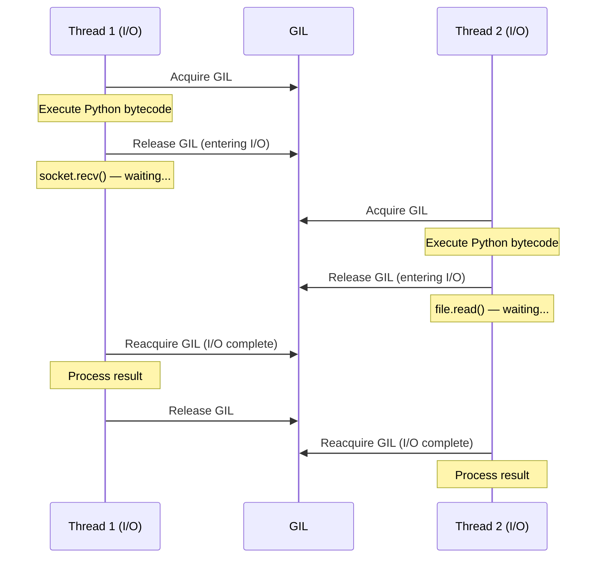
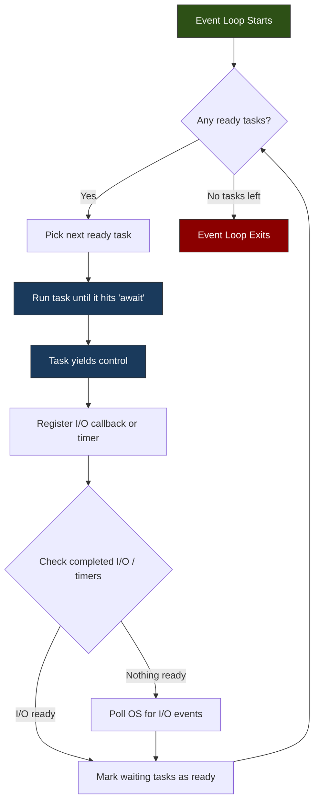

# Concurrency

> Python offers three concurrency models -- threading for I/O-bound work, multiprocessing for CPU-bound work, and asyncio for high-concurrency I/O -- and choosing the wrong one is the most common performance mistake in Python applications.

## Table of Contents
- [Core Concepts](#core-concepts)
  - [Threading](#threading)
  - [GIL (Global Interpreter Lock)](#gil-global-interpreter-lock)
  - [Multiprocessing](#multiprocessing)
  - [Asynchrony (asyncio)](#asynchrony-asyncio)
  - [Choosing the Right Model](#choosing-the-right-model)
- [Code Examples](#code-examples)
- [Common Pitfalls](#common-pitfalls)
- [Key Takeaways](#key-takeaways)
- [Exercises](#exercises)

## Core Concepts

### Threading

#### What

A **thread** is the smallest unit of execution within a process. All threads in a process share the same memory space -- they can read and write the same variables, the same heap, and the same file descriptors. Python's `threading` module provides a high-level interface for creating and managing threads.

Threading is Python's oldest concurrency model and the one most developers reach for first. It maps directly to OS-level threads (POSIX threads on Linux/macOS, Windows threads on Windows), meaning the operating system's scheduler decides when each thread runs.

#### How

You create threads in two ways: by passing a callable to `threading.Thread`, or by subclassing `Thread` and overriding `run()`. The first approach is almost always better -- it's simpler and follows composition over inheritance.

```python
import threading
import time

def download_file(url: str) -> None:
    """Simulate downloading a file."""
    print(f"[{threading.current_thread().name}] Starting download: {url}")
    time.sleep(2)  # Simulate I/O wait
    print(f"[{threading.current_thread().name}] Finished download: {url}")

# Create and start threads
urls = ["https://example.com/a", "https://example.com/b", "https://example.com/c"]
threads: list[threading.Thread] = []

for url in urls:
    t = threading.Thread(target=download_file, args=(url,), name=f"dl-{url[-1]}")
    threads.append(t)
    t.start()

# Wait for all threads to complete
for t in threads:
    t.join()

print("All downloads complete.")
```

The `start()` method spawns the thread; `join()` blocks the calling thread until the target thread finishes. Without `join()`, the main thread might exit before worker threads complete. The `daemon` flag controls whether a thread prevents the process from exiting -- daemon threads are killed when all non-daemon threads finish.

For simple parallel execution of many callables, `concurrent.futures.ThreadPoolExecutor` is a higher-level alternative that manages a pool of reusable threads:

```python
from concurrent.futures import ThreadPoolExecutor, as_completed

def fetch(url: str) -> str:
    time.sleep(1)  # Simulate network I/O
    return f"Data from {url}"

with ThreadPoolExecutor(max_workers=5) as executor:
    futures = {executor.submit(fetch, url): url for url in urls}
    for future in as_completed(futures):
        url = futures[future]
        result = future.result()
        print(f"{url} -> {result}")
```

`ThreadPoolExecutor` handles thread lifecycle, reuse, and exception propagation. Use it as your default threading interface -- raw `threading.Thread` is for when you need fine-grained control.

#### Why It Matters

Threading exists because I/O operations spend most of their time *waiting* -- waiting for network responses, disk reads, database queries. During that wait, the CPU is idle. Threading lets you overlap those waits: while one thread waits for a network response, another thread can initiate a different request.

The key insight is that threads in Python are **real OS threads**, not green threads or fibers. The OS scheduler preempts them, which means context switches happen at unpredictable times. This is both powerful (true parallelism for I/O waits) and dangerous (race conditions, data corruption). Understanding this distinction is critical before choosing threading over asyncio.

### GIL (Global Interpreter Lock)

#### What

The **Global Interpreter Lock (GIL)** is a mutex that protects access to Python objects, preventing multiple native threads from executing Python bytecodes simultaneously. At any given moment, only one thread can be executing Python code, even on a multi-core machine.

This is a CPython implementation detail, not a language specification. Jython (Python on JVM) and GraalPy have no GIL. PyPy has a GIL but with different performance characteristics. The experimental free-threaded CPython build (PEP 703, available behind a flag since 3.13) removes the GIL entirely.

#### How

The GIL works through a tick-based (pre-3.2) or time-based (3.2+) preemption mechanism. In modern CPython, a thread holds the GIL for up to 5 milliseconds (`sys.getswitchinterval()`) before the interpreter forces a release, giving other threads a chance to acquire it.

Here is the critical nuance: **the GIL is released during I/O operations**. When a thread calls `socket.recv()`, `file.read()`, or `time.sleep()`, it releases the GIL before entering the system call and reacquires it when the call returns. This is why threading helps for I/O-bound work despite the GIL.

```python
import sys

# Check the current switch interval (default: 5ms)
print(sys.getswitchinterval())  # 0.005

# You can change it (rarely needed)
sys.setswitchinterval(0.001)  # 1ms -- tighter switching, more overhead
```

The GIL acquisition order is not FIFO. A thread that just released the GIL can immediately reacquire it before a waiting thread gets a chance. CPython 3.2+ added a mechanism where a requesting thread sets a flag asking the GIL holder to release, and the holder checks this flag at the switch interval. This reduced the "convoy effect" where I/O threads starved CPU-bound threads, but the scheduling is still non-deterministic.

For C extensions, the GIL can be explicitly released using `Py_BEGIN_ALLOW_THREADS` / `Py_END_ALLOW_THREADS` macros. This is how NumPy achieves true parallelism -- heavy numerical operations run in C with the GIL released, allowing other Python threads to proceed.

#### Why It Matters

The GIL exists because of CPython's memory management strategy: **reference counting**. Every Python object has a reference count (`ob_refcnt`) that tracks how many references point to it. When the count hits zero, the object is immediately deallocated. Without the GIL, every increment/decrement of `ob_refcnt` would need its own lock -- adding enormous overhead to every single Python operation.

The GIL is not laziness; it is an engineering tradeoff. It makes single-threaded code fast (no per-object locking overhead), makes C extension integration simple (extensions do not need to worry about thread safety for Python objects), and makes reference counting deterministic. The cost is that CPU-bound Python threads cannot run in parallel.

Understanding the GIL prevents two common mistakes: (1) assuming threads are useless in Python (they are excellent for I/O), and (2) assuming threads give you CPU parallelism (they do not -- use `multiprocessing` for that). Every Python concurrency decision starts with understanding the GIL.



### Thread Safety, Locks, and Race Conditions

Before moving to multiprocessing, we need to address the elephant in the room: **shared mutable state**. Because threads share the same memory, concurrent reads and writes to the same variable can corrupt data.

#### What

A **race condition** occurs when the behavior of a program depends on the relative timing of thread execution. A **data race** is the specific case where two threads access the same memory location concurrently and at least one is a write. Python's GIL prevents data races at the bytecode level (a single bytecode instruction is atomic), but *compound operations are not atomic*.

Consider `counter += 1`. In bytecode, this is three operations: `LOAD_GLOBAL counter`, `LOAD_CONST 1`, `BINARY_ADD`, `STORE_GLOBAL counter`. The GIL can release between any of these. If two threads both load `counter = 5`, both add 1 to get 6, and both store 6 -- you lost an increment.

#### How

The `threading` module provides several synchronization primitives:

- **`Lock`** -- mutual exclusion. Only one thread can hold it at a time. The most common and most important primitive.
- **`RLock`** (reentrant lock) -- a lock that can be acquired multiple times by the same thread. Useful when a locked function calls another locked function.
- **`Semaphore`** -- allows up to N threads to access a resource concurrently. Useful for rate limiting.
- **`Event`** -- a flag that threads can wait on. One thread sets it, others block until it is set.
- **`Condition`** -- combines a lock with the ability to wait for a condition to become true.
- **`Barrier`** -- blocks until N threads have all reached the barrier point.

```python
import threading

counter = 0
lock = threading.Lock()

def increment(n: int) -> None:
    global counter
    for _ in range(n):
        with lock:  # Acquire before read-modify-write, release after
            counter += 1

threads = [threading.Thread(target=increment, args=(100_000,)) for _ in range(4)]
for t in threads:
    t.start()
for t in threads:
    t.join()

print(counter)  # Always 400000 with the lock; unpredictable without it
```

Always use `with lock:` (context manager syntax) instead of manual `lock.acquire()` / `lock.release()`. The context manager guarantees the lock is released even if an exception occurs inside the critical section.

#### Why It Matters

Thread safety bugs are among the hardest to debug because they are non-deterministic. A race condition might manifest once per million runs, only under load, only on certain hardware. The fix is disciplined: identify shared mutable state, protect it with locks, and minimize the critical section (the code between acquire and release) to reduce contention.

The best strategy, however, is to **avoid shared mutable state entirely**. Pass data between threads via `queue.Queue` (thread-safe by design), use immutable data structures, or use `concurrent.futures` which returns results without shared state. If you find yourself reaching for locks, consider whether your design could be restructured to eliminate the need.

### Multiprocessing

#### What

The `multiprocessing` module spawns **separate OS processes**, each with its own Python interpreter and its own GIL. Because each process has independent memory, CPU-bound Python code can truly run in parallel across multiple cores.

The API intentionally mirrors `threading` -- `Process` instead of `Thread`, same `start()` / `join()` pattern -- so switching between them is straightforward. But the underlying mechanics are fundamentally different: processes do not share memory by default, and data must be serialized (pickled) to pass between them.

#### How

The basic pattern is identical to threading:

```python
import multiprocessing
import math

def compute_primes(start: int, end: int) -> list[int]:
    """Find primes in range [start, end) using trial division."""
    primes: list[int] = []
    for n in range(max(start, 2), end):
        if all(n % i != 0 for i in range(2, int(math.sqrt(n)) + 1)):
            primes.append(n)
    return primes

if __name__ == "__main__":
    # Split range across 4 processes
    ranges = [(0, 250_000), (250_000, 500_000), (500_000, 750_000), (750_000, 1_000_000)]

    with multiprocessing.Pool(processes=4) as pool:
        results = pool.starmap(compute_primes, ranges)

    total_primes = sum(len(r) for r in results)
    print(f"Found {total_primes} primes below 1,000,000")
```

The `if __name__ == "__main__":` guard is **mandatory** on Windows and macOS (with the default `spawn` start method). Without it, each spawned process re-imports the module and tries to spawn more processes, creating an infinite fork bomb.

`multiprocessing.Pool` is the classic interface, but `concurrent.futures.ProcessPoolExecutor` is the modern alternative with a cleaner API:

```python
from concurrent.futures import ProcessPoolExecutor

with ProcessPoolExecutor(max_workers=4) as executor:
    futures = [executor.submit(compute_primes, s, e) for s, e in ranges]
    results = [f.result() for f in futures]
```

**Inter-process communication** uses three main mechanisms:
- **`Queue`** -- thread- and process-safe FIFO queue. Data is pickled/unpickled automatically.
- **`Pipe`** -- two-way communication channel between exactly two processes. Faster than Queue for point-to-point.
- **Shared memory** (`multiprocessing.Value`, `multiprocessing.Array`, `multiprocessing.shared_memory`) -- for when you need shared state without serialization overhead.

```python
import multiprocessing

def worker(q: multiprocessing.Queue, n: int) -> None:
    """Compute and put result in queue."""
    result = sum(i * i for i in range(n))
    q.put((n, result))

if __name__ == "__main__":
    q: multiprocessing.Queue = multiprocessing.Queue()
    processes = [
        multiprocessing.Process(target=worker, args=(q, 10**6)),
        multiprocessing.Process(target=worker, args=(q, 2 * 10**6)),
    ]

    for p in processes:
        p.start()
    for p in processes:
        p.join()

    while not q.empty():
        n, result = q.get()
        print(f"Sum of squares up to {n}: {result}")
```

**Start methods** control how child processes are created:
- `spawn` (default on macOS/Windows): starts a fresh Python interpreter. Safe but slow because it re-imports modules.
- `fork` (default on Linux): copies the parent process via `os.fork()`. Fast but can cause issues with threads, locks, and certain C libraries.
- `forkserver`: a hybrid -- a server process is forked once, then subsequent processes are spawned from it.

```python
multiprocessing.set_start_method("spawn")  # Call once, at the top of your program
```

#### Why It Matters

Multiprocessing is the only way to achieve true CPU parallelism in standard CPython. The GIL makes threading useless for CPU-bound work -- but multiprocessing sidesteps the GIL entirely because each process has its own interpreter with its own GIL.

The tradeoff is cost. Process creation is expensive (hundreds of milliseconds on some systems), inter-process communication requires serialization (pickling), and shared state is awkward. You would not use multiprocessing to parallelize a function that takes 10ms -- the overhead would dwarf the speedup. It shines for heavy computation: data processing, image manipulation, scientific computing, anything where each unit of work takes seconds or more.

A good mental model: threads are cheap and share everything (great for waiting on I/O), processes are expensive and share nothing (great for CPU computation). The right choice depends entirely on where your program spends its time.

### Asynchrony (asyncio)

#### What

`asyncio` is Python's built-in framework for writing **cooperative concurrent** code using `async` / `await` syntax. Unlike threading (which uses OS-level preemption) or multiprocessing (which uses separate processes), asyncio runs everything in a **single thread** with a central **event loop** that coordinates task switching.

The key word is *cooperative*: tasks voluntarily yield control when they hit an `await` expression. The event loop then picks another ready task to run. No OS context switches, no thread-safety issues, no GIL contention. This makes asyncio extremely efficient for I/O-bound workloads with many concurrent connections -- web servers, API clients, database query dispatchers.

#### How

The fundamental building blocks are:

1. **Coroutines** -- functions defined with `async def`. Calling them returns a coroutine object (not the result). They must be `await`ed or scheduled.
2. **`await`** -- yields control to the event loop until the awaited operation completes. Only valid inside `async def`.
3. **Event loop** -- the scheduler that runs coroutines. `asyncio.run()` creates a loop, runs a coroutine to completion, and cleans up.
4. **Tasks** -- wrappers that schedule coroutines to run concurrently within the event loop. Created with `asyncio.create_task()`.

```python
import asyncio

async def fetch_data(name: str, delay: float) -> str:
    """Simulate an async I/O operation."""
    print(f"[{name}] Starting fetch...")
    await asyncio.sleep(delay)  # Yields control to event loop
    print(f"[{name}] Fetch complete.")
    return f"Data from {name}"

async def main() -> None:
    # These run CONCURRENTLY, not sequentially
    results = await asyncio.gather(
        fetch_data("API-1", 2.0),
        fetch_data("API-2", 1.5),
        fetch_data("API-3", 1.0),
    )
    for r in results:
        print(r)

asyncio.run(main())
# Total time: ~2 seconds (the max), not 4.5 seconds (the sum)
```

**`asyncio.gather()`** runs multiple coroutines concurrently and returns their results in order. It is the async equivalent of "start all, wait for all."

**`asyncio.create_task()`** schedules a coroutine to run in the background. This is useful when you want to fire off a task and continue doing other work:

```python
async def background_logger(message: str) -> None:
    await asyncio.sleep(1)
    print(f"LOG: {message}")

async def main() -> None:
    # Schedule the logger but don't wait for it yet
    task = asyncio.create_task(background_logger("operation started"))

    # Do other work while the logger runs in the background
    result = await fetch_data("main-api", 0.5)
    print(result)

    # Now wait for the background task to complete
    await task

asyncio.run(main())
```

**Semaphores** limit concurrency -- essential for rate limiting or avoiding resource exhaustion:

```python
import asyncio

async def fetch_with_limit(
    sem: asyncio.Semaphore,
    url: str,
    session_id: int,
) -> str:
    async with sem:  # Only N coroutines can enter this block simultaneously
        print(f"[{session_id}] Fetching {url}")
        await asyncio.sleep(1)  # Simulate I/O
        return f"Result from {url}"

async def main() -> None:
    sem = asyncio.Semaphore(3)  # Max 3 concurrent fetches
    urls = [f"https://api.example.com/item/{i}" for i in range(10)]

    tasks = [
        asyncio.create_task(fetch_with_limit(sem, url, i))
        for i, url in enumerate(urls)
    ]
    results = await asyncio.gather(*tasks)
    for r in results:
        print(r)

asyncio.run(main())
```

**Async context managers** (`async with`) work with resources that need async setup/teardown. The most common example is HTTP sessions:

```python
import asyncio
from contextlib import asynccontextmanager
from collections.abc import AsyncIterator

@asynccontextmanager
async def managed_resource(name: str) -> AsyncIterator[str]:
    """Async context manager for a resource with async setup/teardown."""
    print(f"Acquiring {name}...")
    await asyncio.sleep(0.1)  # Simulate async setup
    try:
        yield f"resource-{name}"
    finally:
        print(f"Releasing {name}...")
        await asyncio.sleep(0.1)  # Simulate async cleanup

async def main() -> None:
    async with managed_resource("db-connection") as conn:
        print(f"Using {conn}")
        await asyncio.sleep(0.5)

asyncio.run(main())
```

**Async iterators** (`async for`) let you consume data from async sources incrementally:

```python
import asyncio
from collections.abc import AsyncIterator

async def async_range(start: int, stop: int, delay: float) -> AsyncIterator[int]:
    """Yield integers with an async delay between each."""
    for i in range(start, stop):
        await asyncio.sleep(delay)
        yield i

async def main() -> None:
    async for value in async_range(0, 5, 0.5):
        print(f"Got: {value}")

asyncio.run(main())
```

**`asyncio.wait_for()`** adds timeout support to any awaitable:

```python
async def slow_operation() -> str:
    await asyncio.sleep(10)
    return "done"

async def main() -> None:
    try:
        result = await asyncio.wait_for(slow_operation(), timeout=2.0)
    except asyncio.TimeoutError:
        print("Operation timed out!")

asyncio.run(main())
```

**`asyncio.TaskGroup`** (Python 3.11+) is the modern replacement for `gather()` with better error handling. If any task in the group raises an exception, all other tasks are cancelled:

```python
import asyncio

async def might_fail(name: str, should_fail: bool) -> str:
    await asyncio.sleep(1)
    if should_fail:
        raise ValueError(f"{name} failed!")
    return f"{name} succeeded"

async def main() -> None:
    try:
        async with asyncio.TaskGroup() as tg:
            task1 = tg.create_task(might_fail("A", should_fail=False))
            task2 = tg.create_task(might_fail("B", should_fail=True))
            task3 = tg.create_task(might_fail("C", should_fail=False))
    except* ValueError as eg:
        # ExceptionGroup handling (PEP 654)
        for exc in eg.exceptions:
            print(f"Caught: {exc}")

asyncio.run(main())
```

Here is how the event loop orchestrates cooperative multitasking:



The event loop is built on the OS's I/O multiplexing mechanism: `epoll` on Linux, `kqueue` on macOS, `IOCP` on Windows. These system calls let a single thread monitor thousands of file descriptors (sockets, pipes, files) simultaneously. When any of them become ready, the OS notifies the event loop, which then resumes the corresponding coroutine. This is why asyncio can handle 10,000+ concurrent connections with minimal overhead -- there is no thread per connection, just one thread watching all the sockets.

#### Why It Matters

Asyncio solves a problem that threading cannot: **high-concurrency I/O**. If you need 10,000 concurrent HTTP connections, you cannot create 10,000 OS threads -- the memory overhead alone (each thread gets a stack, typically 1-8 MB) would exhaust your system. Asyncio handles this in a single thread with kilobytes of overhead per coroutine.

This is the model behind FastAPI, aiohttp, and other modern Python web frameworks. When a FastAPI endpoint does `await db.query(...)`, the event loop serves other requests while waiting for the database. This is not just a performance optimization -- it is the architectural foundation of high-throughput Python services.

The tradeoff: asyncio is cooperative, so a single CPU-intensive operation blocks the entire event loop. If one coroutine does heavy computation without `await`-ing, all other coroutines starve. For CPU-bound work inside an async application, offload to a thread pool (`asyncio.to_thread()`) or process pool.

```python
import asyncio

def cpu_heavy_work(n: int) -> int:
    """CPU-bound: runs in a thread to avoid blocking the event loop."""
    return sum(i * i for i in range(n))

async def main() -> None:
    # Offload CPU work to a thread (releases the event loop)
    result = await asyncio.to_thread(cpu_heavy_work, 10_000_000)
    print(f"Result: {result}")

asyncio.run(main())
```

### Choosing the Right Model

#### What

Python's three concurrency models are not interchangeable. Each targets a specific workload pattern, and using the wrong one results in no speedup (or worse, a slowdown). The decision is not subjective or situational -- it follows directly from whether your bottleneck is I/O wait time, CPU computation time, or connection count.

#### How

The decision process is straightforward:

1. **Is the bottleneck I/O or CPU?**
   - I/O-bound: your program spends most of its time *waiting* (network, disk, database).
   - CPU-bound: your program spends most of its time *computing* (math, parsing, image processing).

2. **If I/O-bound, how many concurrent connections do you need?**
   - Moderate (tens): `threading` or `ThreadPoolExecutor` is simplest.
   - High (hundreds to thousands): `asyncio` is the right choice.

3. **If CPU-bound, use `multiprocessing`.**
   - Threading will not help (GIL prevents parallel execution of Python bytecode).
   - asyncio will not help (it is single-threaded).
   - Only `multiprocessing` gives true CPU parallelism.

4. **If you need both I/O and CPU concurrency**, combine models:
   - asyncio event loop for I/O coordination + `asyncio.to_thread()` for blocking I/O + `ProcessPoolExecutor` for CPU work.


Here is a concrete comparison. The same workload -- fetching URLs -- implemented with each model:

| Model | Threads | Processes | Memory | Best For |
|-------|---------|-----------|--------|----------|
| `threading` | N OS threads | 1 process | ~8 MB/thread stack | Moderate I/O concurrency |
| `multiprocessing` | 1 thread/process | N processes | Full process per worker | CPU-heavy computation |
| `asyncio` | 1 thread | 1 process | ~KB per coroutine | High I/O concurrency |

#### Why It Matters

The wrong concurrency model is not just suboptimal -- it can be actively harmful. Threading for CPU work wastes resources fighting the GIL. Multiprocessing for lightweight I/O adds unnecessary serialization overhead and memory consumption. Asyncio for CPU work blocks the event loop and makes your entire application unresponsive.

The decision is also architectural. Once you choose asyncio, your entire call stack must be async -- you cannot `await` inside a regular function. Libraries must be async-compatible (`aiohttp` instead of `requests`, `asyncpg` instead of `psycopg2`). This "async all the way down" requirement means the choice affects your project's dependency graph, not just a single function. Make the choice early and deliberately.

## Code Examples

### Example 1: Concurrent HTTP Requests with asyncio

This is the canonical asyncio use case: fetching multiple URLs concurrently. In production you would use `aiohttp`, but this example uses a simulated async fetch to remain self-contained and dependency-free.

```python
"""Concurrent HTTP fetching with asyncio.

Demonstrates: gather, semaphore for rate limiting, error handling,
and timing to show concurrency benefits.
"""
import asyncio
import time
from dataclasses import dataclass

@dataclass(frozen=True)
class FetchResult:
    """Immutable container for a fetch result."""
    url: str
    status: int
    body: str
    elapsed: float

async def fetch_url(url: str, delay: float = 1.0) -> FetchResult:
    """Simulate an async HTTP GET request.

    In production, replace with aiohttp:
        async with session.get(url) as response:
            body = await response.text()
    """
    start = time.monotonic()
    await asyncio.sleep(delay)  # Simulates network I/O

    # Simulate occasional failures
    if "error" in url:
        raise ConnectionError(f"Failed to fetch {url}")

    elapsed = time.monotonic() - start
    return FetchResult(
        url=url,
        status=200,
        body=f"<html>Content from {url}</html>",
        elapsed=elapsed,
    )

async def fetch_with_retry(
    url: str,
    sem: asyncio.Semaphore,
    max_retries: int = 3,
) -> FetchResult | None:
    """Fetch a URL with rate limiting and retry logic."""
    async with sem:  # Limit concurrent requests
        for attempt in range(1, max_retries + 1):
            try:
                return await asyncio.wait_for(
                    fetch_url(url),
                    timeout=5.0,
                )
            except (ConnectionError, asyncio.TimeoutError) as e:
                if attempt == max_retries:
                    print(f"[FAIL] {url} after {max_retries} attempts: {e}")
                    return None
                wait = 2 ** attempt * 0.1  # Exponential backoff
                print(f"[RETRY] {url} attempt {attempt}/{max_retries}, "
                      f"waiting {wait:.1f}s")
                await asyncio.sleep(wait)
    return None  # Unreachable, but satisfies type checker

async def main() -> None:
    urls = [
        "https://api.example.com/users",
        "https://api.example.com/posts",
        "https://api.example.com/comments",
        "https://api.example.com/albums",
        "https://api.example.com/photos",
        "https://api.example.com/todos",
    ]

    sem = asyncio.Semaphore(3)  # Max 3 concurrent requests
    start = time.monotonic()

    # Using TaskGroup (Python 3.11+) for structured concurrency
    results: list[FetchResult | None] = []
    async with asyncio.TaskGroup() as tg:
        tasks = [
            tg.create_task(fetch_with_retry(url, sem))
            for url in urls
        ]

    results = [t.result() for t in tasks]
    elapsed = time.monotonic() - start

    # Report results
    successful = [r for r in results if r is not None]
    print(f"\nFetched {len(successful)}/{len(urls)} URLs in {elapsed:.2f}s")
    for r in successful:
        print(f"  {r.url} -> {r.status} ({r.elapsed:.2f}s)")

if __name__ == "__main__":
    asyncio.run(main())
```

### Example 2: Parallel CPU-Bound Data Processing with multiprocessing

This example processes a large dataset by splitting it across multiple CPU cores. Each worker computes independently, and results are collected at the end.

```python
"""Parallel data processing with multiprocessing.

Demonstrates: ProcessPoolExecutor, chunked workload distribution,
and comparison with sequential execution.
"""
import math
import time
from concurrent.futures import ProcessPoolExecutor
from collections.abc import Sequence

def is_prime(n: int) -> bool:
    """Check if n is prime using trial division."""
    if n < 2:
        return False
    if n < 4:
        return True
    if n % 2 == 0 or n % 3 == 0:
        return False
    # Check factors of the form 6k +/- 1
    i = 5
    while i * i <= n:
        if n % i == 0 or n % (i + 2) == 0:
            return False
        i += 6
    return True

def count_primes_in_range(bounds: tuple[int, int]) -> int:
    """Count primes in [start, end). Accepts a tuple for easy mapping."""
    start, end = bounds
    return sum(1 for n in range(start, end) if is_prime(n))

def chunk_range(start: int, end: int, num_chunks: int) -> list[tuple[int, int]]:
    """Split [start, end) into num_chunks roughly equal sub-ranges."""
    chunk_size = math.ceil((end - start) / num_chunks)
    chunks: list[tuple[int, int]] = []
    for i in range(num_chunks):
        chunk_start = start + i * chunk_size
        chunk_end = min(chunk_start + chunk_size, end)
        if chunk_start < end:
            chunks.append((chunk_start, chunk_end))
    return chunks

def benchmark_sequential(start: int, end: int) -> tuple[int, float]:
    """Run the computation sequentially and return (count, elapsed)."""
    t0 = time.monotonic()
    count = count_primes_in_range((start, end))
    elapsed = time.monotonic() - t0
    return count, elapsed

def benchmark_parallel(
    start: int,
    end: int,
    num_workers: int,
) -> tuple[int, float]:
    """Run the computation in parallel and return (count, elapsed)."""
    chunks = chunk_range(start, end, num_workers)
    t0 = time.monotonic()

    with ProcessPoolExecutor(max_workers=num_workers) as executor:
        counts = list(executor.map(count_primes_in_range, chunks))

    elapsed = time.monotonic() - t0
    return sum(counts), elapsed

def main() -> None:
    start, end = 2, 500_000
    num_workers = 4

    print(f"Counting primes in [{start:,}, {end:,})...\n")

    # Sequential
    seq_count, seq_time = benchmark_sequential(start, end)
    print(f"Sequential: {seq_count:,} primes in {seq_time:.2f}s")

    # Parallel
    par_count, par_time = benchmark_parallel(start, end, num_workers)
    print(f"Parallel ({num_workers} workers): {par_count:,} primes in {par_time:.2f}s")

    speedup = seq_time / par_time if par_time > 0 else float("inf")
    print(f"\nSpeedup: {speedup:.2f}x")

    assert seq_count == par_count, "Results must match!"

if __name__ == "__main__":
    main()
```

### Example 3: I/O-Bound File Operations with Threading

This example processes multiple files concurrently using a thread pool -- the classic use case where threading shines.

```python
"""Concurrent file processing with threading.

Demonstrates: ThreadPoolExecutor, thread-safe result collection,
and I/O-bound parallelism.
"""
import time
import hashlib
from pathlib import Path
from concurrent.futures import ThreadPoolExecutor, as_completed
from dataclasses import dataclass
from tempfile import TemporaryDirectory

@dataclass(frozen=True)
class FileDigest:
    """Result of hashing a single file."""
    path: Path
    size: int
    sha256: str
    elapsed: float

def hash_file(filepath: Path) -> FileDigest:
    """Compute SHA-256 hash of a file. I/O-bound: reads from disk."""
    start = time.monotonic()
    h = hashlib.sha256()
    size = 0

    with filepath.open("rb") as f:
        while chunk := f.read(8192):  # Walrus operator for read loop
            h.update(chunk)
            size += len(chunk)

    elapsed = time.monotonic() - start
    return FileDigest(
        path=filepath,
        size=size,
        sha256=h.hexdigest(),
        elapsed=elapsed,
    )

def create_test_files(directory: Path, count: int, size_kb: int) -> list[Path]:
    """Create test files for the demo."""
    files: list[Path] = []
    for i in range(count):
        filepath = directory / f"file_{i:03d}.bin"
        filepath.write_bytes(bytes(range(256)) * (size_kb * 4))  # ~size_kb KB
        files.append(filepath)
    return files

def process_files_sequential(files: list[Path]) -> list[FileDigest]:
    """Hash files one at a time."""
    return [hash_file(f) for f in files]

def process_files_threaded(
    files: list[Path],
    max_workers: int = 4,
) -> list[FileDigest]:
    """Hash files concurrently using threads."""
    results: list[FileDigest] = []

    with ThreadPoolExecutor(max_workers=max_workers) as executor:
        # Submit all tasks and track which future maps to which file
        future_to_path = {
            executor.submit(hash_file, f): f for f in files
        }

        # Process results as they complete (not in submission order)
        for future in as_completed(future_to_path):
            filepath = future_to_path[future]
            try:
                result = future.result()
                results.append(result)
            except OSError as e:
                print(f"Error processing {filepath}: {e}")

    return results

def main() -> None:
    with TemporaryDirectory() as tmpdir:
        tmp_path = Path(tmpdir)
        files = create_test_files(tmp_path, count=20, size_kb=512)
        print(f"Created {len(files)} test files ({512} KB each)\n")

        # Sequential
        t0 = time.monotonic()
        seq_results = process_files_sequential(files)
        seq_time = time.monotonic() - t0
        print(f"Sequential: {seq_time:.3f}s")

        # Threaded
        t0 = time.monotonic()
        thr_results = process_files_threaded(files, max_workers=4)
        thr_time = time.monotonic() - t0
        print(f"Threaded (4 workers): {thr_time:.3f}s")

        speedup = seq_time / thr_time if thr_time > 0 else float("inf")
        print(f"Speedup: {speedup:.2f}x\n")

        # Verify correctness -- all hashes should match
        seq_hashes = {r.path.name: r.sha256 for r in seq_results}
        thr_hashes = {r.path.name: r.sha256 for r in thr_results}
        assert seq_hashes == thr_hashes, "Hash mismatch!"
        print("All hashes match between sequential and threaded runs.")

if __name__ == "__main__":
    main()
```

### Example 4: Combining asyncio with ProcessPoolExecutor

Real applications often need both I/O concurrency and CPU parallelism. This example shows the hybrid pattern: asyncio handles network I/O while offloading CPU work to a process pool.

```python
"""Hybrid concurrency: asyncio for I/O + ProcessPoolExecutor for CPU.

Pattern used in production web services where endpoints need to
fetch data (I/O) and then process it (CPU).
"""
import asyncio
import math
import time
from concurrent.futures import ProcessPoolExecutor
from dataclasses import dataclass

# --- CPU-bound work (runs in a separate process) ---

def heavy_computation(data: list[int]) -> dict[str, float]:
    """Simulate CPU-heavy data processing."""
    mean = sum(data) / len(data)
    variance = sum((x - mean) ** 2 for x in data) / len(data)
    std_dev = math.sqrt(variance)
    primes = sum(1 for x in data if x > 1 and all(x % i for i in range(2, int(math.sqrt(x)) + 1)))
    return {
        "mean": mean,
        "std_dev": std_dev,
        "prime_count": primes,
        "total": len(data),
    }

# --- I/O-bound work (runs in the event loop) ---

@dataclass(frozen=True)
class DataSet:
    """Simulated fetched dataset."""
    name: str
    values: list[int]

async def fetch_dataset(name: str) -> DataSet:
    """Simulate fetching a dataset from a remote API."""
    await asyncio.sleep(1.0)  # Simulate network latency
    # Generate deterministic "fetched" data
    values = list(range(1, 50_001))
    return DataSet(name=name, values=values)

# --- Hybrid coordination ---

async def fetch_and_process(
    name: str,
    executor: ProcessPoolExecutor,
    loop: asyncio.AbstractEventLoop,
) -> tuple[str, dict[str, float]]:
    """Fetch data (async I/O) then process it (CPU in process pool)."""
    # Step 1: Async I/O -- fetch the data
    dataset = await fetch_dataset(name)

    # Step 2: CPU work -- offload to process pool
    # run_in_executor bridges asyncio and concurrent.futures
    stats = await loop.run_in_executor(
        executor,
        heavy_computation,
        dataset.values,
    )

    return name, stats

async def main() -> None:
    dataset_names = ["users", "transactions", "products", "analytics"]

    start = time.monotonic()
    loop = asyncio.get_running_loop()

    with ProcessPoolExecutor(max_workers=4) as executor:
        tasks = [
            fetch_and_process(name, executor, loop)
            for name in dataset_names
        ]
        results = await asyncio.gather(*tasks)

    elapsed = time.monotonic() - start

    print(f"Processed {len(results)} datasets in {elapsed:.2f}s\n")
    for name, stats in results:
        print(f"  {name}: mean={stats['mean']:.1f}, "
              f"std={stats['std_dev']:.1f}, "
              f"primes={stats['prime_count']}")

if __name__ == "__main__":
    asyncio.run(main())
```

### Example 5: Thread-Safe Producer-Consumer with queue.Queue

This pattern decouples producers and consumers using a thread-safe queue, avoiding shared mutable state entirely.

```python
"""Producer-consumer pattern using queue.Queue.

Demonstrates: thread-safe data passing without locks,
poison pill shutdown pattern, and graceful termination.
"""
import queue
import threading
import time
import random

# Sentinel value to signal shutdown
_SHUTDOWN = object()

def producer(
    q: queue.Queue[str | object],
    name: str,
    item_count: int,
) -> None:
    """Generate work items and place them in the queue."""
    for i in range(item_count):
        item = f"{name}-item-{i:03d}"
        time.sleep(random.uniform(0.01, 0.05))  # Simulate data generation
        q.put(item)
        print(f"[{name}] Produced: {item}")
    print(f"[{name}] Done producing.")

def consumer(
    q: queue.Queue[str | object],
    name: str,
) -> None:
    """Process work items from the queue until shutdown signal."""
    processed = 0
    while True:
        item = q.get()
        if item is _SHUTDOWN:
            q.task_done()
            break
        # Process the item
        time.sleep(random.uniform(0.02, 0.08))  # Simulate processing
        processed += 1
        print(f"  [{name}] Consumed: {item}")
        q.task_done()

    print(f"  [{name}] Shutting down. Processed {processed} items.")

def main() -> None:
    work_queue: queue.Queue[str | object] = queue.Queue(maxsize=10)

    num_producers = 3
    num_consumers = 2
    items_per_producer = 5

    # Start consumers first (they block waiting for items)
    consumers = [
        threading.Thread(target=consumer, args=(work_queue, f"consumer-{i}"), daemon=True)
        for i in range(num_consumers)
    ]
    for c in consumers:
        c.start()

    # Start producers
    producers = [
        threading.Thread(target=producer, args=(work_queue, f"producer-{i}", items_per_producer))
        for i in range(num_producers)
    ]
    for p in producers:
        p.start()

    # Wait for all producers to finish
    for p in producers:
        p.join()

    # Send shutdown signals -- one per consumer
    for _ in range(num_consumers):
        work_queue.put(_SHUTDOWN)

    # Wait for all items to be processed
    work_queue.join()

    # Wait for consumer threads to exit
    for c in consumers:
        c.join()

    print("\nAll work complete.")

if __name__ == "__main__":
    main()
```

## Common Pitfalls

### Pitfall 1: Using threading for CPU-bound work

The GIL prevents threads from executing Python bytecode in parallel. CPU-bound threading often runs *slower* than sequential code due to GIL contention and context-switch overhead.

```python
# BAD — threading for CPU-bound computation (slower than sequential)
import threading

def cpu_work(n: int) -> int:
    return sum(i * i for i in range(n))

threads = [
    threading.Thread(target=cpu_work, args=(10_000_000,))
    for _ in range(4)
]
for t in threads:
    t.start()
for t in threads:
    t.join()
# This is SLOWER than calling cpu_work(10_000_000) four times sequentially
# because threads fight over the GIL.

# GOOD — multiprocessing for CPU-bound computation (true parallelism)
from concurrent.futures import ProcessPoolExecutor

def cpu_work(n: int) -> int:
    return sum(i * i for i in range(n))

if __name__ == "__main__":
    with ProcessPoolExecutor(max_workers=4) as executor:
        results = list(executor.map(cpu_work, [10_000_000] * 4))
    # Each process has its own GIL — true parallel execution.
```

### Pitfall 2: Blocking the asyncio event loop with synchronous code

Any synchronous call inside a coroutine blocks the *entire* event loop. All other coroutines freeze until the blocking call returns.

```python
# BAD — blocking call inside a coroutine freezes the event loop
import asyncio
import time

async def fetch_data() -> str:
    time.sleep(2)  # BLOCKS the event loop! All other coroutines stall.
    return "data"

async def main() -> None:
    # These run SEQUENTIALLY (6 seconds total), not concurrently
    results = await asyncio.gather(
        fetch_data(),
        fetch_data(),
        fetch_data(),
    )

# GOOD — use async equivalents or offload to a thread
import asyncio

async def fetch_data_async() -> str:
    await asyncio.sleep(2)  # Yields control — other coroutines can run
    return "data"

def blocking_io() -> str:
    import time
    time.sleep(2)  # This IS blocking, but runs in a thread
    return "data"

async def main() -> None:
    # Option 1: Use async APIs
    results = await asyncio.gather(
        fetch_data_async(),
        fetch_data_async(),
        fetch_data_async(),
    )
    # 2 seconds total

    # Option 2: Offload blocking code to a thread
    result = await asyncio.to_thread(blocking_io)
```

### Pitfall 3: Forgetting `if __name__ == "__main__":` with multiprocessing

On macOS and Windows (which use `spawn` start method), the child process re-imports the module. Without the guard, this creates infinite process spawning.

```python
# BAD — missing guard causes infinite process spawning on macOS/Windows
import multiprocessing

def worker(x: int) -> int:
    return x * x

pool = multiprocessing.Pool(4)  # Each child process re-imports this module
results = pool.map(worker, range(10))  # and tries to create another Pool!
# RuntimeError: An attempt has been made to start a new process before
# the current process has finished its bootstrapping phase.

# GOOD — guard all multiprocessing code behind __name__ check
import multiprocessing

def worker(x: int) -> int:
    return x * x

if __name__ == "__main__":
    # Only the main process executes this block.
    # Child processes import the module but skip this.
    with multiprocessing.Pool(4) as pool:
        results = pool.map(worker, range(10))
    print(results)
```

### Pitfall 4: Creating tasks without awaiting them (fire-and-forget leaks)

If you create a task with `asyncio.create_task()` but never `await` it or store a reference, Python may garbage-collect it before it finishes. Exceptions are silently lost.

```python
# BAD — task may be garbage collected before completion; exceptions are lost
import asyncio

async def important_cleanup(resource_id: str) -> None:
    await asyncio.sleep(1)
    print(f"Cleaned up {resource_id}")
    # If this raises, the exception is silently swallowed

async def main() -> None:
    asyncio.create_task(important_cleanup("db-conn-1"))
    # No reference kept! The task might be GC'd.
    # Python 3.12+ emits a warning: "Task was destroyed but it is pending!"

# GOOD — always keep a reference and await tasks before exiting
import asyncio

async def important_cleanup(resource_id: str) -> None:
    await asyncio.sleep(1)
    print(f"Cleaned up {resource_id}")

async def main() -> None:
    # Option 1: Keep reference and await later
    task = asyncio.create_task(important_cleanup("db-conn-1"))
    # ... do other work ...
    await task  # Ensures completion and surfaces exceptions

    # Option 2: Use TaskGroup for structured concurrency (Python 3.11+)
    async with asyncio.TaskGroup() as tg:
        tg.create_task(important_cleanup("db-conn-2"))
        tg.create_task(important_cleanup("db-conn-3"))
    # All tasks are awaited when the context manager exits
```

### Pitfall 5: Race conditions from unprotected shared state

The GIL makes single bytecode operations atomic, but compound operations (read-modify-write) are not atomic. Two threads can interleave between the read and write, causing lost updates.

```python
# BAD — compound operation without lock causes lost updates
import threading

counter = 0

def increment(n: int) -> None:
    global counter
    for _ in range(n):
        counter += 1  # This is LOAD, ADD, STORE — not atomic!
        # Thread can be preempted between LOAD and STORE.

threads = [threading.Thread(target=increment, args=(100_000,)) for _ in range(4)]
for t in threads:
    t.start()
for t in threads:
    t.join()
print(counter)  # Expected: 400000, Actual: some value < 400000

# GOOD — protect shared state with a lock, or avoid shared state entirely
import threading

# Option 1: Lock
counter = 0
lock = threading.Lock()

def increment_safe(n: int) -> None:
    global counter
    for _ in range(n):
        with lock:
            counter += 1

# Option 2: Avoid shared state — each thread returns its count
def count_increments(n: int) -> int:
    """Each thread computes independently — no shared state."""
    return n

from concurrent.futures import ThreadPoolExecutor

with ThreadPoolExecutor(max_workers=4) as executor:
    results = list(executor.map(count_increments, [100_000] * 4))
total = sum(results)  # Aggregation in the main thread — no races
print(total)  # Always 400000
```

## Key Takeaways

- **The GIL prevents CPU parallelism in threads, not I/O parallelism.** Threads are excellent for I/O-bound work (network, disk, database) because the GIL is released during system calls. For CPU-bound work, use `multiprocessing`.

- **asyncio handles thousands of concurrent I/O operations in a single thread.** Coroutines yield control at `await` points, and the event loop schedules the next ready task. This is orders of magnitude more memory-efficient than one-thread-per-connection.

- **Never block the event loop.** Any synchronous call inside an `async def` freezes all coroutines. Use `await asyncio.to_thread()` for unavoidable blocking calls, or use native async libraries.

- **Avoid shared mutable state.** The best concurrency code has no locks because it has no shared state. Use `queue.Queue` for thread communication, return values from `concurrent.futures`, or pass messages between processes.

- **Choose your model based on the bottleneck, not preference.** I/O-bound with moderate concurrency: threading. I/O-bound with high concurrency: asyncio. CPU-bound: multiprocessing. This is not a style choice -- it is an engineering decision with measurable consequences.

## Exercises

1. **Thread Pool File Downloader**: Write a program that simulates downloading 20 files from URLs using `ThreadPoolExecutor`. Each "download" should sleep for a random duration between 0.5 and 2.0 seconds. Print the total elapsed time and compare it to the sequential time. What is the theoretical maximum speedup with `max_workers=5`?

2. **Async Rate-Limited API Client**: Write an async program that "calls" an API endpoint 50 times, using an `asyncio.Semaphore` to limit concurrency to 5 simultaneous requests. Each request takes 0.5 seconds. Track and print: total elapsed time, average response time, and the number of requests in-flight at peak. How does changing the semaphore value affect total time?

3. **Multiprocessing Matrix Multiplication**: Given two large matrices (e.g., 1000x1000), split the row computation across N processes using `ProcessPoolExecutor`. Compare the wall-clock time of the parallel version against the sequential version for different matrix sizes. At what size does the parallel version become faster? Why?

4. **Race Condition Demonstration**: Write a program that intentionally creates a race condition with threads (incrementing a shared counter without a lock), then fix it three different ways: (a) using `threading.Lock`, (b) using `queue.Queue`, and (c) using `concurrent.futures` with result aggregation. Run each version 10 times and compare the outputs.

5. **Hybrid Async Pipeline**: Build a data pipeline using asyncio that (a) fetches 10 "records" concurrently from a simulated async data source, (b) offloads CPU-intensive processing of each record to a `ProcessPoolExecutor` via `loop.run_in_executor()`, and (c) writes results to simulated async storage. Measure and print the time spent in each phase. What happens if you increase the number of records to 1000?

---
up:: [Schedule](../../Schedule.md)
#type/learning #source/self-study #status/seed
