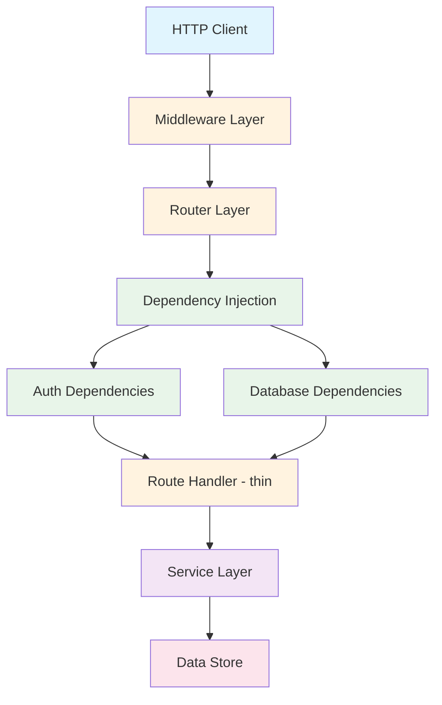
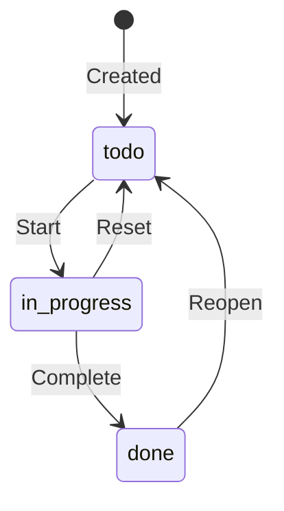

# Capstone Project: Task Manager API

> Build a complete, production-quality REST API from scratch that exercises every Python skill from weeks 1-10 — data structures, OOP, type hints, testing, async, error handling, and FastAPI.

## Table of Contents
- [Core Concepts](#core-concepts)
  - [Project Overview](#project-overview)
  - [Why a Task Manager](#why-a-task-manager)
  - [Architecture](#architecture)
  - [API Specification](#api-specification)
  - [Data Models](#data-models)
  - [Project Structure](#project-structure)
  - [Requirements by Week](#requirements-by-week)
  - [Acceptance Criteria](#acceptance-criteria)
  - [Stretch Goals](#stretch-goals)
- [Code Examples](#code-examples)
- [Common Pitfalls](#common-pitfalls)
- [Key Takeaways](#key-takeaways)
- [Exercises](#exercises)

## Core Concepts

### Project Overview

#### What

You will build a **Task Manager API** — a RESTful backend service that allows users to create, organize, and manage tasks within projects. The API supports task CRUD operations, project grouping, filtering and pagination, task status transitions, and basic authentication. It is not a tutorial with step-by-step instructions — it is a specification that defines *what* to build, and you decide *how* to implement it.

#### How

The project is structured as a series of milestones, each building on the previous one. You start with a minimal working API (one resource, in-memory storage) and progressively add features: more resources, relationships, validation, authentication, error handling, middleware, and tests. Each milestone produces a working, testable application.

**Milestones:**

| Milestone | Deliverable | Skills Tested |
|-----------|-------------|---------------|
| M1: Foundation | CRUD for tasks, in-memory storage, Pydantic models | FastAPI basics, Pydantic, type hints |
| M2: Projects | Add projects resource, task-project relationship | Data structures, OOP, relationships |
| M3: Filtering & Pagination | Query parameters, sorting, pagination | Functions, decorators (dependency injection) |
| M4: Error Handling | Custom exceptions, exception handlers, consistent errors | Exception handling, middleware |
| M5: Authentication | Token-based auth, protected routes, user ownership | Dependency injection, security |
| M6: Async Operations | Async data store, background task simulation | asyncio, async/await |
| M7: Testing | Full pytest suite with fixtures, mocks, parametrize | pytest, mocking, test organization |

#### Why It Matters

Reading about FastAPI is not the same as building with it. The capstone forces you to make hundreds of small decisions — where to put validation logic, how to structure dependencies, when to use `async def` vs `def`, how to organize tests. These decisions are where real learning happens. A completed capstone is also a portfolio piece that demonstrates your ability to build a real application, not just follow tutorials.

### Why a Task Manager

#### What

A Task Manager API is the ideal capstone because it requires exactly the right level of complexity: multiple resources with relationships (tasks belong to projects), state transitions (todo -> in_progress -> done), filtering and sorting, ownership and authorization, and enough business rules to need proper error handling — without requiring domain expertise in any particular field.

#### How

The domain model is simple enough to fit in your head but rich enough to exercise real patterns:

- **Tasks** have a lifecycle (status transitions, not arbitrary status changes)
- **Projects** group tasks and have their own metadata
- **Users** own projects and tasks (authorization decisions)
- **Filtering** requires combining multiple query parameters into database queries
- **Pagination** requires consistent ordering and cursor/offset management

#### Why It Matters

Many tutorial projects are too simple (a single CRUD resource) or too complex (an e-commerce system with payments). A task manager hits the sweet spot — it is complex enough to surface real architectural questions but small enough to complete in a few days.

### Architecture

#### What

The application follows a **layered architecture** with clear separation between HTTP handling, business logic, and data access. This is not over-engineering — it is the minimum viable structure for a testable, maintainable API.

#### How



**Layer responsibilities:**

| Layer | Responsibility | Knows About HTTP? |
|-------|---------------|-------------------|
| Middleware | Cross-cutting concerns (logging, timing, CORS) | Yes |
| Router/Handler | Parse request, call service, format response | Yes |
| Service | Business logic, validation rules, orchestration | No |
| Data Store | Persistence (in-memory dict, or database) | No |

The critical rule: **the service layer must not import anything from `fastapi`**. It raises domain exceptions (like `TaskNotFoundError`), not `HTTPException`. The router layer catches domain exceptions and translates them to HTTP responses via exception handlers. This separation means your service logic can be reused in CLI tools, background jobs, or other contexts without modification.

#### Why It Matters

Without layers, you end up with "fat handlers" — route functions that validate data, enforce business rules, access the database, and format responses all in one place. Fat handlers cannot be tested without making HTTP requests, cannot be reused outside of HTTP, and become unreadable beyond 20 lines. The layered approach costs a small amount of upfront structure but pays back in testability and clarity.

### API Specification

#### What

The API exposes two resources (tasks and projects) with standard CRUD operations, plus filtering, pagination, and status transitions. All endpoints return JSON. All error responses follow a consistent format.

#### How

**Base URL**: `http://localhost:8000/api/v1`

**Task Endpoints:**

| Method | Path | Description | Auth | Request Body | Response |
|--------|------|-------------|------|--------------|----------|
| `POST` | `/tasks` | Create a new task | Required | `TaskCreate` | `201` + `TaskResponse` |
| `GET` | `/tasks` | List tasks with filtering | Required | — | `200` + `PaginatedResponse[TaskResponse]` |
| `GET` | `/tasks/{task_id}` | Get a single task | Required | — | `200` + `TaskResponse` |
| `PATCH` | `/tasks/{task_id}` | Partially update a task | Required | `TaskUpdate` | `200` + `TaskResponse` |
| `DELETE` | `/tasks/{task_id}` | Delete a task | Required | — | `204` |
| `POST` | `/tasks/{task_id}/transition` | Transition task status | Required | `StatusTransition` | `200` + `TaskResponse` |

**Project Endpoints:**

| Method | Path | Description | Auth | Request Body | Response |
|--------|------|-------------|------|--------------|----------|
| `POST` | `/projects` | Create a new project | Required | `ProjectCreate` | `201` + `ProjectResponse` |
| `GET` | `/projects` | List user's projects | Required | — | `200` + `PaginatedResponse[ProjectResponse]` |
| `GET` | `/projects/{project_id}` | Get project with task summary | Required | — | `200` + `ProjectDetailResponse` |
| `PATCH` | `/projects/{project_id}` | Update a project | Required | `ProjectUpdate` | `200` + `ProjectResponse` |
| `DELETE` | `/projects/{project_id}` | Delete project and its tasks | Required | — | `204` |

**Auth Endpoints (simplified):**

| Method | Path | Description | Auth | Request Body | Response |
|--------|------|-------------|------|--------------|----------|
| `POST` | `/auth/register` | Register a new user | No | `UserCreate` | `201` + `UserResponse` |
| `POST` | `/auth/login` | Get access token | No | `LoginRequest` | `200` + `TokenResponse` |

**Query Parameters for List Endpoints:**

| Parameter | Type | Default | Description |
|-----------|------|---------|-------------|
| `status` | `string` | — | Filter by status (todo, in_progress, done) |
| `priority` | `integer` | — | Filter by exact priority (1-5) |
| `project_id` | `integer` | — | Filter tasks by project |
| `search` | `string` | — | Search in title and description |
| `sort_by` | `string` | `created_at` | Field to sort by |
| `order` | `string` | `desc` | Sort order (asc, desc) |
| `page` | `integer` | `1` | Page number |
| `per_page` | `integer` | `20` | Items per page (max 100) |

**Consistent Error Response Format:**

Every error response must follow this structure:

```json
{
    "error": "error_code",
    "message": "Human-readable description",
    "details": []
}
```

The `error` field is a machine-readable code (e.g., `not_found`, `validation_error`, `unauthorized`, `forbidden`, `conflict`). The `details` array is populated for validation errors and empty otherwise.

#### Why It Matters

A well-defined API specification removes ambiguity. You know exactly what to build before you write a single line of code. It also serves as the basis for your test cases — each row in the endpoint table maps to at least two tests (happy path and error case).

### Data Models

#### What

The project uses three domain models (Task, Project, User) and multiple Pydantic schemas per model. The schemas enforce validation rules, and the domain models represent the stored data.

#### How

**Task Status State Machine:**

Tasks follow a strict state machine — not every transition is allowed. This prevents invalid states like going from "done" back to "todo" without explicit re-opening.



Valid transitions:
- `todo` -> `in_progress` (start working)
- `in_progress` -> `done` (complete)
- `in_progress` -> `todo` (reset / put back)
- `done` -> `todo` (reopen)

Invalid transitions (must return `400 Bad Request`):
- `todo` -> `done` (cannot skip in_progress)
- `done` -> `in_progress` (must reopen to todo first)

**Schema Definitions (implement these):**

```python
# --- Task Schemas ---

class TaskCreate(BaseModel):
    title: str          # min_length=1, max_length=200
    description: str    # default="", max_length=2000
    priority: int       # default=1, ge=1, le=5
    project_id: int | None  # default=None, optional project assignment

class TaskUpdate(BaseModel):
    title: str | None
    description: str | None
    priority: int | None
    project_id: int | None

class StatusTransition(BaseModel):
    to_status: TaskStatus  # The target status — service validates the transition

class TaskResponse(BaseModel):
    id: int
    title: str
    description: str
    priority: int
    status: TaskStatus
    project_id: int | None
    owner_id: int
    created_at: datetime
    updated_at: datetime

# --- Project Schemas ---

class ProjectCreate(BaseModel):
    name: str           # min_length=1, max_length=100
    description: str    # default="", max_length=1000

class ProjectResponse(BaseModel):
    id: int
    name: str
    description: str
    owner_id: int
    task_count: int     # Computed: number of tasks in this project
    created_at: datetime

class ProjectDetailResponse(ProjectResponse):
    tasks: list[TaskResponse]  # Include full task list
    status_summary: dict[str, int]  # e.g., {"todo": 3, "in_progress": 1, "done": 5}

# --- User Schemas ---

class UserCreate(BaseModel):
    username: str       # min_length=3, max_length=50, alphanumeric + underscore
    password: str       # min_length=8

class UserResponse(BaseModel):
    id: int
    username: str
    created_at: datetime
    # Note: NEVER include password or password_hash in responses

class LoginRequest(BaseModel):
    username: str
    password: str

class TokenResponse(BaseModel):
    access_token: str
    token_type: str     # Always "bearer"

# --- Pagination Wrapper ---

class PaginatedResponse(BaseModel, Generic[T]):
    items: list[T]
    total: int
    page: int
    per_page: int
    total_pages: int
```

#### Why It Matters

Defining your data models upfront forces you to think about your domain before writing HTTP handlers. The status state machine is a perfect example — without it, you would write `task.status = new_status` in the handler and realize later that users can set any status to any other status, including nonsensical transitions. The model captures the business rule; the service enforces it; the handler just passes data through.

### Project Structure

#### What

The recommended directory layout separates HTTP concerns from business logic and data access. Each file has a single, clear purpose.

#### How

```
task-manager-api/
├── pyproject.toml
├── .env                         # Local environment variables (gitignored)
├── .env.example                 # Template for required env vars (committed)
├── src/
│   └── task_manager/
│       ├── __init__.py
│       ├── main.py              # App factory, include routers, add middleware
│       ├── config.py            # pydantic-settings for configuration
│       ├── dependencies.py      # Shared: get_db, get_current_user, pagination
│       │
│       ├── schemas/             # Pydantic request/response models
│       │   ├── __init__.py
│       │   ├── task.py          # TaskCreate, TaskUpdate, TaskResponse, StatusTransition
│       │   ├── project.py       # ProjectCreate, ProjectResponse, etc.
│       │   ├── user.py          # UserCreate, UserResponse, LoginRequest, TokenResponse
│       │   └── common.py        # PaginatedResponse, PaginationParams, SortParams
│       │
│       ├── services/            # Business logic — NO FastAPI imports here
│       │   ├── __init__.py
│       │   ├── task_service.py  # Task CRUD + status transitions
│       │   ├── project_service.py
│       │   └── auth_service.py  # Registration, login, token generation
│       │
│       ├── store/               # Data access layer
│       │   ├── __init__.py
│       │   └── memory.py        # In-memory dict-based storage
│       │
│       ├── routers/             # HTTP route handlers — thin wrappers
│       │   ├── __init__.py
│       │   ├── tasks.py
│       │   ├── projects.py
│       │   └── auth.py
│       │
│       ├── middleware.py         # Custom middleware (timing, request ID, logging)
│       └── exceptions.py        # Domain exceptions + FastAPI exception handlers
│
└── tests/
    ├── conftest.py              # Shared fixtures: app, client, auth helpers
    ├── test_tasks.py            # Task endpoint tests
    ├── test_projects.py         # Project endpoint tests
    ├── test_auth.py             # Auth endpoint tests
    ├── test_task_service.py     # Service layer unit tests (no HTTP)
    └── test_status_transitions.py  # Status state machine tests
```

**Key design decisions:**

1. **`src/` layout** — puts your package inside `src/` so that `import task_manager` always imports the installed package, not the local directory. This prevents import confusion.

2. **`schemas/` separate from `services/`** — schemas are Pydantic models (data shapes). Services are business logic (behavior). They change for different reasons — do not mix them.

3. **`store/memory.py`** — all data access goes through a store interface. Start with `dict`-based storage. If you add SQLAlchemy later, only the store implementation changes; services and routers remain untouched.

4. **`exceptions.py`** — domain exceptions (like `TaskNotFoundError`) live here alongside their FastAPI exception handlers. This keeps the mapping between domain errors and HTTP responses in one place.

#### Why It Matters

This structure is not arbitrary — it follows the Dependency Rule: outer layers (HTTP) depend on inner layers (business logic), never the reverse. Your service layer can be tested with plain pytest (no HTTP client needed). Your routers can be tested with a mock service. Each layer is independently testable and replaceable.

### Requirements by Week

#### What

Each requirement maps directly to a skill from a previous week. This section makes the connection explicit — you should recognize every pattern from your earlier studies.

#### How

| Requirement | Weeks Used | Skills Applied |
|-------------|-----------|----------------|
| Pydantic models with field validation | W7 (Pydantic) | `BaseModel`, `Field()`, validators |
| Enum-based task status | W2 (Data Structures) | `Enum`, `str` subclass for JSON |
| Status state machine logic | W3 (Functions), W4 (OOP) | dict-based transition table, methods |
| Generic `PaginatedResponse[T]` | W7 (Typing) | `Generic[T]`, type variables |
| Dependency injection | W3 (Decorators), W10 (FastAPI) | Callables as dependencies, `Depends()` |
| `exclude_unset=True` for PATCH | W4 (OOP) | Model methods, partial updates |
| Generator dependencies with `yield` | W6 (Generators) | `yield` for setup/cleanup |
| Custom exceptions with `__init__` | W2 (Exceptions), W4 (OOP) | Exception classes, exception handlers |
| `async def` for I/O-bound endpoints | W9 (Concurrency) | `asyncio`, event loop behavior |
| Middleware with closures | W5 (Scope), W3 (Decorators) | Closures capture `start_time`, wrapping |
| pytest fixtures and parametrize | W8 (Testing) | `@pytest.fixture`, `@pytest.mark.parametrize` |
| Mocking with `dependency_overrides` | W8 (Mocking) | Replacing real dependencies with fakes |
| f-strings for error messages | W1 (Strings) | `f"Task {task_id} not found"` |
| Dict comprehensions for summaries | W6 (Comprehensions) | `{status: count for ...}` |
| `pathlib.Path` for config file paths | W5 (Modules) | `Path(__file__).parent / ".env"` |
| Type hints on every function | W7 (Typing) | Full annotations, `str | None` |
| `collections.Counter` for status summary | W5 (Modules) | `Counter(task.status for task in tasks)` |

#### Why It Matters

This mapping is the entire point of the capstone. If you can implement all these requirements, you have demonstrated working knowledge of everything in the curriculum. If you get stuck on a requirement, you know exactly which week to revisit.

### Acceptance Criteria

#### What

These are the minimum requirements for a "complete" capstone. Meet all of these and you have built a production-quality API.

#### How

**Functional Requirements:**

- [ ] All task CRUD endpoints work correctly (create, list, get, update, delete)
- [ ] All project CRUD endpoints work correctly
- [ ] Tasks can be assigned to projects (via `project_id`)
- [ ] Task status transitions follow the state machine (invalid transitions return 400)
- [ ] List endpoints support filtering by status, priority, and project_id
- [ ] List endpoints support pagination with `page` and `per_page` parameters
- [ ] List endpoints support sorting by `created_at`, `priority`, or `title`
- [ ] Search endpoint filters by partial match on title and description
- [ ] Users can register and log in (simplified token-based auth)
- [ ] Protected endpoints require a valid token
- [ ] Users can only access their own tasks and projects (ownership check)
- [ ] Deleting a project deletes all its tasks (cascade)

**Structural Requirements:**

- [ ] Project follows the recommended directory structure (routers, schemas, services, store)
- [ ] Service layer does NOT import from `fastapi` — it is HTTP-agnostic
- [ ] All functions have complete type annotations (parameters and return types)
- [ ] Separate Pydantic models for Create, Update, and Response (three-schema pattern)
- [ ] Dependencies use `Annotated` type aliases for reusability
- [ ] Custom domain exceptions (not `HTTPException`) in the service layer
- [ ] Exception handlers translate domain exceptions to HTTP responses
- [ ] At least one custom middleware (request timing or request ID)
- [ ] Application factory pattern (`create_app()` function)
- [ ] Configuration via `pydantic-settings` (even if just a few settings)

**Testing Requirements:**

- [ ] At least 20 test cases total
- [ ] Tests for all happy paths (create, read, update, delete for both resources)
- [ ] Tests for error cases (not found, validation errors, unauthorized, forbidden)
- [ ] Tests for status transitions (valid and invalid)
- [ ] Tests use `dependency_overrides` to mock auth and data store
- [ ] At least one parametrized test (e.g., testing all valid/invalid status transitions)
- [ ] Tests are organized with clear naming: `test_{action}_{condition}_{expected_result}`
- [ ] A `conftest.py` with shared fixtures (app, client, authenticated client)

**Code Quality:**

- [ ] Passes `ruff check` with no errors (use default rules)
- [ ] Passes `ruff format --check` with no changes needed
- [ ] Passes `mypy --strict` (or at least `mypy` with minimal type:ignore)
- [ ] No commented-out code, no TODOs in submitted code
- [ ] Docstrings on all public functions and classes

### Stretch Goals

#### What

These are optional enhancements for learners who finish early or want to push further. Each stretch goal introduces a new concept beyond the core curriculum.

#### How

**Stretch Goal 1: SQLite with SQLAlchemy (async)**

Replace the in-memory `dict` store with a real database using `SQLAlchemy` + `aiosqlite`. This requires:
- SQLAlchemy model definitions with relationships
- An async database session dependency (`yield` pattern)
- Alembic for database migrations
- The store interface stays the same — only the implementation changes

**Stretch Goal 2: Background Tasks**

Add a `POST /tasks/{task_id}/remind` endpoint that schedules a reminder using FastAPI's `BackgroundTasks`. The background task should:
- Accept a delay in seconds
- Log a reminder message after the delay (simulating an email or notification)
- Demonstrate that background tasks run after the response is sent

```python
from fastapi import BackgroundTasks

@router.post("/tasks/{task_id}/remind")
async def schedule_reminder(
    task_id: int,
    delay_seconds: int,
    background_tasks: BackgroundTasks,
) -> dict:
    background_tasks.add_task(send_reminder, task_id, delay_seconds)
    return {"message": f"Reminder scheduled in {delay_seconds}s"}
```

**Stretch Goal 3: Rate Limiting Middleware**

Implement a simple rate limiter as custom middleware:
- Track requests per IP address using an in-memory `dict`
- Allow 100 requests per minute per IP
- Return `429 Too Many Requests` when exceeded
- Use `asyncio` for the sliding window cleanup

**Stretch Goal 4: WebSocket for Real-Time Updates**

Add a WebSocket endpoint at `/ws` that broadcasts task changes (created, updated, deleted) to connected clients in real time. This exercises:
- FastAPI's WebSocket support
- Connection management (tracking connected clients)
- Async broadcasting

**Stretch Goal 5: Docker + CI**

- Write a `Dockerfile` that builds a production image
- Write a `docker-compose.yml` for local development
- Add a GitHub Actions workflow that runs `ruff check`, `mypy`, and `pytest` on every push

#### Why It Matters

Stretch goals bridge the gap between "I can build a tutorial project" and "I can build production software." Each one introduces a real-world concern: persistence, background processing, rate limiting, real-time communication, or deployment. Pick the ones that align with your goals.

## Code Examples

### Example 1: In-Memory Store with Type-Safe Interface

The data store is the foundation of the capstone. Start with an in-memory implementation — it is fast to build, requires no external dependencies, and lets you focus on the API layer first.

```python
"""In-memory data store — replace with a database later without changing the service layer."""
from collections import Counter
from collections.abc import Sequence
from datetime import datetime, timezone
from dataclasses import dataclass, field
from enum import Enum


class TaskStatus(str, Enum):
    TODO = "todo"
    IN_PROGRESS = "in_progress"
    DONE = "done"


# Valid status transitions — the state machine defined as data
VALID_TRANSITIONS: dict[TaskStatus, set[TaskStatus]] = {
    TaskStatus.TODO: {TaskStatus.IN_PROGRESS},
    TaskStatus.IN_PROGRESS: {TaskStatus.DONE, TaskStatus.TODO},
    TaskStatus.DONE: {TaskStatus.TODO},
}


@dataclass
class Task:
    """Domain model for a task — this is NOT a Pydantic model.

    Pydantic models are for API boundaries (request/response).
    Dataclasses are for internal domain objects.
    """
    id: int
    title: str
    description: str
    priority: int
    status: TaskStatus
    project_id: int | None
    owner_id: int
    created_at: datetime
    updated_at: datetime


@dataclass
class Project:
    id: int
    name: str
    description: str
    owner_id: int
    created_at: datetime


@dataclass
class User:
    id: int
    username: str
    password_hash: str
    created_at: datetime


class MemoryStore:
    """Thread-safe-ish in-memory store. Good enough for the capstone.

    In production, you'd use SQLAlchemy async sessions here.
    The key insight: the interface (method signatures) would stay the same.
    """
    def __init__(self) -> None:
        self._tasks: dict[int, Task] = {}
        self._projects: dict[int, Project] = {}
        self._users: dict[int, User] = {}
        self._next_task_id: int = 1
        self._next_project_id: int = 1
        self._next_user_id: int = 1

    def _now(self) -> datetime:
        return datetime.now(timezone.utc)

    # --- Task operations ---

    def create_task(
        self,
        title: str,
        description: str,
        priority: int,
        owner_id: int,
        project_id: int | None = None,
    ) -> Task:
        task = Task(
            id=self._next_task_id,
            title=title,
            description=description,
            priority=priority,
            status=TaskStatus.TODO,
            project_id=project_id,
            owner_id=owner_id,
            created_at=self._now(),
            updated_at=self._now(),
        )
        self._tasks[self._next_task_id] = task
        self._next_task_id += 1
        return task

    def get_task(self, task_id: int) -> Task | None:
        return self._tasks.get(task_id)

    def list_tasks(
        self,
        owner_id: int,
        status: TaskStatus | None = None,
        priority: int | None = None,
        project_id: int | None = None,
        search: str | None = None,
    ) -> Sequence[Task]:
        tasks = [t for t in self._tasks.values() if t.owner_id == owner_id]

        if status is not None:
            tasks = [t for t in tasks if t.status == status]
        if priority is not None:
            tasks = [t for t in tasks if t.priority == priority]
        if project_id is not None:
            tasks = [t for t in tasks if t.project_id == project_id]
        if search is not None:
            query = search.lower()
            tasks = [
                t for t in tasks
                if query in t.title.lower() or query in t.description.lower()
            ]
        return tasks

    def update_task(self, task_id: int, **updates: object) -> Task | None:
        task = self._tasks.get(task_id)
        if task is None:
            return None
        for key, value in updates.items():
            if hasattr(task, key):
                setattr(task, key, value)
        task.updated_at = self._now()
        return task

    def delete_task(self, task_id: int) -> bool:
        return self._tasks.pop(task_id, None) is not None

    # --- Project operations ---

    def create_project(
        self, name: str, description: str, owner_id: int,
    ) -> Project:
        project = Project(
            id=self._next_project_id,
            name=name,
            description=description,
            owner_id=owner_id,
            created_at=self._now(),
        )
        self._projects[self._next_project_id] = project
        self._next_project_id += 1
        return project

    def get_project(self, project_id: int) -> Project | None:
        return self._projects.get(project_id)

    def delete_project_cascade(self, project_id: int) -> bool:
        """Delete a project and all tasks assigned to it."""
        if project_id not in self._projects:
            return False
        del self._projects[project_id]
        # Cascade: remove all tasks belonging to this project
        task_ids_to_remove = [
            tid for tid, task in self._tasks.items()
            if task.project_id == project_id
        ]
        for tid in task_ids_to_remove:
            del self._tasks[tid]
        return True

    def get_project_task_summary(self, project_id: int) -> dict[str, int]:
        """Count tasks per status for a project — uses collections.Counter."""
        tasks = [t for t in self._tasks.values() if t.project_id == project_id]
        return dict(Counter(t.status.value for t in tasks))
```

### Example 2: Service Layer with Domain Exceptions

The service layer contains business rules and raises domain exceptions — never HTTP exceptions. This keeps it testable and reusable.

```python
"""Task service — business logic for task operations."""
from task_manager.exceptions import (
    InvalidStatusTransitionError,
    TaskNotFoundError,
    ProjectNotFoundError,
    PermissionDeniedError,
)
from task_manager.store.memory import MemoryStore, Task, TaskStatus, VALID_TRANSITIONS


class TaskService:
    """Encapsulates all task business logic.

    Takes a store and owner_id — never touches HTTP concepts.
    """
    def __init__(self, store: MemoryStore, current_user_id: int) -> None:
        self._store = store
        self._user_id = current_user_id

    def create_task(
        self,
        title: str,
        description: str,
        priority: int,
        project_id: int | None = None,
    ) -> Task:
        """Create a new task, validating the project exists if specified."""
        if project_id is not None:
            project = self._store.get_project(project_id)
            if project is None:
                raise ProjectNotFoundError(project_id)
            if project.owner_id != self._user_id:
                raise PermissionDeniedError("create task in", f"project {project_id}")
        return self._store.create_task(
            title=title,
            description=description,
            priority=priority,
            owner_id=self._user_id,
            project_id=project_id,
        )

    def get_task(self, task_id: int) -> Task:
        """Get a task, enforcing ownership."""
        task = self._store.get_task(task_id)
        if task is None:
            raise TaskNotFoundError(task_id)
        if task.owner_id != self._user_id:
            raise PermissionDeniedError("read", f"task {task_id}")
        return task

    def transition_status(self, task_id: int, to_status: TaskStatus) -> Task:
        """Transition a task's status, enforcing the state machine.

        This is where the status state machine is enforced.
        The service knows the rules; the handler just passes the request through.
        """
        task = self.get_task(task_id)  # Also checks ownership

        if to_status not in VALID_TRANSITIONS.get(task.status, set()):
            raise InvalidStatusTransitionError(
                task_id=task_id,
                from_status=task.status.value,
                to_status=to_status.value,
            )

        updated = self._store.update_task(task_id, status=to_status)
        assert updated is not None  # Should never be None after get_task succeeded
        return updated

    def update_task(self, task_id: int, **updates: object) -> Task:
        """Partially update a task, enforcing ownership."""
        self.get_task(task_id)  # Ownership check
        updated = self._store.update_task(task_id, **updates)
        assert updated is not None
        return updated

    def delete_task(self, task_id: int) -> None:
        """Delete a task, enforcing ownership."""
        self.get_task(task_id)  # Ownership check
        self._store.delete_task(task_id)
```

### Example 3: Domain Exceptions and Exception Handlers

This file contains both the domain exceptions (used by the service layer) and the FastAPI exception handlers (used by the app). They live together because the mapping between them is the key design decision.

```python
"""Domain exceptions and their HTTP mappings."""
from fastapi import Request
from fastapi.responses import JSONResponse


# --- Domain Exceptions (no FastAPI imports needed for these) ---

class TaskNotFoundError(Exception):
    def __init__(self, task_id: int) -> None:
        self.task_id = task_id
        super().__init__(f"Task {task_id} not found")


class ProjectNotFoundError(Exception):
    def __init__(self, project_id: int) -> None:
        self.project_id = project_id
        super().__init__(f"Project {project_id} not found")


class PermissionDeniedError(Exception):
    def __init__(self, action: str, resource: str) -> None:
        self.action = action
        self.resource = resource
        super().__init__(f"Cannot {action} {resource}")


class InvalidStatusTransitionError(Exception):
    def __init__(self, task_id: int, from_status: str, to_status: str) -> None:
        self.task_id = task_id
        self.from_status = from_status
        self.to_status = to_status
        super().__init__(
            f"Cannot transition task {task_id} from '{from_status}' to '{to_status}'"
        )


class DuplicateUsernameError(Exception):
    def __init__(self, username: str) -> None:
        self.username = username
        super().__init__(f"Username '{username}' is already taken")


# --- Exception Handlers (registered in main.py via create_app) ---

async def handle_not_found(request: Request, exc: Exception) -> JSONResponse:
    """Handle TaskNotFoundError and ProjectNotFoundError."""
    return JSONResponse(
        status_code=404,
        content={"error": "not_found", "message": str(exc), "details": []},
    )


async def handle_permission_denied(
    request: Request, exc: PermissionDeniedError,
) -> JSONResponse:
    return JSONResponse(
        status_code=403,
        content={"error": "forbidden", "message": str(exc), "details": []},
    )


async def handle_invalid_transition(
    request: Request, exc: InvalidStatusTransitionError,
) -> JSONResponse:
    return JSONResponse(
        status_code=400,
        content={
            "error": "invalid_transition",
            "message": str(exc),
            "details": [
                {
                    "from": exc.from_status,
                    "to": exc.to_status,
                    "task_id": exc.task_id,
                }
            ],
        },
    )


async def handle_duplicate_username(
    request: Request, exc: DuplicateUsernameError,
) -> JSONResponse:
    return JSONResponse(
        status_code=409,
        content={"error": "conflict", "message": str(exc), "details": []},
    )
```

### Example 4: Test Suite Structure with conftest.py

The test configuration provides reusable fixtures for the entire test suite. This is where dependency overrides happen.

```python
"""conftest.py — shared test fixtures for the entire test suite."""
import pytest
from httpx import ASGITransport, AsyncClient

from task_manager.main import create_app
from task_manager.dependencies import get_store, get_current_user
from task_manager.store.memory import MemoryStore


@pytest.fixture
def store() -> MemoryStore:
    """Fresh in-memory store for each test — complete isolation."""
    return MemoryStore()


@pytest.fixture
def test_user() -> dict:
    """Standard test user — consistent across all tests."""
    return {"id": 1, "username": "testuser", "role": "user"}


@pytest.fixture
def app(store: MemoryStore, test_user: dict):
    """Create a fully configured app with mocked dependencies."""
    app = create_app()

    # Override the store dependency — all tests share the same in-memory store
    app.dependency_overrides[get_store] = lambda: store

    # Override auth — all requests are authenticated as test_user
    app.dependency_overrides[get_current_user] = lambda: test_user

    yield app
    app.dependency_overrides.clear()


@pytest.fixture
async def client(app) -> AsyncClient:
    """Async HTTP client for making requests to the test app."""
    transport = ASGITransport(app=app)
    async with AsyncClient(transport=transport, base_url="http://test/api/v1") as ac:
        yield ac


@pytest.fixture
async def client_with_tasks(client: AsyncClient) -> AsyncClient:
    """Client with pre-populated task data for list/filter tests."""
    tasks = [
        {"title": "Buy groceries", "priority": 2},
        {"title": "Write tests", "priority": 5},
        {"title": "Review PR", "priority": 3, "project_id": None},
        {"title": "Deploy to staging", "priority": 4},
        {"title": "Update docs", "priority": 1},
    ]
    for task_data in tasks:
        await client.post("/tasks", json=task_data)
    return client
```

### Example 5: Parametrized Tests for Status Transitions

This test file demonstrates `pytest.mark.parametrize` for exhaustively testing the status state machine — a pattern from week 8 applied to a real domain problem.

```python
"""Tests for task status transition logic."""
import pytest
from httpx import AsyncClient


VALID_TRANSITIONS = [
    ("todo", "in_progress"),
    ("in_progress", "done"),
    ("in_progress", "todo"),
    ("done", "todo"),
]

INVALID_TRANSITIONS = [
    ("todo", "done"),           # Cannot skip in_progress
    ("done", "in_progress"),    # Must reopen to todo first
    ("todo", "todo"),           # No self-transitions
    ("done", "done"),           # No self-transitions
    ("in_progress", "in_progress"),
]


async def _create_task_with_status(
    client: AsyncClient, target_status: str,
) -> int:
    """Helper: create a task and transition it to the desired status.

    Follows valid transitions to reach the target status.
    """
    resp = await client.post("/tasks", json={"title": "Test task"})
    task_id = resp.json()["id"]

    # Transition path to reach each status
    transition_paths: dict[str, list[str]] = {
        "todo": [],
        "in_progress": ["in_progress"],
        "done": ["in_progress", "done"],
    }

    for status in transition_paths[target_status]:
        await client.post(
            f"/tasks/{task_id}/transition",
            json={"to_status": status},
        )
    return task_id


@pytest.mark.anyio
@pytest.mark.parametrize("from_status,to_status", VALID_TRANSITIONS)
async def test_valid_status_transitions(
    client: AsyncClient, from_status: str, to_status: str,
) -> None:
    """Each valid transition should succeed with 200."""
    task_id = await _create_task_with_status(client, from_status)
    response = await client.post(
        f"/tasks/{task_id}/transition",
        json={"to_status": to_status},
    )
    assert response.status_code == 200
    assert response.json()["status"] == to_status


@pytest.mark.anyio
@pytest.mark.parametrize("from_status,to_status", INVALID_TRANSITIONS)
async def test_invalid_status_transitions(
    client: AsyncClient, from_status: str, to_status: str,
) -> None:
    """Each invalid transition should fail with 400."""
    task_id = await _create_task_with_status(client, from_status)
    response = await client.post(
        f"/tasks/{task_id}/transition",
        json={"to_status": to_status},
    )
    assert response.status_code == 400
    assert response.json()["error"] == "invalid_transition"
```

## Common Pitfalls

### Pitfall 1: Skipping the Service Layer and Putting Logic in Handlers

The temptation is strong — why add a service layer for a "small" project? Because every project grows, and fat handlers are the hardest thing to refactor later.

```python
# BAD — business logic in the handler
@router.post("/tasks/{task_id}/transition")
async def transition_task(
    task_id: int,
    body: StatusTransition,
    store: MemoryStore = Depends(get_store),
    user: dict = Depends(get_current_user),
) -> TaskResponse:
    task = store.get_task(task_id)
    if task is None:
        raise HTTPException(status_code=404, detail="Not found")
    if task.owner_id != user["id"]:
        raise HTTPException(status_code=403, detail="Forbidden")
    if body.to_status not in VALID_TRANSITIONS[task.status]:
        raise HTTPException(status_code=400, detail="Invalid transition")
    store.update_task(task_id, status=body.to_status)
    return task

# GOOD — handler is thin, service contains the logic
@router.post("/tasks/{task_id}/transition")
async def transition_task(
    task_id: int,
    body: StatusTransition,
    store: MemoryStore = Depends(get_store),
    user: dict = Depends(get_current_user),
) -> TaskResponse:
    service = TaskService(store, current_user_id=user["id"])
    task = service.transition_status(task_id, body.to_status)
    return task
```

The "good" handler is three lines. The service can be tested with `TaskService(mock_store, user_id=1).transition_status(...)` — no HTTP client, no request parsing, no middleware. Testing the handler requires HTTP; testing the service requires nothing.

### Pitfall 2: Not Testing Error Cases

Most beginners write tests only for the happy path and assume error handling works. It does not — error handling is where the most bugs hide.

```python
# BAD — only testing the happy path
@pytest.mark.anyio
async def test_create_task(client: AsyncClient) -> None:
    response = await client.post("/tasks", json={"title": "My task"})
    assert response.status_code == 201
    # ... that's it. No error case tests.

# GOOD — test happy path AND every error case
@pytest.mark.anyio
async def test_create_task_success(client: AsyncClient) -> None:
    response = await client.post("/tasks", json={"title": "My task", "priority": 3})
    assert response.status_code == 201
    data = response.json()
    assert data["title"] == "My task"
    assert data["status"] == "todo"

@pytest.mark.anyio
async def test_create_task_empty_title_returns_422(client: AsyncClient) -> None:
    response = await client.post("/tasks", json={"title": ""})
    assert response.status_code == 422

@pytest.mark.anyio
async def test_create_task_priority_out_of_range_returns_422(client: AsyncClient) -> None:
    response = await client.post("/tasks", json={"title": "Task", "priority": 99})
    assert response.status_code == 422

@pytest.mark.anyio
async def test_create_task_in_nonexistent_project_returns_404(client: AsyncClient) -> None:
    response = await client.post(
        "/tasks", json={"title": "Task", "project_id": 999},
    )
    assert response.status_code == 404

@pytest.mark.anyio
async def test_create_task_no_auth_returns_401(unauthenticated_client: AsyncClient) -> None:
    response = await unauthenticated_client.post("/tasks", json={"title": "Task"})
    assert response.status_code == 401
```

A good rule: for every endpoint, write at least one test per status code it can return (201, 400, 401, 403, 404, 422).

### Pitfall 3: Hardcoding IDs and Timestamps in Tests

Tests that assert against specific IDs or timestamps are brittle — they break when the store implementation changes or when tests run in a different order.

```python
# BAD — hardcoded ID and timestamp
@pytest.mark.anyio
async def test_create_task(client: AsyncClient) -> None:
    response = await client.post("/tasks", json={"title": "Test"})
    data = response.json()
    assert data["id"] == 1  # Breaks if another test creates a task first
    assert data["created_at"] == "2026-02-28T10:00:00Z"  # Breaks immediately

# GOOD — assert on structure and relationships, not specific values
@pytest.mark.anyio
async def test_create_task(client: AsyncClient) -> None:
    response = await client.post("/tasks", json={"title": "Test"})
    data = response.json()
    assert isinstance(data["id"], int)
    assert data["id"] > 0
    assert "created_at" in data
    # If you need to test timestamps, freeze time with freezegun or time-machine
```

Assert on *properties* (is an int, is positive, is present) rather than *values* (equals 1, equals a specific datetime). This makes tests resilient to implementation changes.

### Pitfall 4: Forgetting Ownership Checks

Without ownership enforcement, any authenticated user can read, modify, or delete any other user's tasks. This is a security bug.

```python
# BAD — no ownership check
@router.get("/tasks/{task_id}")
async def get_task(
    task_id: int, store: MemoryStore = Depends(get_store),
) -> TaskResponse:
    task = store.get_task(task_id)
    if task is None:
        raise HTTPException(status_code=404, detail="Not found")
    return task  # Any user can see any task!

# GOOD — enforce ownership in the service layer
@router.get("/tasks/{task_id}")
async def get_task(
    task_id: int,
    store: MemoryStore = Depends(get_store),
    user: dict = Depends(get_current_user),
) -> TaskResponse:
    service = TaskService(store, current_user_id=user["id"])
    return service.get_task(task_id)
    # TaskService.get_task checks task.owner_id == current_user_id
    # Raises PermissionDeniedError (→ 403) if they don't match

# Even better — write a test that proves the ownership check works
@pytest.mark.anyio
async def test_cannot_access_other_users_task(
    client: AsyncClient, store: MemoryStore,
) -> None:
    # Create a task owned by user 99 (not the test user)
    store.create_task(
        title="Secret task", description="", priority=1,
        owner_id=99,  # Different from test user (id=1)
    )
    response = await client.get("/tasks/1")
    assert response.status_code == 403
```

Ownership checks belong in the service layer because they are a business rule, not an HTTP concern. The service does not know about HTTP — it raises `PermissionDeniedError`, and the exception handler translates it to a 403 response.

### Pitfall 5: Not Using an Application Factory

Creating the `FastAPI` app at module level means you cannot configure it differently for tests, and module-level side effects make imports unpredictable.

```python
# BAD — module-level app creation
# main.py
app = FastAPI()
store = MemoryStore()  # Global mutable state!

@app.get("/tasks")
async def list_tasks():
    return store.list_tasks()

# In tests, you're stuck with the global store — tests interfere with each other

# GOOD — application factory
# main.py
def create_app() -> FastAPI:
    app = FastAPI(title="Task Manager API")

    # Register exception handlers
    app.add_exception_handler(TaskNotFoundError, handle_not_found)
    app.add_exception_handler(ProjectNotFoundError, handle_not_found)
    app.add_exception_handler(PermissionDeniedError, handle_permission_denied)
    app.add_exception_handler(InvalidStatusTransitionError, handle_invalid_transition)

    # Register middleware
    app.add_middleware(CORSMiddleware, allow_origins=["*"])

    # Include routers
    app.include_router(task_router, prefix="/api/v1")
    app.include_router(project_router, prefix="/api/v1")
    app.include_router(auth_router, prefix="/api/v1")

    return app

# For uvicorn: create the default instance
app = create_app()

# In tests: each test gets a fresh app
@pytest.fixture
def app():
    test_app = create_app()
    test_app.dependency_overrides[get_store] = lambda: MemoryStore()
    return test_app
```

The factory pattern gives you control: each test creates a fresh app with its own store, its own dependency overrides, and zero shared state. This is the only way to achieve true test isolation.

## Key Takeaways

- **The capstone is a forcing function** — it exposes gaps in your understanding that reading alone cannot reveal. If you struggle with dependency injection, you know exactly what to revisit. The goal is not perfection; it is discovering what you do not know yet.

- **Start with the simplest thing that works** (Milestone 1: one resource, in-memory storage, no auth), then add complexity incrementally. A working API with one endpoint is infinitely more valuable than a half-finished API with all endpoints.

- **The service layer is the most important architectural decision**. It separates "what the API does" from "how HTTP works." If you build only one thing right, make it the separation between handlers and services.

- **Write tests alongside features, not after**. Each milestone should end with passing tests. If you save testing for the end, you will never write them — and you will miss the most valuable part of the exercise.

- **Every line of code in the capstone maps to a skill from the curriculum**. If you get stuck, the Requirements by Week table tells you exactly which week's material to review. This is not new learning — it is synthesis of everything you already know.

## Exercises

1. **Architecture design**: Before writing any code, draw a dependency diagram (on paper or in a Mermaid block) showing how your modules depend on each other. Verify that no arrow points from `services/` to `routers/` or `fastapi`. Then write a one-paragraph explanation of why this constraint matters for testability.

2. **Schema design challenge**: Design the full set of Pydantic schemas for a `Comment` resource (users can comment on tasks). Define `CommentCreate`, `CommentUpdate`, and `CommentResponse`. Include a `TaskDetailResponse` that extends `TaskResponse` with a `comments` field. Consider: should `CommentUpdate` allow changing the `task_id`? Why or why not? What validations should the `content` field have?

3. **State machine implementation**: Implement the status transition logic as a standalone Python module (no FastAPI, no HTTP). Write a function `validate_transition(from_status: str, to_status: str) -> bool` and a class `TaskStateMachine` that tracks the current status and enforces transitions. Write pytest tests for every valid and invalid transition. Then integrate it into your service layer.

4. **Test coverage analysis**: After completing Milestone 1, run `pytest --cov=task_manager --cov-report=term-missing` to see your test coverage. Identify the three least-covered files and write tests to bring each one above 80% coverage. For each new test, explain what scenario it covers that the existing tests missed.

5. **Refactoring exercise**: Take your Milestone 1 code (everything in one or two files) and refactor it into the full project structure without changing any behavior. After refactoring, run your existing tests to verify nothing broke. This exercises the discipline of separating concerns while maintaining a green test suite.

---
up:: [Schedule](../../Schedule.md)
#type/learning #source/self-study #status/seed
