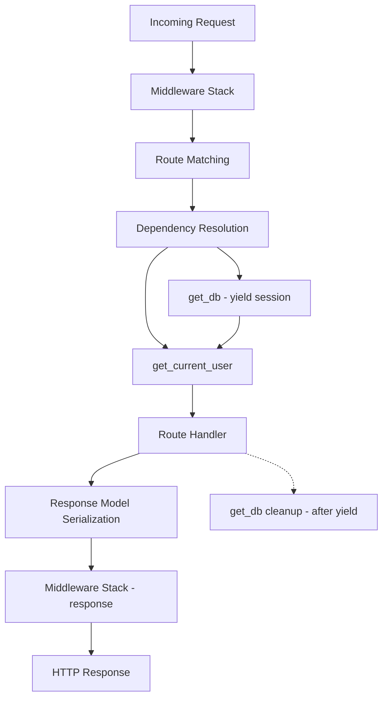
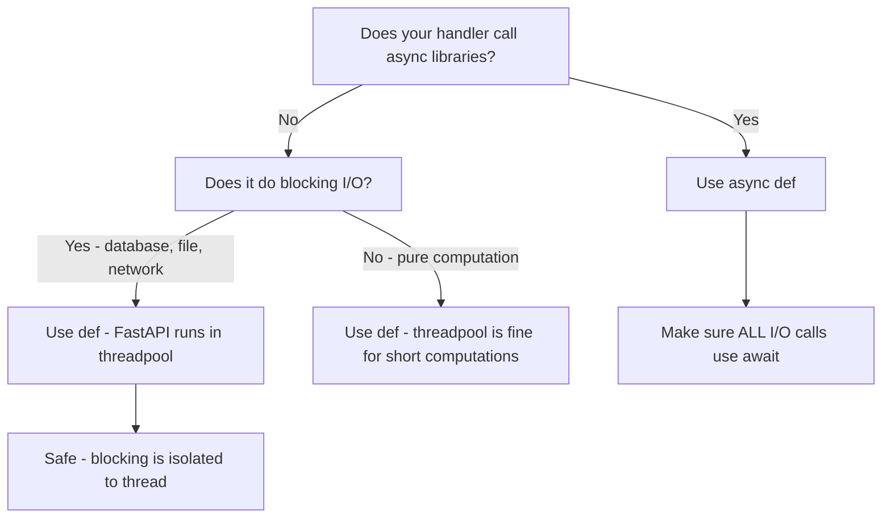

# FastAPI Framework

> FastAPI is a modern, high-performance Python web framework that leverages type hints and Pydantic to deliver automatic validation, serialization, and interactive API documentation with minimal boilerplate.

## Table of Contents
- [Core Concepts](#core-concepts)
  - [What Is FastAPI and Why It Exists](#what-is-fastapi-and-why-it-exists)
  - [ASGI vs WSGI: The Server Interface](#asgi-vs-wsgi-the-server-interface)
  - [Project Structure](#project-structure)
  - [Routes, Path Parameters, and Query Parameters](#routes-path-parameters-and-query-parameters)
  - [Request and Response Models with Pydantic](#request-and-response-models-with-pydantic)
  - [Dependency Injection with Depends](#dependency-injection-with-depends)
  - [Async Endpoints](#async-endpoints)
  - [Middleware](#middleware)
  - [Error Handling](#error-handling)
- [Code Examples](#code-examples)
- [Common Pitfalls](#common-pitfalls)
- [Key Takeaways](#key-takeaways)
- [Exercises](#exercises)

## Core Concepts

### What Is FastAPI and Why It Exists

#### What

FastAPI is a Python web framework for building APIs, created by Sebastian Ramirez and released in 2018. It sits on top of Starlette (for the web layer) and Pydantic (for data validation). It uses standard Python type hints to generate request validation, response serialization, and OpenAPI documentation automatically.

#### How

You install it with `pip install "fastapi[standard]"` (the `[standard]` extra includes `uvicorn`, the ASGI server, plus useful extras like `python-multipart` for form data). You define route handlers as regular Python functions decorated with HTTP method decorators. Type annotations on function parameters drive the entire validation and documentation pipeline — there is no separate schema definition file.

When you annotate a parameter with `item_id: int`, FastAPI automatically validates the incoming data, converts it to the correct type, and returns a `422 Unprocessable Entity` if validation fails. This all happens before your code runs. The same annotations generate an interactive Swagger UI at `/docs` and a ReDoc interface at `/redoc`.

#### Why It Matters

Before FastAPI, Python web frameworks fell into two camps: Flask/Django (WSGI, synchronous, manual validation) and aiohttp/Sanic (async, but no validation framework). FastAPI unified these by combining async-native design with Pydantic validation and automatic documentation. The result is a framework where the code *is* the documentation — your type hints aren't just for mypy, they drive runtime behavior. This eliminates the drift between API docs and actual behavior that plagues most projects.

### ASGI vs WSGI: The Server Interface

#### What

WSGI (Web Server Gateway Interface) and ASGI (Asynchronous Server Gateway Interface) are the two Python standards that define how a web server communicates with a Python application. WSGI is synchronous — one request, one thread, one response. ASGI is asynchronous — it supports concurrent connections, WebSockets, and long-lived connections within a single process.

#### How

WSGI applications implement a simple callable:

```python
def wsgi_app(environ: dict, start_response: Callable) -> Iterable[bytes]:
    start_response("200 OK", [("Content-Type", "text/plain")])
    return [b"Hello"]
```

ASGI applications are async callables that receive `scope`, `receive`, and `send`:

```python
async def asgi_app(scope: dict, receive: Callable, send: Callable) -> None:
    await send({"type": "http.response.start", "status": 200, "headers": [...]})
    await send({"type": "http.response.body", "body": b"Hello"})
```

FastAPI is an ASGI application. You run it with an ASGI server like `uvicorn` (based on `uvloop` for speed) or `hypercorn`. Uvicorn handles the raw socket I/O, then hands requests to FastAPI through the ASGI interface. When you run `uvicorn main:app --reload`, uvicorn creates an event loop, accepts connections, and calls your FastAPI application for each request.

#### Why It Matters

WSGI cannot handle WebSockets or Server-Sent Events because it expects a single synchronous request-response cycle. ASGI lifts this limitation. More importantly, ASGI lets your application handle thousands of concurrent connections in a single process — each `await` yields control back to the event loop, which picks up another request. This is why FastAPI can serve high-concurrency workloads (chat servers, real-time dashboards, streaming APIs) that would require many WSGI worker processes to handle.

### Project Structure

#### What

A FastAPI project organizes code into a predictable directory layout that separates concerns: routes (what endpoints exist), schemas (what data looks like), dependencies (shared logic), and application configuration. There is no enforced structure — FastAPI is unopinionated — but the community has converged on a pattern that scales well.

#### How

Here is the recommended structure for a production FastAPI project:

```
task-manager/
├── pyproject.toml              # Project metadata, dependencies
├── src/
│   └── task_manager/
│       ├── __init__.py
│       ├── main.py             # Application factory, app instance
│       ├── config.py           # Settings via pydantic-settings
│       ├── dependencies.py     # Shared dependencies (DB sessions, auth)
│       ├── models/             # Database / domain models (if using ORM)
│       │   ├── __init__.py
│       │   └── task.py
│       ├── schemas/            # Pydantic request/response models
│       │   ├── __init__.py
│       │   └── task.py
│       ├── routers/            # Route handlers, one file per resource
│       │   ├── __init__.py
│       │   └── tasks.py
│       └── middleware.py       # Custom middleware
└── tests/
    ├── conftest.py             # Shared fixtures
    ├── test_tasks.py
    └── test_dependencies.py
```

The key principle: `routers/` contain the HTTP logic (parsing requests, returning responses), `schemas/` contain Pydantic models (validation rules, serialization shapes), and `dependencies.py` contains reusable logic that gets injected into handlers. The `main.py` file creates the `FastAPI` instance and includes the routers.

#### Why It Matters

Without structure, FastAPI projects devolve into a single `main.py` with hundreds of routes, inline Pydantic models, and duplicated logic. The router-based structure scales because each file has a single responsibility. When you need to add a new resource (users, projects, comments), you add a router file, a schema file, and wire it in `main.py`. No existing code changes. This is the Open/Closed Principle applied to web applications.

The `schemas/` vs `models/` separation matters because Pydantic schemas and database models serve different purposes. Your API might accept a `TaskCreate` schema (no `id` field) but return a `TaskResponse` schema (with `id` and `created_at`). The database model has all fields plus ORM metadata. Conflating these leads to leaky abstractions.

### Routes, Path Parameters, and Query Parameters

#### What

Routes map HTTP methods and URL paths to Python functions. Path parameters are variable segments in the URL (`/tasks/{task_id}`). Query parameters are key-value pairs appended after `?` (`/tasks?status=done&limit=10`). FastAPI uses type annotations to distinguish between them and validate each one automatically.

#### How

FastAPI determines parameter sources by their declaration:

1. If the parameter name matches a path variable in the route decorator, it is a **path parameter**.
2. If the parameter has a Pydantic `BaseModel` type hint, it is the **request body**.
3. Otherwise, it is a **query parameter**.

```python
from fastapi import FastAPI, Query, Path

app = FastAPI()

@app.get("/tasks/{task_id}")
async def get_task(
    task_id: int = Path(ge=1, description="The ID of the task to retrieve"),
) -> dict:
    return {"task_id": task_id}

@app.get("/tasks")
async def list_tasks(
    status: str | None = Query(None, pattern="^(todo|in_progress|done)$"),
    limit: int = Query(10, ge=1, le=100),
    offset: int = Query(0, ge=0),
) -> dict:
    return {"status": status, "limit": limit, "offset": offset}
```

`Path()` and `Query()` are special FastAPI classes that add validation constraints and metadata. `ge=1` means "greater than or equal to 1". The `description` field appears in the auto-generated documentation. Default values make query parameters optional — parameters without defaults are required.

FastAPI also supports `Enum` types for path and query parameters, automatically restricting values to valid options and documenting the allowed values in the OpenAPI schema.

```python
from enum import Enum

class TaskStatus(str, Enum):
    TODO = "todo"
    IN_PROGRESS = "in_progress"
    DONE = "done"

@app.get("/tasks")
async def list_tasks(status: TaskStatus | None = None) -> dict:
    return {"status": status}
```

#### Why It Matters

In Flask, you would write `@app.route("/tasks/<int:task_id>")` and add manual validation inside the handler. In Django REST Framework, you would define a serializer class separately. FastAPI collapses these into the function signature itself. This is not just syntactic sugar — it means the validation logic, the documentation, and the handler are always in sync. You cannot forget to validate a parameter because validation *is* the type annotation.

The `Path()` and `Query()` descriptors provide a clean way to add constraints without cluttering the function body. When you read a FastAPI handler, the signature tells you everything: what parameters exist, what types they expect, what ranges are valid, and which are optional.

### Request and Response Models with Pydantic

#### What

Pydantic models define the shape of request bodies and API responses. A request model specifies what data the client must send (and validates it). A response model specifies what data the API returns (and strips anything extra). FastAPI uses these models for automatic validation, serialization, and documentation.

#### How

You define separate Pydantic models for different operations on the same resource. This is intentional — what you accept for creation differs from what you return in a response.

```python
from datetime import datetime
from pydantic import BaseModel, Field

# What the client sends to create a task
class TaskCreate(BaseModel):
    title: str = Field(min_length=1, max_length=200)
    description: str = Field(default="", max_length=2000)
    priority: int = Field(default=1, ge=1, le=5)

# What the client sends to update a task (all fields optional)
class TaskUpdate(BaseModel):
    title: str | None = Field(None, min_length=1, max_length=200)
    description: str | None = Field(None, max_length=2000)
    priority: int | None = Field(None, ge=1, le=5)
    status: str | None = None

# What the API returns
class TaskResponse(BaseModel):
    id: int
    title: str
    description: str
    priority: int
    status: str
    created_at: datetime
    updated_at: datetime
```

In the route handler, you use the `response_model` parameter to control the response shape:

```python
@app.post("/tasks", response_model=TaskResponse, status_code=201)
async def create_task(task: TaskCreate) -> TaskResponse:
    # FastAPI automatically parses the JSON body into a TaskCreate instance.
    # If validation fails, a 422 response is returned before this code runs.
    new_task = save_to_database(task)
    return new_task
```

When the client sends a POST request with a JSON body, FastAPI:
1. Reads the raw bytes from the request body.
2. Parses them as JSON.
3. Passes the JSON dict to `TaskCreate(**data)`.
4. Pydantic validates every field according to the `Field()` constraints.
5. If validation passes, the `TaskCreate` instance is passed to your function.
6. If validation fails, FastAPI returns a 422 response with detailed error messages — your handler never executes.

The `response_model` works in the opposite direction: FastAPI takes your return value, serializes it through `TaskResponse`, and strips any fields not defined in the model. This prevents accidentally leaking internal data (like password hashes) in API responses.

#### Why It Matters

Manual validation is the most common source of security vulnerabilities and bugs in web APIs. Developers forget to check string lengths, accept negative numbers for quantities, or fail to strip extra fields from responses. Pydantic eliminates this class of bugs by making validation declarative — you define the rules once in the model, and they are enforced consistently for every request.

The Create/Update/Response model pattern (sometimes called "schema separation" or the "three-schema pattern") is essential for production APIs. A `TaskCreate` has no `id` (the server assigns it). A `TaskUpdate` has all-optional fields (partial updates). A `TaskResponse` includes computed fields like `created_at`. Trying to use a single model for all three operations leads to hacks like `Optional` everywhere with runtime checks for which fields are "really" required.

### Dependency Injection with Depends

#### What

Dependency Injection (DI) in FastAPI is a system where your route handlers declare what they need (a database session, the current user, pagination parameters) and FastAPI provides it automatically. You declare a dependency by adding a parameter with `Depends(some_function)` as its default value. FastAPI calls that function, passes the result to your handler, and handles cleanup.

#### How

A dependency is any callable (function, class, or method) that FastAPI can call before your handler. Dependencies can have their own dependencies, forming a tree that FastAPI resolves automatically.

```python
from collections.abc import AsyncGenerator
from fastapi import Depends, FastAPI, Query

app = FastAPI()

# --- Simple dependency: pagination parameters ---
class PaginationParams:
    def __init__(
        self,
        offset: int = Query(0, ge=0),
        limit: int = Query(20, ge=1, le=100),
    ) -> None:
        self.offset = offset
        self.limit = limit

@app.get("/tasks")
async def list_tasks(
    pagination: PaginationParams = Depends(PaginationParams),
) -> dict:
    return {"offset": pagination.offset, "limit": pagination.limit}
```

When FastAPI sees `Depends(PaginationParams)`, it:
1. Inspects `PaginationParams.__init__` for its parameters.
2. Extracts `offset` and `limit` from the query string (because they have `Query()` defaults).
3. Constructs a `PaginationParams` instance.
4. Passes it to `list_tasks`.

Dependencies can be nested. A common pattern is a database session dependency that is used by a "current user" dependency:

```python
from typing import Annotated

# Database session dependency
async def get_db() -> AsyncGenerator[AsyncSession, None]:
    async with async_session_maker() as session:
        yield session  # yield makes this a generator dependency — FastAPI handles cleanup

# Current user dependency — depends on the database session
async def get_current_user(
    token: str = Header(),
    db: AsyncSession = Depends(get_db),
) -> User:
    user = await db.execute(select(User).where(User.token == token))
    if not user:
        raise HTTPException(status_code=401, detail="Invalid token")
    return user.scalar_one()

# Use Annotated for cleaner repeated dependency declarations
CurrentUser = Annotated[User, Depends(get_current_user)]
DbSession = Annotated[AsyncSession, Depends(get_db)]

@app.get("/tasks")
async def list_tasks(user: CurrentUser, db: DbSession) -> list[TaskResponse]:
    tasks = await db.execute(select(Task).where(Task.owner_id == user.id))
    return tasks.scalars().all()
```

The `yield` in `get_db` is a generator dependency. Code before `yield` runs before the handler; code after `yield` runs after the response is sent (cleanup). This is FastAPI's equivalent of a context manager in dependency form.

#### Why It Matters

Without DI, you end up with one of two bad patterns: (1) global variables for shared resources (database connections, configuration), or (2) duplicated setup code in every handler. Both are fragile and hard to test.

FastAPI's `Depends()` solves testing directly: in tests, you call `app.dependency_overrides[get_db] = mock_get_db` and replace any dependency with a mock. No monkey-patching, no complex fixtures — just a dict assignment. This is dramatically simpler than mocking in Flask or Django.

The `Annotated` pattern (`CurrentUser = Annotated[User, Depends(get_current_user)]`) is the recommended modern approach (Python 3.9+). It moves the `Depends()` into the type annotation itself, so you can reuse it across many handlers without repeating the `Depends()` call. It also plays better with type checkers — mypy sees `user: CurrentUser` as `user: User`, which is the correct type.

The dependency tree resolution is one of FastAPI's most powerful features. When multiple handlers depend on `get_db`, and `get_current_user` also depends on `get_db`, FastAPI resolves the tree so `get_db` is called only once per request (by default). This prevents creating multiple database sessions for a single request.



### Async Endpoints

#### What

FastAPI supports both synchronous (`def`) and asynchronous (`async def`) endpoint handlers. Async handlers use Python's `asyncio` to handle concurrent I/O operations without blocking the event loop. The choice between `def` and `async def` affects how FastAPI executes your handler and has direct performance implications.

#### How

```python
# Async handler — runs directly on the event loop
@app.get("/tasks/{task_id}")
async def get_task(task_id: int) -> TaskResponse:
    # Use async database driver, async HTTP client, etc.
    task = await async_db.fetch_one(query, values={"id": task_id})
    return task

# Sync handler — FastAPI runs this in a thread pool
@app.get("/health")
def health_check() -> dict:
    # Blocking I/O is OK here — it runs in a separate thread
    return {"status": "healthy"}
```

When you declare a handler with `async def`, FastAPI calls it directly on the main event loop using `await`. This means the handler *must not* perform blocking operations (like calling a synchronous database driver or `time.sleep()`), because that blocks the entire event loop and kills concurrency for all other requests.

When you declare a handler with `def` (no `async`), FastAPI detects this and runs it in a separate thread pool (`anyio.to_thread.run_sync`). This means blocking operations are safe — they block the thread, not the event loop. Other async handlers continue running on the event loop unaffected.

The decision tree is simple:



For CPU-bound work within async handlers, offload to a thread or process pool:

```python
import asyncio
from concurrent.futures import ProcessPoolExecutor

executor = ProcessPoolExecutor(max_workers=4)

def cpu_intensive_work(data: bytes) -> bytes:
    """Heavy computation that blocks — must not run on event loop."""
    # ... image processing, data crunching, etc.
    return processed_data

@app.post("/process")
async def process_data(payload: DataPayload) -> ProcessedResponse:
    loop = asyncio.get_event_loop()
    result = await loop.run_in_executor(executor, cpu_intensive_work, payload.data)
    return ProcessedResponse(result=result)
```

#### Why It Matters

The entire benefit of ASGI and async is concurrency — handling many requests simultaneously on a single process. But this only works if you respect the contract: `async def` handlers must not block. A single blocking call in an `async def` handler blocks the event loop for *every* concurrent request, turning your async server into something worse than a synchronous one (because at least WSGI servers use multiple threads).

The `def` fallback is FastAPI's safety net. If you are using a synchronous database driver (like `psycopg2` instead of `asyncpg`), use `def` handlers. FastAPI will run them in threads, giving you similar concurrency to a threaded WSGI server. You do not get the full benefit of async, but you do not block the event loop either.

The common mistake is using `async def` because it "feels modern" and then calling synchronous libraries inside it. This is worse than using `def` because it blocks without the threadpool safety net. Use `async def` only when you are using async-native libraries throughout: `asyncpg`, `httpx.AsyncClient`, `aiofiles`, `motor` (async MongoDB), etc.

### Middleware

#### What

Middleware is code that runs for every request before it reaches a route handler, and for every response before it is sent to the client. It wraps the entire request-response cycle. Common uses include logging, CORS headers, request timing, authentication, and rate limiting.

#### How

FastAPI supports two styles of middleware: ASGI middleware (Starlette-style) and the simpler `@app.middleware("http")` decorator.

```python
import time
from collections.abc import Callable, Awaitable
from fastapi import FastAPI, Request, Response

app = FastAPI()

# Simple middleware using the decorator
@app.middleware("http")
async def add_timing_header(
    request: Request,
    call_next: Callable[[Request], Awaitable[Response]],
) -> Response:
    start_time = time.perf_counter()
    response = await call_next(request)
    duration_ms = (time.perf_counter() - start_time) * 1000
    response.headers["X-Process-Time-Ms"] = f"{duration_ms:.2f}"
    return response
```

The `call_next` function passes the request to the next middleware or the route handler. Everything before `await call_next(request)` runs during the request phase; everything after runs during the response phase. This is the "onion model" — each middleware wraps around the next layer.

For more complex middleware (like CORS), use Starlette's middleware classes:

```python
from starlette.middleware.cors import CORSMiddleware

app.add_middleware(
    CORSMiddleware,
    allow_origins=["https://example.com"],
    allow_credentials=True,
    allow_methods=["*"],
    allow_headers=["*"],
)
```

Middleware executes in reverse order of registration — the last middleware added is the outermost layer (runs first for requests, last for responses). Keep this in mind when ordering matters (e.g., logging middleware should be outermost to capture the total request time including other middleware).

#### Why It Matters

Middleware separates cross-cutting concerns from business logic. Without it, every route handler would need to add timing headers, check CORS, validate tokens, and log requests — duplicated across hundreds of endpoints. Middleware runs once, applies everywhere.

The key insight is the request/response symmetry. A single middleware function handles both phases. This is cleaner than Flask's `before_request`/`after_request` pair because the middleware has access to both the request context *and* its own local variables (like `start_time` above) in a single function scope.

### Error Handling

#### What

FastAPI provides structured error handling through `HTTPException` for expected errors (not found, unauthorized, validation failures) and exception handlers for unexpected errors. The goal is to always return consistent, machine-readable error responses — never leak stack traces to clients.

#### How

`HTTPException` is the standard way to signal errors in handlers:

```python
from fastapi import HTTPException, status

@app.get("/tasks/{task_id}")
async def get_task(task_id: int) -> TaskResponse:
    task = await db.get_task(task_id)
    if task is None:
        raise HTTPException(
            status_code=status.HTTP_404_NOT_FOUND,
            detail=f"Task {task_id} not found",
        )
    return task
```

`HTTPException` is not a regular exception — it is a signal to FastAPI to return a specific HTTP response. FastAPI catches it internally and converts it to a JSON response: `{"detail": "Task 42 not found"}`.

For domain-specific errors, define custom exceptions and register handlers:

```python
class TaskNotFoundError(Exception):
    def __init__(self, task_id: int) -> None:
        self.task_id = task_id

class PermissionDeniedError(Exception):
    def __init__(self, action: str, resource: str) -> None:
        self.action = action
        self.resource = resource

@app.exception_handler(TaskNotFoundError)
async def task_not_found_handler(
    request: Request, exc: TaskNotFoundError,
) -> JSONResponse:
    return JSONResponse(
        status_code=404,
        content={
            "error": "not_found",
            "message": f"Task {exc.task_id} not found",
        },
    )

@app.exception_handler(PermissionDeniedError)
async def permission_denied_handler(
    request: Request, exc: PermissionDeniedError,
) -> JSONResponse:
    return JSONResponse(
        status_code=403,
        content={
            "error": "permission_denied",
            "message": f"Cannot {exc.action} on {exc.resource}",
        },
    )
```

This approach keeps your route handlers clean — they raise domain exceptions, and the handlers translate them to HTTP responses. The business logic never thinks about status codes or JSON formatting.

For validation errors (Pydantic failures), FastAPI automatically returns a 422 response with structured error details. You can override this default behavior:

```python
from fastapi.exceptions import RequestValidationError

@app.exception_handler(RequestValidationError)
async def validation_error_handler(
    request: Request, exc: RequestValidationError,
) -> JSONResponse:
    errors = []
    for error in exc.errors():
        errors.append({
            "field": ".".join(str(loc) for loc in error["loc"]),
            "message": error["msg"],
            "type": error["type"],
        })
    return JSONResponse(
        status_code=422,
        content={"error": "validation_error", "details": errors},
    )
```

#### Why It Matters

Error handling is the difference between a toy API and a production API. Clients need machine-readable error responses with consistent structure to build reliable integrations. If your API sometimes returns `{"detail": "..."}` and sometimes returns `{"error": "..."}` and sometimes returns an HTML stack trace, client developers will hate you.

Custom exception handlers decouple your business logic from HTTP concerns. Your service layer raises `TaskNotFoundError` — it does not know or care about HTTP status codes. The exception handler maps domain errors to HTTP responses. This separation means you can reuse your service logic in CLI tools, background workers, or other contexts that have nothing to do with HTTP.

## Code Examples

### Example 1: Complete Minimal Application

A production-quality "hello world" that demonstrates the core patterns — application factory, proper typing, and interactive docs.

```python
"""Minimal FastAPI application with proper structure."""
from fastapi import FastAPI

def create_app() -> FastAPI:
    """Application factory pattern — creates and configures the app."""
    app = FastAPI(
        title="Task Manager API",
        version="0.1.0",
        description="A simple task management API",
    )

    @app.get("/")
    async def root() -> dict[str, str]:
        return {"message": "Task Manager API is running"}

    @app.get("/health")
    async def health() -> dict[str, str]:
        """Health check endpoint for load balancers and monitoring."""
        return {"status": "healthy"}

    return app

app = create_app()
# Run with: uvicorn main:app --reload
# Docs at: http://127.0.0.1:8000/docs
```

### Example 2: Full CRUD Router with Pydantic Models

A realistic router file showing the Create, Read, Update, Delete pattern for a resource, with proper request/response models.

```python
"""Task router — CRUD operations for task resources."""
from datetime import datetime, timezone
from enum import Enum

from fastapi import APIRouter, HTTPException, status
from pydantic import BaseModel, Field

router = APIRouter(prefix="/tasks", tags=["tasks"])


# --- Schemas ---

class TaskStatus(str, Enum):
    """Valid task statuses — inherits from str for JSON serialization."""
    TODO = "todo"
    IN_PROGRESS = "in_progress"
    DONE = "done"


class TaskCreate(BaseModel):
    """Schema for creating a new task. No id, no timestamps — server assigns those."""
    title: str = Field(min_length=1, max_length=200, examples=["Buy groceries"])
    description: str = Field(default="", max_length=2000)
    priority: int = Field(default=1, ge=1, le=5, description="1=lowest, 5=highest")


class TaskUpdate(BaseModel):
    """Schema for partial updates. All fields optional — only send what changes."""
    title: str | None = Field(None, min_length=1, max_length=200)
    description: str | None = Field(None, max_length=2000)
    priority: int | None = Field(None, ge=1, le=5)
    status: TaskStatus | None = None


class TaskResponse(BaseModel):
    """Schema for API responses. Includes server-generated fields."""
    id: int
    title: str
    description: str
    priority: int
    status: TaskStatus
    created_at: datetime
    updated_at: datetime


# --- In-memory storage (replace with database in production) ---

_tasks: dict[int, dict] = {}
_next_id: int = 1


def _get_now() -> datetime:
    return datetime.now(timezone.utc)


# --- Route Handlers ---

@router.post("", response_model=TaskResponse, status_code=status.HTTP_201_CREATED)
async def create_task(task: TaskCreate) -> dict:
    """Create a new task. Returns the created task with server-assigned id and timestamps."""
    global _next_id
    now = _get_now()
    task_data = {
        "id": _next_id,
        **task.model_dump(),  # Pydantic v2: .model_dump() replaces .dict()
        "status": TaskStatus.TODO,
        "created_at": now,
        "updated_at": now,
    }
    _tasks[_next_id] = task_data
    _next_id += 1
    return task_data


@router.get("", response_model=list[TaskResponse])
async def list_tasks(
    status_filter: TaskStatus | None = None,
    limit: int = Field(default=20, ge=1, le=100),
) -> list[dict]:
    """List all tasks, optionally filtered by status."""
    tasks = list(_tasks.values())
    if status_filter is not None:
        tasks = [t for t in tasks if t["status"] == status_filter]
    return tasks[:limit]


@router.get("/{task_id}", response_model=TaskResponse)
async def get_task(task_id: int) -> dict:
    """Get a single task by ID."""
    if task_id not in _tasks:
        raise HTTPException(
            status_code=status.HTTP_404_NOT_FOUND,
            detail=f"Task {task_id} not found",
        )
    return _tasks[task_id]


@router.patch("/{task_id}", response_model=TaskResponse)
async def update_task(task_id: int, updates: TaskUpdate) -> dict:
    """Partially update a task. Only provided fields are changed."""
    if task_id not in _tasks:
        raise HTTPException(
            status_code=status.HTTP_404_NOT_FOUND,
            detail=f"Task {task_id} not found",
        )
    # exclude_unset=True: only include fields the client explicitly sent
    update_data = updates.model_dump(exclude_unset=True)
    _tasks[task_id].update(update_data)
    _tasks[task_id]["updated_at"] = _get_now()
    return _tasks[task_id]


@router.delete("/{task_id}", status_code=status.HTTP_204_NO_CONTENT)
async def delete_task(task_id: int) -> None:
    """Delete a task. Returns 204 No Content on success."""
    if task_id not in _tasks:
        raise HTTPException(
            status_code=status.HTTP_404_NOT_FOUND,
            detail=f"Task {task_id} not found",
        )
    del _tasks[task_id]
```

### Example 3: Dependency Injection — Database Session and Auth

A realistic dependency chain showing how database sessions and authentication compose together.

```python
"""Dependencies module — reusable logic injected into route handlers."""
from collections.abc import AsyncGenerator
from typing import Annotated

from fastapi import Depends, Header, HTTPException, status
from sqlalchemy.ext.asyncio import AsyncSession, async_sessionmaker, create_async_engine

# --- Database setup ---

DATABASE_URL = "sqlite+aiosqlite:///./tasks.db"
engine = create_async_engine(DATABASE_URL, echo=False)
async_session = async_sessionmaker(engine, expire_on_commit=False)


async def get_db() -> AsyncGenerator[AsyncSession, None]:
    """Yield a database session, ensuring cleanup after the request.

    The 'yield' makes this a generator dependency:
    - Code before yield: setup (create session)
    - yield value: injected into the handler
    - Code after yield: cleanup (close session) — runs even if handler raises
    """
    session = async_session()
    try:
        yield session
    finally:
        await session.close()


# Type alias — use this in handler signatures for clean, DRY code
DbSession = Annotated[AsyncSession, Depends(get_db)]


# --- Authentication dependency ---

async def get_current_user(
    authorization: str = Header(description="Bearer token"),
    db: DbSession = None,  # type: ignore[assignment]  # Depends handles this
) -> dict:
    """Extract and validate the current user from the Authorization header.

    This dependency:
    1. Reads the Authorization header
    2. Validates the token format
    3. Looks up the user in the database
    4. Raises 401 if anything fails
    """
    if not authorization.startswith("Bearer "):
        raise HTTPException(
            status_code=status.HTTP_401_UNAUTHORIZED,
            detail="Invalid authorization header format",
            headers={"WWW-Authenticate": "Bearer"},
        )

    token = authorization.removeprefix("Bearer ")

    # In production: decode JWT, verify signature, check expiration
    user = await _lookup_user_by_token(db, token)
    if user is None:
        raise HTTPException(
            status_code=status.HTTP_401_UNAUTHORIZED,
            detail="Invalid or expired token",
            headers={"WWW-Authenticate": "Bearer"},
        )
    return user


async def _lookup_user_by_token(db: AsyncSession, token: str) -> dict | None:
    """Placeholder — replace with actual database query."""
    # Simulated user lookup
    if token == "valid-token":
        return {"id": 1, "username": "alice", "role": "admin"}
    return None


# Type alias for authenticated routes
CurrentUser = Annotated[dict, Depends(get_current_user)]


# --- Using dependencies in routes ---

# In routers/tasks.py:
# from dependencies import DbSession, CurrentUser
#
# @router.get("/tasks")
# async def list_tasks(db: DbSession, user: CurrentUser) -> list[TaskResponse]:
#     # db and user are automatically injected
#     tasks = await db.execute(select(Task).where(Task.owner_id == user["id"]))
#     return tasks.scalars().all()
```

### Example 4: Application Factory with Middleware and Exception Handlers

A complete `main.py` that ties together routers, middleware, and error handling.

```python
"""Application entry point — assembles all components."""
import logging
import time
from collections.abc import Awaitable, Callable

from fastapi import FastAPI, Request, Response
from fastapi.exceptions import RequestValidationError
from fastapi.responses import JSONResponse
from starlette.middleware.cors import CORSMiddleware

# from task_manager.routers import tasks  # Import your routers

logger = logging.getLogger(__name__)


class TaskNotFoundError(Exception):
    """Raised when a task does not exist."""
    def __init__(self, task_id: int) -> None:
        self.task_id = task_id
        super().__init__(f"Task {task_id} not found")


def create_app() -> FastAPI:
    """Application factory — creates and fully configures the FastAPI instance."""
    app = FastAPI(
        title="Task Manager API",
        version="1.0.0",
        docs_url="/docs",
        redoc_url="/redoc",
    )

    # --- CORS Middleware ---
    app.add_middleware(
        CORSMiddleware,
        allow_origins=["https://example.com"],
        allow_credentials=True,
        allow_methods=["GET", "POST", "PATCH", "DELETE"],
        allow_headers=["Authorization", "Content-Type"],
    )

    # --- Custom Middleware: Request Logging & Timing ---
    @app.middleware("http")
    async def log_requests(
        request: Request,
        call_next: Callable[[Request], Awaitable[Response]],
    ) -> Response:
        start = time.perf_counter()
        response = await call_next(request)
        duration_ms = (time.perf_counter() - start) * 1000
        logger.info(
            "%s %s → %d (%.2fms)",
            request.method,
            request.url.path,
            response.status_code,
            duration_ms,
        )
        response.headers["X-Request-Duration-Ms"] = f"{duration_ms:.2f}"
        return response

    # --- Exception Handlers ---
    @app.exception_handler(TaskNotFoundError)
    async def handle_task_not_found(
        request: Request, exc: TaskNotFoundError,
    ) -> JSONResponse:
        return JSONResponse(
            status_code=404,
            content={"error": "not_found", "message": str(exc)},
        )

    @app.exception_handler(RequestValidationError)
    async def handle_validation_error(
        request: Request, exc: RequestValidationError,
    ) -> JSONResponse:
        """Override default 422 response with a consistent error format."""
        errors = [
            {
                "field": ".".join(str(loc) for loc in err["loc"]),
                "message": err["msg"],
            }
            for err in exc.errors()
        ]
        return JSONResponse(
            status_code=422,
            content={"error": "validation_error", "details": errors},
        )

    @app.exception_handler(Exception)
    async def handle_unexpected_error(
        request: Request, exc: Exception,
    ) -> JSONResponse:
        """Catch-all for unexpected errors. Log the full traceback, return a safe message."""
        logger.exception("Unexpected error on %s %s", request.method, request.url.path)
        return JSONResponse(
            status_code=500,
            content={"error": "internal_error", "message": "An unexpected error occurred"},
        )

    # --- Include Routers ---
    # app.include_router(tasks.router)

    return app


app = create_app()
```

### Example 5: Testing FastAPI with pytest and Dependency Overrides

How to test FastAPI applications using `httpx.AsyncClient` and dependency overrides.

```python
"""Test module for task API endpoints."""
import pytest
from httpx import ASGITransport, AsyncClient

from task_manager.main import create_app
from task_manager.dependencies import get_db, get_current_user


@pytest.fixture
def app():
    """Create a fresh app instance for each test."""
    app = create_app()

    # Override the database dependency with an in-memory store
    async def mock_get_db():
        yield {}  # Simple dict as mock "database"

    # Override auth to always return a test user
    async def mock_get_current_user():
        return {"id": 1, "username": "testuser", "role": "admin"}

    app.dependency_overrides[get_db] = mock_get_db
    app.dependency_overrides[get_current_user] = mock_get_current_user
    return app


@pytest.fixture
async def client(app) -> AsyncClient:
    """Async test client that talks directly to the ASGI app (no network)."""
    transport = ASGITransport(app=app)
    async with AsyncClient(transport=transport, base_url="http://test") as ac:
        yield ac


@pytest.mark.anyio
async def test_create_task(client: AsyncClient) -> None:
    """Test creating a task returns 201 with the correct data."""
    response = await client.post(
        "/tasks",
        json={"title": "Write tests", "priority": 3},
    )
    assert response.status_code == 201
    data = response.json()
    assert data["title"] == "Write tests"
    assert data["priority"] == 3
    assert data["status"] == "todo"
    assert "id" in data
    assert "created_at" in data


@pytest.mark.anyio
async def test_create_task_validation_error(client: AsyncClient) -> None:
    """Test that invalid data returns 422 with structured error details."""
    response = await client.post(
        "/tasks",
        json={"title": "", "priority": 99},  # Empty title, priority out of range
    )
    assert response.status_code == 422
    data = response.json()
    assert data["error"] == "validation_error"
    assert len(data["details"]) >= 1  # At least one validation error


@pytest.mark.anyio
async def test_get_nonexistent_task(client: AsyncClient) -> None:
    """Test that requesting a missing task returns 404."""
    response = await client.get("/tasks/999")
    assert response.status_code == 404


@pytest.mark.anyio
async def test_update_task_partial(client: AsyncClient) -> None:
    """Test PATCH with partial data only updates provided fields."""
    # Create a task first
    create_resp = await client.post(
        "/tasks",
        json={"title": "Original title", "priority": 1},
    )
    task_id = create_resp.json()["id"]

    # Update only the title
    update_resp = await client.patch(
        f"/tasks/{task_id}",
        json={"title": "Updated title"},
    )
    assert update_resp.status_code == 200
    data = update_resp.json()
    assert data["title"] == "Updated title"
    assert data["priority"] == 1  # Unchanged
```

### Example 6: Settings Management with pydantic-settings

Production applications need configuration from environment variables, `.env` files, or secrets managers. `pydantic-settings` makes this type-safe.

```python
"""Application configuration using pydantic-settings."""
from functools import lru_cache

from pydantic_settings import BaseSettings, SettingsConfigDict


class Settings(BaseSettings):
    """Application settings — loaded from environment variables.

    pydantic-settings automatically reads env vars matching field names
    (case-insensitive) and validates them against the type hints.
    """
    model_config = SettingsConfigDict(
        env_file=".env",
        env_file_encoding="utf-8",
        case_sensitive=False,
    )

    # App configuration
    app_name: str = "Task Manager"
    debug: bool = False

    # Database
    database_url: str = "sqlite+aiosqlite:///./tasks.db"

    # Auth
    secret_key: str  # No default — required, must be set in env
    access_token_expire_minutes: int = 30

    # CORS
    allowed_origins: list[str] = ["http://localhost:3000"]


@lru_cache
def get_settings() -> Settings:
    """Cache settings to avoid re-reading env vars on every request.

    Use as a dependency: settings: Settings = Depends(get_settings)
    """
    return Settings()
```

## Common Pitfalls

### Pitfall 1: Blocking the Event Loop with Synchronous Code in async def

This is the single most common FastAPI performance bug. Using `async def` with a synchronous library freezes the entire server.

```python
# BAD — blocking call inside async handler stops ALL concurrent requests
import requests  # synchronous HTTP library

@app.get("/external-data")
async def get_external_data() -> dict:
    # This blocks the event loop for the entire duration of the HTTP call.
    # No other request can be processed while this waits for a response.
    response = requests.get("https://api.example.com/data")
    return response.json()

# GOOD — use an async HTTP library, or use a sync handler (def, not async def)

# Option A: async library (preferred for high concurrency)
import httpx

@app.get("/external-data")
async def get_external_data() -> dict:
    async with httpx.AsyncClient() as client:
        response = await client.get("https://api.example.com/data")
        return response.json()

# Option B: sync handler — FastAPI runs it in a thread pool automatically
@app.get("/external-data")
def get_external_data() -> dict:
    response = requests.get("https://api.example.com/data")
    return response.json()
```

The rule is absolute: if you use `async def`, every I/O call inside it must use `await`. If your libraries are synchronous, use `def` instead and let FastAPI handle the threading.

### Pitfall 2: Using a Single Pydantic Model for Create, Update, and Response

Trying to reuse one model for all operations leads to `Optional` everywhere, runtime hacks, and leaky data.

```python
# BAD — one model for everything forces ugly compromises
class Task(BaseModel):
    id: int | None = None         # Optional because creation doesn't have it
    title: str | None = None      # Optional because updates are partial
    description: str = ""
    status: str = "todo"
    password_hash: str | None = None  # Oops — this leaks in responses

@app.post("/tasks")
async def create_task(task: Task) -> Task:
    # How do we enforce that title is required for creation but optional for update?
    # We can't — the model allows None for both.
    if task.title is None:
        raise ValueError("title is required")  # Manual validation defeats the purpose
    return task

# GOOD — separate models for each operation
class TaskCreate(BaseModel):
    """What the client sends. No id, no server fields."""
    title: str = Field(min_length=1, max_length=200)
    description: str = Field(default="", max_length=2000)

class TaskUpdate(BaseModel):
    """Partial updates. All fields optional."""
    title: str | None = Field(None, min_length=1, max_length=200)
    description: str | None = None

class TaskResponse(BaseModel):
    """What the API returns. No sensitive fields."""
    id: int
    title: str
    description: str
    status: str
    created_at: datetime

@app.post("/tasks", response_model=TaskResponse, status_code=201)
async def create_task(task: TaskCreate) -> TaskResponse:
    # title is guaranteed to be a non-empty string — Pydantic enforced it
    ...
```

More code, but each model has a clear contract. Validation happens at the schema boundary, not in the handler.

### Pitfall 3: Forgetting exclude_unset in Partial Updates

Using `model_dump()` without `exclude_unset=True` on partial update models turns unset fields into explicit `None` values, overwriting existing data.

```python
# BAD — model_dump() includes all fields, even ones the client didn't send
class TaskUpdate(BaseModel):
    title: str | None = None
    description: str | None = None
    priority: int | None = None

@app.patch("/tasks/{task_id}")
async def update_task(task_id: int, updates: TaskUpdate) -> dict:
    # Client sends: {"title": "New title"}
    update_data = updates.model_dump()
    # update_data = {"title": "New title", "description": None, "priority": None}
    # This overwrites description and priority with None!
    existing_task.update(update_data)
    return existing_task

# GOOD — exclude_unset=True only includes fields the client explicitly provided
@app.patch("/tasks/{task_id}")
async def update_task(task_id: int, updates: TaskUpdate) -> dict:
    # Client sends: {"title": "New title"}
    update_data = updates.model_dump(exclude_unset=True)
    # update_data = {"title": "New title"}  — only what was sent
    existing_task.update(update_data)
    return existing_task
```

The difference is subtle but critical: `model_dump()` returns all fields (using defaults for unset ones), while `model_dump(exclude_unset=True)` only returns fields the client explicitly included in the request body. This is the correct way to implement PATCH semantics.

### Pitfall 4: Not Using Dependency Overrides in Tests

Testing with real dependencies (real database, real auth) makes tests slow, flaky, and painful. FastAPI's dependency override system exists specifically for this.

```python
# BAD — testing with real dependencies
@pytest.fixture
def client():
    # This connects to a real database!
    # Tests are slow, require database setup, and interfere with each other.
    return TestClient(app)

def test_create_task(client):
    # This hits the real auth system — needs a valid token
    response = client.post(
        "/tasks",
        json={"title": "Test"},
        headers={"Authorization": "Bearer real-token-somehow"},
    )

# GOOD — override dependencies with test doubles
@pytest.fixture
def client():
    app = create_app()

    async def mock_get_db():
        yield {}  # In-memory mock

    async def mock_get_current_user():
        return {"id": 1, "username": "testuser"}

    app.dependency_overrides[get_db] = mock_get_db
    app.dependency_overrides[get_current_user] = mock_get_current_user

    transport = ASGITransport(app=app)
    with AsyncClient(transport=transport, base_url="http://test") as ac:
        yield ac
```

The `dependency_overrides` dict is the idiomatic way to mock in FastAPI. It is cleaner than `unittest.mock.patch` because it works at the framework level — no need to know where the dependency is imported from.

### Pitfall 5: Putting Business Logic in Route Handlers

Route handlers should be thin — they parse the request, call service functions, and return responses. Putting business logic directly in handlers makes it impossible to reuse or test independently.

```python
# BAD — business logic mixed into the handler
@router.post("/tasks", response_model=TaskResponse, status_code=201)
async def create_task(task: TaskCreate, db: DbSession, user: CurrentUser) -> dict:
    # Validation logic in the handler
    existing = await db.execute(
        select(Task).where(Task.title == task.title, Task.owner_id == user["id"])
    )
    if existing.scalar_one_or_none():
        raise HTTPException(status_code=409, detail="Duplicate task title")

    # Creation logic in the handler
    new_task = Task(
        title=task.title,
        description=task.description,
        owner_id=user["id"],
        status="todo",
    )
    db.add(new_task)
    await db.commit()
    await db.refresh(new_task)
    return new_task

# GOOD — handler is thin, logic is in a service layer
# services/task_service.py
class TaskService:
    def __init__(self, db: AsyncSession) -> None:
        self.db = db

    async def create_task(self, task_data: TaskCreate, owner_id: int) -> Task:
        """Create a task, enforcing uniqueness constraint."""
        await self._ensure_unique_title(task_data.title, owner_id)
        new_task = Task(
            **task_data.model_dump(),
            owner_id=owner_id,
            status="todo",
        )
        self.db.add(new_task)
        await self.db.commit()
        await self.db.refresh(new_task)
        return new_task

    async def _ensure_unique_title(self, title: str, owner_id: int) -> None:
        existing = await self.db.execute(
            select(Task).where(Task.title == title, Task.owner_id == owner_id)
        )
        if existing.scalar_one_or_none():
            raise DuplicateTaskError(title)

# routers/tasks.py — thin handler
@router.post("/tasks", response_model=TaskResponse, status_code=201)
async def create_task(
    task: TaskCreate, db: DbSession, user: CurrentUser,
) -> Task:
    service = TaskService(db)
    return await service.create_task(task, owner_id=user["id"])
```

The service layer can be tested without HTTP. It can be reused from CLI scripts, background workers, or other services. The handler is just glue between HTTP and business logic.

## Key Takeaways

- **Type hints drive everything in FastAPI** — validation, serialization, documentation, and dependency resolution all come from your function signatures. Invest in precise type annotations and you get all four for free.

- **Use separate Pydantic models for create, update, and response** operations. The three-schema pattern prevents leaky abstractions, ensures proper validation for each operation, and keeps internal fields out of API responses.

- **Choose `async def` or `def` based on your libraries, not preference**. Use `async def` only when all I/O operations inside use `await`. Use plain `def` for synchronous libraries — FastAPI runs them in a threadpool automatically. Mixing `async def` with blocking calls is the number one performance killer.

- **Dependency injection with `Depends()` replaces globals, simplifies testing, and composes cleanly**. Use `Annotated` type aliases for reusable dependency declarations. Use `dependency_overrides` in tests to swap real dependencies for mocks without monkey-patching.

- **Keep route handlers thin**. Parse the request, call a service function, return the response. Business logic belongs in service classes that can be tested and reused independently of HTTP.

## Exercises

1. **Build a basic API**: Create a FastAPI application with a `BookRouter` that supports CRUD operations for a book resource. Define `BookCreate`, `BookUpdate`, and `BookResponse` Pydantic models with appropriate field validations (title must be non-empty, publication year must be between 1450 and the current year, ISBN must be 13 characters). Use an in-memory `dict` for storage.

2. **Implement dependency injection**: Add a `PaginationParams` dependency (accepting `page` and `per_page` query parameters with sensible defaults and validation) and a `SortParams` dependency (accepting `sort_by` and `order` parameters). Apply both to your `list_books` endpoint. Write a test that verifies pagination works correctly using `dependency_overrides` to inject a mock data source.

3. **Add middleware and error handling**: Add three pieces of middleware to your application: (a) a request timing middleware that adds an `X-Process-Time` header, (b) a request ID middleware that generates a UUID for each request and includes it in the response headers, and (c) a custom exception handler that catches a `BookNotFoundError` domain exception and returns a structured JSON error response. Verify all three work by writing tests.

4. **Async vs sync analysis**: Take your book API and create two versions of an endpoint that calls an external API (simulate with `asyncio.sleep(1)` for async and `time.sleep(1)` for sync). Use `time.perf_counter()` to measure how long it takes to handle 10 concurrent requests to each version. Explain the performance difference in terms of how FastAPI handles `async def` vs `def` handlers.

5. **Full application assembly**: Refactor your book API into the recommended project structure: separate `routers/`, `schemas/`, `dependencies.py`, `main.py` with an application factory, and a `tests/` directory. Add a `GET /books/{book_id}/summary` endpoint that depends on both authentication (mock it) and the database session. Write at least 5 tests covering happy paths and error cases.

---
up:: [Schedule](../../Schedule.md)
#type/learning #source/self-study #status/seed
